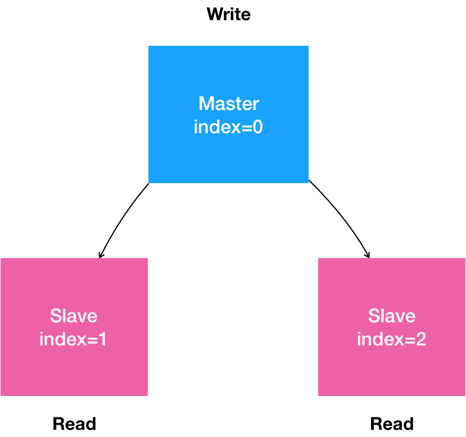
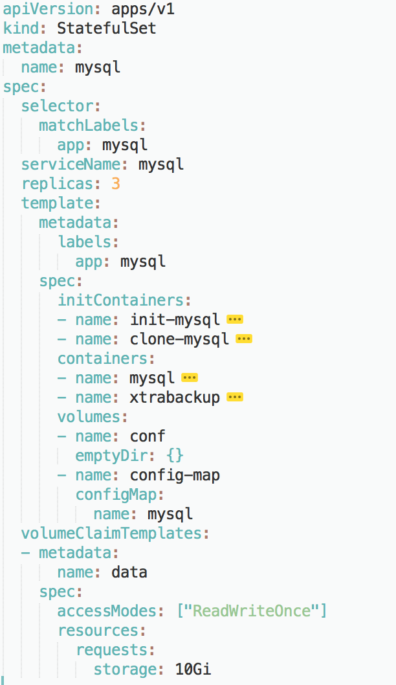

[toc]

------

### 背景

Deployment 实际上并不足以覆盖所有的应用编排问题。

造成这个问题的根本原因，在于 Deployment 对应用做了一个简单化假设。

它认为，一个应用的所有 Pod，是完全一样的。所以，它们互相之间没有顺序，也无所谓运行在哪台宿主机上。需要的时候，Deployment 就可以通过 Pod 模板创建新的 Pod；不需要的时候，Deployment 就可以“杀掉”任意一个 Pod。

但是，在实际的场景中，并不是所有的应用都可以满足这样的要求。尤其是分布式应用，它的多个实例之间，往往有依赖关系，比如：主从关系、主备关系。

还有就是数据存储类应用，它的多个实例，往往都会在本地磁盘上保存一份数据。而这些实例一旦被杀掉，即便重建出来，实例与数据之间的对应关系也已经丢失，从而导致应用失败。

所以，这种实例之间有不对等关系，以及实例对外部数据有依赖关系的应用，就被称为“有状态应用”（Stateful Application）。

容器技术诞生后，大家很快发现，它用来封装“无状态应用”（Stateless Application），尤其是 Web 服务，非常好用。但是，一旦你想要用容器运行“有状态应用”，其困难程度就会直线上升。而且，这个问题解决起来，单纯依靠容器技术本身已经无能为力，这也就导致了很长一段时间内，“有状态应用”几乎成了容器技术圈子的“忌讳”，大家一听到这个词，就纷纷摇头。

得益于“控制器模式”的设计思想，Kubernetes 项目很早就在 Deployment 的基础上，扩展出了对“有状态应用”的初步支持。这个编排功能，就是：StatefulSet。


### StatefulSet 拓扑状态

StatefulSet 的设计其实非常容易理解。它把真实世界里的应用状态，抽象为了两种情况：

- 拓扑状态。这种情况意味着，应用的多个实例之间不是完全对等的关系。这些应用实例，必须按照某些顺序启动，比如应用的主节点 A 要先于从节点 B 启动。而如果你把 A 和 B 两个 Pod 删除掉，它们再次被创建出来时也必须严格按照这个顺序才行。并且，新创建出来的 Pod，必须和原来 Pod 的网络标识一样，这样原先的访问者才能使用同样的方法，访问到这个新 Pod。
- 存储状态。这种情况意味着，应用的多个实例分别绑定了不同的存储数据。对于这些应用实例来说，Pod A 第一次读取到的数据，和隔了十分钟之后再次读取到的数据，应该是同一份，哪怕在此期间 Pod A 被重新创建过。这种情况最典型的例子，就是一个数据库应用的多个存储实例。

所以，StatefulSet 的核心功能，就是通过某种方式记录这些状态，然后在 Pod 被重新创建时，能够为新 Pod 恢复这些状态。

#### Headless Service

> https://kubernetes.io/zh/docs/concepts/services-networking/service/#headless-services

**Service 是 Kubernetes 项目中用来将一组 Pod 暴露给外界访问的一种机制。**比如，一个 Deployment 有 3 个 Pod，那么我就可以定义一个 Service。然后，用户只要能访问到这个 Service，它就能访问到某个具体的 Pod。

那么，这个 Service 又是如何被访问的呢？

第一种方式，是以 **Service 的 VIP**（Virtual IP，即：虚拟 IP）方式。比如：当我访问 10.0.23.1 这个 Service 的 IP 地址时，10.0.23.1 其实就是一个 VIP，它会把请求转发到该 Service 所代理的某一个 Pod 上。

第二种方式，就是以 **Service 的 DNS 方式**。比如：这时候，只要我访问“my-svc.my-namespace.svc.cluster.local”这条 DNS 记录，就可以访问到名叫 my-svc 的 Service 所代理的某一个 Pod。


第二种 Service DNS 的方式下，具体还可以分为两种处理方法：

> 第一种处理方法，是 Normal Service。这种情况下，你访问“my-svc.my-namespace.svc.cluster.local”解析到的，正是 my-svc 这个 Service 的 VIP，后面的流程就跟 VIP 方式一致了。
>
> 而第二种处理方法，正是 Headless Service。这种情况下，你访问“my-svc.my-namespace.svc.cluster.local”解析到的，直接就是 my-svc 代理的某一个 Pod 的 IP 地址。可以看到，这里的区别在于，Headless Service 不需要分配一个 VIP，而是可以直接以 DNS 记录的方式解析出被代理 Pod 的 IP 地址。

那么，这样的设计又有什么作用呢？需要从 Headless Service 的定义方式看起。

下面是一个标准的 Headless Service 对应的 YAML 文件：

```

apiVersion: v1
kind: Service
metadata:
  name: nginx
  labels:
    app: nginx
spec:
  ports:
  - port: 80
    name: web
  clusterIP: None
  selector:
    app: nginx
```

所谓的 Headless Service，其实仍是一个标准 Service 的 YAML 文件。只不过，它的 clusterIP 字段的值是：None，即：这个 Service，没有一个 VIP 作为“头”。这也就是 Headless 的含义。所以，这个 Service 被创建后并不会被分配一个 VIP，而是会以 DNS 记录的方式暴露出它所代理的 Pod。

而它所代理的 Pod，依然是 Label Selector 机制选择出来的，即：所有携带了 app=nginx 标签的 Pod，都会被这个 Service 代理起来。

当你按照这样的方式创建了一个 Headless Service 之后，它所代理的所有 Pod 的 IP 地址，都会被绑定一个这样格式的 DNS 记录，如下所示：

> <pod-name>.<svc-name>.<namespace>.svc.cluster.local

这个 DNS 记录，正是 Kubernetes 项目为 Pod 分配的唯一的“可解析身份”（Resolvable Identity）。

有了这个“可解析身份”，只要你知道了一个 Pod 的名字，以及它对应的 Service 的名字，你就可以非常确定地通过这条 DNS 记录访问到 Pod 的 IP 地址。


#### StatefulSet入门

**StatefulSet 又是如何使用这个 DNS 记录来维持 Pod 的拓扑状态的呢？**

为了回答这个问题，现在我们就来编写一个 StatefulSet 的 YAML 文件，如下所示：

```

apiVersion: apps/v1
kind: StatefulSet
metadata:
  name: web
spec:
  serviceName: "nginx"
  replicas: 2
  selector:
    matchLabels:
      app: nginx
  template:
    metadata:
      labels:
        app: nginx
    spec:
      containers:
      - name: nginx
        image: nginx:1.9.1
        ports:
        - containerPort: 80
          name: web
```

**完整参考示列** 有前后关系：

```
apiVersion: v1
kind: Service
metadata:
  name: nginx-test
  labels:
    app: nginx_test
spec:
  ports:
  - port: 80
    name: nginx-web
  # clusterIP 设置为 None
  clusterIP: None
  selector:
    app: nginx_test

---

apiVersion: apps/v1beta1
kind: StatefulSet
metadata:
  name: nginx-web
spec:
  serviceName: "nginx-test"
  replicas: 2
  template:
    metadata:
      labels:
        app: nginx_test
    spec:
      containers:
      - name: nginx-test
        image: nginx:1.11
        ports:
        - containerPort: 80
          name: nginx-web
```


这个 YAML 文件，和我们在前面用到的 nginx-deployment 的唯一区别，就是多了一个 serviceName=nginx 字段。

这个字段的作用，就是告诉 StatefulSet 控制器，在执行控制循环（Control Loop）的时候，请使用 nginx 这个 Headless Service 来保证 Pod 的“可解析身份”。

所以，当你通过 kubectl create 创建了上面这个 Service 和 StatefulSet 之后，就会看到如下两个对象：

```

$ kubectl create -f svc.yaml
$ kubectl get service nginx
NAME      TYPE         CLUSTER-IP   EXTERNAL-IP   PORT(S)   AGE
nginx     ClusterIP    None         <none>        80/TCP    10s

$ kubectl create -f statefulset.yaml
$ kubectl get statefulset web
NAME      DESIRED   CURRENT   AGE
web       2         1         19s
```

这时候，如果你手比较快的话，还可以通过 kubectl 的 -w 参数，即：Watch 功能，实时查看 StatefulSet 创建两个有状态实例的过程：

> 如果手不够快的话，Pod 很快就创建完了。不过，你依然可以通过这个 StatefulSet 的 Events 看到这些信息。

```

$ kubectl get pods -w -l app=nginx
NAME      READY     STATUS    RESTARTS   AGE
web-0     0/1       Pending   0          0s
web-0     0/1       Pending   0         0s
web-0     0/1       ContainerCreating   0         0s
web-0     1/1       Running   0         19s
web-1     0/1       Pending   0         0s
web-1     0/1       Pending   0         0s
web-1     0/1       ContainerCreating   0         0s
web-1     1/1       Running   0         20s
```

通过上面这个 Pod 的创建过程，我们不难看到，StatefulSet 给它所管理的所有 Pod 的名字，进行了编号，编号规则是：-。而且这些编号都是从 0 开始累加，与 StatefulSet 的每个 Pod 实例一一对应，绝不重复。

更重要的是，这些 Pod 的创建，也是严格按照编号顺序进行的。比如，在 web-0 进入到 Running 状态、并且细分状态（Conditions）成为 Ready 之前，web-1 会一直处于 Pending 状态。

> Ready 状态再一次提醒了我们，为 Pod 设置 livenessProbe 和 readinessProbe 的重要性。

当这两个 Pod 都进入了 Running 状态之后，你就可以查看到它们各自唯一的“网络身份”了。

使用 kubectl exec 命令进入到容器中查看它们的 hostname：

```

$ kubectl exec web-0 -- sh -c 'hostname'
web-0
$ kubectl exec web-1 -- sh -c 'hostname'
web-1
```

这两个 Pod 的 hostname 与 Pod 名字是一致的，都被分配了对应的编号。接下来，我们再试着以 DNS 的方式，访问一下这个 Headless Service：

```

$ kubectl run -i --tty --image busybox:1.28.4 dns-test --restart=Never --rm /bin/sh 
```

通过这条命令，我们启动了一个一次性的 Pod，因为–rm 意味着 Pod 退出后就会被删除掉。然后，在这个 Pod 的容器里面，我们尝试用 nslookup 命令，解析一下 Pod 对应的 Headless Service：

```

$ kubectl run -i --tty --image busybox:1.28.4 dns-test --restart=Never --rm /bin/sh
$ nslookup web-0.nginx
Server:    10.0.0.10
Address 1: 10.0.0.10 kube-dns.kube-system.svc.cluster.local

Name:      web-0.nginx
Address 1: 10.244.1.7

$ nslookup web-1.nginx
Server:    10.0.0.10
Address 1: 10.0.0.10 kube-dns.kube-system.svc.cluster.local

Name:      web-1.nginx
Address 1: 10.244.2.7
```

从 nslookup 命令的输出结果中，我们可以看到，在访问 web-0.nginx 的时候，最后解析到的，正是 web-0 这个 Pod 的 IP 地址；而当访问 web-1.nginx 的时候，解析到的则是 web-1 的 IP 地址。

这时候，如果你在另外一个 Terminal 里把这两个“有状态应用”的 Pod 删掉：

```

$ kubectl delete pod -l app=nginx
pod "web-0" deleted
pod "web-1" deleted
```

然后，再在当前 Terminal 里 Watch 一下这两个 Pod 的状态变化，就会发现一个有趣的现象：

```

$ kubectl get pod -w -l app=nginx
NAME      READY     STATUS              RESTARTS   AGE
web-0     0/1       ContainerCreating   0          0s
NAME      READY     STATUS    RESTARTS   AGE
web-0     1/1       Running   0          2s
web-1     0/1       Pending   0         0s
web-1     0/1       ContainerCreating   0         0s
web-1     1/1       Running   0         32s
```

可以看到，当我们把这两个 Pod 删除之后，Kubernetes 会按照原先编号的顺序，创建出了两个新的 Pod。并且，Kubernetes 依然为它们分配了与原来相同的“网络身份”：web-0.nginx 和 web-1.nginx。

通过这种严格的对应规则，StatefulSet 就保证了 Pod 网络标识的稳定性。

比如，如果 web-0 是一个需要先启动的主节点，web-1 是一个后启动的从节点，那么只要这个 StatefulSet 不被删除，你访问 web-0.nginx 时始终都会落在主节点上，访问 web-1.nginx 时，则始终都会落在从节点上，这个关系绝对不会发生任何变化。

所以，如果我们再用 nslookup 命令，查看一下这个新 Pod 对应的 Headless Service 的话：

```

$ kubectl run -i --tty --image busybox dns-test --restart=Never --rm /bin/sh 
$ nslookup web-0.nginx
Server:    10.0.0.10
Address 1: 10.0.0.10 kube-dns.kube-system.svc.cluster.local

Name:      web-0.nginx
Address 1: 10.244.1.8

$ nslookup web-1.nginx
Server:    10.0.0.10
Address 1: 10.0.0.10 kube-dns.kube-system.svc.cluster.local

Name:      web-1.nginx
Address 1: 10.244.2.8
```

可以看到，在这个 StatefulSet 中，这两个新 Pod 的“网络标识”（比如：web-0.nginx 和 web-1.nginx），再次解析到了正确的 IP 地址（比如：web-0 Pod 的 IP 地址 10.244.1.8）。

通过这种方法，Kubernetes 就成功地将 Pod 的拓扑状态（比如：哪个节点先启动，哪个节点后启动），按照 Pod 的“名字 + 编号”的方式固定了下来。此外，Kubernetes 还为每一个 Pod 提供了一个固定并且唯一的访问入口，即：这个 Pod 对应的 DNS 记录。

这些状态，在 StatefulSet 的整个生命周期里都会保持不变，绝不会因为对应 Pod 的删除或者重新创建而失效。不过，相信你也已经注意到了，尽管 web-0.nginx 这条记录本身不会变，但它解析到的 Pod 的 IP 地址，并不是固定的。这就意味着，**对于“有状态应用”实例的访问，你必须使用 DNS 记录或者 hostname 的方式**，而绝不应该直接访问这些 Pod 的 IP 地址。

#### 小结

StatefulSet 这个控制器的主要作用之一，就是使用 Pod 模板创建 Pod 的时候，对它们进行编号，并且按照编号顺序逐一完成创建工作。

而当 StatefulSet 的“控制循环”发现 Pod 的“实际状态”与“期望状态”不一致，需要新建或者删除 Pod 进行“调谐”的时候，它会严格按照这些 Pod 编号的顺序，逐一完成这些操作。

StatefulSet 其实可以认为是对 Deployment 的改良。

通过 Headless Service 的方式，StatefulSet 为每个 Pod 创建了一个固定并且稳定的 DNS 记录，来作为它的访问入口。


### StatefulSet  存储状态

StatefulSet 对存储状态的管理机制。这个机制，主要使用的是一个叫作 Persistent Volume Claim 的功能。

在编写 Pod 的时候，要在一个 Pod 里声明 Volume，只要在 Pod 里加上 spec.volumes 字段即可。然后，你就可以在这个字段里定义一个具体类型的 Volume 了，比如：hostPath。

如果你并不知道有哪些 Volume 类型可以用，要怎么办呢？

更具体地说，作为一个应用开发者，我可能对持久化存储项目（比如 Ceph、GlusterFS 等）一窍不通，也不知道公司的 Kubernetes 集群里到底是怎么搭建出来的，我也自然不会编写它们对应的 Volume 定义文件。

所谓“术业有专攻”，这些关于 Volume 的管理和远程持久化存储的知识，不仅超越了开发者的知识储备，还会有暴露公司基础设施秘密的风险。

比如，下面这个例子，就是一个声明了 Ceph RBD 类型 Volume 的 Pod：

```

apiVersion: v1
kind: Pod
metadata:
  name: rbd
spec:
  containers:
    - image: kubernetes/pause
      name: rbd-rw
      volumeMounts:
      - name: rbdpd
        mountPath: /mnt/rbd
  volumes:
    - name: rbdpd
      rbd:
        monitors:
        - '10.16.154.78:6789'
        - '10.16.154.82:6789'
        - '10.16.154.83:6789'
        pool: kube
        image: foo
        fsType: ext4
        readOnly: true
        user: admin
        keyring: /etc/ceph/keyring
        imageformat: "2"
        imagefeatures: "layering"
```

其一，如果不懂得 Ceph RBD 的使用方法，那么这个 Pod 里 Volumes 字段，你十有八九也完全看不懂。

其二，这个 Ceph RBD 对应的存储服务器的地址、用户名、授权文件的位置，也都被轻易地暴露给了全公司的所有开发人员，这是一个典型的信息被“过度暴露”的例子。


####  PVC 与 PV

这也是为什么，在后来的演化中，Kubernetes 项目引入了一组叫作 Persistent Volume Claim（PVC）和 Persistent Volume（PV）的 API 对象，大大降低了用户声明和使用持久化 Volume 的门槛。

有了 PVC 之后，一个开发人员想要使用一个 Volume，只需要简单的两步即可。

第一步：定义一个 PVC，声明想要的 Volume 的属性：

```

kind: PersistentVolumeClaim
apiVersion: v1
metadata:
  name: pv-claim
spec:
  accessModes:
  - ReadWriteOnce
  resources:
    requests:
      storage: 1Gi
```

在这个 PVC 对象里，不需要任何关于 Volume 细节的字段，只有描述性的属性和定义。比如，storage: 1Gi，表示我想要的 Volume 大小至少是 1 GiB；accessModes: ReadWriteOnce，表示这个 Volume 的挂载方式是可读写，并且只能被挂载在一个节点上而非被多个节点共享。

> 关于哪种类型的 Volume 支持哪种类型的 AccessMode，你可以查看 Kubernetes 项目官方文档中的[详细列表](https://kubernetes.io/docs/concepts/storage/persistent-volumes/#access-modes)。

第二步：实现一个PV

```
kind: PersistentVolume
apiVersion: v1
metadata:
  name: pv-volume
  labels:
    type: local
spec:
  capacity:
    storage: 10Gi
  accessModes:
    - ReadWriteOnce
  rbd:
    monitors:
    - '10.40.0.21:6789' --修改为 kubectl get pods -n rook-ceph 查看 rook-ceph-mon- 开头的POD IP
    - '10.32.0.10:6789'
    - '10.40.0.23:6789'
    pool: kube
    image: foo
    fsType: ext4
    readOnly: false
    user: admin
    keyring: /etc/ceph/keyring
```

这个 PV 对象的 spec.rbd 字段，正是我们前面介绍过的 Ceph RBD Volume 的详细定义。而且，它还声明了这个 PV 的容量是 10 GiB。这样，Kubernetes 就会为我们刚刚创建的 PVC 对象绑定这个 PV。


第三步：在应用的 Pod 中，声明使用这个 PVC：

```

apiVersion: v1
kind: Pod
metadata:
  name: pv-pod
spec:
  containers:
    - name: pv-container
      image: nginx
      ports:
        - containerPort: 80
          name: "http-server"
      volumeMounts:
        - mountPath: "/usr/share/nginx/html"
          name: pv-storage
  volumes:
    - name: pv-storage
      persistentVolumeClaim:
        claimName: pv-claim
```

在这个 Pod 的 Volumes 定义中，我们只需要声明它的类型是 persistentVolumeClaim，然后指定 PVC 的名字，而完全不必关心 Volume 本身的定义。

所以，Kubernetes 中 PVC 和 PV 的设计，实际上类似于“接口”和“实现”的思想。开发者只要知道并会使用“接口”，即：PVC；而运维人员则负责给“接口”绑定具体的实现，即：PV。

这种解耦，就避免了因为向开发者暴露过多的存储系统细节而带来的隐患。此外，这种职责的分离，往往也意味着出现事故时可以更容易定位问题和明确责任，从而避免“扯皮”现象的出现。

而 PVC、PV 的设计，也使得 StatefulSet 对存储状态的管理成为了可能。


```

apiVersion: apps/v1
kind: StatefulSet
metadata:
  name: web
spec:
  serviceName: "nginx"
  replicas: 2
  selector:
    matchLabels:
      app: nginx
  template:
    metadata:
      labels:
        app: nginx
    spec:
      containers:
      - name: nginx
        image: nginx:1.9.1
        ports:
        - containerPort: 80
          name: web
        volumeMounts:
        - name: www
          mountPath: /usr/share/nginx/html
  volumeClaimTemplates:
  - metadata:
      name: www
    spec:
      accessModes:
      - ReadWriteOnce
      resources:
        requests:
          storage: 1Gi
```

这次，我们为这个 StatefulSet 额外添加了一个 volumeClaimTemplates 字段。从名字就可以看出来，它跟 Deployment 里 Pod 模板（PodTemplate）的作用类似。也就是说，凡是被这个 StatefulSet 管理的 Pod，都会声明一个对应的 PVC；而这个 PVC 的定义，就来自于 volumeClaimTemplates 这个模板字段。更重要的是，这个 PVC 的名字，会被分配一个与这个 Pod 完全一致的编号。

这个自动创建的 PVC，与 PV 绑定成功后，就会进入 Bound 状态，这就意味着这个 Pod 可以挂载并使用这个 PV 了。

可以先记住这样一个结论：**PVC 其实就是一种特殊的 Volume**。只不过一个 PVC 具体是什么类型的 Volume，要在跟某个 PV 绑定之后才知道。

当然，PVC 与 PV 的绑定得以实现的前提是，运维人员已经在系统里创建好了符合条件的 PV（比如，我们在前面用到的 pv-volume）；或者，你的 Kubernetes 集群运行在公有云上，这样 Kubernetes 就会通过 Dynamic Provisioning 的方式，自动为你创建与 PVC 匹配的 PV。

在使用 kubectl create 创建了 StatefulSet 之后，就会看到 Kubernetes 集群里出现了两个 PVC：

```

$ kubectl create -f statefulset.yaml
$ kubectl get pvc -l app=nginx
NAME        STATUS    VOLUME                                     CAPACITY   ACCESSMODES   AGE
www-web-0   Bound     pvc-15c268c7-b507-11e6-932f-42010a800002   1Gi        RWO           48s
www-web-1   Bound     pvc-15c79307-b507-11e6-932f-42010a800002   1Gi        RWO           48s
```

可以看到，这些 PVC，都以“--< 编号 >”的方式命名，并且处于 Bound 状态。这个 StatefulSet 创建出来的所有 Pod，都会声明使用编号的 PVC。比如，在名叫 web-0 的 Pod 的 volumes 字段，它会声明使用名叫 www-web-0 的 PVC，从而挂载到这个 PVC 所绑定的 PV。

可以使用如下所示的指令，在 Pod 的 Volume 目录里写入一个文件，来验证一下上述 Volume 的分配情况：

```

$ for i in 0 1; do kubectl exec web-$i -- sh -c 'echo hello $(hostname) > /usr/share/nginx/html/index.html'; done
```

如上所示，通过 kubectl exec 指令，我们在每个 Pod 的 Volume 目录里，写入了一个 index.html 文件。这个文件的内容，正是 Pod 的 hostname。比如，我们在 web-0 的 index.html 里写入的内容就是"hello web-0"。

此时，如果你在这个 Pod 容器里访问“http://localhost”，你实际访问到的就是 Pod 里 Nginx 服务器进程，而它会为你返回 /usr/share/nginx/html/index.html 里的内容。这个操作的执行方法如下所示：

```

$ for i in 0 1; do kubectl exec -it web-$i -- curl localhost; done
hello web-0
hello web-1
```

现在，关键来了。如果你使用 kubectl delete 命令删除这两个 Pod，这些 Volume 里的文件会不会丢失呢？

```

$ kubectl delete pod -l app=nginx
pod "web-0" deleted
pod "web-1" deleted
```

可以看到，正如我们前面介绍过的，在被删除之后，这两个 Pod 会被按照编号的顺序被重新创建出来。而这时候，如果你在新创建的容器里通过访问“http://localhost”的方式去访问 web-0 里的 Nginx 服务：

```

# 在被重新创建出来的Pod容器里访问http://localhost
$ kubectl exec -it web-0 -- curl localhost
hello web-0
```

这个请求依然会返回：hello web-0。也就是说，原先与名叫 web-0 的 Pod 绑定的 PV，在这个 Pod 被重新创建之后，依然同新的名叫 web-0 的 Pod 绑定在了一起。对于 Pod web-1 来说，也是完全一样的情况。


**这是怎么做到的呢？**

StatefulSet 控制器恢复这个 Pod 的过程：

首先，当你把一个 Pod，比如 web-0，删除之后，这个 Pod 对应的 PVC 和 PV，并不会被删除，而这个 Volume 里已经写入的数据，也依然会保存在远程存储服务里（比如，我们在这个例子里用到的 Ceph 服务器）。

此时，StatefulSet 控制器发现，一个名叫 web-0 的 Pod 消失了。所以，控制器就会重新创建一个新的、名字还是叫作 web-0 的 Pod 来，“纠正”这个不一致的情况。

需要注意的是，在这个新的 Pod 对象的定义里，它声明使用的 PVC 的名字，还是叫作：www-web-0。这个 PVC 的定义，还是来自于 PVC 模板（volumeClaimTemplates），这是 StatefulSet 创建 Pod 的标准流程。

所以，在这个新的 web-0 Pod 被创建出来之后，Kubernetes 为它查找名叫 www-web-0 的 PVC 时，就会直接找到旧 Pod 遗留下来的同名的 PVC，进而找到跟这个 PVC 绑定在一起的 PV。

新的 Pod 就可以挂载到旧 Pod 对应的那个 Volume，并且获取到保存在 Volume 里的数据。

通过这种方式，Kubernetes 的 StatefulSet 就实现了对应用存储状态的管理。


#### StatefulSet  存储实现原理

**首先，StatefulSet 的控制器直接管理的是 Pod。**这是因为，StatefulSet 里的不同 Pod 实例，不再像 ReplicaSet 中那样都是完全一样的，而是有了细微区别的。比如，每个 Pod 的 hostname、名字等都是不同的、携带了编号的。而 StatefulSet 区分这些实例的方式，就是通过在 Pod 的名字里加上事先约定好的编号。

**其次，Kubernetes 通过 Headless Service，为这些有编号的 Pod，在 DNS 服务器中生成带有同样编号的 DNS 记录。**只要 StatefulSet 能够保证这些 Pod 名字里的编号不变，那么 Service 里类似于 web-0.nginx.default.svc.cluster.local 这样的 DNS 记录也就不会变，而这条记录解析出来的 Pod 的 IP 地址，则会随着后端 Pod 的删除和再创建而自动更新。这当然是 Service 机制本身的能力，不需要 StatefulSet 操心。

**最后，StatefulSet 还为每一个 Pod 分配并创建一个同样编号的 PVC。**这样，Kubernetes 就可以通过 Persistent Volume 机制为这个 PVC 绑定上对应的 PV，从而保证了每一个 Pod 都拥有一个独立的 Volume。

在这种情况下，即使 Pod 被删除，它所对应的 PVC 和 PV 依然会保留下来。所以当这个 Pod 被重新创建出来之后，Kubernetes 会为它找到同样编号的 PVC，挂载这个 PVC 对应的 Volume，从而获取到以前保存在 Volume 里的数据。


#### 小结

StatefulSet 其实就是一种特殊的 Deployment，而其独特之处在于，它的每个 Pod 都被编号了。而且，这个编号会体现在 Pod 的名字和 hostname 等标识信息上，这不仅代表了 Pod 的创建顺序，也是 Pod 的重要网络标识（即：在整个集群里唯一的、可被访问的身份）。

有了这个编号后，StatefulSet 就使用 Kubernetes 里的两个标准功能：Headless Service 和 PV/PVC，实现了对 Pod 的拓扑状态和存储状态的维护。


### StatefulSet MySQL主从示例

选择的实例是部署一个 MySQL 集群，这也是 Kubernetes 官方文档里的一个经典案例。

相比于 Etcd、Cassandra 等“原生”就考虑了分布式需求的项目，MySQL 以及很多其他的数据库项目，在分布式集群的搭建上并不友好，甚至有点“原始”。

所以，这次就直接选择了这个具有挑战性的例子，和你分享如何使用 StatefulSet 将它的集群搭建过程“容器化”。

> 在开始实践之前，请确保 Kubernetes 集群还是可用的，并且网络插件和存储插件都能正常运行。

首先，用自然语言来描述一下我们想要部署的“有状态应用”。

- 是一个“主从复制”（Maser-Slave Replication）的 MySQL 集群；
- 有 1 个主节点（Master）；
- 有多个从节点（Slave）；
- 从节点需要能水平扩展；
- 所有的写操作，只能在主节点上执行；
- 读操作可以在所有节点上执行。

这就是一个非常典型的主从模式的 MySQL 集群了。我们可以把上面描述的“有状态应用”的需求，通过一张图来表示。



#### 常规环境

在常规环境里，部署这样一个主从模式的 MySQL 集群的主要难点在于：如何让从节点能够拥有主节点的数据，即：如何配置主（Master）从（Slave）节点的复制与同步。

在安装好 MySQL 的 Master 节点之后，你需要做的**第一步**工作，就是**通过 XtraBackup 将 Master 节点的数据备份到指定目录。**

> XtraBackup 是业界主要使用的开源 MySQL 备份和恢复工具。

这一步会自动在目标目录里生成一个备份信息文件，名叫：xtrabackup_binlog_info。这个文件一般会包含如下两个信息：

```

$ cat xtrabackup_binlog_info
TheMaster-bin.000001     481
```

这两个信息会在接下来配置 Slave 节点的时候用到。

**第二步**：配置 Slave 节点。

Slave 节点在第一次启动前，需要先把 Master 节点的备份数据，连同备份信息文件，一起拷贝到自己的数据目录（/var/lib/mysql）下。然后，我们执行这样一句 SQL：

```

TheSlave|mysql> CHANGE MASTER TO
                MASTER_HOST='$masterip',
                MASTER_USER='xxx',
                MASTER_PASSWORD='xxx',
                MASTER_LOG_FILE='TheMaster-bin.000001',
                MASTER_LOG_POS=481;
```

其中，MASTER_LOG_FILE 和 MASTER_LOG_POS，就是该备份对应的二进制日志（Binary Log）文件的名称和开始的位置（偏移量），也正是 xtrabackup_binlog_info 文件里的那两部分内容（即：TheMaster-bin.000001 和 481）。

**第三步**，启动 Slave 节点。在这一步，我们需要执行这样一句 SQL：

```

TheSlave|mysql> START SLAVE;
```

这样，Slave 节点就启动了。它会使用备份信息文件中的二进制日志文件和偏移量，与主节点进行数据同步。

**第四步，在这个集群中添加更多的 Slave 节点。**

需要注意的是，新添加的 Slave 节点的备份数据，来自于已经存在的 Slave 节点。

所以，在这一步，我们需要将 Slave 节点的数据备份在指定目录。而这个备份操作会自动生成另一种备份信息文件，名叫：xtrabackup_slave_info。同样地，这个文件也包含了 MASTER_LOG_FILE 和 MASTER_LOG_POS 两个字段。

然后，我们就可以执行跟前面一样的“CHANGE MASTER TO”和“START SLAVE” 指令，来初始化并启动这个新的 Slave 节点了。

通过上面的叙述，我们不难看到，**将部署 MySQL 集群的流程迁移到 Kubernetes 项目上，需要能够“容器化”地解决下面的“三座大山”**：

- Master 节点和 Slave 节点需要有不同的配置文件（即：不同的 my.cnf）；
- Master 节点和 Slave 节点需要能够传输备份信息文件；
- 在 Slave 节点第一次启动之前，需要执行一些初始化 SQL 操作；

而由于 MySQL 本身同时拥有拓扑状态（主从节点的区别）和存储状态（MySQL 保存在本地的数据），我们自然要通过 StatefulSet 来解决这“三座大山”的问题。

其中，**“第一座大山：Master 节点和 Slave 节点需要有不同的配置文件”**，很容易处理：我们只需要给主从节点分别准备两份不同的 MySQL 配置文件，然后根据 Pod 的序号（Index）挂载进去即可。


#### Kubernetes部署

这样的配置文件信息，应该保存在 ConfigMap 里供 Pod 使用。它的定义如下所示：

```

apiVersion: v1
kind: ConfigMap
metadata:
  name: mysql
  labels:
    app: mysql
data:
  master.cnf: |
    # 主节点MySQL的配置文件
    [mysqld]
    log-bin
  slave.cnf: |
    # 从节点MySQL的配置文件
    [mysqld]
    super-read-only
```

在这里，我们定义了 master.cnf 和 slave.cnf 两个 MySQL 的配置文件。

- master.cnf 开启了 log-bin，即：使用二进制日志文件的方式进行主从复制，这是一个标准的设置。
- slave.cnf 的开启了 super-read-only，代表的是从节点会拒绝除了主节点的数据同步操作之外的所有写操作，即：它对用户是只读的。

而上述 ConfigMap 定义里的 data 部分，是 Key-Value 格式的。比如，master.cnf 就是这份配置数据的 Key，而“|”后面的内容，就是这份配置数据的 Value。这份数据将来挂载进 Master 节点对应的 Pod 后，就会在 Volume 目录里生成一个叫作 master.cnf 的文件。

接下来，我们需要创建两个 Service 来供 StatefulSet 以及用户使用。这两个 Service 的定义如下所示：

```

apiVersion: v1
kind: Service
metadata:
  name: mysql
  labels:
    app: mysql
spec:
  ports:
  - name: mysql
    port: 3306
  clusterIP: None
  selector:
    app: mysql
---
apiVersion: v1
kind: Service
metadata:
  name: mysql-read
  labels:
    app: mysql
spec:
  ports:
  - name: mysql
    port: 3306
  selector:
    app: mysql
```

可以看到，这两个 Service 都代理了所有携带 app=mysql 标签的 Pod，也就是所有的 MySQL Pod。端口映射都是用 Service 的 3306 端口对应 Pod 的 3306 端口。

不同的是，第一个名叫“mysql”的 Service 是一个 Headless Service（即：clusterIP= None）。所以它的作用，是通过为 Pod 分配 DNS 记录来固定它的拓扑状态，比如“mysql-0.mysql”和“mysql-1.mysql”这样的 DNS 名字。其中，编号为 0 的节点就是我们的主节点。

而第二个名叫“mysql-read”的 Service，则是一个常规的 Service。

并且我们规定，所有用户的读请求，都必须访问第二个 Service 被自动分配的 DNS 记录，即：“mysql-read”（当然，也可以访问这个 Service 的 VIP）。这样，读请求就可以被转发到任意一个 MySQL 的主节点或者从节点上。

> Kubernetes 中的所有 Service、Pod 对象，都会被自动分配同名的 DNS 记录。

而所有用户的写请求，则必须直接以 DNS 记录的方式访问到 MySQL 的主节点，也就是：“mysql-0.mysql“这条 DNS 记录。

**“第二座大山：Master 节点和 Slave 节点需要能够传输备份文件”的问题。**

比较推荐的做法是：先搭建框架，再完善细节。其中，Pod 部分如何定义，是完善细节时的重点。

所以首先，我们先为 StatefulSet 对象规划一个大致的框架，如下图所示：



在这一步，我们可以先为 StatefulSet 定义一些通用的字段。

比如：selector 表示，这个 StatefulSet 要管理的 Pod 必须携带 app=mysql 标签；它声明要使用的 Headless Service 的名字是：mysql。

这个 StatefulSet 的 replicas 值是 3，表示它定义的 MySQL 集群有三个节点：一个 Master 节点，两个 Slave 节点。

可以看到，StatefulSet 管理的“有状态应用”的多个实例，也都是通过同一份 Pod 模板创建出来的，使用的是同一个 Docker 镜像。这也就意味着：如果你的应用要求不同节点的镜像不一样，那就不能再使用 StatefulSet 了。对于这种情况，应该可能需要使用 Operator。

除了这些基本的字段外，作为一个有存储状态的 MySQL 集群，StatefulSet 还需要管理存储状态。所以，我们需要通过 volumeClaimTemplate（PVC 模板）来为每个 Pod 定义 PVC。比如，这个 PVC 模板的 resources.requests.strorage 指定了存储的大小为 10 GiB；ReadWriteOnce 指定了该存储的属性为可读写，并且一个 PV 只允许挂载在一个宿主机上。将来，这个 PV 对应的的 Volume 就会充当 MySQL Pod 的存储数据目录。

来重点设计一下这个 StatefulSet 的 Pod 模板，也就是 template 字段。

由于 StatefulSet 管理的 Pod 都来自于同一个镜像，这就要求我们在编写 Pod 时，一定要保持清醒，用“人格分裂”的方式进行思考：

- 如果这个 Pod 是 Master 节点，我们要怎么做；
- 如果这个 Pod 是 Slave 节点，我们又要怎么做。

想清楚这两个问题，我们就可以按照 Pod 的启动过程来一步步定义它们了。

**第一步：从 ConfigMap 中，获取 MySQL 的 Pod 对应的配置文件。**

为此，我们需要进行一个初始化操作，根据节点的角色是 Master 还是 Slave 节点，为 Pod 分配对应的配置文件。此外，MySQL 还要求集群里的每个节点都有一个唯一的 ID 文件，名叫 server-id.cnf。

这些初始化操作显然适合通过 InitContainer 来完成。所以，我们首先定义了一个 InitContainer，如下所示：

```

      ...
      # template.spec
      initContainers:
      - name: init-mysql
        image: mysql:5.7
        command:
        - bash
        - "-c"
        - |
          set -ex
          # 从Pod的序号，生成server-id
          [[ `hostname` =~ -([0-9]+)$ ]] || exit 1
          ordinal=${BASH_REMATCH[1]}
          echo [mysqld] > /mnt/conf.d/server-id.cnf
          # 由于server-id=0有特殊含义，我们给ID加一个100来避开它
          echo server-id=$((100 + $ordinal)) >> /mnt/conf.d/server-id.cnf
          # 如果Pod序号是0，说明它是Master节点，从ConfigMap里把Master的配置文件拷贝到/mnt/conf.d/目录；
          # 否则，拷贝Slave的配置文件
          if [[ $ordinal -eq 0 ]]; then
            cp /mnt/config-map/master.cnf /mnt/conf.d/
          else
            cp /mnt/config-map/slave.cnf /mnt/conf.d/
          fi
        volumeMounts:
        - name: conf
          mountPath: /mnt/conf.d
        - name: config-map
          mountPath: /mnt/config-map
```

在这个名叫 init-mysql 的 InitContainer 的配置中，它从 Pod 的 hostname 里，读取到了 Pod 的序号，以此作为 MySQL 节点的 server-id。

然后，init-mysql 通过这个序号，判断当前 Pod 到底是 Master 节点（即：序号为 0）还是 Slave 节点（即：序号不为 0），从而把对应的配置文件从 /mnt/config-map 目录拷贝到 /mnt/conf.d/ 目录下。

其中，文件拷贝的源目录 /mnt/config-map，正是 ConfigMap 在这个 Pod 的 Volume，如下所示：

```

      ...
      # template.spec
      volumes:
      - name: conf
        emptyDir: {}
      - name: config-map
        configMap:
          name: mysql
```

通过这个定义，init-mysql 在声明了挂载 config-map 这个 Volume 之后，ConfigMap 里保存的内容，就会以文件的方式出现在它的 /mnt/config-map 目录当中。

而文件拷贝的目标目录，即容器里的 /mnt/conf.d/ 目录，对应的则是一个名叫 conf 的、emptyDir 类型的 Volume。基于 Pod Volume 共享的原理，当 InitContainer 复制完配置文件退出后，后面启动的 MySQL 容器只需要直接声明挂载这个名叫 conf 的 Volume，它所需要的.cnf 配置文件已经出现在里面了。这跟我们之前介绍的 Tomcat 和 WAR 包的处理方法是完全一样的。

**第二步：在 Slave Pod 启动前，从 Master 或者其他 Slave Pod 里拷贝数据库数据到自己的目录下。**

为了实现这个操作，我们就需要再定义第二个 InitContainer，如下所示：

```

      ...
      # template.spec.initContainers
      - name: clone-mysql
        image: gcr.io/google-samples/xtrabackup:1.0
        command:
        - bash
        - "-c"
        - |
          set -ex
          # 拷贝操作只需要在第一次启动时进行，所以如果数据已经存在，跳过
          [[ -d /var/lib/mysql/mysql ]] && exit 0
          # Master节点(序号为0)不需要做这个操作
          [[ `hostname` =~ -([0-9]+)$ ]] || exit 1
          ordinal=${BASH_REMATCH[1]}
          [[ $ordinal -eq 0 ]] && exit 0
          # 使用ncat指令，远程地从前一个节点拷贝数据到本地
          ncat --recv-only mysql-$(($ordinal-1)).mysql 3307 | xbstream -x -C /var/lib/mysql
          # 执行--prepare，这样拷贝来的数据就可以用作恢复了
          xtrabackup --prepare --target-dir=/var/lib/mysql
        volumeMounts:
        - name: data
          mountPath: /var/lib/mysql
          subPath: mysql
        - name: conf
          mountPath: /etc/mysql/conf.d
```

在这个名叫 clone-mysql 的 InitContainer 里，我们使用的是 xtrabackup 镜像（它里面安装了 xtrabackup 工具）。

而在它的启动命令里，我们首先做了一个判断。即：当初始化所需的数据（/var/lib/mysql/mysql 目录）已经存在，或者当前 Pod 是 Master 节点的时候，不需要做拷贝操作。

接下来，clone-mysql 会使用 Linux 自带的 ncat 指令，向 DNS 记录为“mysql-< 当前序号减一 >.mysql”的 Pod，也就是当前 Pod 的前一个 Pod，发起数据传输请求，并且直接用 xbstream 指令将收到的备份数据保存在 /var/lib/mysql 目录下。

> 3307 是一个特殊端口，运行着一个专门负责备份 MySQL 数据的辅助进程。

当然，这一步你可以随意选择用自己喜欢的方法来传输数据。比如，用 scp 或者 rsync，都没问题。

注意到，这个容器里的 /var/lib/mysql 目录，实际上正是一个名为 data 的 PVC，即：我们在前面声明的持久化存储。

这就可以保证，哪怕宿主机宕机了，我们数据库的数据也不会丢失。更重要的是，由于 Pod Volume 是被 Pod 里的容器共享的，所以后面启动的 MySQL 容器，就可以把这个 Volume 挂载到自己的 /var/lib/mysql 目录下，直接使用里面的备份数据进行恢复操作。

不过，clone-mysql 容器还要对 /var/lib/mysql 目录，执行一句 xtrabackup --prepare 操作，目的是让拷贝来的数据进入一致性状态，这样，这些数据才能被用作数据恢复。

至此，我们就通过 InitContainer 完成了对“主、从节点间备份文件传输”操作的处理过程。

可以开始定义 MySQL 容器, 启动 MySQL 服务了。由于 StatefulSet 里的所有 Pod 都来自用同一个 Pod 模板，所以我们还要“人格分裂”地去思考：这个 MySQL 容器的启动命令，在 Master 和 Slave 两种情况下有什么不同。

有了 Docker 镜像，在 Pod 里声明一个 Master 角色的 MySQL 容器并不是什么困难的事情：直接执行 MySQL 启动命令即可。

但是，如果这个 Pod 是一个第一次启动的 Slave 节点，在执行 MySQL 启动命令之前，它就需要使用前面 InitContainer 拷贝来的备份数据进行初始化。

可是，别忘了，**容器是一个单进程模型。**

一个 Slave 角色的 MySQL 容器启动之前，谁能负责给它执行初始化的 SQL 语句呢？

这就是我们需要解决的“第三座大山”的问题，即：如何在 Slave 节点的 MySQL 容器第一次启动之前，执行初始化 SQL。

我们可以为这个 MySQL 容器额外定义一个 sidecar 容器，来完成这个操作，它的定义如下所示：

```

      ...
      # template.spec.containers
      - name: xtrabackup
        image: gcr.io/google-samples/xtrabackup:1.0
        ports:
        - name: xtrabackup
          containerPort: 3307
        command:
        - bash
        - "-c"
        - |
          set -ex
          cd /var/lib/mysql
          
          # 从备份信息文件里读取MASTER_LOG_FILEM和MASTER_LOG_POS这两个字段的值，用来拼装集群初始化SQL
          if [[ -f xtrabackup_slave_info ]]; then
            # 如果xtrabackup_slave_info文件存在，说明这个备份数据来自于另一个Slave节点。这种情况下，XtraBackup工具在备份的时候，就已经在这个文件里自动生成了"CHANGE MASTER TO" SQL语句。所以，我们只需要把这个文件重命名为change_master_to.sql.in，后面直接使用即可
            mv xtrabackup_slave_info change_master_to.sql.in
            # 所以，也就用不着xtrabackup_binlog_info了
            rm -f xtrabackup_binlog_info
          elif [[ -f xtrabackup_binlog_info ]]; then
            # 如果只存在xtrabackup_binlog_inf文件，那说明备份来自于Master节点，我们就需要解析这个备份信息文件，读取所需的两个字段的值
            [[ `cat xtrabackup_binlog_info` =~ ^(.*?)[[:space:]]+(.*?)$ ]] || exit 1
            rm xtrabackup_binlog_info
            # 把两个字段的值拼装成SQL，写入change_master_to.sql.in文件
            echo "CHANGE MASTER TO MASTER_LOG_FILE='${BASH_REMATCH[1]}',\
                  MASTER_LOG_POS=${BASH_REMATCH[2]}" > change_master_to.sql.in
          fi
          
          # 如果change_master_to.sql.in，就意味着需要做集群初始化工作
          if [[ -f change_master_to.sql.in ]]; then
            # 但一定要先等MySQL容器启动之后才能进行下一步连接MySQL的操作
            echo "Waiting for mysqld to be ready (accepting connections)"
            until mysql -h 127.0.0.1 -e "SELECT 1"; do sleep 1; done
            
            echo "Initializing replication from clone position"
            # 将文件change_master_to.sql.in改个名字，防止这个Container重启的时候，因为又找到了change_master_to.sql.in，从而重复执行一遍这个初始化流程
            mv change_master_to.sql.in change_master_to.sql.orig
            # 使用change_master_to.sql.orig的内容，也是就是前面拼装的SQL，组成一个完整的初始化和启动Slave的SQL语句
            mysql -h 127.0.0.1 <<EOF
          $(<change_master_to.sql.orig),
            MASTER_HOST='mysql-0.mysql',
            MASTER_USER='root',
            MASTER_PASSWORD='',
            MASTER_CONNECT_RETRY=10;
          START SLAVE;
          EOF
          fi
          
          # 使用ncat监听3307端口。它的作用是，在收到传输请求的时候，直接执行"xtrabackup --backup"命令，备份MySQL的数据并发送给请求者
          exec ncat --listen --keep-open --send-only --max-conns=1 3307 -c \
            "xtrabackup --backup --slave-info --stream=xbstream --host=127.0.0.1 --user=root"
        volumeMounts:
        - name: data
          mountPath: /var/lib/mysql
          subPath: mysql
        - name: conf
          mountPath: /etc/mysql/conf.d
```

可以看到，在这个名叫 xtrabackup 的 sidecar 容器的启动命令里，其实实现了两部分工作。

**第一部分工作，当然是 MySQL 节点的初始化工作。**这个初始化需要使用的 SQL，是 sidecar 容器拼装出来、保存在一个名为 change_master_to.sql.in 的文件里的，具体过程如下所示：

sidecar 容器首先会判断当前 Pod 的 /var/lib/mysql 目录下，是否有 xtrabackup_slave_info 这个备份信息文件。

- 如果有，则说明这个目录下的备份数据是由一个 Slave 节点生成的。这种情况下，XtraBackup 工具在备份的时候，就已经在这个文件里自动生成了"CHANGE MASTER TO" SQL 语句。所以，我们只需要把这个文件重命名为 change_master_to.sql.in，后面直接使用即可。
- 如果没有 xtrabackup_slave_info 文件、但是存在 xtrabackup_binlog_info 文件，那就说明备份数据来自于 Master 节点。这种情况下，sidecar 容器就需要解析这个备份信息文件，读取 MASTER_LOG_FILE 和 MASTER_LOG_POS 这两个字段的值，用它们拼装出初始化 SQL 语句，然后把这句 SQL 写入到 change_master_to.sql.in 文件中。

接下来，sidecar 容器就可以执行初始化了。从上面的叙述中可以看到，只要这个 change_master_to.sql.in 文件存在，那就说明接下来需要进行集群初始化操作。

所以，这时候，sidecar 容器只需要读取并执行 change_master_to.sql.in 里面的“CHANGE MASTER TO”指令，再执行一句 START SLAVE 命令，一个 Slave 节点就被成功启动了。

> Pod 里的容器并没有先后顺序，所以在执行初始化 SQL 之前，必须先执行一句 SQL（select 1）来检查一下 MySQL 服务是否已经可用。

当然，上述这些初始化操作完成后，我们还要删除掉前面用到的这些备份信息文件。否则，下次这个容器重启时，就会发现这些文件存在，所以又会重新执行一次数据恢复和集群初始化的操作，这是不对的。

同理，change_master_to.sql.in 在使用后也要被重命名，以免容器重启时因为发现这个文件存在又执行一遍初始化。

**在完成 MySQL 节点的初始化后，这个 sidecar 容器的第二个工作，则是启动一个数据传输服务。**

 sidecar是常驻进程，要监听3370端口；

具体做法是：sidecar 容器会使用 ncat 命令启动一个工作在 3307 端口上的网络发送服务。一旦收到数据传输请求时，sidecar 容器就会调用 xtrabackup --backup 指令备份当前 MySQL 的数据，然后把这些备份数据返回给请求者。这就是为什么我们在 InitContainer 里定义数据拷贝的时候，访问的是“上一个 MySQL 节点”的 3307 端口。

值得一提的是，由于 sidecar 容器和 MySQL 容器同处于一个 Pod 里，所以它是直接通过 Localhost 来访问和备份 MySQL 容器里的数据的，非常方便。

至此，也就翻越了**“第三座大山”，完成了 Slave 节点第一次启动前的初始化工作。**

扳倒了这“三座大山”后，我们终于可以定义 Pod 里的主角，MySQL 容器了。有了前面这些定义和初始化工作，MySQL 容器本身的定义就非常简单了，如下所示：

```

      ...
      # template.spec
      containers:
      - name: mysql
        image: mysql:5.7
        env:
        - name: MYSQL_ALLOW_EMPTY_PASSWORD
          value: "1"
        ports:
        - name: mysql
          containerPort: 3306
        volumeMounts:
        - name: data
          mountPath: /var/lib/mysql
          subPath: mysql
        - name: conf
          mountPath: /etc/mysql/conf.d
        resources:
          requests:
            cpu: 500m
            memory: 1Gi
        livenessProbe:
          exec:
            command: ["mysqladmin", "ping"]
          initialDelaySeconds: 30
          periodSeconds: 10
          timeoutSeconds: 5
        readinessProbe:
          exec:
            # 通过TCP连接的方式进行健康检查
            command: ["mysql", "-h", "127.0.0.1", "-e", "SELECT 1"]
          initialDelaySeconds: 5
          periodSeconds: 2
          timeoutSeconds: 1
```

在这个容器的定义里，我们使用了一个标准的 MySQL 5.7 的官方镜像。它的数据目录是 /var/lib/mysql，配置文件目录是 /etc/mysql/conf.d。

如果 MySQL 容器是 Slave 节点的话，它的数据目录里的数据，就来自于 InitContainer 从其他节点里拷贝而来的备份。它的配置文件目录 /etc/mysql/conf.d 里的内容，则来自于 ConfigMap 对应的 Volume。而它的初始化工作，则是由同一个 Pod 里的 sidecar 容器完成的。

另外，我们为它定义了一个 livenessProbe，通过 mysqladmin ping 命令来检查它是否健康；还定义了一个 readinessProbe，通过查询 SQL（select 1）来检查 MySQL 服务是否可用。当然，凡是 readinessProbe 检查失败的 MySQL Pod，都会从 Service 里被摘除掉。

至此，一个完整的主从复制模式的 MySQL 集群就定义完了。

现在，我们就可以使用 kubectl 命令，尝试运行一下这个 StatefulSet 了。

首先，我们需要在 Kubernetes 集群里创建满足条件的 PV。

可以按照如下方式使用存储插件 Rook：

```

$ kubectl create -f rook-storage.yaml
$ cat rook-storage.yaml
apiVersion: ceph.rook.io/v1
kind: CephBlockPool
metadata:
  name: replicapool
  namespace: rook-ceph
spec:
  replicated:
    size: 3
---
apiVersion: storage.k8s.io/v1
kind: StorageClass
metadata:
  name: rook-ceph-block
provisioner: ceph.rook.io/block
parameters:
  pool: replicapool
  clusterNamespace: rook-ceph
```

在这里，用到了 StorageClass 来完成这个操作。它的作用，是自动地为集群里存在的每一个 PVC，调用存储插件（Rook）创建对应的 PV，从而省去了我们手动创建 PV 的机械劳动。我在后续讲解容器存储的时候，会再详细介绍这个机制。

> 在使用 Rook 的情况下，mysql-statefulset.yaml 里的 volumeClaimTemplates 字段需要加上声明 storageClassName=rook-ceph-block，才能使用到这个 Rook 提供的持久化存储。

**然后，我们就可以创建这个 StatefulSet 了**，如下所示：

```

$ kubectl create -f mysql-statefulset.yaml
$ kubectl get pod -l app=mysql
NAME      READY     STATUS    RESTARTS   AGE
mysql-0   2/2       Running   0          2m
mysql-1   2/2       Running   0          1m
mysql-2   2/2       Running   0          1m
```

可以看到，StatefulSet 启动成功后，会有三个 Pod 运行。

**接下来，我们可以尝试向这个 MySQL 集群发起请求，执行一些 SQL 操作来验证它是否正常：**

```

$ kubectl run mysql-client --image=mysql:5.7 -i --rm --restart=Never --\
  mysql -h mysql-0.mysql <<EOF
CREATE DATABASE test;
CREATE TABLE test.messages (message VARCHAR(250));
INSERT INTO test.messages VALUES ('hello');
EOF
```

如上所示，我们通过启动一个容器，使用 MySQL client 执行了创建数据库和表、以及插入数据的操作。需要注意的是，我们连接的 MySQL 的地址必须是 mysql-0.mysql（即：Master 节点的 DNS 记录）。因为，只有 Master 节点才能处理写操作。

而通过连接 mysql-read 这个 Service，我们就可以用 SQL 进行读操作，如下所示：

```

$ kubectl run mysql-client --image=mysql:5.7 -i -t --rm --restart=Never --\
 mysql -h mysql-read -e "SELECT * FROM test.messages"
Waiting for pod default/mysql-client to be running, status is Pending, pod ready: false
+---------+
| message |
+---------+
| hello   |
+---------+
pod "mysql-client" deleted
```

在有了 StatefulSet 以后，你就可以像 Deployment 那样，非常方便地扩展这个 MySQL 集群，比如：

```

$ kubectl scale statefulset mysql  --replicas=5
```

这时候，你就会发现新的 Slave Pod mysql-3 和 mysql-4 被自动创建了出来。

而如果你像如下所示的这样，直接连接 mysql-3.mysql，即 mysql-3 这个 Pod 的 DNS 名字来进行查询操作：

```

$ kubectl run mysql-client --image=mysql:5.7 -i -t --rm --restart=Never --\
  mysql -h mysql-3.mysql -e "SELECT * FROM test.messages"
Waiting for pod default/mysql-client to be running, status is Pending, pod ready: false
+---------+
| message |
+---------+
| hello   |
+---------+
pod "mysql-client" deleted
```

就会看到，从 StatefulSet 为我们新创建的 mysql-3 上，同样可以读取到之前插入的记录。也就是说，我们的数据备份和恢复，都是有效的。

完整的yaml文件：

```
apiVersion: apps/v1beta2
kind: StatefulSet
metadata:
  name: mysql
spec:
  selector:
    matchLabels:
      app: mysql
  serviceName: mysql
  replicas: 3
  template:
    metadata:
      labels:
        app: mysql
    spec:
      initContainers:
      - name: init-mysql
        image: mysql:5.7
        command:
        - bash
        - "-c"
        - |
          set -ex
          # Generate mysql server-id from pod ordinal index.
          [[ `hostname` =~ -([0-9]+)$ ]] || exit 1
          ordinal=${BASH_REMATCH[1]}
          echo [mysqld] > /mnt/conf.d/server-id.cnf
          # Add an offset to avoid reserved server-id=0 value.
          echo server-id=$((100 + $ordinal)) >> /mnt/conf.d/server-id.cnf
          # Copy appropriate conf.d files from config-map to emptyDir.
          if [[ $ordinal -eq 0 ]]; then
            cp /mnt/config-map/master.cnf /mnt/conf.d/
          else
            cp /mnt/config-map/slave.cnf /mnt/conf.d/
          fi
        volumeMounts:
        - name: conf
          mountPath: /mnt/conf.d
        - name: config-map
          mountPath: /mnt/config-map
      - name: clone-mysql
        image: gcr.io/google-samples/xtrabackup:1.0
        command:
        - bash
        - "-c"
        - |
          set -ex
          # Skip the clone if data already exists.
          [[ -d /var/lib/mysql/mysql ]] && exit 0
          # Skip the clone on master (ordinal index 0).
          [[ `hostname` =~ -([0-9]+)$ ]] || exit 1
          ordinal=${BASH_REMATCH[1]}
          [[ $ordinal -eq 0 ]] && exit 0
          # Clone data from previous peer.
          ncat --recv-only mysql-$(($ordinal-1)).mysql 3307 | xbstream -x -C /var/lib/mysql
          # Prepare the backup.
          xtrabackup --prepare --target-dir=/var/lib/mysql
        volumeMounts:
        - name: data
          mountPath: /var/lib/mysql
          subPath: mysql
        - name: conf
          mountPath: /etc/mysql/conf.d
      containers:
      - name: mysql
        image: mysql:5.7
        env:
        - name: MYSQL_ALLOW_EMPTY_PASSWORD
          value: "1"
        ports:
        - name: mysql
          containerPort: 3306
        volumeMounts:
        - name: data
          mountPath: /var/lib/mysql
          subPath: mysql
        - name: conf
          mountPath: /etc/mysql/conf.d
        resources:
          requests:
            cpu: 500m
            memory: 1Gi
        livenessProbe:
          exec:
            command: ["mysqladmin", "ping"]
          initialDelaySeconds: 30
          periodSeconds: 10
          timeoutSeconds: 5
        readinessProbe:
          exec:
            # Check we can execute queries over TCP (skip-networking is off).
            command: ["mysql", "-h", "127.0.0.1", "-e", "SELECT 1"]
          initialDelaySeconds: 5
          periodSeconds: 2
          timeoutSeconds: 1
      - name: xtrabackup
        image: gcr.io/google-samples/xtrabackup:1.0
        ports:
        - name: xtrabackup
          containerPort: 3307
        command:
        - bash
        - "-c"
        - |
          set -ex
          cd /var/lib/mysql
          # Determine binlog position of cloned data, if any.
          if [[ -f xtrabackup_slave_info ]]; then
            # XtraBackup already generated a partial "CHANGE MASTER TO" query
            # because we're cloning from an existing slave.
            mv xtrabackup_slave_info change_master_to.sql.in
            # Ignore xtrabackup_binlog_info in this case (it's useless).
            rm -f xtrabackup_binlog_info
          elif [[ -f xtrabackup_binlog_info ]]; then
            # We're cloning directly from master. Parse binlog position.
            [[ `cat xtrabackup_binlog_info` =~ ^(.*?)[[:space:]]+(.*?)$ ]] || exit 1
            rm xtrabackup_binlog_info
            echo "CHANGE MASTER TO MASTER_LOG_FILE='${BASH_REMATCH[1]}',\
                  MASTER_LOG_POS=${BASH_REMATCH[2]}" > change_master_to.sql.in
          fi
          # Check if we need to complete a clone by starting replication.
          if [[ -f change_master_to.sql.in ]]; then
            echo "Waiting for mysqld to be ready (accepting connections)"
            until mysql -h 127.0.0.1 -e "SELECT 1"; do sleep 1; done
            echo "Initializing replication from clone position"
            # In case of container restart, attempt this at-most-once.
            mv change_master_to.sql.in change_master_to.sql.orig
            mysql -h 127.0.0.1 <<EOF
          $(<change_master_to.sql.orig),
            MASTER_HOST='mysql-0.mysql',
            MASTER_USER='root',
            MASTER_PASSWORD='',
            MASTER_CONNECT_RETRY=10;
          START SLAVE;
          EOF
          fi
          # Start a server to send backups when requested by peers.
          exec ncat --listen --keep-open --send-only --max-conns=1 3307 -c \
            "xtrabackup --backup --slave-info --stream=xbstream --host=127.0.0.1 --user=root"
        volumeMounts:
        - name: data
          mountPath: /var/lib/mysql
          subPath: mysql
        - name: conf
          mountPath: /etc/mysql/conf.d
        resources:
          requests:
            cpu: 100m
            memory: 100Mi
      volumes:
      - name: conf
        emptyDir: {}
      - name: config-map
        configMap:
          name: mysql
  volumeClaimTemplates:
  - metadata:
      name: data
    spec:
      accessModes: ["ReadWriteOnce"]
      resources:
        requests:
          storage: 10Gi
```

StatefulSet 其实是一种特殊的 Deployment，只不过这个“Deployment”的每个 Pod 实例的名字里，都携带了一个唯一并且固定的编号。这个编号的顺序，固定了 Pod 的拓扑关系；这个编号对应的 DNS 记录，固定了 Pod 的访问方式；这个编号对应的 PV，绑定了 Pod 与持久化存储的关系。

