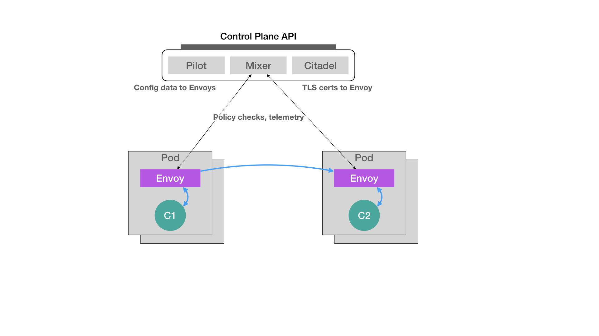
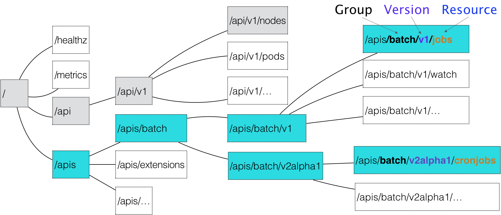
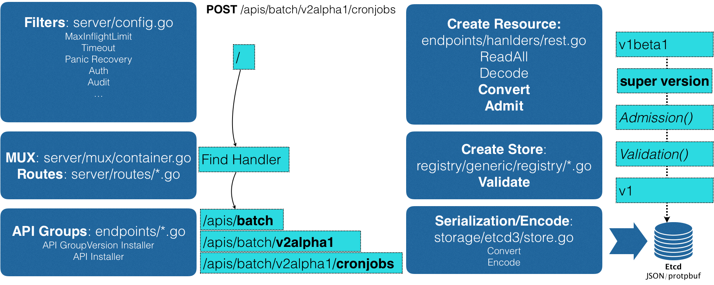
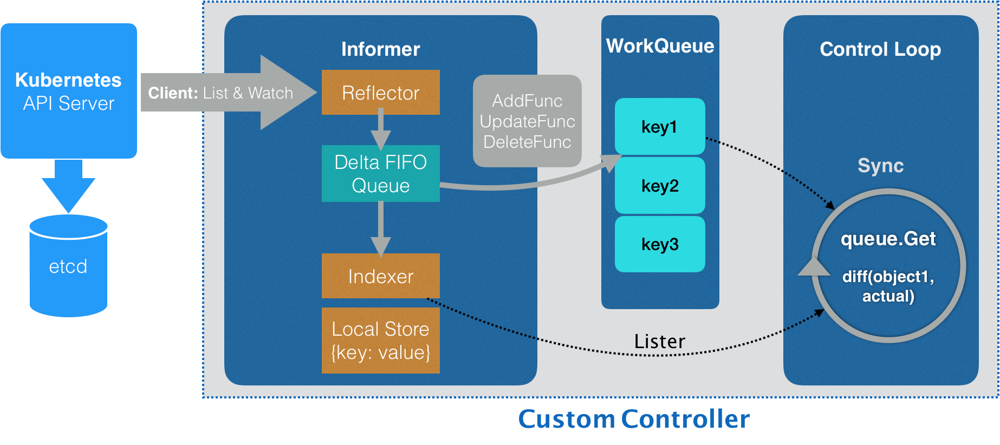

[toc]

------

### 命令式命令行操作

很多 Kubernetes 的 API 对象，有的是用来描述应用，有的则是为应用提供各种各样的服务。但是，无一例外地，为了使用这些 API 对象提供的能力，你都需要编写一个对应的 YAML 文件交给 Kubernetes。

这个 YAML 文件，正是 Kubernetes 声明式 API 所必须具备的一个要素。不过，是不是只要用 YAML 文件代替了命令行操作，就是声明式 API 了呢？

我们知道，Docker Swarm 的编排操作都是基于命令行的，比如：

```

$ docker service create --name nginx --replicas 2  nginx
$ docker service update --image nginx:1.7.9 nginx
```

像这样的两条命令，就是用 Docker Swarm 启动了两个 Nginx 容器实例。其中，第一条 create 命令创建了这两个容器，而第二条 update 命令则把它们“滚动更新”成了一个新的镜像。

对于这种使用方式，我们称为**命令式命令行操作。**


### 命令式配置文件操作

像上面这样的创建和更新两个 Nginx 容器的操作，在 Kubernetes 里又该怎么做呢？

我们需要在本地编写一个 Deployment 的 YAML 文件：

```

apiVersion: apps/v1
kind: Deployment
metadata:
  name: nginx-deployment
spec:
  selector:
    matchLabels:
      app: nginx
  replicas: 2
  template:
    metadata:
      labels:
        app: nginx
    spec:
      containers:
      - name: nginx
        image: nginx
        ports:
        - containerPort: 80
```

然后，我们还需要使用 kubectl create 命令在 Kubernetes 里创建这个 Deployment 对象：

```

$ kubectl create -f nginx.yaml
```

这样，两个 Nginx 的 Pod 就会运行起来了。

而如果要更新这两个 Pod 使用的 Nginx 镜像，该怎么办呢？ kubectl set image 和 kubectl edit 命令，来直接修改 Kubernetes 里的 API 对象。不过，相信很多人都有这样的想法，我能不能通过修改本地 YAML 文件来完成这个操作呢？这样我的改动就会体现在这个本地 YAML 文件里了。

当然可以。

比如，我们可以修改这个 YAML 文件里的 Pod 模板部分，把 Nginx 容器的镜像改成 1.7.9，如下所示：

```

...
    spec:
      containers:
      - name: nginx
        image: nginx:1.7.9
```

而接下来，我们就可以执行一句 kubectl replace 操作，来完成这个 Deployment 的更新：

```

$ kubectl replace -f nginx.yaml
```

可是，上面这种基于 YAML 文件的操作方式，是“声明式 API”吗？

并不是。

对于上面这种先 kubectl create，再 replace 的操作，我们称为命令式配置文件操作。

也就是说，它的处理方式，其实跟前面 Docker Swarm 的两句命令，没什么本质上的区别。只不过，它是把 Docker 命令行里的参数，写在了配置文件里而已。


### 声明式 API

kubectl apply 命令。

现在使用 kubectl apply 命令来创建这个 Deployment：

```

$ kubectl apply -f nginx.yaml
```

Nginx 的 Deployment 就被创建了出来，这看起来跟 kubectl create 的效果一样。然后，我再修改一下 nginx.yaml 里定义的镜像：

```

...
    spec:
      containers:
      - name: nginx
        image: nginx:1.7.9
```

在修改完这个 YAML 文件之后，我不再使用 kubectl replace 命令进行更新，而是继续执行一条 kubectl apply 命令，即：

```

$ kubectl apply -f nginx.yaml
```

Kubernetes 就会立即触发这个 Deployment 的“滚动更新”。可是，它跟 kubectl replace 命令有什么本质区别吗？

可以简单地理解为，kubectl replace 的执行过程，是使用新的 YAML 文件中的 API 对象，替换原有的 API 对象；而 kubectl apply，则是执行了一个对原有 API 对象的 PATCH 操作。

> 类似地，kubectl set image 和 kubectl edit 也是对已有 API 对象的修改。

这意味着 kube-apiserver 在响应命令式请求（比如，kubectl replace）的时候，一次只能处理一个写请求，否则会有产生冲突的可能。而对于声明式请求（比如，kubectl apply），**一次能处理多个写操作，并且具备 Merge 能力**。

正是由于要照顾到这样的 API 设计，做同样一件事情，Kubernetes 需要的步骤往往要比其他项目多不少。


### 声明式 API的Istio示例

以 Istio 项目为例，来看下声明式 API 在实际使用时的重要意义。



在上面这个架构图中，不难看到 Istio 项目架构的核心所在。**Istio 最根本的组件，是运行在每一个应用 Pod 里的 Envoy 容器。**

这个 Envoy 项目是 Lyft 公司推出的一个高性能 C++ 网络代理，也是 Lyft 公司对 Istio 项目的唯一贡献。

而 Istio 项目，则把这个代理服务以 sidecar 容器的方式，运行在了每一个被治理的应用 Pod 中。我们知道，Pod 里的所有容器都共享同一个 Network Namespace。所以，Envoy 容器就能够通过配置 Pod 里的 iptables 规则，把整个 Pod 的进出流量接管下来。

这时候，Istio 的控制层（Control Plane）里的 Pilot 组件，就能够通过调用每个 Envoy 容器的 API，对这个 Envoy 代理进行配置，从而实现微服务治理。

假设这个 Istio 架构图左边的 Pod 是已经在运行的应用，而右边的 Pod 则是我们刚刚上线的应用的新版本。这时候，Pilot 通过调节这两 Pod 里的 Envoy 容器的配置，从而将 90% 的流量分配给旧版本的应用，将 10% 的流量分配给新版本应用，并且，还可以在后续的过程中随时调整。这样，一个典型的“灰度发布”的场景就完成了。比如，Istio 可以调节这个流量从 90%-10%，改到 80%-20%，再到 50%-50%，最后到 0%-100%，就完成了这个灰度发布的过程。

更重要的是，在整个微服务治理的过程中，无论是对 Envoy 容器的部署，还是像上面这样对 Envoy 代理的配置，用户和应用都是完全“无感”的。

你可能会有所疑惑：**Istio 项目明明需要在每个 Pod 里安装一个 Envoy 容器，又怎么能做到“无感”的呢？**

实际上，**Istio 项目使用的，是 Kubernetes 中的一个非常重要的功能，叫作 Dynamic Admission Control。**

在 Kubernetes 项目中，当一个 Pod 或者任何一个 API 对象被提交给 APIServer 之后，总有一些“初始化”性质的工作需要在它们被 Kubernetes 项目正式处理之前进行。比如，自动为所有 Pod 加上某些标签（Labels）。

而这个“初始化”操作的实现，借助的是一个叫作 Admission 的功能。它其实是 Kubernetes 项目里一组被称为 Admission Controller 的代码，可以选择性地被编译进 APIServer 中，在 API 对象创建之后会被立刻调用到。

但这就意味着，如果你现在想要添加一些自己的规则到 Admission Controller，就会比较困难。因为，这要求重新编译并重启 APIServer。显然，这种使用方法对 Istio 来说，影响太大了。

所以，Kubernetes 项目为我们额外提供了一种“热插拔”式的 Admission 机制，它就是 Dynamic Admission Control，也叫作：Initializer。

```

apiVersion: v1
kind: Pod
metadata:
  name: myapp-pod
  labels:
    app: myapp
spec:
  containers:
  - name: myapp-container
    image: busybox
    command: ['sh', '-c', 'echo Hello Kubernetes! && sleep 3600']
```

可以看到，这个 Pod 里面只有一个用户容器，叫作：myapp-container。

接下来，Istio 项目要做的，就是在这个 Pod YAML 被提交给 Kubernetes 之后，在它对应的 API 对象里自动加上 Envoy 容器的配置，使这个对象变成如下所示的样子：

```

apiVersion: v1
kind: Pod
metadata:
  name: myapp-pod
  labels:
    app: myapp
spec:
  containers:
  - name: myapp-container
    image: busybox
    command: ['sh', '-c', 'echo Hello Kubernetes! && sleep 3600']
  - name: envoy
    image: lyft/envoy:845747b88f102c0fd262ab234308e9e22f693a1
    command: ["/usr/local/bin/envoy"]
    ...
```

可以看到，被 Istio 处理后的这个 Pod 里，除了用户自己定义的 myapp-container 容器之外，多出了一个叫作 envoy 的容器，它就是 Istio 要使用的 Envoy 代理。


#### 容器的 Initializer

那么，Istio 又是如何在用户完全不知情的前提下完成这个操作的呢？

Istio 要做的，就是编写一个用来为 Pod“自动注入”Envoy 容器的 Initializer。

**首先，Istio 会将这个 Envoy 容器本身的定义，以 ConfigMap 的方式保存在 Kubernetes 当中。**这个 ConfigMap（名叫：envoy-initializer）的定义如下所示：

```

apiVersion: v1
kind: ConfigMap
metadata:
  name: envoy-initializer
data:
  config: |
    containers:
      - name: envoy
        image: lyft/envoy:845747db88f102c0fd262ab234308e9e22f693a1
        command: ["/usr/local/bin/envoy"]
        args:
          - "--concurrency 4"
          - "--config-path /etc/envoy/envoy.json"
          - "--mode serve"
        ports:
          - containerPort: 80
            protocol: TCP
        resources:
          limits:
            cpu: "1000m"
            memory: "512Mi"
          requests:
            cpu: "100m"
            memory: "64Mi"
        volumeMounts:
          - name: envoy-conf
            mountPath: /etc/envoy
    volumes:
      - name: envoy-conf
        configMap:
          name: envoy
```

这个 ConfigMap 的 data 部分，正是一个 Pod 对象的一部分定义。其中，我们可以看到 Envoy 容器对应的 containers 字段，以及一个用来声明 Envoy 配置文件的 volumes 字段。

不难想到，Initializer 要做的工作，就是把这部分 Envoy 相关的字段，自动添加到用户提交的 Pod 的 API 对象里。可是，用户提交的 Pod 里本来就有 containers 字段和 volumes 字段，所以 Kubernetes 在处理这样的更新请求时，就必须使用类似于 git merge 这样的操作，才能将这两部分内容合并在一起。

在 Initializer 更新用户的 Pod 对象的时候，必须使用 PATCH API 来完成。而这种 PATCH API，正是声明式 API 最主要的能力。

接下来，**Istio 将一个编写好的 Initializer，作为一个 Pod 部署在 Kubernetes 中**。这个 Pod 的定义非常简单，如下所示：

```

apiVersion: v1
kind: Pod
metadata:
  labels:
    app: envoy-initializer
  name: envoy-initializer
spec:
  containers:
    - name: envoy-initializer
      image: envoy-initializer:0.0.1
      imagePullPolicy: Always
```

我们可以看到，这个 envoy-initializer 使用的 envoy-initializer:0.0.1 镜像，就是一个事先编写好的“自定义控制器”（Custom Controller）。一个 Kubernetes 的控制器，实际上就是一个“死循环”：它不断地获取“实际状态”，然后与“期望状态”作对比，并以此为依据决定下一步的操作。

而 Initializer 的控制器，不断获取到的“实际状态”，就是用户新创建的 Pod。而它的“期望状态”，则是：这个 Pod 里被添加了 Envoy 容器的定义。

用一段 Go 语言风格的伪代码，来为你描述这个控制逻辑，如下所示：

```

for {
  // 获取新创建的Pod
  pod := client.GetLatestPod()
  // Diff一下，检查是否已经初始化过
  if !isInitialized(pod) {
    // 没有？那就来初始化一下
    doSomething(pod)
  }
}
```

- 如果这个 Pod 里面已经添加过 Envoy 容器，那么就“放过”这个 Pod，进入下一个检查周期。
- 而如果还没有添加过 Envoy 容器的话，它就要进行 Initialize 操作了，即：修改该 Pod 的 API 对象（doSomething 函数）。

这时候，Istio 要往这个 Pod 里合并的字段，正是我们之前保存在 envoy-initializer 这个 ConfigMap 里的数据（即：它的 data 字段的值）。

所以，在 Initializer 控制器的工作逻辑里，它首先会从 APIServer 中拿到这个 ConfigMap：

```

func doSomething(pod) {
  cm := client.Get(ConfigMap, "envoy-initializer")
}
```

然后，把这个 ConfigMap 里存储的 containers 和 volumes 字段，直接添加进一个空的 Pod 对象里：

```

func doSomething(pod) {
  cm := client.Get(ConfigMap, "envoy-initializer")
  
  newPod := Pod{}
  newPod.Spec.Containers = cm.Containers
  newPod.Spec.Volumes = cm.Volumes
}
```

Kubernetes 的 API 库，为我们提供了一个方法，使得我们可以直接使用新旧两个 Pod 对象，生成一个 TwoWayMergePatch：

```

func doSomething(pod) {
  cm := client.Get(ConfigMap, "envoy-initializer")

  newPod := Pod{}
  newPod.Spec.Containers = cm.Containers
  newPod.Spec.Volumes = cm.Volumes

  // 生成patch数据
  patchBytes := strategicpatch.CreateTwoWayMergePatch(pod, newPod)

  // 发起PATCH请求，修改这个pod对象
  client.Patch(pod.Name, patchBytes)
}
```

**有了这个 TwoWayMergePatch 之后，Initializer 的代码就可以使用这个 patch 的数据，调用 Kubernetes 的 Client，发起一个 PATCH 请求。**

这样，一个用户提交的 Pod 对象里，就会被自动加上 Envoy 容器相关的字段。

当然，Kubernetes 还允许你通过配置，来指定要对什么样的资源进行这个 Initialize 操作，比如下面这个例子：

```

apiVersion: admissionregistration.k8s.io/v1alpha1
kind: InitializerConfiguration
metadata:
  name: envoy-config
initializers:
  // 这个名字必须至少包括两个 "."
  - name: envoy.initializer.kubernetes.io
    rules:
      - apiGroups:
          - "" //  ""就是core API Group的意思
        apiVersions:
          - v1
        resources:
          - pods
```

这个配置，就意味着 Kubernetes 要对所有的 Pod 进行这个 Initialize 操作，并且，我们指定了负责这个操作的 Initializer，名叫：envoy-initializer。

而一旦这个 InitializerConfiguration 被创建，Kubernetes 就会把这个 Initializer 的名字，加在所有新创建的 Pod 的 Metadata 上，格式如下所示：

```

apiVersion: v1
kind: Pod
metadata:
  initializers:
    pending:
      - name: envoy.initializer.kubernetes.io
  name: myapp-pod
  labels:
    app: myapp
...
```

可以看到，每一个新创建的 Pod，都会自动携带了 metadata.initializers.pending 的 Metadata 信息。

这个 Metadata，正是接下来 Initializer 的控制器判断这个 Pod 有没有执行过自己所负责的初始化操作的重要依据（也就是前面伪代码中 isInitialized() 方法的含义）。

这也就意味着，当你在 Initializer 里完成了要做的操作后，一定要记得将这个 metadata.initializers.pending 标志清除掉。这一点，你在编写 Initializer 代码的时候一定要非常注意。

此外，除了上面的配置方法，你还可以在具体的 Pod 的 Annotation 里添加一个如下所示的字段，从而声明要使用某个 Initializer：

```

apiVersion: v1
kind: Pod
metadata
  annotations:
    "initializer.kubernetes.io/envoy": "true"
    ...
```

在这个 Pod 里，我们添加了一个 Annotation，写明： initializer.kubernetes.io/envoy=true。这样，就会使用到我们前面所定义的 envoy-initializer 了。

以上，就是关于 Initializer 最基本的工作原理和使用方法了。

相信你此时已经明白，**Istio 项目的核心，就是由无数个运行在应用 Pod 中的 Envoy 容器组成的服务代理网格。这也正是 Service Mesh 的含义。**

#### 小结

而这个机制得以实现的原理，正是借助了 Kubernetes 能够对 API 对象进行在线更新的能力，这也正是 Kubernetes“声明式 API”的独特之处：

- 首先，所谓“声明式”，指的就是我只需要提交一个定义好的 API 对象来“声明”，我所期望的状态是什么样子。
- 其次，“声明式 API”允许有多个 API 写端，以 PATCH 的方式对 API 对象进行修改，而无需关心本地原始 YAML 文件的内容。
- 最后，也是最重要的，有了上述两个能力，Kubernetes 项目才可以基于对 API 对象的增、删、改、查，在完全无需外界干预的情况下，完成对“实际状态”和“期望状态”的调谐（Reconcile）过程。

所以说，**声明式 API，才是 Kubernetes 项目编排能力“赖以生存”的核心所在**。

此外，不难看到，无论是对 sidecar 容器的巧妙设计，还是对 Initializer 的合理利用，Istio 项目的设计与实现，其实都依托于 Kubernetes 的声明式 API 和它所提供的各种编排能力。可以说，Istio 是在 Kubernetes 项目使用上的一位“集大成者”。

> 一个 Istio 项目部署完成后，会在 Kubernetes 里创建大约 43 个 API 对象。
>
> Kubernetes 社区也看得很明白：Istio 项目有多火热，就说明 Kubernetes 这套“声明式 API”有多成功。

而在使用 Initializer 的流程中，最核心的步骤，莫过于 Initializer“自定义控制器”的编写过程。它遵循的，正是标准的“Kubernetes 编程范式”，即：

> 如何使用控制器模式，同 Kubernetes 里 API 对象的“增、删、改、查”进行协作，进而完成用户业务逻辑的编写过程。


### 深入解析声明式 API 的工作原理

你可能一直就很好奇：当我把一个 YAML 文件提交给 Kubernetes 之后，它究竟是如何创建出一个 API 对象的呢？

在 Kubernetes 项目中，一个 API 对象在 Etcd 里的完整资源路径，是由：Group（API 组）、Version（API 版本）和 Resource（API 资源类型）三个部分组成的。

通过这样的结构，整个 Kubernetes 里的所有 API 对象，实际上就可以用如下的树形结构表示出来：



Kubernetes 里 API 对象的组织方式，其实是层层递进的。

比如，现在我要声明要创建一个 CronJob 对象，那么我的 YAML 文件的开始部分会这么写：

```

apiVersion: batch/v2alpha1
kind: CronJob
...
```

在这个 YAML 文件中，“CronJob”就是这个 API 对象的资源类型（Resource），“batch”就是它的组（Group），v2alpha1 就是它的版本（Version）。

当我们提交了这个 YAML 文件之后，Kubernetes 就会把这个 YAML 文件里描述的内容，转换成 Kubernetes 里的一个 CronJob 对象。

***Kubernetes 是如何对 Resource、Group 和 Version 进行解析，从而在 Kubernetes 项目里找到 CronJob 对象的定义呢？***

**首先，Kubernetes 会匹配 API 对象的组。**

需要明确的是，对于 Kubernetes 里的核心 API 对象，比如：Pod、Node 等，是不需要 Group 的（即：它们的 Group 是“”）。所以，对于这些 API 对象来说，Kubernetes 会直接在 /api 这个层级进行下一步的匹配过程。

而对于 CronJob 等非核心 API 对象来说，Kubernetes 就必须在 /apis 这个层级里查找它对应的 Group，进而根据“batch”这个 Group 的名字，找到 /apis/batch。

不难发现，这些 API Group 的分类是以对象功能为依据的，比如 Job 和 CronJob 就都属于“batch” （离线业务）这个 Group。

**然后，Kubernetes 会进一步匹配到 API 对象的版本号。**

对于 CronJob 这个 API 对象来说，Kubernetes 在 batch 这个 Group 下，匹配到的版本号就是 v2alpha1。在 Kubernetes 中，同一种 API 对象可以有多个版本，这正是 Kubernetes 进行 API 版本化管理的重要手段。这样，比如在 CronJob 的开发过程中，对于会影响到用户的变更就可以通过升级新版本来处理，从而保证了向后兼容。

**最后，Kubernetes 会匹配 API 对象的资源类型。**

在前面匹配到正确的版本之后，Kubernetes 就知道，我要创建的原来是一个 /apis/batch/v2alpha1 下的 CronJob 对象。

这时候，APIServer 就可以继续创建这个 CronJob 对象了。为了方便理解，总结了一个如下所示流程图来阐述这个创建过程：



- 首先，当我们发起了创建 CronJob 的 POST 请求之后，我们编写的 YAML 的信息就被提交给了 APIServer。
- 而 APIServer 的第一个功能，就是过滤这个请求，并完成一些前置性的工作，比如授权、超时处理、审计等。
- 然后，请求会进入 MUX 和 Routes 流程。如果你编写过 Web Server 的话就会知道，MUX 和 Routes 是 APIServer 完成 URL 和 Handler 绑定的场所。而 APIServer 的 Handler 要做的事情，就是按照我刚刚介绍的匹配过程，找到对应的 CronJob 类型定义。
- 接着，APIServer 最重要的职责就来了：根据这个 CronJob 类型定义，使用用户提交的 YAML 文件里的字段，创建一个 CronJob 对象。
- 而在这个过程中，APIServer 会进行一个 Convert 工作，即：把用户提交的 YAML 文件，转换成一个叫作 Super Version 的对象，它正是该 API 资源类型所有版本的字段全集。这样用户提交的不同版本的 YAML 文件，就都可以用这个 Super Version 对象来进行处理了。
- 接下来，APIServer 会先后进行 Admission() 和 Validation() 操作。比如，我在上一篇文章中提到的 Admission Controller 和 Initializer，就都属于 Admission 的内容。
- 而 Validation，则负责验证这个对象里的各个字段是否合法。这个被验证过的 API 对象，都保存在了 APIServer 里一个叫作 Registry 的数据结构中。也就是说，只要一个 API 对象的定义能在 Registry 里查到，它就是一个有效的 Kubernetes API 对象。
- 最后，APIServer 会把验证过的 API 对象转换成用户最初提交的版本，进行序列化操作，并调用 Etcd 的 API 把它保存起来。

由此可见，声明式 API 对于 Kubernetes 来说非常重要。所以，APIServer 这样一个在其他项目里“平淡无奇”的组件，却成了 Kubernetes 项目的重中之重。它不仅是 Google Borg 设计思想的集中体现，也是 Kubernetes 项目里唯一一个被 Google 公司和 RedHat 公司双重控制、其他势力根本无法参与其中的组件。

此外，由于同时要兼顾性能、API 完备性、版本化、向后兼容等很多工程化指标，所以 Kubernetes 团队在 APIServer 项目里大量使用了 Go 语言的代码生成功能，来自动化诸如 Convert、DeepCopy 等与 API 资源相关的操作。这部分自动生成的代码，曾一度占到 Kubernetes 项目总代码的 20%~30%。

这也是为何，在过去很长一段时间里，在这样一个极其“复杂”的 APIServer 中，添加一个 Kubernetes 风格的 API 资源类型，是一个非常困难的工作。

不过，在 Kubernetes v1.7 之后，这个工作就变得轻松得多了。这，当然得益于一个全新的 API 插件机制：CRD。


### API 插件机制：CRD

CRD 的全称是 Custom Resource Definition。顾名思义，它指的就是，允许用户在 Kubernetes 中添加一个跟 Pod、Node 类似的、新的 API 资源类型，即：自定义 API 资源。

**举个例子**，为 Kubernetes 添加一个名叫 Network 的 API 资源类型。

它的作用是，一旦用户创建一个 Network 对象，那么 Kubernetes 就应该使用这个对象定义的网络参数，调用真实的网络插件，比如 Neutron 项目，为用户创建一个真正的“网络”。这样，将来用户创建的 Pod，就可以声明使用这个“网络”了。这个 Network 对象的 YAML 文件，名叫 example-network.yaml，它的内容如下所示：

```

apiVersion: samplecrd.k8s.io/v1
kind: Network
metadata:
  name: example-network
spec:
  cidr: "192.168.0.0/16"
  gateway: "192.168.0.1"
```

Kubernetes 又该如何知道这个 API（samplecrd.k8s.io/v1/network）的存在呢？

其实，上面的这个 YAML 文件，就是一个具体的“自定义 API 资源”实例，也叫 CR（Custom Resource）。而为了能够让 Kubernetes 认识这个 CR，你就需要让 Kubernetes 明白这个 CR 的宏观定义是什么，也就是 CRD（Custom Resource Definition）。

接下来，先编写一个 CRD 的 YAML 文件，它的名字叫作 network.yaml，内容如下所示：

```

apiVersion: apiextensions.k8s.io/v1beta1
kind: CustomResourceDefinition
metadata:
  name: networks.samplecrd.k8s.io
spec:
  group: samplecrd.k8s.io
  version: v1
  names:
    kind: Network
    plural: networks
  scope: Namespaced
```

可以看到，在这个 CRD 中，我指定了“group: samplecrd.k8s.io”“version: v1”这样的 API 信息，也指定了这个 CR 的资源类型叫作 Network，复数（plural）是 networks。

然后，我还声明了它的 scope 是 Namespaced，即：我们定义的这个 Network 是一个属于 Namespace 的对象，类似于 Pod。

还需要让 Kubernetes“认识”这种 YAML 文件里描述的“网络”部分，比如“cidr”（网段），“gateway”（网关）这些字段的含义。

这时候呢，就需要稍微做些代码工作了。

首先，要在 GOPATH 下，创建一个结构如下的项目：

```

$ tree $GOPATH/src/github.com/<your-name>/k8s-controller-custom-resource
.
├── controller.go
├── crd
│   └── network.yaml
├── example
│   └── example-network.yaml
├── main.go
└── pkg
    └── apis
        └── samplecrd
            ├── register.go
            └── v1
                ├── doc.go
                ├── register.go
                └── types.go
```

其中，pkg/apis/samplecrd 就是 API 组的名字，v1 是版本，而 v1 下面的 types.go 文件里，则定义了 Network 对象的完整描述。

> https://github.com/resouer/k8s-controller-custom-resource

在 pkg/apis/samplecrd 目录下创建了一个 register.go 文件，用来放置后面要用到的全局变量。这个文件的内容如下所示：

```

package samplecrd

const (
 GroupName = "samplecrd.k8s.io"
 Version   = "v1"
)
```

需要在 pkg/apis/samplecrd 目录下添加一个 doc.go 文件（Golang 的文档源文件）。这个文件里的内容如下所示：

```

// +k8s:deepcopy-gen=package

// +groupName=samplecrd.k8s.io
package v1
```

在这个文件中，你会看到 +[=value]格式的注释，这就是 Kubernetes 进行代码生成要用的 Annotation 风格的注释。其中，+k8s:deepcopy-gen=package 意思是，请为整个 v1 包里的所有类型定义自动生成 DeepCopy 方法；而+groupName=samplecrd.k8s.io，则定义了这个包对应的 API 组的名字。

可以看到，这些定义在 doc.go 文件的注释，起到的是全局的代码生成控制的作用，所以也被称为 Global Tags。

**需要添加 types.go 文件**。顾名思义，它的作用就是定义一个 Network 类型到底有哪些字段（比如，spec 字段里的内容）。这个文件的主要内容如下所示：

```

package v1
...
// +genclient
// +genclient:noStatus
// +k8s:deepcopy-gen:interfaces=k8s.io/apimachinery/pkg/runtime.Object

// Network describes a Network resource
type Network struct {
 // TypeMeta is the metadata for the resource, like kind and apiversion
 metav1.TypeMeta `json:",inline"`
 // ObjectMeta contains the metadata for the particular object, including
 // things like...
 //  - name
 //  - namespace
 //  - self link
 //  - labels
 //  - ... etc ...
 metav1.ObjectMeta `json:"metadata,omitempty"`
 
 Spec networkspec `json:"spec"`
}
// networkspec is the spec for a Network resource
type networkspec struct {
 Cidr    string `json:"cidr"`
 Gateway string `json:"gateway"`
}

// +k8s:deepcopy-gen:interfaces=k8s.io/apimachinery/pkg/runtime.Object

// NetworkList is a list of Network resources
type NetworkList struct {
 metav1.TypeMeta `json:",inline"`
 metav1.ListMeta `json:"metadata"`
 
 Items []Network `json:"items"`
}
```

在上面这部分代码里，你可以看到 Network 类型定义方法跟标准的 Kubernetes 对象一样，都包括了 TypeMeta（API 元数据）和 ObjectMeta（对象元数据）字段。而其中的 Spec 字段，就是需要我们自己定义的部分。所以，在 networkspec 里，我定义了 Cidr 和 Gateway 两个字段。其中，每个字段最后面的部分比如json:"cidr"，指的就是这个字段被转换成 JSON 格式之后的名字，也就是 YAML 文件里的字段名字。

此外，除了定义 Network 类型，你还需要定义一个 NetworkList 类型，用来描述一组 Network 对象应该包括哪些字段。之所以需要这样一个类型，是因为在 Kubernetes 中，获取所有 X 对象的 List() 方法，返回值都是List 类型，而不是 X 类型的数组。这是不一样的。

同样地，在 Network 和 NetworkList 类型上，也有代码生成注释。

其中，+genclient 的意思是：请为下面这个 API 资源类型生成对应的 Client 代码。而 +genclient:noStatus 的意思是：这个 API 资源类型定义里，没有 Status 字段。否则，生成的 Client 就会自动带上 UpdateStatus 方法。

如果你的类型定义包括了 Status 字段的话，就不需要这句 +genclient:noStatus 注释了。比如下面这个例子：

```

// +genclient

// Network is a specification for a Network resource
type Network struct {
 metav1.TypeMeta   `json:",inline"`
 metav1.ObjectMeta `json:"metadata,omitempty"`
 
 Spec   NetworkSpec   `json:"spec"`
 Status NetworkStatus `json:"status"`
}
```

需要注意的是，+genclient 只需要写在 Network 类型上，而不用写在 NetworkList 上。因为 NetworkList 只是一个返回值类型，Network 才是“主类型”。

而由于在 Global Tags 里已经定义了为所有类型生成 DeepCopy 方法，所以这里就不需要再显式地加上 +k8s:deepcopy-gen=true 了。当然，这也就意味着你可以用 +k8s:deepcopy-gen=false 来阻止为某些类型生成 DeepCopy。

你可能已经注意到，在这两个类型上面还有一句+k8s:deepcopy-gen:interfaces=k8s.io/apimachinery/pkg/runtime.Object的注释。它的意思是，请在生成 DeepCopy 的时候，实现 Kubernetes 提供的 runtime.Object 接口。否则，在某些版本的 Kubernetes 里，你的这个类型定义会出现编译错误。这是一个固定的操作，记住即可。

不过，你或许会有这样的顾虑：这些代码生成注释这么灵活，我该怎么掌握呢？

其实，上面我所讲述的内容，已经足以应对 99% 的场景了。

> 如果你对代码生成感兴趣的话，https://www.openshift.com/blog/kubernetes-deep-dive-code-generation-customresources

最后，需要再编写一个 pkg/apis/samplecrd/v1/register.go 文件。

在前面对 APIServer 工作原理的讲解中，我已经提到，“registry”的作用就是注册一个类型（Type）给 APIServer。其中，Network 资源类型在服务器端注册的工作，APIServer 会自动帮我们完成。但与之对应的，我们还需要让客户端也能“知道”Network 资源类型的定义。这就需要我们在项目里添加一个 register.go 文件。它最主要的功能，就是定义了如下所示的 addKnownTypes() 方法：

```

package v1
...
// addKnownTypes adds our types to the API scheme by registering
// Network and NetworkList
func addKnownTypes(scheme *runtime.Scheme) error {
 scheme.AddKnownTypes(
  SchemeGroupVersion,
  &Network{},
  &NetworkList{},
 )
 
 // register the type in the scheme
 metav1.AddToGroupVersion(scheme, SchemeGroupVersion)
 return nil
}
```

有了这个方法，Kubernetes 就能够在后面生成客户端的时候，“知道”Network 以及 NetworkList 类型的定义了。

像上面这种 register.go 文件里的内容其实是非常固定的，你以后可以直接使用我提供的这部分代码做模板，然后把其中的资源类型、GroupName 和 Version 替换成你自己的定义即可。

这样，Network 对象的定义工作就全部完成了。可以看到，它其实定义了两部分内容：

- 第一部分是，自定义资源类型的 API 描述，包括：组（Group）、版本（Version）、资源类型（Resource）等。
- 第二部分是，自定义资源类型的对象描述，包括：Spec、Status 等。

接下来，我就要使用 Kubernetes 提供的代码生成工具，为上面定义的 Network 资源类型自动生成 clientset、informer 和 lister。其中，clientset 就是操作 Network 对象所需要使用的客户端，而 informer 和 lister 这两个包的主要功能：

这个代码生成工具名叫k8s.io/code-generator，使用方法如下所示：

```

# 代码生成的工作目录，也就是我们的项目路径
$ ROOT_PACKAGE="github.com/resouer/k8s-controller-custom-resource"
# API Group
$ CUSTOM_RESOURCE_NAME="samplecrd"
# API Version
$ CUSTOM_RESOURCE_VERSION="v1"

# 安装k8s.io/code-generator
$ go get -u k8s.io/code-generator/...
$ cd $GOPATH/src/k8s.io/code-generator

# 执行代码自动生成，其中pkg/client是生成目标目录，pkg/apis是类型定义目录
$ ./generate-groups.sh all "$ROOT_PACKAGE/pkg/client" "$ROOT_PACKAGE/pkg/apis" "$CUSTOM_RESOURCE_NAME:$CUSTOM_RESOURCE_VERSION"
```

代码生成工作完成之后，我们再查看一下这个项目的目录结构：

```

$ tree
.
├── controller.go
├── crd
│   └── network.yaml
├── example
│   └── example-network.yaml
├── main.go
└── pkg
    ├── apis
    │   └── samplecrd
    │       ├── constants.go
    │       └── v1
    │           ├── doc.go
    │           ├── register.go
    │           ├── types.go
    │           └── zz_generated.deepcopy.go
    └── client
        ├── clientset
        ├── informers
        └── listers
```

其中，pkg/apis/samplecrd/v1 下面的 zz_generated.deepcopy.go 文件，就是自动生成的 DeepCopy 代码文件。

而整个 client 目录，以及下面的三个包（clientset、informers、 listers），都是 Kubernetes 为 Network 类型生成的客户端库，这些库会在后面编写自定义控制器的时候用到。

可以看到，到目前为止的这些工作，其实并不要求你写多少代码，主要考验的是“复制、粘贴、替换”这样的“基本功”。

而有了这些内容，现在你就可以在 Kubernetes 集群里创建一个 Network 类型的 API 对象了。我们不妨一起来试验下。

**首先，使用 network.yaml 文件**，在 Kubernetes 中创建 Network 对象的 CRD（Custom Resource Definition）：

```

$ kubectl apply -f crd/network.yaml
customresourcedefinition.apiextensions.k8s.io/networks.samplecrd.k8s.io created
```

这个操作，就告诉了 Kubernetes，我现在要添加一个自定义的 API 对象。而这个对象的 API 信息，正是 network.yaml 里定义的内容。我们可以通过 kubectl get 命令，查看这个 CRD：

```

$ kubectl get crd
NAME                        CREATED AT
networks.samplecrd.k8s.io   2018-09-15T10:57:12Z
```

然后，我们就可以创建一个 Network 对象了，这里用到的是 example-network.yaml：

```

$ kubectl apply -f example/example-network.yaml 
network.samplecrd.k8s.io/example-network created
```

通过这个操作，你就在 Kubernetes 集群里创建了一个 Network 对象。它的 API 资源路径是samplecrd.k8s.io/v1/networks。这时候，你就可以通过 kubectl get 命令，查看到新创建的 Network 对象：

```

$ kubectl get network
NAME              AGE
example-network   8s
```

你还可以通过 kubectl describe 命令，看到这个 Network 对象的细节：

```

$ kubectl describe network example-network
Name:         example-network
Namespace:    default
Labels:       <none>
...API Version:  samplecrd.k8s.io/v1
Kind:         Network
Metadata:
  ...
  Generation:          1
  Resource Version:    468239
  ...
Spec:
  Cidr:     192.168.0.0/16
  Gateway:  192.168.0.1
```

当然 ，你也可以编写更多的 YAML 文件来创建更多的 Network 对象，这和创建 Pod、Deployment 的操作，没有任何区别。


### 编写自定义控制器

“声明式 API”并不像“命令式 API”那样有着明显的执行逻辑。这就使得基于声明式 API 的业务功能实现，往往需要通过控制器模式来“监视”API 对象的变化（比如，创建或者删除 Network），然后以此来决定实际要执行的具体工作。

为 Network 这个自定义 API 对象编写一个自定义控制器（Custom Controller）。

> https://github.com/resouer/k8s-controller-custom-resource

总得来说，编写自定义控制器代码的过程包括：**编写 main 函数、编写自定义控制器的定义，以及编写控制器里的业务逻辑三个部分。**

main 函数的主要工作就是，定义并初始化一个自定义控制器（Custom Controller），然后启动它。这部分代码的主要内容如下所示：

```

func main() {
  ...
  
  cfg, err := clientcmd.BuildConfigFromFlags(masterURL, kubeconfig)
  ...
  kubeClient, err := kubernetes.NewForConfig(cfg)
  ...
  networkClient, err := clientset.NewForConfig(cfg)
  ...
  
  networkInformerFactory := informers.NewSharedInformerFactory(networkClient, ...)
  
  controller := NewController(kubeClient, networkClient,
  networkInformerFactory.Samplecrd().V1().Networks())
  
  go networkInformerFactory.Start(stopCh)
 
  if err = controller.Run(2, stopCh); err != nil {
    glog.Fatalf("Error running controller: %s", err.Error())
  }
}
```

可以看到，这个 main 函数主要通过三步完成了初始化并启动一个自定义控制器的工作。

**第一步：**main 函数根据我提供的 Master 配置（APIServer 的地址端口和 kubeconfig 的路径），创建一个 Kubernetes 的 client（kubeClient）和 Network 对象的 client（networkClient）。

但是，如果我没有提供 Master 配置呢？

这时，main 函数会直接使用一种名叫 **InClusterConfig** 的方式来创建这个 client。这个方式，会假设你的自定义控制器是以 Pod 的方式运行在 Kubernetes 集群里的。Kubernetes 里所有的 Pod 都会以 Volume 的方式自动挂载 Kubernetes 的默认 ServiceAccount。所以，这个控制器就会直接使用默认 ServiceAccount 数据卷里的授权信息，来访问 APIServer。

**第二步：**main 函数为 Network 对象创建一个叫作 InformerFactory（即：networkInformerFactory）的工厂，并使用它生成一个 Network 对象的 Informer，传递给控制器。

**第三步**：main 函数启动上述的 Informer，然后执行 controller.Run，启动自定义控制器。

至此，main 函数就结束了。

看到这，你可能会感到非常困惑：编写自定义控制器的过程难道就这么简单吗？这个 Informer 又是个什么东西呢？


#### 自定义控制器的工作原理

在 Kubernetes 项目中，一个自定义控制器的工作原理，可以用下面这样一幅流程图来表示：



这个控制器要做的第一件事，是从 Kubernetes 的 APIServer 里获取它所关心的对象，也就是我定义的 Network 对象。

这个操作，依靠的是一个叫作 Informer（可以翻译为：通知器）的代码库完成的。Informer 与 API 对象是一一对应的，所以我传递给自定义控制器的，正是一个 Network 对象的 Informer（Network Informer）。

不知你是否已经注意到，我在创建这个 Informer 工厂的时候，需要给它传递一个 networkClient。

事实上，Network Informer 正是使用这个 networkClient，跟 APIServer 建立了连接。不过，真正负责维护这个连接的，则是 Informer 所使用的 Reflector 包。

更具体地说，Reflector 使用的是一种叫作 ListAndWatch 的方法，来“获取”并“监听”这些 Network 对象实例的变化。

在 ListAndWatch 机制下，一旦 APIServer 端有新的 Network 实例被创建、删除或者更新，Reflector 都会收到“事件通知”。这时，该事件及它对应的 API 对象这个组合，就被称为增量（Delta），它会被放进一个 Delta FIFO Queue（即：增量先进先出队列）中。

而另一方面，Informe 会不断地从这个 Delta FIFO Queue 里读取（Pop）增量。每拿到一个增量，Informer 就会判断这个增量里的事件类型，然后创建或者更新本地对象的缓存。这个缓存，在 Kubernetes 里一般被叫作 Store。

比如，如果事件类型是 Added（添加对象），那么 Informer 就会通过一个叫作 Indexer 的库把这个增量里的 API 对象保存在本地缓存中，并为它创建索引。相反，如果增量的事件类型是 Deleted（删除对象），那么 Informer 就会从本地缓存中删除这个对象。

这个同步本地缓存的工作，是 Informer 的第一个职责，也是它最重要的职责。

而 Informer 的第二个职责，则是根据这些事件的类型，触发事先注册好的 ResourceEventHandler。这些 Handler，需要在创建控制器的时候注册给它对应的 Informer。


#### 编写这个控制器的定义

它的主要内容如下所示：

```yaml

func NewController(
  kubeclientset kubernetes.Interface,
  networkclientset clientset.Interface,
  networkInformer informers.NetworkInformer) *Controller {
  ...
  controller := &Controller{
    kubeclientset:    kubeclientset,
    networkclientset: networkclientset,
    networksLister:   networkInformer.Lister(),
    networksSynced:   networkInformer.Informer().HasSynced,
    workqueue:        workqueue.NewNamedRateLimitingQueue(...,  "Networks"),
    ...
  }
    networkInformer.Informer().AddEventHandler(cache.ResourceEventHandlerFuncs{
    AddFunc: controller.enqueueNetwork,
    UpdateFunc: func(old, new interface{}) {
      oldNetwork := old.(*samplecrdv1.Network)
      newNetwork := new.(*samplecrdv1.Network)
      if oldNetwork.ResourceVersion == newNetwork.ResourceVersion {
        return
      }
      controller.enqueueNetwork(new)
    },
    DeleteFunc: controller.enqueueNetworkForDelete,
 return controller
}
```

前面在 main 函数里创建了两个 client（kubeclientset 和 networkclientset），然后在这段代码里，使用这两个 client 和前面创建的 Informer，初始化了自定义控制器。

值得注意的是，在这个自定义控制器里，还设置了一个工作队列（work queue），它正是处于示意图中间位置的 WorkQueue。这个工作队列的作用是，负责同步 Informer 和控制循环之间的数据。

> 实际上，Kubernetes 项目为我们提供了很多个工作队列的实现

networkInformer 注册了三个 Handler（AddFunc、UpdateFunc 和 DeleteFunc），分别对应 API 对象的“添加”“更新”和“删除”事件。而具体的处理操作，都是将该事件对应的 API 对象加入到工作队列中。

需要注意的是，实际入队的并不是 API 对象本身，而是它们的 Key，即：该 API 对象的`<namespace>/<name>`。


而我们后面即将编写的控制循环，则会不断地从这个工作队列里拿到这些 Key，然后开始执行真正的控制逻辑。

综合上面的讲述，**所谓 Informer，其实就是一个带有本地缓存和索引机制的、可以注册 EventHandler 的 client。**它是自定义控制器跟 APIServer 进行数据同步的重要组件。

更具体地说，Informer 通过一种叫作 ListAndWatch 的方法，把 APIServer 中的 API 对象缓存在了本地，并负责更新和维护这个缓存。

其中，ListAndWatch 方法的含义是：首先，通过 APIServer 的 LIST API“获取”所有最新版本的 API 对象；

然后，再通过 WATCH API 来“监听”所有这些 API 对象的变化。而通过监听到的事件变化，Informer 就可以实时地更新本地缓存，并且调用这些事件对应的 EventHandler 了。

此外，在这个过程中，每经过 resyncPeriod 指定的时间，Informer 维护的本地缓存，都会使用最近一次 LIST 返回的结果强制更新一次，从而保证缓存的有效性。在 Kubernetes 中，这个缓存强制更新的操作就叫作：resync。

需要注意的是，这个定时 resync 操作，也会触发 Informer 注册的“更新”事件。但此时，这个“更新”事件对应的 Network 对象实际上并没有发生变化，即：新、旧两个 Network 对象的 ResourceVersion 是一样的。在这种情况下，Informer 就不需要对这个更新事件再做进一步的处理了。

这也是为什么在上面的 UpdateFunc 方法里，先判断了一下新、旧两个 Network 对象的版本（ResourceVersion）是否发生了变化，然后才开始进行的入队操作。

以上，就是 Kubernetes 中的 Informer 库的工作原理了。


#### 控制循环

最后面的控制循环（Control Loop）部分，也正是我在 main 函数最后调用 controller.Run() 启动的“控制循环”。它的主要内容如下所示：

```go

func (c *Controller) Run(threadiness int, stopCh <-chan struct{}) error {
 ...
  if ok := cache.WaitForCacheSync(stopCh, c.networksSynced); !ok {
    return fmt.Errorf("failed to wait for caches to sync")
  }
  
  ...
  for i := 0; i < threadiness; i++ {
    go wait.Until(c.runWorker, time.Second, stopCh)
  }
  
  ...
  return nil
}
```

可以看到，启动控制循环的逻辑非常简单：

- 首先，等待 Informer 完成一次本地缓存的数据同步操作；
- 然后，直接通过 goroutine 启动一个（或者并发启动多个）“无限循环”的任务。

而这个“无限循环”任务的每一个循环周期，执行的正是我们真正关心的业务逻辑。


#### 编写自定义控制器的业务逻辑

```go

func (c *Controller) runWorker() {
  for c.processNextWorkItem() {
  }
}

func (c *Controller) processNextWorkItem() bool {
  obj, shutdown := c.workqueue.Get()
  
  ...
  
  err := func(obj interface{}) error {
    ...
    if err := c.syncHandler(key); err != nil {
     return fmt.Errorf("error syncing '%s': %s", key, err.Error())
    }
    
    c.workqueue.Forget(obj)
    ...
    return nil
  }(obj)
  
  ...
  
  return true
}

func (c *Controller) syncHandler(key string) error {

  namespace, name, err := cache.SplitMetaNamespaceKey(key)
  ...
  
  network, err := c.networksLister.Networks(namespace).Get(name)
  if err != nil {
    if errors.IsNotFound(err) {
      glog.Warningf("Network does not exist in local cache: %s/%s, will delete it from Neutron ...",
      namespace, name)
      
      glog.Warningf("Network: %s/%s does not exist in local cache, will delete it from Neutron ...",
    namespace, name)
    
     // FIX ME: call Neutron API to delete this network by name.
     //
     // neutron.Delete(namespace, name)
     
     return nil
  }
    ...
    
    return err
  }
  
  glog.Infof("[Neutron] Try to process network: %#v ...", network)
  
  // FIX ME: Do diff().
  //
  // actualNetwork, exists := neutron.Get(namespace, name)
  //
  // if !exists {
  //   neutron.Create(namespace, name)
  // } else if !reflect.DeepEqual(actualNetwork, network) {
  //   neutron.Update(namespace, name)
  // }
  
  return nil
}
```

在这个执行周期里（processNextWorkItem），我们首先从工作队列里出队（workqueue.Get）了一个成员，也就是一个 Key（Network 对象的：namespace/name）。

然后，在 syncHandler 方法中，使用这个 Key，尝试从 Informer 维护的缓存中拿到了它所对应的 Network 对象。

可以看到，在这里，使用了 networksLister 来尝试获取这个 Key 对应的 Network 对象。这个操作，其实就是在访问本地缓存的索引。实际上，在 Kubernetes 的源码中，你会经常看到控制器从各种 Lister 里获取对象，比如：podLister、nodeLister 等等，它们使用的都是 Informer 和缓存机制。

而如果控制循环从缓存中拿不到这个对象（即：networkLister 返回了 IsNotFound 错误），那就意味着这个 Network 对象的 Key 是通过前面的“删除”事件添加进工作队列的。所以，尽管队列里有这个 Key，但是对应的 Network 对象已经被删除了。

这时候，就需要调用 Neutron 的 API，把这个 Key 对应的 Neutron 网络从真实的集群里删除掉。

**而如果能够获取到对应的 Network 对象，就可以执行控制器模式里的对比“期望状态”和“实际状态”的逻辑了。**

其中，自定义控制器“千辛万苦”拿到的这个 Network 对象，**正是 APIServer 里保存的“期望状态”**，即：用户通过 YAML 文件提交到 APIServer 里的信息。当然，在我们的例子里，它已经被 Informer 缓存在了本地。


**那么，“实际状态”又从哪里来呢？**当然是来自于实际的集群了。

所以，我们的控制循环需要通过 Neutron API 来查询实际的网络情况。

比如，我可以先通过 Neutron 来查询这个 Network 对象对应的真实网络是否存在。

- 如果不存在，这就是一个典型的“期望状态”与“实际状态”不一致的情形。这时，我就需要使用这个 Network 对象里的信息（比如：CIDR 和 Gateway），调用 Neutron API 来创建真实的网络。
- 如果存在，那么，我就要读取这个真实网络的信息，判断它是否跟 Network 对象里的信息一致，从而决定我是否要通过 Neutron 来更新这个已经存在的真实网络。

这样，就通过对比“期望状态”和“实际状态”的差异，完成了一次调协（Reconcile）的过程。

至此，一个完整的自定义 API 对象和它所对应的自定义控制器，就编写完毕了。


#### 编译这个项目

编译并启动这个项目的具体流程如下所示：

```

# Clone repo
$ git clone https://github.com/resouer/k8s-controller-custom-resource$ cd k8s-controller-custom-resource

### Skip this part if you don't want to build
# Install dependency
$ go get github.com/tools/godep
$ godep restore
# Build
$ go build -o samplecrd-controller .

$ ./samplecrd-controller -kubeconfig=$HOME/.kube/config -alsologtostderr=true
I0915 12:50:29.051349   27159 controller.go:84] Setting up event handlers
I0915 12:50:29.051615   27159 controller.go:113] Starting Network control loop
I0915 12:50:29.051630   27159 controller.go:116] Waiting for informer caches to sync
E0915 12:50:29.066745   27159 reflector.go:134] github.com/resouer/k8s-controller-custom-resource/pkg/client/informers/externalversions/factory.go:117: Failed to list *v1.Network: the server could not find the requested resource (get networks.samplecrd.k8s.io)
...
```

你可以看到，自定义控制器被启动后，一开始会报错。

这是因为，此时 Network 对象的 CRD 还没有被创建出来，所以 Informer 去 APIServer 里“获取”（List）Network 对象时，并不能找到 Network 这个 API 资源类型的定义，即：

```

Failed to list *v1.Network: the server could not find the requested resource (get networks.samplecrd.k8s.io)
```

接下来我就需要创建 Network 对象的 CRD，这个操作在上面了。

在另一个 shell 窗口里执行：

```

$ kubectl apply -f crd/network.yaml
```

这时候，你就会看到控制器的日志恢复了正常，控制循环启动成功：

```

...
I0915 12:50:29.051630   27159 controller.go:116] Waiting for informer caches to sync
...
I0915 12:52:54.346854   25245 controller.go:121] Starting workers
I0915 12:52:54.346914   25245 controller.go:127] Started workers
```

接下来，我就可以进行 Network 对象的增删改查操作了。

首先，创建一个 Network 对象：

```

$ cat example/example-network.yaml 
apiVersion: samplecrd.k8s.io/v1
kind: Network
metadata:
  name: example-network
spec:
  cidr: "192.168.0.0/16"
  gateway: "192.168.0.1"
  
$ kubectl apply -f example/example-network.yaml 
network.samplecrd.k8s.io/example-network created
```

这时候，查看一下控制器的输出：

```

...
I0915 12:50:29.051349   27159 controller.go:84] Setting up event handlers
I0915 12:50:29.051615   27159 controller.go:113] Starting Network control loop
I0915 12:50:29.051630   27159 controller.go:116] Waiting for informer caches to sync
...
I0915 12:52:54.346854   25245 controller.go:121] Starting workers
I0915 12:52:54.346914   25245 controller.go:127] Started workers
I0915 12:53:18.064409   25245 controller.go:229] [Neutron] Try to process network: &v1.Network{TypeMeta:v1.TypeMeta{Kind:"", APIVersion:""}, ObjectMeta:v1.ObjectMeta{Name:"example-network", GenerateName:"", Namespace:"default", ... ResourceVersion:"479015", ... Spec:v1.NetworkSpec{Cidr:"192.168.0.0/16", Gateway:"192.168.0.1"}} ...
I0915 12:53:18.064650   25245 controller.go:183] Successfully synced 'default/example-network'
...
```

可以看到，我们上面创建 example-network 的操作，触发了 EventHandler 的“添加”事件，从而被放进了工作队列。

紧接着，控制循环就从队列里拿到了这个对象，并且打印出了正在“处理”这个 Network 对象的日志。

可以看到，这个 Network 的 ResourceVersion，也就是 API 对象的版本号，是 479015，而它的 Spec 字段的内容，跟我提交的 YAML 文件一摸一样，比如，它的 CIDR 网段是：192.168.0.0/16。

来修改一下这个 YAML 文件的内容，如下所示：

```

$ cat example/example-network.yaml 
apiVersion: samplecrd.k8s.io/v1
kind: Network
metadata:
  name: example-network
spec:
  cidr: "192.168.1.0/16"
  gateway: "192.168.1.1"
```

可以看到，我把这个 YAML 文件里的 CIDR 和 Gateway 字段修改成了 192.168.1.0/16 网段。然后，我们执行了 kubectl apply 命令来提交这次更新，如下所示：

```

$ kubectl apply -f example/example-network.yaml 
network.samplecrd.k8s.io/example-network configured
```

这时候，我们就可以观察一下控制器的输出：

```

...
I0915 12:53:51.126029   25245 controller.go:229] [Neutron] Try to process network: &v1.Network{TypeMeta:v1.TypeMeta{Kind:"", APIVersion:""}, ObjectMeta:v1.ObjectMeta{Name:"example-network", GenerateName:"", Namespace:"default", ...  ResourceVersion:"479062", ... Spec:v1.NetworkSpec{Cidr:"192.168.1.0/16", Gateway:"192.168.1.1"}} ...
I0915 12:53:51.126348   25245 controller.go:183] Successfully synced 'default/example-network'
```

可以看到，这一次，Informer 注册的“更新”事件被触发，更新后的 Network 对象的 Key 被添加到了工作队列之中。

所以，接下来控制循环从工作队列里拿到的 Network 对象，与前一个对象是不同的：它的 ResourceVersion 的值变成了 479062；而 Spec 里的字段，则变成了 192.168.1.0/16 网段。最后，我再把这个对象删除掉：

```

$ kubectl delete -f example/example-network.yaml
```

这一次，在控制器的输出里，我们就可以看到，Informer 注册的“删除”事件被触发，并且控制循环“调用”Neutron API“删除”了真实环境里的网络。这个输出如下所示：

```

W0915 12:54:09.738464   25245 controller.go:212] Network: default/example-network does not exist in local cache, will delete it from Neutron ...
I0915 12:54:09.738832   25245 controller.go:215] [Neutron] Deleting network: default/example-network ...
I0915 12:54:09.738854   25245 controller.go:183] Successfully synced 'default/example-network'
```

以上，就是编写和使用自定义控制器的全部流程了。

实际上，**这套流程不仅可以用在自定义 API 资源上，也完全可以用在 Kubernetes 原生的默认 API 对象上。**


比如，我们在 main 函数里，除了创建一个 Network Informer 外，还可以初始化一个 Kubernetes 默认 API 对象的 Informer 工厂，比如 Deployment 对象的 Informer。这个具体做法如下所示：

```

func main() {
  ...
  
  kubeInformerFactory := kubeinformers.NewSharedInformerFactory(kubeClient, time.Second*30)
  
  controller := NewController(kubeClient, exampleClient,
  kubeInformerFactory.Apps().V1().Deployments(),
  networkInformerFactory.Samplecrd().V1().Networks())
  
  go kubeInformerFactory.Start(stopCh)
  ...
}
```

在这段代码中，我们首先使用 Kubernetes 的 client（kubeClient）创建了一个工厂；

然后，用跟 Network 类似的处理方法，生成了一个 Deployment Informer；

接着，我把 Deployment Informer 传递给了自定义控制器；当然，我也要调用 Start 方法来启动这个 Deployment Informer。

而有了这个 Deployment Informer 后，这个控制器也就持有了所有 Deployment 对象的信息。接下来，它既可以通过 deploymentInformer.Lister() 来获取 Etcd 里的所有 Deployment 对象，也可以为这个 Deployment Informer 注册具体的 Handler 来。

更重要的是，这就使得在这个自定义控制器里面，我可以通过对自定义 API 对象和默认 API 对象进行协同，从而实现更加复杂的编排功能。

比如：用户每创建一个新的 Deployment，这个自定义控制器，就可以为它创建一个对应的 Network 供它使用。


#### 小结

这其中，有如下几个概念和机制，是你一定要理解清楚的：

所谓的 Informer，就是一个自带缓存和索引机制，可以触发 Handler 的客户端库。这个本地缓存在 Kubernetes 中一般被称为 Store，索引一般被称为 Index。

Informer 使用了 Reflector 包，它是一个可以通过 ListAndWatch 机制获取并监视 API 对象变化的客户端封装。Reflector 和 Informer 之间，用到了一个“增量先进先出队列”进行协同。

而 Informer 与你要编写的控制循环之间，则使用了一个工作队列来进行协同。在实际应用中，除了控制循环之外的所有代码，实际上都是 Kubernetes 为你自动生成的，即：pkg/client/{informers, listers, clientset}里的内容。

而这些自动生成的代码，就为我们提供了一个可靠而高效地获取 API 对象“期望状态”的编程库。

所以，接下来，作为开发者，你就只需要关注如何拿到“实际状态”，然后如何拿它去跟“期望状态”做对比，从而决定接下来要做的业务逻辑即可。

以上内容，就是 Kubernetes API 编程范式的核心思想。