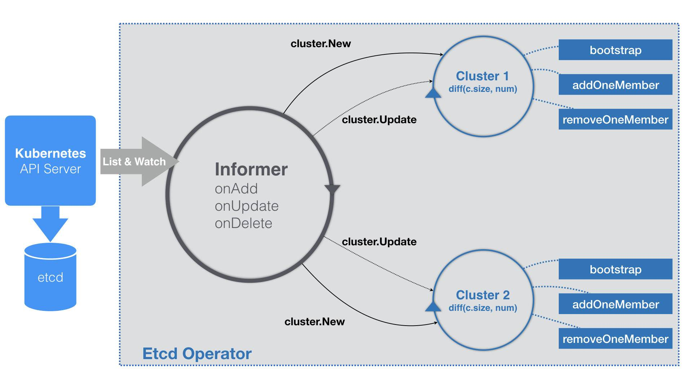

[toc]

------

Kubernetes 项目中的大部分编排对象（比如 Deployment、StatefulSet、DaemonSet，以及 Job），“有状态应用”的管理方法， Kubernetes 添加自定义 API 对象和编写自定义控制器。

可能你已经感觉到，在 Kubernetes 中，管理“有状态应用”是一个比较复杂的过程，尤其是编写 Pod 模板的时候，总有一种“在 YAML 文件里编程序”的感觉，让人很不舒服。

而在 Kubernetes 生态中，**还有一个相对更加灵活和编程友好的管理“有状态应用”的解决方案，它就是：Operator。**


### Etcd Operator 示例

Etcd Operator 的使用方法非常简单，只需要两步即可完成：

**第一步**，将这个 Operator 的代码 Clone 到本地：

```

$ git clone https://github.com/coreos/etcd-operator
```

**第二步**，将这个 Etcd Operator 部署在 Kubernetes 集群里。

不过，在部署 Etcd Operator 的 Pod 之前，你需要先执行这样一个脚本：

```

$ example/rbac/create_role.sh
```

这个脚本的作用，就是为 Etcd Operator 创建 RBAC 规则。这是因为，Etcd Operator 需要访问 Kubernetes 的 APIServer 来创建对象。

更具体地说，上述脚本为 Etcd Operator 定义了如下所示的权限：

- 对 Pod、Service、PVC、Deployment、Secret 等 API 对象，有所有权限；
- 对 CRD 对象，有所有权限；
- 对属于 etcd.database.coreos.com 这个 API Group 的 CR（Custom Resource）对象，有所有权限。

而 Etcd Operator 本身，其实就是一个 Deployment，它的 YAML 文件如下所示：

```

apiVersion: extensions/v1beta1
kind: Deployment
metadata:
  name: etcd-operator
spec:
  replicas: 1
  template:
    metadata:
      labels:
        name: etcd-operator
    spec:
      containers:
      - name: etcd-operator
        image: quay.io/coreos/etcd-operator:v0.9.2
        command:
        - etcd-operator
        env:
        - name: MY_POD_NAMESPACE
          valueFrom:
            fieldRef:
              fieldPath: metadata.namespace
        - name: MY_POD_NAME
          valueFrom:
            fieldRef:
              fieldPath: metadata.name
...
```

```
$ kubectl create -f example/deployment.yaml
```

而一旦 Etcd Operator 的 Pod 进入了 Running 状态，你就会发现，有一个 CRD 被自动创建了出来，如下所示：

```

$ kubectl get pods
NAME                              READY     STATUS      RESTARTS   AGE
etcd-operator-649dbdb5cb-bzfzp    1/1       Running     0          20s

$ kubectl get crd
NAME                                    CREATED AT
etcdclusters.etcd.database.coreos.com   2018-09-18T11:42:55Z
```

这个 CRD 名叫etcdclusters.etcd.database.coreos.com 。你可以通过 kubectl describe 命令看到它的细节，如下所示：

```

$ kubectl describe crd  etcdclusters.etcd.database.coreos.com
...
Group:   etcd.database.coreos.com
  Names:
    Kind:       EtcdCluster
    List Kind:  EtcdClusterList
    Plural:     etcdclusters
    Short Names:
      etcd
    Singular:  etcdcluster
  Scope:       Namespaced
  Version:     v1beta2
  
...
```

可以看到，这个 CRD 相当于告诉了 Kubernetes：接下来，如果有 API 组（Group）是etcd.database.coreos.com、API 资源类型（Kind）是“EtcdCluster”的 YAML 文件被提交上来，你可一定要认识啊。所以说，通过上述两步操作，你实际上是在 Kubernetes 里添加了一个名叫 EtcdCluster 的自定义资源类型。而 Etcd Operator 本身，就是这个自定义资源类型对应的自定义控制器。

而当 Etcd Operator 部署好之后，接下来在这个 Kubernetes 里创建一个 Etcd 集群的工作就非常简单了。你只需要编写一个 EtcdCluster 的 YAML 文件，然后把它提交给 Kubernetes 即可，如下所示：

```

$ kubectl apply -f example/example-etcd-cluster.yaml
```

这个 example-etcd-cluster.yaml 文件里描述的，是一个 3 个节点的 Etcd 集群。我们可以看到它被提交给 Kubernetes 之后，就会有三个 Etcd 的 Pod 运行起来，如下所示：

```

$ kubectl get pods
NAME                            READY     STATUS    RESTARTS   AGE
example-etcd-cluster-dp8nqtjznc   1/1       Running     0          1m
example-etcd-cluster-mbzlg6sd56   1/1       Running     0          2m
example-etcd-cluster-v6v6s6stxd   1/1       Running     0          2m
```


**究竟发生了什么，让创建一个 Etcd 集群的工作如此简单呢？**

我们当然还是得从这个 example-etcd-cluster.yaml 文件开始说起。不难想到，这个文件里定义的，正是 EtcdCluster 这个 CRD 的一个具体实例，也就是一个 Custom Resource（CR）。而它的内容非常简单，如下所示：

```

apiVersion: "etcd.database.coreos.com/v1beta2"
kind: "EtcdCluster"
metadata:
  name: "example-etcd-cluster"
spec:
  size: 3
  version: "3.2.13"
```

可以看到，EtcdCluster 的 spec 字段非常简单。其中，size=3 指定了它所描述的 Etcd 集群的节点个数。而 version=“3.2.13”，则指定了 Etcd 的版本，仅此而已。而真正把这样一个 Etcd 集群创建出来的逻辑，就是 Etcd Operator 要实现的主要工作了。

看到这里，相信你应该已经对 Operator 有了一个初步的认知；


### Operator 的工作原理

Operator 的工作原理，实际上是利用了 Kubernetes 的自定义 API 资源（CRD），来描述我们想要部署的“有状态应用”；然后在自定义控制器里，根据自定义 API 对象的变化，来完成具体的部署和运维工作。

所以，编写一个 Etcd Operator，与我们前面编写一个自定义控制器的过程，没什么不同。

不过，考虑到你可能还不太清楚Etcd 集群的组建方式，在这里先简单介绍一下这部分知识。

**Etcd Operator 部署 Etcd 集群，采用的是静态集群（Static）的方式。**

静态集群的好处是，它不必依赖于一个额外的服务发现机制来组建集群，非常适合本地容器化部署。而它的难点，则在于你必须在部署的时候，就规划好这个集群的拓扑结构，并且能够知道这些节点固定的 IP 地址。比如下面这个例子：

```

$ etcd --name infra0 --initial-advertise-peer-urls http://10.0.1.10:2380 \
  --listen-peer-urls http://10.0.1.10:2380 \
...
  --initial-cluster-token etcd-cluster-1 \
  --initial-cluster infra0=http://10.0.1.10:2380,infra1=http://10.0.1.11:2380,infra2=http://10.0.1.12:2380 \
  --initial-cluster-state new
  
$ etcd --name infra1 --initial-advertise-peer-urls http://10.0.1.11:2380 \
  --listen-peer-urls http://10.0.1.11:2380 \
...
  --initial-cluster-token etcd-cluster-1 \
  --initial-cluster infra0=http://10.0.1.10:2380,infra1=http://10.0.1.11:2380,infra2=http://10.0.1.12:2380 \
  --initial-cluster-state new
  
$ etcd --name infra2 --initial-advertise-peer-urls http://10.0.1.12:2380 \
  --listen-peer-urls http://10.0.1.12:2380 \
...
  --initial-cluster-token etcd-cluster-1 \
  --initial-cluster infra0=http://10.0.1.10:2380,infra1=http://10.0.1.11:2380,infra2=http://10.0.1.12:2380 \
  --initial-cluster-state new
```

在这个例子中，我启动了三个 Etcd 进程，组成了一个三节点的 Etcd 集群。

其中，这些节点启动参数里的–initial-cluster 参数，非常值得你关注。它的含义，正是当前节点启动时集群的拓扑结构。说得更详细一点，就是当前这个节点启动时，需要跟哪些节点通信来组成集群。

举个例子，我们可以看一下上述 infra2 节点的–initial-cluster 的值，如下所示：

```

...
--initial-cluster infra0=http://10.0.1.10:2380,infra1=http://10.0.1.11:2380,infra2=http://10.0.1.12:2380 \
```

可以看到，–initial-cluster 参数是由“< 节点名字 >=< 节点地址 >”格式组成的一个数组。而上面这个配置的意思就是，当 infra2 节点启动之后，这个 Etcd 集群里就会有 infra0、infra1 和 infra2 三个节点。同时，这些 Etcd 节点，需要通过 2380 端口进行通信以便组成集群，这也正是上述配置中–listen-peer-urls 字段的含义。

此外，一个 Etcd 集群还需要用–initial-cluster-token 字段，来声明一个该集群独一无二的 Token 名字。像上述这样为每一个 Ectd 节点配置好它对应的启动参数之后把它们启动起来，一个 Etcd 集群就可以自动组建起来了。


### 编写的 Etcd Operator流程

而我们要编写的 Etcd Operator，就是要把上述过程自动化。这其实等同于：用代码来生成每个 Etcd 节点 Pod 的启动命令，然后把它们启动起来。

#### EtcdCluster CRD 的定义

接下来，我们一起来实践一下这个流程。当然，在编写自定义控制器之前，我们首先需要完成 EtcdCluster 这个 CRD 的定义，它对应的 types.go 文件的主要内容，如下所示：

```

// +genclient
// +k8s:deepcopy-gen:interfaces=k8s.io/apimachinery/pkg/runtime.Object

type EtcdCluster struct {
  metav1.TypeMeta   `json:",inline"`
  metav1.ObjectMeta `json:"metadata,omitempty"`
  Spec              ClusterSpec   `json:"spec"`
  Status            ClusterStatus `json:"status"`
}

type ClusterSpec struct {
 // Size is the expected size of the etcd cluster.
 // The etcd-operator will eventually make the size of the running
 // cluster equal to the expected size.
 // The vaild range of the size is from 1 to 7.
 Size int `json:"size"`
 ... 
}
```

可以看到，EtcdCluster 是一个有 Status 字段的 CRD。在这里，我们可以不必关心 ClusterSpec 里的其他字段，只关注 Size（即：Etcd 集群的大小）字段即可。Size 字段的存在，就意味着将来如果我们想要调整集群大小的话，应该直接修改 YAML 文件里 size 的值，并执行 kubectl apply -f。


#### Etcd部署流程

这样，Operator 就会帮我们完成 Etcd 节点的增删操作。这种“scale”能力，也是 Etcd Operator 自动化运维 Etcd 集群需要实现的主要功能。而为了能够支持这个功能，我们就不再像前面那样在–initial-cluster 参数里把拓扑结构固定死。

所以，Etcd Operator 的实现，虽然选择的也是静态集群，但这个集群具体的组建过程，是逐个节点动态添加的方式，即：

- 首先，Etcd Operator 会创建一个“种子节点”；
- 然后，Etcd Operator 会不断创建新的 Etcd 节点，然后将它们逐一加入到这个集群当中，直到集群的节点数等于 size。

这就意味着，在生成不同角色的 Etcd Pod 时，Operator 需要能够区分种子节点与普通节点。而这两种节点的不同之处，就在于一个名叫–initial-cluster-state 的启动参数：

- 当这个参数值设为 new 时，就代表了该节点是种子节点。而我们前面提到过，种子节点还必须通过–initial-cluster-token 声明一个独一无二的 Token。
- 而如果这个参数值设为 existing，那就是说明这个节点是一个普通节点，Etcd Operator 需要把它加入到已有集群里。

那么接下来的问题就是，每个 Etcd 节点的–initial-cluster 字段的值又是怎么生成的呢？由于这个方案要求种子节点先启动，所以对于种子节点 infra0 来说，它启动后的集群只有它自己，即：–initial-cluster=infra0=http://10.0.1.10:2380。而对于接下来要加入的节点，比如 infra1 来说，它启动后的集群就有两个节点了，所以它的–initial-cluster 参数的值应该是：infra0=http://10.0.1.10:2380,infra1=http://10.0.1.11:2380。

其他节点，都以此类推。


现在，你就应该能在脑海中构思出上述三节点 Etcd 集群的部署过程了。

首先，只要用户提交 YAML 文件时声明创建一个 EtcdCluster 对象（一个 Etcd 集群），那么 Etcd Operator 都应该先创建一个单节点的种子集群（Seed Member），并启动这个种子节点。以 infra0 节点为例，它的 IP 地址是 10.0.1.10，那么 Etcd Operator 生成的种子节点的启动命令，如下所示：

```

$ etcd
  --data-dir=/var/etcd/data
  --name=infra0
  --initial-advertise-peer-urls=http://10.0.1.10:2380
  --listen-peer-urls=http://0.0.0.0:2380
  --listen-client-urls=http://0.0.0.0:2379
  --advertise-client-urls=http://10.0.1.10:2379
  --initial-cluster=infra0=http://10.0.1.10:2380
  --initial-cluster-state=new
  --initial-cluster-token=4b5215fa-5401-4a95-a8c6-892317c9bef8
```

可以看到，这个种子节点的 initial-cluster-state 是 new，并且指定了唯一的 initial-cluster-token 参数。我们可以把这个创建种子节点（集群）的阶段称为：**Bootstrap。**

接下来，对于其他每一个节点，Operator 只需要执行如下两个操作即可，以 infra1 为例。

第一步：通过 Etcd 命令行添加一个新成员：

```

$ etcdctl member add infra1 http://10.0.1.11:2380
```

第二步：为这个成员节点生成对应的启动参数，并启动它：

```

$ etcd
    --data-dir=/var/etcd/data
    --name=infra1
    --initial-advertise-peer-urls=http://10.0.1.11:2380
    --listen-peer-urls=http://0.0.0.0:2380
    --listen-client-urls=http://0.0.0.0:2379
    --advertise-client-urls=http://10.0.1.11:2379
    --initial-cluster=infra0=http://10.0.1.10:2380,infra1=http://10.0.1.11:2380
    --initial-cluster-state=existing
```

可以看到，对于这个 infra1 成员节点来说，它的 initial-cluster-state 是 existing，也就是要加入已有集群。而它的 initial-cluster 的值，则变成了 infra0 和 infra1 两个节点的 IP 地址。所以，以此类推，不断地将 infra2 等后续成员添加到集群中，直到整个集群的节点数目等于用户指定的 size 之后，部署就完成了。


### Etcd Operator 的工作原理

跟所有的自定义控制器一样，Etcd Operator 的启动流程也是围绕着 Informer 展开的，如下所示：

```

func (c *Controller) Start() error {
 for {
  err := c.initResource()
  ...
  time.Sleep(initRetryWaitTime)
 }
 c.run()
}

func (c *Controller) run() {
 ...
 
 _, informer := cache.NewIndexerInformer(source, &api.EtcdCluster{}, 0, cache.ResourceEventHandlerFuncs{
  AddFunc:    c.onAddEtcdClus,
  UpdateFunc: c.onUpdateEtcdClus,
  DeleteFunc: c.onDeleteEtcdClus,
 }, cache.Indexers{})
 
 ctx := context.TODO()
 // TODO: use workqueue to avoid blocking
 informer.Run(ctx.Done())
}
```

可以看到，Etcd Operator 启动要做的第一件事（ c.initResource），是创建 EtcdCluster 对象所需要的 CRD，即：前面提到的etcdclusters.etcd.database.coreos.com。这样 Kubernetes 就能够“认识”EtcdCluster 这个自定义 API 资源了。

而接下来，**Etcd Operator 会定义一个 EtcdCluster 对象的 Informer。**

不过，需要注意的是，由于 Etcd Operator 的完成时间相对较早，所以它里面有些代码的编写方式会跟之前最新的编写方式不太一样。

> Etcd Operator 并没有用工作队列来协调 Informer 和控制循环。这其实正是[声明式API](./10-声明式API.md)

具体来讲，在控制循环里执行的业务逻辑，往往是比较耗时间的。比如，创建一个真实的 Etcd 集群。而 Informer 的 WATCH 机制对 API 对象变化的响应，则非常迅速。所以，控制器里的业务逻辑就很可能会拖慢 Informer 的执行周期，甚至可能 Block 它。而要协调这样两个快、慢任务的一个典型解决方法，就是引入一个工作队列。

由于 Etcd Operator 里没有工作队列，那么在它的 EventHandler 部分，就不会有什么入队操作，而直接就是每种事件对应的具体的业务逻辑了。

不过，Etcd Operator 在业务逻辑的实现方式上，与常规的自定义控制器略有不同。我把在这一部分的工作原理，提炼成了一个详细的流程图，如下所示：



可以看到，Etcd Operator 的特殊之处在于，它为每一个 EtcdCluster 对象，都启动了一个控制循环，“并发”地响应这些对象的变化。显然，这种做法不仅可以简化 Etcd Operator 的代码实现，还有助于提高它的响应速度。

以一开始的 example-etcd-cluster 的 YAML 文件为例。

当这个 YAML 文件第一次被提交到 Kubernetes 之后，Etcd Operator 的 Informer，就会立刻“感知”到一个新的 EtcdCluster 对象被创建了出来。所以，EventHandler 里的“添加”事件会被触发。而这个 Handler 要做的操作也很简单，即：在 Etcd Operator 内部创建一个对应的 Cluster 对象（cluster.New），比如流程图里的 Cluster1。

而这个 Handler 要做的操作也很简单，即：在 Etcd Operator 内部创建一个对应的 Cluster 对象（cluster.New），比如流程图里的 Cluster1。这个 Cluster 对象，就是一个 Etcd 集群在 Operator 内部的描述，所以它与真实的 Etcd 集群的生命周期是一致的。

而一个 Cluster 对象需要具体负责的，其实有两个工作。

**其中，第一个工作只在该 Cluster 对象第一次被创建的时候才会执行。这个工作，就是我们前面提到过的 Bootstrap，即：创建一个单节点的种子集群。**

由于种子集群只有一个节点，所以这一步直接就会生成一个 Etcd 的 Pod 对象。这个 Pod 里有一个 InitContainer，负责检查 Pod 的 DNS 记录是否正常。如果检查通过，用户容器也就是 Etcd 容器就会启动起来。而这个 Etcd 容器最重要的部分，当然就是它的启动命令了。

它的种子节点的容器启动命令如下所示：

```

/usr/local/bin/etcd
  --data-dir=/var/etcd/data
  --name=example-etcd-cluster-mbzlg6sd56
  --initial-advertise-peer-urls=http://example-etcd-cluster-mbzlg6sd56.example-etcd-cluster.default.svc:2380
  --listen-peer-urls=http://0.0.0.0:2380
  --listen-client-urls=http://0.0.0.0:2379
  --advertise-client-urls=http://example-etcd-cluster-mbzlg6sd56.example-etcd-cluster.default.svc:2379
  --initial-cluster=example-etcd-cluster-mbzlg6sd56=http://example-etcd-cluster-mbzlg6sd56.example-etcd-cluster.default.svc:2380
  --initial-cluster-state=new
  --initial-cluster-token=4b5215fa-5401-4a95-a8c6-892317c9bef8
```

可以看到，在这些启动参数（比如：initial-cluster）里，Etcd Operator 只会使用 Pod 的 DNS 记录，而不是它的 IP 地址。这当然是因为，在 Operator 生成上述启动命令的时候，Etcd 的 Pod 还没有被创建出来，它的 IP 地址自然也无从谈起。

这也就意味着，每个 Cluster 对象，都会事先创建一个与该 EtcdCluster 同名的 Headless Service。这样，Etcd Operator 在接下来的所有创建 Pod 的步骤里，就都可以使用 Pod 的 DNS 记录来代替它的 IP 地址了。

> Headless Service 的 DNS 记录格式是：...svc.cluster.local。 [StatefulSet](./07-深入理解StatefulSet)

**Cluster 对象的第二个工作，则是启动该集群所对应的控制循环。**

这个控制循环每隔一定时间，就会执行一次下面的 Diff 流程。首先，控制循环要获取到所有正在运行的、属于这个 Cluster 的 Pod 数量，也就是该 Etcd 集群的“实际状态”。而这个 Etcd 集群的“期望状态”，正是用户在 EtcdCluster 对象里定义的 size。

所以接下来，控制循环会对比这两个状态的差异。

如果实际的 Pod 数量不够，那么控制循环就会执行一个添加成员节点的操作（即：上述流程图中的 addOneMember 方法）；反之，就执行删除成员节点的操作（即：上述流程图中的 removeOneMember 方法）。

以 addOneMember 方法为例，它执行的流程如下所示：

- 生成一个新节点的 Pod 的名字，比如：example-etcd-cluster-v6v6s6stxd；
- 调用 Etcd Client，执行前面提到过的 etcdctl member add example-etcd-cluster-v6v6s6stxd 命令；
- 使用这个 Pod 名字，和已经存在的所有节点列表，组合成一个新的 initial-cluster 字段的值；
- 使用这个 initial-cluster 的值，生成这个 Pod 里 Etcd 容器的启动命令。如下所示：

```

/usr/local/bin/etcd
  --data-dir=/var/etcd/data
  --name=example-etcd-cluster-v6v6s6stxd
  --initial-advertise-peer-urls=http://example-etcd-cluster-v6v6s6stxd.example-etcd-cluster.default.svc:2380
  --listen-peer-urls=http://0.0.0.0:2380
  --listen-client-urls=http://0.0.0.0:2379
  --advertise-client-urls=http://example-etcd-cluster-v6v6s6stxd.example-etcd-cluster.default.svc:2379
  --initial-cluster=example-etcd-cluster-mbzlg6sd56=http://example-etcd-cluster-mbzlg6sd56.example-etcd-cluster.default.svc:2380,example-etcd-cluster-v6v6s6stxd=http://example-etcd-cluster-v6v6s6stxd.example-etcd-cluster.default.svc:2380
  --initial-cluster-state=existing
```

这样，当这个容器启动之后，一个新的 Etcd 成员节点就被加入到了集群当中。控制循环会重复这个过程，直到正在运行的 Pod 数量与 EtcdCluster 指定的 size 一致。在有了这样一个与 EtcdCluster 对象一一对应的控制循环之后，你后续对这个 EtcdCluster 的任何修改，比如：修改 size 或者 Etcd 的 version，它们对应的更新事件都会由这个 Cluster 对象的控制循环进行处理。


如果对比一下 Etcd Operator 与 [MySQL StatefulSet](./07-深入理解StatefulSet#StatefulSet MySQL主从示例) 的话，你可能会有两个问题。

第一个问题是，在 StatefulSet 里，它为 Pod 创建的名字是带编号的，这样就把整个集群的拓扑状态固定了下来（比如：一个三节点的集群一定是由名叫 web-0、web-1 和 web-2 的三个 Pod 组成）。可是，在 Etcd Operator 里，为什么我们使用随机名字就可以了呢？

这是因为，Etcd Operator 在每次添加 Etcd 节点的时候，都会先执行 etcdctl member add ；每次删除节点的时候，则会执行 etcdctl member remove 。这些操作，其实就会更新 Etcd 内部维护的拓扑信息，所以 Etcd Operator 无需在集群外部通过编号来固定这个拓扑关系。


第二个问题是，为什么我没有在 EtcdCluster 对象里声明 Persistent Volume？

难道，我们不担心节点宕机之后 Etcd 的数据会丢失吗？我们知道，Etcd 是一个基于 Raft 协议实现的高可用 Key-Value 存储。根据 Raft 协议的设计原则，当 Etcd 集群里只有半数以下（在我们的例子里，小于等于一个）的节点失效时，当前集群依然可以正常工作。此时，Etcd Operator 只需要通过控制循环创建出新的 Pod，然后将它们加入到现有集群里，就完成了“期望状态”与“实际状态”的调谐工作。这个集群，是一直可用的 。

但是，当这个 Etcd 集群里有半数以上（在我们的例子里，大于等于两个）的节点失效的时候，这个集群就会丧失数据写入的能力，从而进入“不可用”状态。此时，即使 Etcd Operator 创建出新的 Pod 出来，Etcd 集群本身也无法自动恢复起来。

这个时候，我们就必须使用 Etcd 本身的备份数据来对集群进行恢复操作。在有了 Operator 机制之后，上述 Etcd 的备份操作，是由一个单独的 Etcd Backup Operator 负责完成的。

创建和使用这个 Operator 的流程，如下所示：

```

# 首先，创建etcd-backup-operator
$ kubectl create -f example/etcd-backup-operator/deployment.yaml

# 确认etcd-backup-operator已经在正常运行
$ kubectl get pod
NAME                                    READY     STATUS    RESTARTS   AGE
etcd-backup-operator-1102130733-hhgt7   1/1       Running   0          3s

# 可以看到，Backup Operator会创建一个叫etcdbackups的CRD
$ kubectl get crd
NAME                                    KIND
etcdbackups.etcd.database.coreos.com    CustomResourceDefinition.v1beta1.apiextensions.k8s.io

# 我们这里要使用AWS S3来存储备份，需要将S3的授权信息配置在文件里
$ cat $AWS_DIR/credentials
[default]
aws_access_key_id = XXX
aws_secret_access_key = XXX

$ cat $AWS_DIR/config
[default]
region = <region>

# 然后，将上述授权信息制作成一个Secret
$ kubectl create secret generic aws --from-file=$AWS_DIR/credentials --from-file=$AWS_DIR/config

# 使用上述S3的访问信息，创建一个EtcdBackup对象
$ sed -e 's|<full-s3-path>|mybucket/etcd.backup|g' \
    -e 's|<aws-secret>|aws|g' \
    -e 's|<etcd-cluster-endpoints>|"http://example-etcd-cluster-client:2379"|g' \
    example/etcd-backup-operator/backup_cr.yaml \
    | kubectl create -f -
```

需要注意的是，每当你创建一个 EtcdBackup 对象（[backup_cr.yaml](https://github.com/coreos/etcd-operator/blob/master/example/etcd-backup-operator/backup_cr.yaml)），就相当于为它所指定的 Etcd 集群做了一次备份。EtcdBackup 对象的 etcdEndpoints 字段，会指定它要备份的 Etcd 集群的访问地址。

所以，在实际的环境里，我建议你把最后这个备份操作，编写成一个 Kubernetes 的 CronJob 以便定时运行。而当 Etcd 集群发生了故障之后，你就可以通过创建一个 EtcdRestore 对象来完成恢复操作。当然，这就意味着你也需要事先启动 Etcd Restore Operator。这个流程的完整过程，如下所示：

```

# 创建etcd-restore-operator
$ kubectl create -f example/etcd-restore-operator/deployment.yaml

# 确认它已经正常运行
$ kubectl get pods
NAME                                     READY     STATUS    RESTARTS   AGE
etcd-restore-operator-4203122180-npn3g   1/1       Running   0          7s

# 创建一个EtcdRestore对象，来帮助Etcd Operator恢复数据，记得替换模板里的S3的访问信息
$ sed -e 's|<full-s3-path>|mybucket/etcd.backup|g' \
    -e 's|<aws-secret>|aws|g' \
    example/etcd-restore-operator/restore_cr.yaml \
    | kubectl create -f -
```

上面例子里的 EtcdRestore 对象（[restore_cr.yaml](https://github.com/coreos/etcd-operator/blob/master/example/etcd-restore-operator/restore_cr.yaml)），会指定它要恢复的 Etcd 集群的名字和备份数据所在的 S3 存储的访问信息。

而当一个 EtcdRestore 对象成功创建后，Etcd Restore Operator 就会通过上述信息，恢复出一个全新的 Etcd 集群。然后，Etcd Operator 会把这个新集群直接接管过来，从而重新进入可用的状态。EtcdBackup 和 EtcdRestore 这两个 Operator 的工作原理，与 Etcd Operator 的实现方式非常类似。所以，这一部分就交给你课后去探索了。


### 总结

可以看到，Etcd 集群本身就拥有良好的分布式设计和一定的高可用能力。在这种情况下，StatefulSet“为 Pod 编号”和“将 Pod 同 PV 绑定”这两个主要的特性，就不太有用武之地了。

而相比之下，Etcd Operator 把一个 Etcd 集群，抽象成了一个具有一定“自治能力”的整体。而当这个“自治能力”本身不足以解决问题的时候，我们可以通过两个专门负责备份和恢复的 Operator 进行修正。这种实现方式，不仅更加贴近 Etcd 的设计思想，也更加编程友好。

不过，如果现在要部署的应用，既需要用 StatefulSet 的方式维持拓扑状态和存储状态，又有大量的编程工作要做，那我到底该如何选择呢？其实，Operator 和 StatefulSet 并不是竞争关系。

你完全可以编写一个 Operator，然后在 Operator 的控制循环里创建和控制 StatefulSet 而不是 Pod。比如，业界知名的[Prometheus 项目的 Operator](https://github.com/coreos/prometheus-operator)，正是这么实现的。


此外，CoreOS 公司在被 RedHat 公司收购之后，已经把 Operator 的编写过程封装成了一个叫作[Operator SDK](https://github.com/operator-framework/operator-sdk)的工具（整个项目叫作 Operator Framework），它可以帮助你生成 Operator 的框架代码。


是否可以将operator和自定义控制器划等号？原理上是一个东西。

