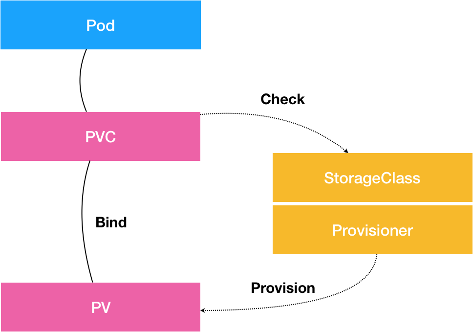

本文章来源于：<https://github.com/Zeb-D/my-review> ，请star 强力支持，你的支持，就是我的动力。

[toc]

------

容器化一个应用比较麻烦的地方，莫过于对其“状态”的管理。而最常见的“状态”，又莫过于存储状态了。


**Kubernetes 项目处理容器持久化存储的核心原理**

[StatefulSet 管理存储状态](./07-深入理解StatefulSet.md)的文章，里面有说到过的Persistent Volume（PV）和 Persistent Volume Claim（PVC）持久化存储体系。


### PV与PVC示例



其中，PV 描述的，是持久化存储数据卷。这个 API 对象主要定义的是一个持久化存储在宿主机上的目录，比如一个 NFS 的挂载目录。

通常情况下，PV 对象是由运维人员事先创建在 Kubernetes 集群里待用的。比如，运维人员可以定义这样一个 NFS 类型的 PV，如下所示：

```yaml

apiVersion: v1
kind: PersistentVolume
metadata:
  name: nfs
spec:
  storageClassName: manual
  capacity:
    storage: 1Gi
  accessModes:
    - ReadWriteMany
  nfs:
    server: 10.244.1.4
    path: "/"
```

而 PVC 描述的，则是 Pod 所希望使用的持久化存储的属性。比如，Volume 存储的大小、可读写权限等等。

PVC 对象通常由开发人员创建；或者以 PVC 模板的方式成为 StatefulSet 的一部分，然后由 StatefulSet 控制器负责创建带编号的 PVC。

比如，开发人员可以声明一个 1 GiB 大小的 PVC，如下所示：

```

apiVersion: v1
kind: PersistentVolumeClaim
metadata:
  name: nfs
spec:
  accessModes:
    - ReadWriteMany
  storageClassName: manual
  resources:
    requests:
      storage: 1Gi
```

而用户创建的 PVC 要真正被容器使用起来，就必须先和某个符合条件的 PV 进行绑定。这里要检查的条件，包括两部分：

- 第一个条件，当然是 PV 和 PVC 的 spec 字段。比如，PV 的存储（storage）大小，就必须满足 PVC 的要求。
- 而第二个条件，则是 PV 和 PVC 的 storageClassName 字段必须一样。


在成功地将 PVC 和 PV 进行绑定之后，Pod 就能够像使用 hostPath 等常规类型的 Volume 一样，在自己的 YAML 文件里声明使用这个 PVC 了，如下所示：

```

apiVersion: v1
kind: Pod
metadata:
  labels:
    role: web-frontend
spec:
  containers:
  - name: web
    image: nginx
    ports:
      - name: web
        containerPort: 80
    volumeMounts:
        - name: nfs
          mountPath: "/usr/share/nginx/html"
  volumes:
  - name: nfs
    persistentVolumeClaim:
      claimName: nfs
```

可以看到，Pod 需要做的，就是在 volumes 字段里声明自己要使用的 PVC 名字。接下来，等这个 Pod 创建之后，kubelet 就会把这个 PVC 所对应的 PV，也就是一个 NFS 类型的 Volume，挂载在这个 Pod 容器内的目录上。

不难看出，**PVC 和 PV 的设计，其实跟“面向对象”的思想完全一致。**

PVC 可以理解为持久化存储的“接口”，它提供了对某种持久化存储的描述，但不提供具体的实现；而这个持久化存储的实现部分则由 PV 负责完成。

这样做的好处是，作为应用开发者，我们只需要跟 PVC 这个“接口”打交道，而不必关心具体的实现是 NFS 还是 Ceph。毕竟这些存储相关的知识太专业了，应该交给专业的人去做。


**其实还有一个比较棘手的情况。**

比如，你在创建 Pod 的时候，系统里并没有合适的 PV 跟它定义的 PVC 绑定，也就是说此时容器想要使用的 Volume 不存在。这时候，Pod 的启动就会报错。

但是，过了一会儿，运维人员也发现了这个情况，所以他赶紧创建了一个对应的 PV。这时候，我们当然希望 Kubernetes 能够再次完成 PVC 和 PV 的绑定操作，从而启动 Pod。

所以在 Kubernetes 中，实际上存在着一个专门处理持久化存储的控制器，叫作 Volume Controller。这个 Volume Controller 维护着多个控制循环，其中有一个循环，扮演的就是撮合 PV 和 PVC 的“红娘”的角色。它的名字叫作 PersistentVolumeController。

PersistentVolumeController 会不断地查看当前每一个 PVC，是不是已经处于 Bound（已绑定）状态。如果不是，那它就会遍历所有的、可用的 PV，并尝试将其与这个“单身”的 PVC 进行绑定。这样，Kubernetes 就可以保证用户提交的每一个 PVC，只要有合适的 PV 出现，它就能够很快进入绑定状态，从而结束“单身”之旅。

而所谓将一个 PV 与 PVC 进行“绑定”，其实就是将这个 PV 对象的名字，填在了 PVC 对象的 spec.volumeName 字段上。所以，接下来 Kubernetes 只要获取到这个 PVC 对象，就一定能够找到它所绑定的 PV。


### PV持久化存储原理

**这个 PV 对象，又是如何变成容器里的一个持久化存储的呢？**

用一句话总结，所谓容器的 Volume，其实就是将一个宿主机上的目录，跟一个容器里的目录绑定挂载在了一起。

**而所谓的“持久化 Volume”，指的就是这个宿主机上的目录，具备“持久性”。**即：这个目录里面的内容，既不会因为容器的删除而被清理掉，也不会跟当前的宿主机绑定。这样，当容器被重启或者在其他节点上重建出来之后，它仍然能够通过挂载这个 Volume，访问到这些内容。

显然，我们前面使用的 hostPath 和 emptyDir 类型的 Volume 并不具备这个特征：它们既有可能被 kubelet 清理掉，也不能被“迁移”到其他节点上。

所以，大多数情况下，持久化 Volume 的实现，往往依赖于一个远程存储服务，比如：远程文件存储（比如，NFS、GlusterFS）、远程块存储（比如，公有云提供的远程磁盘）等等。

而 Kubernetes 需要做的工作，就是使用这些存储服务，来为容器准备一个持久化的宿主机目录，以供将来进行绑定挂载时使用。而所谓“持久化”，指的是容器在这个目录里写入的文件，都会保存在远程存储中，从而使得这个目录具备了“持久性”。


这个准备“持久化”宿主机目录的过程，我们可以形象地称为**“两阶段处理”**。

通过一个具体的例子为你说明：

#### Attach

当一个 Pod 调度到一个节点上之后，kubelet 就要负责为这个 Pod 创建它的 Volume 目录。默认情况下，kubelet 为 Volume 创建的目录是如下所示的一个宿主机上的路径：

```

/var/lib/kubelet/pods/<Pod的ID>/volumes/kubernetes.io~<Volume类型>/<Volume名字>
```

接下来，kubelet 要做的操作就取决于你的 Volume 类型了。

如果你的 Volume 类型是远程块存储，比如 Google Cloud 的 Persistent Disk（GCE 提供的远程磁盘服务），那么 kubelet 就需要先调用 Goolge Cloud 的 API，将它所提供的 Persistent Disk 挂载到 Pod 所在的宿主机上。

这相当于执行：

```

$ gcloud compute instances attach-disk <虚拟机名字> --disk <远程磁盘名字>
```

这一步为虚拟机挂载远程磁盘的操作，对应的正是“两阶段处理”的第一阶段。在 Kubernetes 中，我们把这个阶段称为 Attach。

#### Mount

Attach 阶段完成后，为了能够使用这个远程磁盘，kubelet 还要进行第二个操作，即：格式化这个磁盘设备，然后将它挂载到宿主机指定的挂载点上。不难理解，这个挂载点，正是我在前面反复提到的 Volume 的宿主机目录。所以，这一步相当于执行：

```

# 通过lsblk命令获取磁盘设备ID
$ sudo lsblk
# 格式化成ext4格式
$ sudo mkfs.ext4 -m 0 -F -E lazy_itable_init=0,lazy_journal_init=0,discard /dev/<磁盘设备ID>
# 挂载到挂载点
$ sudo mkdir -p /var/lib/kubelet/pods/<Pod的ID>/volumes/kubernetes.io~<Volume类型>/<Volume名字>
```

这个将磁盘设备格式化并挂载到 Volume 宿主机目录的操作，对应的正是“两阶段处理”的第二个阶段，我们一般称为：Mount。

Mount 阶段完成后，这个 Volume 的宿主机目录就是一个“持久化”的目录了，容器在它里面写入的内容，会保存在 Google Cloud 的远程磁盘中。

而如果你的 Volume 类型是远程文件存储（比如 NFS）的话，kubelet 的处理过程就会更简单一些。

因为在这种情况下，kubelet 可以跳过“第一阶段”（Attach）的操作，这是因为一般来说，远程文件存储并没有一个“存储设备”需要挂载在宿主机上。所以，kubelet 会直接从“第二阶段”（Mount）开始准备宿主机上的 Volume 目录。

在这一步，kubelet 需要作为 client，将远端 NFS 服务器的目录（比如：“/”目录），挂载到 Volume 的宿主机目录上，即相当于执行如下所示的命令：

```

$ mount -t nfs <NFS服务器地址>:/ /var/lib/kubelet/pods/<Pod的ID>/volumes/kubernetes.io~<Volume类型>/<Volume名字> 
```

通过这个挂载操作，Volume 的宿主机目录就成为了一个远程 NFS 目录的挂载点，后面你在这个目录里写入的所有文件，都会被保存在远程 NFS 服务器上。所以，我们也就完成了对这个 Volume 宿主机目录的“持久化”。


#### Kubernetes 如何定义和区分这两个阶段的呢？

其实很简单，在具体的 Volume 插件的实现接口上，Kubernetes 分别给这两个阶段提供了两种不同的参数列表：

- 对于“第一阶段”（Attach），Kubernetes 提供的可用参数是 nodeName，即宿主机的名字。
- 而对于“第二阶段”（Mount），Kubernetes 提供的可用参数是 dir，即 Volume 的宿主机目录。

作为一个存储插件，你只需要根据自己的需求进行选择和实现即可。

而经过了“两阶段处理”，我们就得到了一个“持久化”的 Volume 宿主机目录。所以，接下来，kubelet 只要把这个 Volume 目录通过 CRI 里的 Mounts 参数，传递给 Docker，然后就可以为 Pod 里的容器挂载这个“持久化”的 Volume 了。其实，这一步相当于执行了如下所示的命令：

```

$ docker run -v /var/lib/kubelet/pods/<Pod的ID>/volumes/kubernetes.io~<Volume类型>/<Volume名字>:/<容器内的目标目录> 我的镜像 ...
```

以上，就是 Kubernetes 处理 PV 的具体原理了。

> 对应地，在删除一个 PV 的时候，Kubernetes 也需要 Unmount 和 Dettach 两个阶段来处理。


实际上，你可能已经发现，这个 PV 的处理流程似乎跟 Pod 以及容器的启动流程没有太多的耦合，只要 kubelet 在向 Docker 发起 CRI 请求之前，确保“持久化”的宿主机目录已经处理完毕即可。

所以，在 Kubernetes 中，上述**关于 PV 的“两阶段处理”流程，是靠独立于 kubelet 主控制循环（Kubelet Sync Loop）之外的两个控制循环来实现的。**


其中，“第一阶段”的 Attach（以及 Dettach）操作，是由 Volume Controller 负责维护的，这个控制循环的名字叫作：AttachDetachController。而它的作用，就是不断地检查每一个 Pod 对应的 PV，和这个 Pod 所在宿主机之间挂载情况。从而决定，是否需要对这个 PV 进行 Attach（或者 Dettach）操作。

需要注意，作为一个 Kubernetes 内置的控制器，Volume Controller 自然是 kube-controller-manager 的一部分。所以，AttachDetachController 也一定是运行在 Master 节点上的。当然，Attach 操作只需要调用公有云或者具体存储项目的 API，并不需要在具体的宿主机上执行操作，所以这个设计没有任何问题。

而“第二阶段”的 Mount（以及 Unmount）操作，必须发生在 Pod 对应的宿主机上，所以它必须是 kubelet 组件的一部分。这个控制循环的名字，叫作：VolumeManagerReconciler，它运行起来之后，是一个独立于 kubelet 主循环的 Goroutine。

通过这样将 Volume 的处理同 kubelet 的主循环解耦，Kubernetes 就避免了这些耗时的远程挂载操作拖慢 kubelet 的主控制循环，进而导致 Pod 的创建效率大幅下降的问题。实际上，kubelet 的一个主要设计原则，就是它的主控制循环绝对不可以被 block。


### StorageClass

在了解了 Kubernetes 的 Volume 处理机制之后，在这个体系里有一个重要概念：StorageClass。

曾经提到过，PV 这个对象的创建，是由运维人员完成的。但是，在大规模的生产环境里，这其实是一个非常麻烦的工作。

这是因为，一个大规模的 Kubernetes 集群里很可能有成千上万个 PVC，这就意味着运维人员必须得事先创建出成千上万个 PV。更麻烦的是，随着新的 PVC 不断被提交，运维人员就不得不继续添加新的、能满足条件的 PV，否则新的 Pod 就会因为 PVC 绑定不到 PV 而失败。在实际操作中，这几乎没办法靠人工做到。

所以，Kubernetes 为我们提供了一套可以自动创建 PV 的机制，即：Dynamic Provisioning。

相比之下，前面人工管理 PV 的方式就叫作 Static Provisioning。

**Dynamic Provisioning 机制工作的核心，在于一个名叫 StorageClass 的 API 对象**。

而 StorageClass 对象的作用，其实就是创建 PV 的模板。

具体地说，StorageClass 对象会定义如下两个部分内容：

- 第一，PV 的属性。比如，存储类型、Volume 的大小等等。
- 第二，创建这种 PV 需要用到的存储插件。比如，Ceph 等等。

有了这样两个信息之后，Kubernetes 就能够根据用户提交的 PVC，找到一个对应的 StorageClass 了。然后，Kubernetes 就会调用该 StorageClass 声明的存储插件，创建出需要的 PV。

假如我们的 Volume 的类型是 GCE 的 Persistent Disk 的话，运维人员就需要定义一个如下所示的 StorageClass：

```

apiVersion: storage.k8s.io/v1
kind: StorageClass
metadata:
  name: block-service
provisioner: kubernetes.io/gce-pd
parameters:
  type: pd-ssd
```

在这个 YAML 文件里，我们定义了一个名叫 block-service 的 StorageClass。

这个 StorageClass 的 provisioner 字段的值是：kubernetes.io/gce-pd，这正是 Kubernetes 内置的 GCE PD 存储插件的名字。

而这个 StorageClass 的 parameters 字段，就是 PV 的参数。比如：上面例子里的 type=pd-ssd，指的是这个 PV 的类型是“SSD 格式的 GCE 远程磁盘”。

需要注意的是，由于需要使用 GCE Persistent Disk，上面这个例子只有在 GCE 提供的 Kubernetes 服务里才能实践。如果你想使用我们之前部署在本地的 Kubernetes 集群以及 Rook 存储服务的话，你的 StorageClass 需要使用如下所示的 YAML 文件来定义：

```

apiVersion: ceph.rook.io/v1beta1
kind: Pool
metadata:
  name: replicapool
  namespace: rook-ceph
spec:
  replicated:
    size: 3
---
apiVersion: storage.k8s.io/v1
kind: StorageClass
metadata:
  name: block-service
provisioner: ceph.rook.io/block
parameters:
  pool: replicapool
  #The value of "clusterNamespace" MUST be the same as the one in which your rook cluster exist
  clusterNamespace: rook-ceph
```

在这个 YAML 文件中，我们定义的还是一个名叫 block-service 的 StorageClass，只不过它声明使的存储插件是由 Rook 项目。有了 StorageClass 的 YAML 文件之后，运维人员就可以在 Kubernetes 里创建这个 StorageClass 了：

```

$ kubectl create -f sc.yaml
```

这时候，作为应用开发者，我们只需要在 PVC 里指定要使用的 StorageClass 名字即可，如下所示：

```

apiVersion: v1
kind: PersistentVolumeClaim
metadata:
  name: claim1
spec:
  accessModes:
    - ReadWriteOnce
  storageClassName: block-service
  resources:
    requests:
      storage: 30Gi
```

可以看到，我们在这个 PVC 里添加了一个叫作 storageClassName 的字段，用于指定该 PVC 所要使用的 StorageClass 的名字是：block-service。以 Google Cloud 为例。当我们通过 kubectl create 创建上述 PVC 对象之后，Kubernetes 就会调用 Google Cloud 的 API，创建出一块 SSD 格式的 Persistent Disk。然后，再使用这个 Persistent Disk 的信息，自动创建出一个对应的 PV 对象。

```

$ kubectl create -f pvc.yaml
```

可以看到，我们创建的 PVC 会绑定一个 Kubernetes 自动创建的 PV，如下所示：

```

$ kubectl describe pvc claim1
Name:           claim1
Namespace:      default
StorageClass:   block-service
Status:         Bound
Volume:         pvc-e5578707-c626-11e6-baf6-08002729a32b
Labels:         <none>
Capacity:       30Gi
Access Modes:   RWO
No Events.
```

而且，通过查看这个自动创建的 PV 的属性，你就可以看到它跟我们在 PVC 里声明的存储的属性是一致的，如下所示：

```

$ kubectl describe pv pvc-e5578707-c626-11e6-baf6-08002729a32b
Name:            pvc-e5578707-c626-11e6-baf6-08002729a32b
Labels:          <none>
StorageClass:    block-service
Status:          Bound
Claim:           default/claim1
Reclaim Policy:  Delete
Access Modes:    RWO
Capacity:        30Gi
...
No events.
```

此外，你还可以看到，这个自动创建出来的 PV 的 StorageClass 字段的值，也是 block-service。这是因为，Kubernetes 只会将 StorageClass 相同的 PVC 和 PV 绑定起来。

有了 Dynamic Provisioning 机制，运维人员只需要在 Kubernetes 集群里创建出数量有限的 StorageClass 对象就可以了。这就好比，运维人员在 Kubernetes 集群里创建出了各种各样的 PV 模板。这时候，当开发人员提交了包含 StorageClass 字段的 PVC 之后，Kubernetes 就会根据这个 StorageClass 创建出对应的 PV。

> [Kubernetes 的官方文档](https://kubernetes.io/docs/concepts/storage/storage-classes/#provisioner)里已经列出了默认支持 Dynamic Provisioning 的内置存储插件。而对于不在文档里的插件，比如 NFS，或者其他非内置存储插件，你其实可以通过[kubernetes-incubator/external-storage](https://github.com/kubernetes-incubator/external-storage)这个库来自己编写一个外部插件完成这个工作。像我们之前部署的 Rook，已经内置了 external-storage 的实现，所以 Rook 是完全支持 Dynamic Provisioning 特性的。

需要注意的是，StorageClass 并不是专门为了 Dynamic Provisioning 而设计的。

比如，在一开始的例子里，我在 PV 和 PVC 里都声明了 storageClassName=manual。而我的集群里，实际上并没有一个名叫 manual 的 StorageClass 对象。这完全没有问题，这个时候 Kubernetes 进行的是 Static Provisioning，但在做绑定决策的时候，它依然会考虑 PV 和 PVC 的 StorageClass 定义。

而这么做的好处也很明显：这个 PVC 和 PV 的绑定关系，就完全在我自己的掌控之中。

这里，你可能会有疑问，我在之前讲解 StatefulSet 存储状态的例子时，好像并没有声明 StorageClass 啊？

实际上，如果集群已经开启了名叫 DefaultStorageClass 的 Admission Plugin，它就会为 PVC 和 PV 自动添加一个默认的 StorageClass；否则，PVC 的 storageClassName 的值就是“”，这也意味着它只能够跟 storageClassName 也是“”的 PV 进行绑定。


#### 小结


从图中我们可以看到，在这个体系中：

- PVC 描述的，是 Pod 想要使用的持久化存储的属性，比如存储的大小、读写权限等。
- PV 描述的，则是一个具体的 Volume 的属性，比如 Volume 的类型、挂载目录、远程存储服务器地址等。
- 而 StorageClass 的作用，则是充当 PV 的模板。并且，只有同属于一个 StorageClass 的 PV 和 PVC，才可以绑定在一起。

当然，StorageClass 的另一个重要作用，是指定 PV 的 Provisioner（存储插件）。这时候，如果你的存储插件支持 Dynamic Provisioning 的话，Kubernetes 就可以自动为你创建 PV 了。

**需要注意的是**，这套容器持久化存储体系，完全是 Kubernetes 项目自己负责管理的，并不依赖于 docker volume 命令和 Docker 的存储插件。当然，这套体系本身就比 docker volume 命令的诞生时间还要早得多。


容器持久化存储涉及的概念比较多，总结一下整体流程。

用户提交请求创建pod，Kubernetes发现这个pod声明使用了PVC，那就靠PersistentVolumeController帮它找一个PV配对。

没有现成的PV，就去找对应的StorageClass，帮它新创建一个PV，然后和PVC完成绑定。

新创建的PV，还只是一个API 对象，需要经过“两阶段处理”变成宿主机上的“持久化 Volume”才真正有用：
第一阶段由运行在master上的AttachDetachController负责，为这个PV完成 Attach 操作，为宿主机挂载远程磁盘；
第二阶段是运行在每个节点上kubelet组件的内部，把第一步attach的远程磁盘 mount 到宿主机目录。这个控制循环叫VolumeManagerReconciler，运行在独立的Goroutine，不会阻塞kubelet主循环。

完成这两步，PV对应的“持久化 Volume”就准备好了，POD可以正常启动，将“持久化 Volume”挂载在容器内指定的路径。


像 PV、PVC 这样的用法，是不是有“过度设计”的嫌疑？

比如，我们公司的运维人员可以像往常一样维护一套 NFS 或者 Ceph 服务器，根本不必学习 Kubernetes。而开发人员，则完全可以靠“复制粘贴”的方式，在 Pod 的 YAML 文件里填上 Volumes 字段，而不需要去使用 PV 和 PVC。

实际上，如果只是为了职责划分，PV、PVC 体系确实不见得比直接在 Pod 里声明 Volumes 字段有什么优势。

不过，你有没有想过这样一个问题，如果[Kubernetes 内置的 20 种持久化数据卷实现](https://kubernetes.io/docs/concepts/storage/persistent-volumes/#types-of-persistent-volumes)，都没办法满足你的容器存储需求时，该怎么办？

