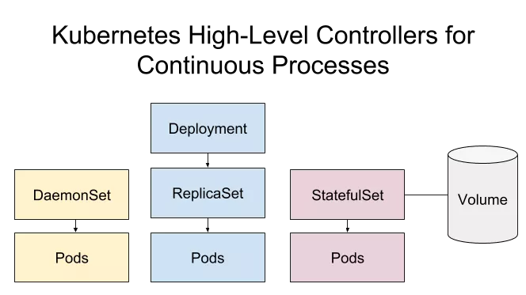

本文章来源于：<https://github.com/Zeb-D/my-review> ，请star 强力支持，你的支持，就是我的动力。

[TOC]

------

云计算、容器化以及容器编排是 DevOps 中最重要的发展趋势，无论你是数据科学家、软件开发者还是产品经理，了解 Docker 和 Kubernetes 的基本概念总是有好处的，二者可以帮助你与他人协作、部署应用并提升你对雇主的价值。

本文将会覆盖到一些基本的 Kubernetes 的概念，Kubernetes 的术语有很多，这一点会让人望而却步，我将帮助你建立一个思维模型来加快你对这项技术的理解。

如果你之前了解一些 Docker 相关的概念，那么学习 Kubernetes 才更具意义。


### Kubernetes 是什么

Kubernetes 是生产环境中用于管理容器化应用的开源平台，简称为 K8s，后面我大部分都会使用 K8s 这个术语，毕竟，谁不喜欢简洁一点呢？

K8s 目前非常热门，可以从下面的图表中感受的到，在过去5年中，Google 对 K8s 关键词的搜索趋势急剧攀升。

为什么 K8s 的需求如此旺盛？Kubernetes 可以让你更加轻松地自动伸缩应用，减少宕机时间，提高安全性。无需额外编写脚本，就能检查、重启及改变 Docker 容器的数量，只需告诉 K8s 想要的容器数量即可，K8s 甚至可以基于资源使用情况自动扩展容器。


Kubernetes 就是要抽象出复杂性，它为应用程序的开发环境提供了清晰的接口。


对于一个每天只有少量访问的静态网站来说，K8s 没有太大意义，K8s 的使用场景是需要快速伸缩的大型应用程序。


对于大型应用程序，K8s 可以充分利用计算和存储资源。当对接云供应商时，K8s 可以节省成本。无论在哪使用 K8s，它都可以帮助你节省时间，并减少一些令 DevOps 头痛的问题。


Docker 有一款极具竞争力的容器编排产品叫 Docker Swarm，但它没有 K8s 的一些特性和市场份额。可能你会觉得 Docker 与对标的竞品 K8s 协作不太好，实际上两者合作地很好，我强烈建议你使用 K8s 编排容器。

直接学习 K8s 的抽象概念可能会比较棘手，所以，我会解释各个关键部件是如何组合在一起的，这样你脑海中可以对这个强大的平台有一个初步的印象。下面让我们来了解关键的 K8s 概念以及它们之间的关系。


我们先了解下六层抽象及相应的组成部分，然后再看下七个关键的 K8s API 对象。


### K8s 的 6 个抽象层

我们假设有一个持续运行且不需要存储状态的应用。


下面是 K8s 的6层抽象，级别由高到低排列：


- Deployment
- ReplicaSet
- Pod
- Node Cluster
- Node Processes
- Docker Container


Deployment 负责创建及管理 ReplicaSet，ReplicaSet 负责创建及管理 Pod，Pod 运行在 Node 中，Node 中有容器运行时，可以运行放入 Docker 镜像中的应用代码，听起来就像爱尔兰民谣歌曲 “The Rattlin’Bog”。


蓝色阴影部分是 K8s 高层次的抽象层，绿色部分代表 Node 层及 Node 子进程，这一点只需要了解，后面可能不会讲到。


需要注意的是 K8s 实例通常会在单个 Node 中运行多个 Pod。


Docker 容器包含应用代码。

```
语法小插曲

根据 K8s 的风格指南，像 Pod 这样的 API 对象，大小写应该遵循“在实际对象名称中应大小写一致”的规则。然而，在文档中大都没有遵循这条准则 —— API 对象看起来是随机大写或小写。

我将在文章中保持 K8s 风格指南声明的策略和大写方面的错误。

语法小插曲结束
```

下面我们分别来看下6个抽象层，从最高层开始。

#### **Deployment**

如果你想持续运行一个无状态的应用，比如 HTTP 服务器，那么你需要 Deployment，Deployment 允许你在无需停机的状态下更新应用，并在 Pod 宕掉时根据策略重启 Pod。

你可以通过命令行或者配置文件创建 Deployment，我会在后续的文章中展示两种方法，请保持持续关注。

#### **ReplicaSet**

Deployment 会创建 ReplicaSet 来保障你的应用所需 Pod 的数量，ReplicaSet 会基于 Deployment 中的触发器自动创建及伸缩 Pod 数量。

Replication Controller 也支持和 ReplicaSet 相同的功能，但前者已经是 old school 了，后者才是2019年管理复制 Pod 的明智方式。

#### **Pod**

Pod 是 K8s 的基础构建模块，一个 Pod 包含一组一个或多个容器。通常每个 Pod 包含一个容器。

Pod 会处理 Volume、Secret 以及容器的相关配置。

Pod 不是持久的，会在宕掉时自动重启。

当应用需要水平扩展时，ReplicationSet 会复制 Pod。

Pod 活在 Worker Node 中。


### 集群层面

#### **集群**

K8s 集群由 Master 集群和 Worker Node 组成。

#### **Worker Node**

Worker Node 可以简称为 Node。Node 是机器的抽象，物理机或者虚拟机，可以把 Node 看作计算机服务器。

一个或多个 Pod 运行在一个 Worker Node 中。

一个 Pod 绝不会拆分到不同的 Node 中，Pod 中的内容总是位于同一个 Node 并一起调度。

那么谁来指挥 Worker Node 该做什么呢？Master 集群。

#### **Cluster Master**

Master 集群有很多好玩的别名，如 Master 节点、Kubernetes Master、集群控制面板、控制面板或者直接叫 Master，但无论怎么叫，它的作用是治理 Worker Node。

Master 做出调度决策，响应事件，实现更改，并监视集群。

Master 和 Worker Node 都包含子进程组件。


#### Node 进程

**Master 组件**

Master 组件包含 API server（即 kube-apiserver）、Scheduler（即 kube-scheduler）、kube-controller-manager 及 cloud-controller manager。


下面我们简要看下各个组件。

API Server——暴露 K8s API，是 K8s 控制的前端，即 kube-apiserver，可以当做是 hub。

etcd——用于集群状态数据的分布式键值存储。

Scheduler——为新 Pod 选择 Node，即 kube-scheduler，可以想象成匹配器，参考这里[2]。

kube-controller-manager——运行控制器来处理集群后台任务的进程，可当做集群控制器。

cloud-controller-manager——运行控制器与云供应商交互，可以当做云接口。


#### **Worker Node 组件**

Worker Node 的组件包括 kubelet、kube-proxy 及 容器运行时。

kubelet——负责 Worker Node 的一切事务，与 Master 的 API server 通信。

kube-proxy——连接正确 Pod 的路由，也扮演跨 Pod 服务负载均衡的角色。

容器运行时——下载镜像，运行容器，例如：Docker 就是一个容器运行时。

让我们深入到最后一层，看看这些容器运行时中在运行什么。


#### Docker 容器层面

如果你想使用 K8s 运行应用，应用需要在容器中。Docker 是目前为止最为常用的容器平台，我们假设你在使用 Docker。

在创建 Deployment 时，需要确定 Pod 应该使用哪个 Docker 镜像，容器运行时（runtime）会下载镜像并创建容器。

K8s 不会直接创建容器，它会创建包含容器的 Pod。Pod 中的容器会共享配置资源，如 Volume 存储。

管理和运行 Pod 的高级别 K8s API 资源有5个: Deployment，StatefulSet， DaemonSet，Job 和 CronJob。这些对象负责管理和运行 Pod，来创建和运行容器。

下面让我们看看这些创建和管理连续流程的控制器。


### ReplicaSets，StatefulSets 及 DaemonSets

正如你所了解到的，ReplicaSet 创建并管理 Pod。

如果由于 Node 出错，导致 Pod 关闭，ReplicaSet 会自动在另外的 Node 中替换 Pod。所以应该通过 Deployment 来创建 ReplicaSet，而不是直接创建，因为通过 Deployment 可以更加轻松地更新应用。



应用有时需要保存状态（state）信息，你可以将状态认为是当前用户与应用交互的状态。所以在电子游戏中，它是用户角色在某个时间点上的所有的唯一形态。


例如，在最初的《超级马里奥兄弟》游戏中，状态将包含用户游戏的所有相关方面：什么级别，该级别中的位置，大或小，火球或没有火球，多少硬币，多少点数，以及多少生命。

如果 APP 需要追踪状态，该怎么办呢？使用 StatefulSet。


#### **StatefulSet**


与 ReplicaSet 一样，StatefulSet 根据容器规范管理一组 Pod 的部署和伸缩。与 Deployment 不同，StatefulSet 的 Pod 是不可互换的。每个 Pod 都有一个唯一的、持久的标识符，在任何重新调度期间，控制器都要维护这个标识符。StatefulSet 用于持久的、有状态的后端，如数据库。

Pod 的状态信息保存在与 StatefulSet 关联的 Volume 中。我们稍后会讲到 Volume。


#### **DaemonSet**


DaemonSet 用于处理连续的过程，在每个 Node 上运行一个 Pod，每个自动被放入集群的 Node 会通过 DaemonSet 启动 Pod。DaemonSet 对后台运行的任务(如监控和日志收集)非常有用。

StatefulSet 和 DaemonSet 不受 Deployment 控制，虽然两者与 ReplicaSet 位于同级别的抽象层，在当前 API 中没有针对它们更高层级的抽象层了。

下面我们来看下 Job 和 CronJob。


### Jobs and CronJobs

#### **Job**

Job 是 Pod 批处理的 supervisor。Job 创建 Pod，并通过跟踪成功完成任务的 Pod 数量来确保任务的执行。与 ReplicaSet 不同，一旦容器内的任务成功完成，容器就不再重新启动。当运行一次性任务时，可以使用 Job。


#### **CronJob**

如果你想定期在特定时间（如每个小时，每天或者每月）运行 Job，可以创建一个 CronJob，CronJob 和 Job 类似，但它是在固定的时间间隔，定时重复执行。

你经常需要创建一个服务来提供对临时 Pod 的一致访问。


#### **Service**

K8s 服务为一组 Pod 创建一个访问点。服务提供一致的 IP 地址和端口来访问底层 Pod。外部用户和内部 Pod 都使用服务与其他 Pod 通信。

服务种类繁多。与 K8s 建立网络是一个值得参考的主题。

下面我们来看下使用 Volume 和 PersistentVolume 存储数据。


### Volumes，PersistentVolumes 及 PersistentVolume Claims


#### Volume

Volume 是可以存放数据的目录，是 Pod 的组成部分，不独立于 Pod 存在。基于 Pod 规范创建 Volume，并且 Volume 不能单独删除。

Pod 中的容器都可以访问 Volume，每个想访问 Volume 的容器必须单独挂载它。

K8s Volume 的生命周期比任何容器的生命周期都长，当外围的 Pod 死掉后，Volume 也会死掉。但某些 Volume 类型的文件会继续存在于本地或者云端，即使在 Volume 消失之后。

K8s Volume 比 Docker volume 更具实用性，K8s Volume 可以访问本地磁盘存储、内存或者云端存储，Pod 可以同时组合使用。

K8s Volume 类型包含空目录、工作节点的文件系统以及特定云服务商存储。例如，awsEleasticBlockStore 和 gcePersistentDisk 是提供长期存储的特定服务商。更多内容可参考文档[4]。


#### **PersistentVolumes 和 PersistentVolumeClaims**


为了更好地抽象出基础设施的细节，K8s 开发了 persistentvolume 和PersistentVolumeClaim。不幸的是，名字有点误导人，因为普通的 Volume 也可以持久存储。

与独立使用 Volume 相比， PersisententVolume（PV）和 PersisentVolumeClaim（PVC）增加了复杂性，但 PV 对于大型项目的存储资源管理很有用处。

使用 PV 时，用户实际上最终使用的还是 Volume，但需要做两步操作。

1. PersistentVolume 由 集群 admin 提供（或者动态提供）。
2. 对于 Pod 所需的存储，集群用户创建一个 PersistentVolumeClaim 清单， 来指定所需的存储空间和存储类型。然后 K8s 查找并保留所需的存储。

然后用户创建一个Pod， Pod 使用了 PVC 的 Volume。

PersistentVolume 具有独立于 Pod 的生命周期，事实上，Pod 甚至都不知道 PV，只知道 PVC。

PVC 消耗 PV 资源，类似 Pod 消耗 Node 资源。


### **总结**

希望这篇对 K8s 概念的介绍对你有用，如果帮到了你，希望你可以在社交平台上分享，以便别人也可以读到。


下面我们总结一些上述讲到的 K8s 概念，Deployment 的六层抽象：


- Deployment：管理 ReplicaSet，用于持久的，无状态的应用（如 HTTP 服务器）

- ReplicaSet：创建及管理 Pod

- Pod：K8s 基本单元

- Node 集群：Worker Node Master集群

- - Worker Node：运行 Pod 的机器
  - Master 集群：治理 worker node


- Node 进程

  Master 组件：

- - API server：hub
  - etcd：集群信息
  - scheduler：匹配器
  - kube-controller-manager：集群控制器
  - cloud-controller-manager：云端接口

- 

- Worker Node 组件：

- - kubelet：Worker Node 大脑
  - kube-proxy：交通警察
  - container-runtime：Docker

- 

- Docker Container：app 代码运行的地方


下面是另外 7 个需要知道的高级别 K8s API 对象：


- StatefulSet：与 ReplicaSet 类似，用于处理有状态的进程。
- DaemonSet：每个 Node 中自动化的 Pod，联想下监控。
- Job：运行容器以完成操作，批处理。
- CronJob：重复的 Job，联想下定时任务。
- Service：Pod 的访问入口。
- Volume：存储数据，联想硬盘。
- PersistentVolume，PersistentVolumeClaim：分配存储的系统。


理解 k8s 需要理解许多抽象概念。不要指望第一次就能记住。


### **资源**

下面的资源可以加深你所学到知识。

- [来自 Google 的漫画版核心概念](http://mp.weixin.qq.com/s?__biz=MzA5OTAyNzQ2OA==&mid=2649696224&idx=1&sn=d80a082157b8c9bea33e2c1fbffe4108&chksm=88931883bfe4919521b701051519d3ba72690bc381e47b3c12d60620c293d38ed22cf2a597ff&scene=21#wechat_redirect)
- 另外一个来自 Daniel Sanche 的比较好的 K8s 核心概念概览[5]
- 查看 Nigel Poulton 的 The Kubernetes Book[6]

相关链接：

1. https://towardsdatascience.com/learn-enough-docker-to-be-useful-b7ba70caeb4b

2. https://medium.com/@dominik.tornow/the-kubernetes-scheduler-cd429abac02f

3. https://medium.com/google-cloud/kubernetes-nodeport-vs-loadbalancer-vs-ingress-when-should-i-use-what-922f010849e0

4. https://kubernetes.io/docs/concepts/storage/volumes/

5. https://medium.com/google-cloud/kubernetes-101-pods-nodes-containers-and-clusters-c1509e409e16

6. https://www.amazon.com/Kubernetes-Book-Version-November-2018-ebook-dp-B072TS9ZQZ/dp/B072TS9ZQZ/ref=mt_kindle?_encoding=UTF8

   

原文链接：https://towardsdatascience.com/key-kubernetes-concepts-62939f4bc08e


