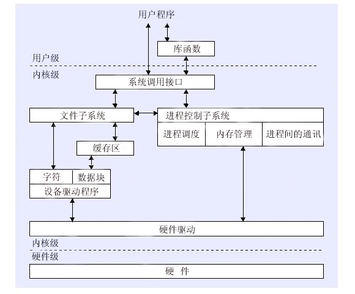

本文章来源于：<https://github.com/Zeb-D/my-review> ，请star 强力支持，你的支持，就是我的动力。

[TOC]


在CPU的所有指令中，有一些指令是非常危险的，如果错用，将导致整个系统崩溃。比如：清内存、设置时钟等。如果所有的程序都能使用这些指令，那么你的系统一天死机n回就不足为奇了。

所以，CPU将指令分为特权指令和非特权指令，对于那些危险的指令，只允许操作系统及其相关模块使用，普通的应用程序只能使用那些不会造成灾难的指令。*Intel的CPU将特权级别分为4个级别：RING0,RING1,RING2,RING3。*

 linux的内核是一个有机的整体。每一个用户进程运行时都好像有一份内核的拷贝，每当用户进程使用系统调用时，都自动地将运行模式从用户级转为内核级，此时进程在内核的地址空间中运行。

 当一个任务（进程）执行系统调用而陷入内核代码中执行时，我们就称进程处于内核运行态（或简称为内核态）。此时处理器处于特权级最高的（0级）内核代码中执行。

当进程处于内核态时，执行的内核代码会使用当前进程的内核栈。每个进程都有自己的内核栈。当进程在执行用户自己的代码时，则称其处于用户运行态（用户态）。即此时处理器在特权级最低的（3级）用户代码中运行。

当正在执行用户程序而突然被中断程序中断时，此时用户程序也可以象征性地称为处于进程的内核态。因为中断处理程序将使用当前进程的内核栈。这与处于内核态的进程的状态有些类似。

 内核态与用户态是操作系统的两种运行级别,跟intel cpu没有必然的联系, 

```
如上所提到的intel cpu提供Ring0-Ring3四种级别的运行模式，Ring0级别最高，Ring3最低。
Linux使用了Ring3级别运行用户态，Ring0作为 内核态，没有使用Ring1和Ring2。
Ring3状态不能访问Ring0的地址空间，包括代码和数据。
```

Linux进程的4GB地址空间，3G-4G部 分大家是共享的，是内核态的地址空间，这里存放在整个内核的代码和所有的内核模块，以及内核所维护的数据。

用户运行一个程序:

> 该程序所创建的进程开始是运 行在用户态的，
>
> 如果要执行文件操作，网络数据发送等操作，必须通过write，send等系统调用，这些系统调用会调用内核中的代码来完成操作，
>
> 这时，必须切换到Ring0，然后进入3GB-4GB中的内核地址空间去执行这些代码完成操作，
>
> 完成后，切换回Ring3，回到用户态。

这样，用户态的程序就不能 随意操作内核地址空间，具有一定的安全保护作用。

   处理器总处于以下状态中的一种：

> 1、内核态，运行于进程上下文，内核代表进程运行于内核空间；
>
> 2、内核态，运行于中断上下文，内核代表硬件运行于内核空间；
>
> 3、用户态，运行于用户空间。

 

从用户空间到内核空间有两种触发手段：

- 1.用户空间的应用程序，通过系统调用，进入内核空间。这个时候用户空间的进程要传递很多变量、参数的值给内核，内核态运行的时候也要保存用户进程的一些寄存器值、变量等。所谓的“进程上下文”，可以看作是用户进程传递给内核的这些参数以及内核要保存的那一整套的变量和寄存器值和当时的环境等。
- 2.硬件通过触发信号，导致内核调用中断处理程序，进入内核空间。这个过程中，硬件的一些变量和参数也要传递给内核，内核通过这些参数进行中断处理。所谓的“中断上下文”，其实也可以看作就是硬件传递过来的这些参数和内核需要保存的一些其他环境（主要是当前被打断执行的进程环境）。

 一个程序我们可以从两种角度去分析。其一就是它的静态结构，其二就是动态过程。

下图表示了用户态和内核态直接的关系（静态的角度来观察程序）



**系统调用是操作系统中的最小功能单位。**

> - 系统调用与上层应用程序的关系：
>    如果将系统调用比作是一个“比画”，那么上层应用就是一个“汉字”。如果完成一个“汉字”，就需要通过多个系统调用。

> - 系统调用与公用函数库的关系：
>    公用函数库实现对系统调用的封装，将简单的业务逻辑接口呈现给用户，方便用户调用，从这个角度上看，库函数就像是组成汉字的“偏旁”。

**用户态切换为内核态的三种情况**

- 异常事件： 当CPU正在执行运行在用户态的程序时，突然发生某些预先不可知的异常事件，这个时候就会触发从当前用户态执行的进程转向内核态执行相关的异常事件，典型的如[缺页异常](https://link.jianshu.com?t=http://www.cnblogs.com/jikexianfeng/articles/5647994.html)。
- 外围设备的中断：当外围设备完成用户的请求操作后，会像CPU发出中断信号，此时，CPU就会暂停执行下一条即将要执行的指令，转而去执行中断信号对应的处理程序，如果先前执行的指令是在用户态下，则自然就发生从用户态到内核态的转换。
- **系统调用的本质其实也是中断**，相对于外围设备的硬中断，这种中断称为软中断。从触发方式和效果上来看，这三种切换方式是完全一样的，都相当于是执行了一个中断响应的过程。但是从触发的对象来看，**系统调用是进程主动请求切换的，而异常和硬中断则是被动的。**

