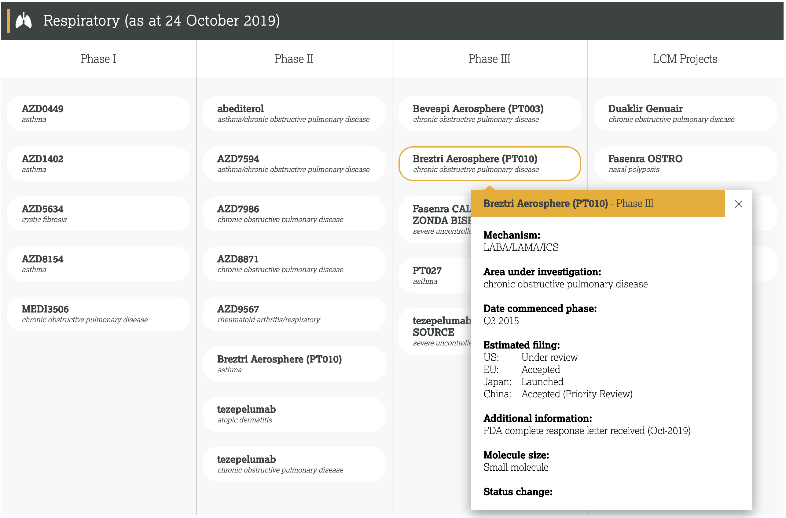

本文章来源于：<https://github.com/Zeb-D/my-review> ，请star 强力支持，你的支持，就是我的动力。

[TOC]

------

ToB 服务交付的方式分为公有云部署和私有化部署两种。其中，对成本敏感的中小企业往往采用公有云部署的方式，从而尽量减少成本。客单价较高的大型企业、政府、银行和事业单位，考虑到数据隐私、安全、合规等要求，往往采用私有化部署的方式。基于对公司营收的巨大贡献，私有化部署便成为了 ToB 企业的重中之重。

在众多私有化部署的场景中，较为复杂的是公有云厂商的专有云产品，之所以复杂，是因为这些厂商直接将公有云的核心功能打包进行私有化部署，和垂直类解决方案往往提供单一功能相比，其难度可想而知。国内采用该种模式的有京东云的 JDStack，金山云的 KingStack，腾讯云的 TCE 和阿里云的 Apsara Stack。

## 存在的问题：部署耗时和成本

私有化部署的耗时，一般需要两周左右的时间，给人感觉耗时太长了。但从耗时角度去看的话，一个大单从开始到最终结项，历时半年到一年是很正常的，这样看，两周的部署耗时占比不到 10%，并非项目交付耗时的主要矛盾点。

但如果两周部署耗时的背后，是从研发团队抽调了几十名高级工程师加班加点，夜以继日换来的，可能大家都无法淡定了。假设一次大型央企的异地私有化交付项目，部署耗时 20 天，期间现场累计参与人数超过 60 人，现场峰值人数超过 30 人，30%的人员是高级工程师，相关人员频繁往返于两地间，粗略估算一下成本，至少 50 万，这样的模式，只能是在起步阶段交点学费吸取点教训。

在部署耗时的优化上，还需要考虑客户所在行业的特殊性，尤其是关系国计民生的领域，互联网的快速迭代，越变越美并不一定适用。我们可以建议在入场前将我们需要的资源准备完毕，但也只能是建议。对于在现场部署过程中，诸如各种审批流程和要求，甲方工作人员每天的工作时长，基于安全因素对数据传输和拷贝的限制等等，都会影响最终的部署耗时。

因此，相比于部署耗时的优化，对部署成本的控制更现实一些。如果部署工作是由外包来进行的，且过程中不需要公有云厂商的技术支持，那么只要部署耗时控制在客户可接受的范围即可，厂商也会因此具备大规模批量实施的能力。

## 存在的问题：质量缺陷

什么叫做质量缺陷呢？简单来说，在你完成一套专有云产品的私有化部署之后，最严重的情况，可能这套系统完全无法使用，大部分时候，都会有一小部分功能无法使用。

质量缺陷的影响是什么？最糟糕的情形莫过于你成功的将你的客户转化成你的测试团队，从你部署的系统中，源源不断的反馈各种问题，进而逐渐失去了客户对你的信任。

既然是在公有云验证过的产品，为什么私有化部署还会出现这么多的功能不可用（或者称之为质量缺陷）？我觉得有如下两点：

**复杂度：**从厂商角度看，公有云产品由数百个模块构成，对外提供几十种功能，涉及到从网络，硬件，操作系统，程序，配置，上下游依赖关系，数据等方方面面，这样一个在公有云厂商中往往是多个部门上千人耗费数年打造的产品，现在让刚成立的交付团队来搞定一个由上千人参与的复杂系统，其难度可想而知，仅仅是能够熟练使用公有云产品提供的这几十种功能，就需要花费很长时间，更何况还要面对数百个模块，数百种配置文件，数百个模块间的复杂依赖，不同的开发语言，几乎涵盖了业界所有主流的开源软件等，以及为了一个小功能牵一发而动全身的痛苦。

**兼容性：**从客户角度看，不同行业不同客户，真可谓是千人千面。基础设施的供应商不同，组网协议不同，硬件的品牌型号规格不同，操作系统和内核版本不同，登录和认证方式不同，等保要求不同，资源提供方式不同，还有各种极小众的东西，比如非常生僻的数据库，十几年前的软件，小众的编程语言等等。专有云产品为了兼容这些差异，必然需要临时开发一些定制化功能，这也成了质量缺陷的重灾区。

## 存在的问题：可运维性

为什么在公有云环境下大家反馈良好的产品，在私有化部署中被如此吐槽，主要是因为在公有云场景下，问题被化整为零了。

举例来说，各个产品做的都很不错，每个产品平均仅存在一个部署的小问题，这对于一个研发了数十个模块，拥有百十人规模的团队来说，已经是不错的成绩了。但同样的问题，放在私有化环境下，就不好玩了，五十个产品，每个产品部署的时候都有一个小问题，而交付团队人员少，对系统的掌握程度也不如研发团队，你让他怎么办？

某云提供的运维手册，多达 2100 页，80MB 的体积，我都不知道自己上次看这种大部头书是什么时候了。当然，文档也是交付的必要内容之一，从这个角度来说，某云在国内做的还是很好的。

## 如何解决存在的问题呢？

通过降低部署环节的技术难度，实现一键部署的能力，将交付工作交给外包团队，从而具备大规模批量交付的能力。整个的过程大致如下：

- 第一步，对部署流程进行原子化拆分；
- 第二步，对每一个原子化的部署步骤进行标准化改造，例如以统一的全局错误码进行异常输出，便于查找解决方案；
- 第三步，对每一个部署步骤均进行多次的部署可靠性验证和回滚验证，确保每一个原子的部署操作具备较高的成功率，同时回滚后不会有任何影响二次部署的残留物；
- 第四步，为每一个原子操作提供功能测试能力，确保仅在该操作正确无误后，才会进入下一个操作环节；
- 第五步，梳理各个原子操作间的串并行关系和依赖关系，从而生成部署时序图，进而基于部署时序图打造出一键部署能力。

这里需要注意的是，一键部署并不等于全自动化部署，在相当长的时间，可能也无法做到 100%的全自动化部署，很多环节尤其是前置依赖还是需要客户配合的。

业内众多厂商也在提一体机的概念，一体机的解决方案确实更好，理想情况下，把一批机器放到客户的机房，加电并设置网络就可以使用了，而且公有云厂商的硬件成本更有优势，客户也能看到"实物”，只是在当下，主要是在企业客户中使用。

## 值得注意的关键点

**部署流程图，**是整个解决方案中最重要的环节，没有之一。类似于工程施工图，将整体工程从无到有的所有过程、环节、工艺标准、施工要求、依赖和注意事项，进行完整的说明。部署流程图决不能止步于模块部署的内容，而是要涵盖从网络的实施、硬件的上架、操作系统的安装到部署服务的所有环节，这样才能保证一键部署的成功率。找一个完全空白的环境，不断的从零重建，相信大家都可以梳理出完善的部署流程图。在这里再次提醒大家，要覆盖所有环节，尤其是那些你从未接触的部分，以我为例，在交换机参数配置上就吃过好几次亏。

**功能验证，**以客户的定制化需求为例说明，研发开发完毕自测通过，测试也通过了，运维验证通过后打包发版，交付发现功能上有缺陷，这时候，研发可能就愤怒了，有问题，怎么不早说！因此，功能验证是需要整合产品、研发、测试、运维、安全、法务、合规、交付和客户各种角色对功能验收的要求，便于及早发现问题，减少返工的成本。具体来说，在每个原子操作执行完毕后，对涉及到的功能、接口、页面进行充分的验证，在每个阶段完成后，也要对该阶段的组合功能进行验证。同时，对于相关模块的实例数量，实例规格，依赖，健康状态，配置正确性，错误日志以及性能指标等进行检查，以及相关的配置是否真正生效。多管齐下，确保能够准确判断每个原子操作执行的正确性以及在异常情况下尽可能给出异常原因。

**一致性维护，**通过 Puppet 等配置管理工具来确保服务器配置的一致性，如 NTP、DNS、YUM、信任关系、日志统一收集、工具列表和版本以及系统参数，避免手工维护缺失和遗漏导致的质量缺陷问题。例如在部署阶段，NTP 时钟不同步导致的趋势图无法展示实时数据，进而耗费了非常大的人力来进行问题定位。

**检查清单，**主要是对标准规范、统一配置、最佳实践，易错问题且会导致严重后果的问题再次确认，避免后期的大规模返工或者故障。例如，配置变更后需要重启服务器才能真正生效的策略，不仅要检查其配置是否生效，还需要在相关步骤执行完毕后，确保检查服务器的运行时间；通过 Systemd 拉起的服务，要检查其设置了开机自动启动；系统安装后，要确保所有磁盘均为 XFS 格式且全部写入系统配置中；所有用户定制化内容，全部需要再次检查是否生效，如不同用户要求的超卖比。

**虚拟化和启动自检，**将模块实现虚拟化部署，从而能够和硬件、组网协议、IP 地址等用户资源解耦，实现镜像在多套环境下的固化，从而大幅提升模块部署的成功率。短时间内无法实现虚拟化部署的模块，则必须实现启动自检功能，在物理机或者虚拟机环境下启动前，需要检查环境是否满足自己的要求，例如 JAVA 是否可用，版本是否符合要求，Swap 是否关闭等。

**全局标准化，**以服务启停方式为例，全部收敛为 Systemd 方式拉起服务，用户仅需要知道进程名就可以实现任意服务的启停操作，日志切分则全部由程序自行实现，不通过外部的 crontab 来进行，这样既降低了复杂度，也大幅提升了可运维性。

**插件化，**对于专有云产品的定制化功能，尽量由系统通过插件的形式来支持，避免直接修改相关代码导致后期的不可维护。以登录功能为例，目前所有的主流公有云，都支持多种登录方式，这样，在专有云模式下，多增加一种登录方式，其对系统整体的影响就非常小了。

## 下一步发展计划

在解决私有化部署过程中的问题后，接下来的重点工作是提升系统的自动化运维水平，降低系统的运维成本，逐步将运维工作从厂商交接给客户的运维团队。主要在两个方面发力：

操作平台，将日常运维工作中的各类场景（包括但不限于日常巡检，故障处理，版本升级、预案执行、问题定位、配置变更、补丁升级），进行标准化的文档改造并录入到操作平台，然后按照使用频率和重要性逐步将各类场景进行自动化和智能化的升级，减少运维人员需要介入的频次。

可视化，运维人员的主要工作从执行变为监督，因此可视化会变为主要的使用工具。通过各类大屏，将系统的运行状态、健康度、核心指标、容量数据等关键信息进行实时展示，便于运维人员了解情况。