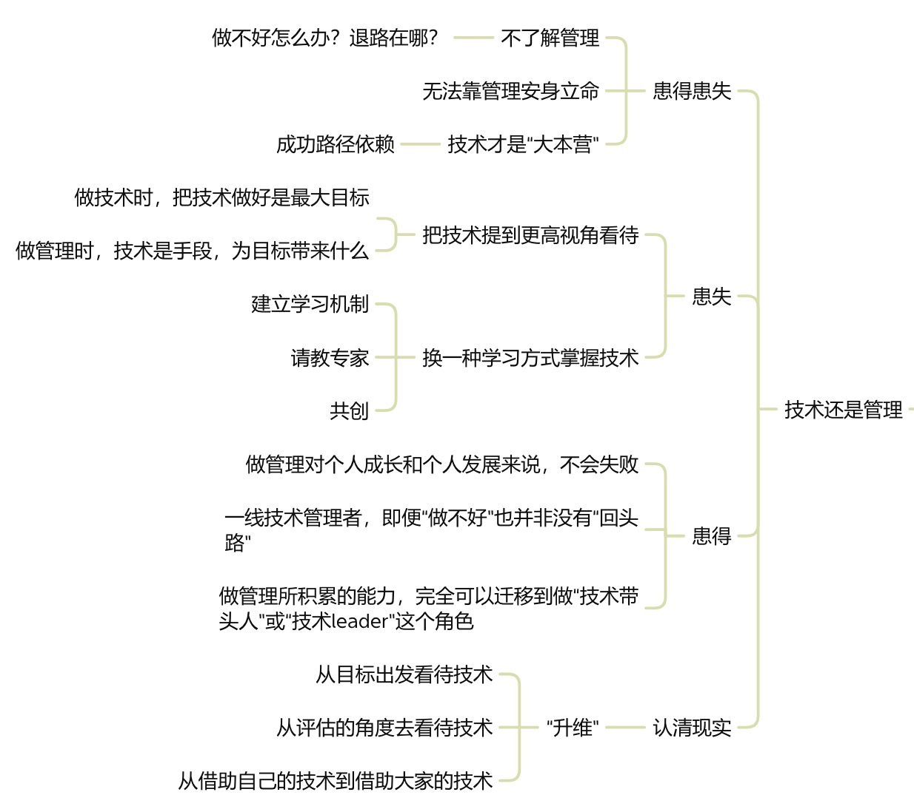
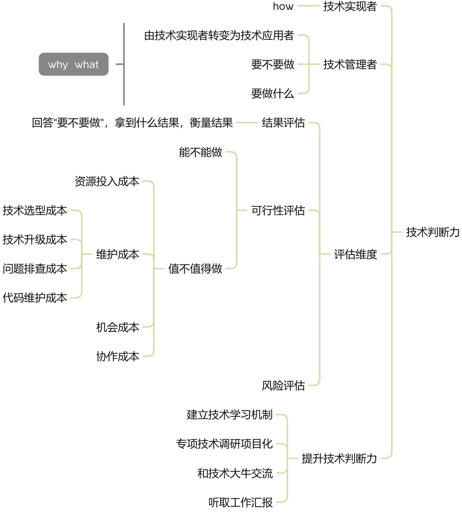

本文章来源于：<https://github.com/Zeb-D/my-review> ，请star 强力支持，你的支持，就是我的动力。

[TOC]

------

新晋管理者都有一些相同的烦恼和忧愁。

“管理事太杂了，没时间写代码，越来越虚”

“如何平稳技术与管理？”

“管理事太琐碎，离技术越来越远，未来职业怎么规划？”

“做管理最大的挑战，就是舍弃技术，特别难”

这些问题的本源是因为新晋管理者正在进入一个全新的领域，离开以往的舒适区。

以往的舒适区是技术范围，而且主要是技术实现。接受一个功能需求，通过技术实现出来。

而成为管理后，不再是技术实现，而是任务分配，团队建设，资源协调等等脱离技术的事项。

**走出舒适区是相当痛苦的，它会让人产生不安全感，让人容易自我质疑，以及自我否定，进而退回舒适区**。

新晋管理者都有类似这种前怕狼后怕虎的焦虑。

前怕狼后怕虎，狼是啥？管理之路不好走，事很杂，心里虚。虎是啥？离技术越来越远，失去了技术优势。

从自身安身立命安全感角度讲，是青黄不接的时候，管理还没有摸出门道，不知道怎么搞定，倍感焦虑；而熟练掌握的技术，却投入的时间越来越少。

这种纠结的状态，归纳为一个词叫：患得患失。还没有得到时，担心得不到；得到后，又担心失去。

如何才能突破这一关卡，或者说如何挣脱刚开始做管理时，患得患失的思维逻辑呢？

最近在看《技术管理实践36讲》，整理了份思维导图，来梳理作者的观点：

首先，对管理本身就不太了解，对未知事物总有种畏惧感。尤其技术人更喜欢与确定性事务打交道。其次成功路径依赖，喜欢与干得好其实是相互促进的关系，干得越好越喜欢，越喜欢就干得越好。并且会在做其他事情时，不自主地迁移原先的成功路径。

**怎么解决“患失”**？成为管理后，怎么保持技术能力。不能丢失原先的优势。

做技术时，技术能力来源于自己的实践。而管理后，没有整块的时间技术实现。但作为技术管理，技术判断力是核心能力，怎么提升判断力呢？

1、转变思维，不再是技术实现者，而是技术应用者。在实现目标的过程中，技术能带来什么？

2、不再是考虑怎么实现，而是以目标为导向，考虑要不要投入资源，并且评估值不值得做。

3、值不值得做，需要从资源投入成本、维护成本、机会成本、协作成本四方面考虑。

最重要的还是要保持学习。怎么保持学习呢？不再只靠自己的时间投入，依靠的是团队的力量。

1、学习型组织，组织定期分享，技术交流

2、做专项技术调研，让负责人做调研汇报

3、与技术大牛交流

4、听取汇报，相互探讨

**怎么解决“患得”？** 首先需要明确，管理带来的价值。技术人三条腿“技术”、“管理”、“业务”就包含了管理。其次，管理代表了更大的责任，也表示可以输出更大的价值。最后能得到更立体的视角和灵活的思维方式。

退一步，就算管理失败了，也积累了些管理能力，这部分能力可以迁移到技术带头人，还有架构师也是需要部分管理能力。

所以说就算没有得到，也不算完全失去。

当然最重要的，如果管理是未来必经之路，那当下开始积累管理能力，就是最好的准备。

------

其实不管是做技术，还是做管理。都不是为了做而做，我们都是为了自我成长，成长为更好的自己。保持开放心态，拥抱变化，从单纯的技术维度到相对复杂的管理维度。可以帮我们更快速地全面提升。