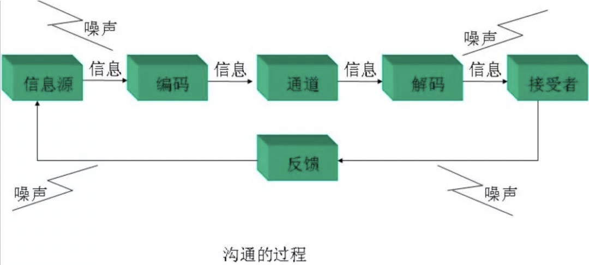
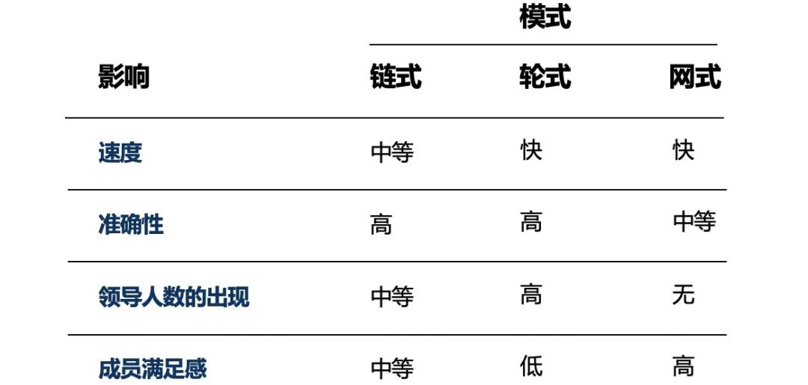

本文章来源于：<https://github.com/Zeb-D/my-review> ，请star 强力支持，你的支持，就是我的动力。

[TOC]

------


```
世界上有两件最难的事:把别人的钱装进自己的口袋;把自己的思想装进别人的脑袋。
```


### 为什么沟通那么重要

谁都知道在工作中沟通是非常重要的，那大家有没有真正想过为什么沟通这么重要呢?

首先我们想想看，在你的日常工作时间分配上，“沟通”所用的时间占比多少呢?

日常的会议、 在钉钉、企业微信上的讨论、处理邮件等等，反正我个人是远远超过了 50%的。这就和管理学上的一 个著名理论很契合了:

管理者 50%以上的时间用在了沟通上，但同时工作中 50%以上的障碍都是在沟通中产生的。 这就是“双 50%理论”，这直观的反应了不论是在占用时间上，还是对工作的影响程度上，沟 通都是至关重要的。


为什么团队里开会大家总是很沉默，有想法的同学也不吭声?上面这个图大家应该在各种不 同的渠道都看到过吧，相信大在第一次看到这个图的时候都会和我一样会心一笑吧。

为什么这张图能有这样的效果呢?因为这个图所表现出来的问题真的非常好的影射了我们 日常实际工作的情况:由于沟通不到位的问题导致一个产品在不同的角色的理解上造成了这 么巨大的差异。那么在像阿里这样的互联网公司，工作量常见的沟通问题都要哪些呢? 这里做一些简单的列举:

 为什么推动兄弟团队配合这么难，他们配合的进度完全不可控?

  为什么工作布置给了下属，但是最后又都堆积到了我这里?

  为什么会议讨论留下来的 action 执行起来总是拖拖拉拉完成不了?

  为什么老板最近的消息经常已读不回?

  为什么整天被钉钉消息淹没了，个人的事情只能在夜深人静加班做了?

  ......

这么多的沟通问题，那沟通问什么这么困难呢?这里从最常见的情况来看，特别是在 1 对 1 的沟通中，主要有三个主要的原因:


既然沟通的问题很多，导致问题的原因也非常复杂，那我们的出路在哪里呢?是不是解决办 法就是标准化我们的工作，然后通过标准化、流程化来让我们的工作减少沟通的需求，然后 大家都可以在自己的工位安安静静写代码、写方案、这样就万事大吉了呢?答案是否定的。

我们来看这个象限图，这个是李开复博士在对未来 AI 的设想中提到的一个模型:


可以看到，在区间图的左下角的岗位对应的是低社交需求，并且是结构化的领域，在这样的 领域的岗位，未来 5-10 就会被 AI 机器人所取代。

如果我们的工作能够简单的通过定义标准化的接口做到按流程执行，从而避免或减少沟通， 那我们的工作的价值就会降低，从而最终被机器取代，就像流水线上的工人正在大量被智能 机器人所取代那样。

我想说的意思不是说为了体现工作的价值，要故意提高工作的沟通成本，相反，我们的确需 要通过归纳总结梳理标准话的流程、甚至是工具化的手段来降低一个领域的沟通，但我们同 时工作在找更复杂、更需要去沟通的场景中，去创造更大的价值。所以我们要做的是保持竞 争力，持续提升沟通能力。这个才是大家每个人要持续努力的方向。


### 沟通的基础

有一个西方的谚语是这么说的:世界上有两件最难的事:把别人的钱装进自己的口袋;把自 己的思想装进别人的脑袋。就像图上的这个场景一样，在沟通遇到问题的时候，大家往往都 会觉得自己是对的，都想要说服对方，但有都总是困难重重。

沟通失败的原因总是多种多样，要么是表达上的问题，要么是倾听和反馈上的问题，要么是 环境上带来的问题。列举下来，一般的情况有:

 缺乏信息或知识

  没有说明重要性

  只注重了表达、没有注重倾听

  没有完全理解对方的话，以至于询问不当 

  没有注重反馈

  时间不够

  不良情绪

  职位的差距、文化的差距

首先，我们来一起了解一下沟通模型。沟通是从信息发送者出发，到信息接受者收到消息，然后给出反馈到信息发送者的一个完整闭环。



这里的编码，可能是文字，也可以是声音，甚至是手势、表情;通道可以是钉钉、邮件、视 频、也可以是面对面;各种外界环境可能带来噪音，比如心情不好，或者大家背景不同、缺 少共同语言，并行沟通的影响等等。

可以看到，一个最小闭环的沟通过程，因为涉及多个环节，其实形成了一个较长的链路，链 路一旦长了，在链路上的各个环节都容易出现问题，最终就会将问题层层放大。这里就必须 给大家介绍一下沟通漏斗的理论了。


这里必须要知道沟通漏斗的形成过程。举个例子，比如一个开发的 leader，发现最近项目 开发中引入的问题比较多，产品好几次遇到严重的线上质疑，于是他决定开个会整改，晚上 睡不着觉心里想怎么解决呢?

想到了 10 个方面(100%)的问题的，需要与下属员工讲。

当第二天站在众人面前开会时， 由于没休息好并且紧张，想到的 10 件事情，只说出了其中的 8 件，漏掉了 2 件，也就是只 说出了 80%。而这 8 件事在当众讲的时候，由于场地的限制、人员的多少等关系影响，造成员工真正听到的是有 6 件事(60%)。

又由于员工水平、知识背景的差异，我们的技术 leader 语言表达的高低、语言口音方言等 实际情况，真正被别人理解、消化的东西大概只有 40%。

等到这些人去落地执行时，由于 每件事情与个人关系的大小、执行的意愿强弱等因素，造成到最后得到执行的已经变成 20% 了;

虽然这个比例比较夸张，实际并没有这么严重，但是这个沟通造成的漏斗确是实实在在 存在的，我们只能想办法将他变得影响越小越好。

那么到底有没有办法减少或消除这个沟通造成的漏斗现象呢?我们从说、听、问三个角度来 看一下。


#### 沟通基础一:表达

沟通的基础，第一条就是表达，就是发送信息。我们的马老师是公认的演讲高手，他的表达 能力就非常强。

在表达上，除了我们大家比较了解的，需要有易懂的语言、清晰地逻辑，我们还需要注意什 么呢?看马老师的形象我们就清楚了，那就是语气、表情、肢体动作这些。


在沟通管理领域，有一个非常著名的理论，“沟通 = 7%内容 + 38%声音 + 55%肢体语 言”，这充分说明了身体语言在沟通过程中的重要性。这里，给大家在沟通表达时的身体语 言提供一些建议:

  语言和身体语言必须保持一致

  设法一开始引起对方的注意

  如果必要，需要重复、改述

  用对方熟悉的语言

  要:正面面对、点头、微笑、身体前倾、目光接触  不要:双手抱在胸前、眼神游离、干别的事


再举一个我们日常中最常见的例子。日常我们用钉钉做沟通比较多，同样的一句话，如果用 不同的语调会表示不同的态度、表达不同的意思(如“这个需求提测了吗?”，是询问还是催 促?)。所以我在钉钉上询问别人类似的问题时，总担心被误解，一般都会增加一个笑脸的 表情包，不知道大家有没有这样的做法呢?^_^


#### 沟通基础二:倾听

沟通的第二个基础就是听。沟通的关键往往是接收者、听者，而非说话者。越是成功的人， 往往越是擅于倾听的人。


相对于简体字(用口听)，繁体字的“听”更能体现倾听的精髓(看来我们古人还是的智慧还 是很了不起的):

-   “耳王”。既然是听，最重要的器官无疑是耳朵，所以听的要义就是以耳为王，带着耳朵 来，把倾听放在第一位。
-   “十四”。其中的“四”可以看成“目”，也就是眼睛。听不光用耳朵，还要用眼睛。对方的 眼神、表情、肢体语言，都包含着丰富的信息，是与对方提供的资料或实物相配合的
-   “一心”。要达到沟通的目的，收到最佳的效果，必须要用心，而且要一心一意。是用心 去听讲，用心去观察，用心去提问，用心去思考。

倾听也分成几个不同的层次:

  听而不闻

  假装倾听

  选择性倾听

  专注的倾听

  设身处地的倾听


其他第五层和第四层的区别是，专注的听还是为了对听到的内容作出反应，但设身处地的听 是为了了解对方，而不是为了做反应，目的是通过交流了解对方的观念、感受，真正做到同 理心。


#### 沟通基础三:提问

沟通的第三个基础就是提问，会提问的人更是沟通达人。擅长说的人，沟通的主要时间都是 他在讲，不用担心冷场，而且他可以讲得很精彩。典型的就是培训老师;擅长问的人，和他 说话时他说的不多，但往往提出一些发人深省的问题，让你娇躯(或者虎躯)一震，打开一 个新的世界。所以，善于提问的人才是正在引导沟通方向的人。


一般提问的方式有四种，不同的场合环境和目的需要采用不同的提问方式:

-   封闭式:你同意这个方案吗?我们能按期完成这个任务吗?

-   开放式:你有什么好的建议吗?

-   引导式:如果资源的问题解决了，你第一步打算怎么做?

-   反问式:如果你一味地回答对方问题，就会很容易陷入被动局势。如何让谈话走上你的

  频道?反问式提问便是一个高招， 例如:“我想问一下，这个需求开发排期是怎么样 的?”“那业务的运营节奏是怎样的呢?”


### 团队内沟通和跨团队沟通

接下来给大家介绍三组最常见的沟通场景，这些沟通场景也是日常工作中最容易遇到困难的 地方。首先介绍团队内的沟通和跨团队的沟通。


#### 团队内沟通

团队内的沟通是大家每个人首先要面的的场景。在团队里，一般来说有 3 种沟通的模式。

  链式
  严格遵循正式的指挥链和沟通链，信息线性传递，如在军事化的组织里就比较常见;

 轮式
  轮式沟通仰赖核心人物作为所有成员沟通的引线和中心节点，可以激发强而有力的领导人物出现;

 网式
  允许所有团体成员积极主动的沟通，所有成员均能自由的贡献自我，没有信息的中间节点，也没有明显的领导者角色;

这里，我们对这三种模式做了一个对比:




-   首先在团内里经常出现的问题是“缺少信任“，这个在新组建的团队里特别常见。

-   缺少信任之后就会给团队带来第二个问题，那就是”害怕冲突“，最常见的就是在会议上 大家都沉默不发言。因为缺少信任，大家不知道自己不同的意见会导致别人什么样的反

-   害怕冲突的团队自然会带来第三个问题”缺乏承诺“。可以想象，如果自已不同的观点没

  有表达出来，那么团队最终达成的结论，我是不会有太强的承诺的，因为自己对这个结

  论心里并不认同。

-   缺乏承诺继续会导致问题，那就是”逃避责任“，没有承诺的结论如果后续导致了不好的

  结果，团队成员自然不想对这个结果承担责任，他会心里想，这个本来就不是我希望的做法，看，果然出问题了吧。

-   逃避责任的最终就会团队成员”忽视结果“，如果团队成员自己团队的结果都无感了，那么这个团队也就名存实亡了。

  

  如果大家对团队沟通协作的五大障碍有兴趣，希望更深入的了解，推荐大家看一本书《团队 协作的五大障碍》。


不过建立信任也不一定是这样刻意，或者一定要经历历史性的大战役才能培养，其实“信任” 是在一次次达成并保持的小的约定的基础上建立起来的。比如大家约定的一个文档产出时 间，大家约定的一个会前准备工作，只要类似这种小小的约定能持续达成，大家间的信任就 能有效的建立。

团队里的冲突往往是破坏团队沟通氛围的重要因素，不希望团队里有成员的冲突往往是大家 共同的想法。不过这里要想和大家聊一聊的是，冲突对于团队的沟通一定是件坏事情吗?

答案是否定的，团队可以从健康的富有成效的分歧及处理中得到成长。对团队不利的是”破 坏性冲突“，但对团队有价值的是”建设性的冲突“，我们一起来看看这两种冲突有什么区别:


在团队里，阻碍健康冲突的原因一般有:

  缺乏信任、尊重和理解

  过强势的管理风格

  团队成员不稳定或跨地域


#### 跨团队沟通

在跨团队沟通我们经常遇到的各种问题，我们先简单给大家罗列一下:

-   专业有 gap，缺少共同语言。比如业务开发的团队依赖中台的能力，如果业务开发团队 不了解中台产品的当前现有的体系，讲不清楚对中台需求的需求，就会出现这种情况， 最终导致沟通意愿受损，沟通出问题。
-   目标达不成一致(受部门墙的影响)，比如你计划一个战略级的项目规划，但是需要其 他部门来支持你，在前期调研的时候很配合，真正开始实施了，你也许发现他们的态度 发生了变化，他们不打算真的做较大投入了，因为这个和他们团队的目标不匹配。
-   进度不透明。和兄弟团队约定好了交付的时间，但是中间过程没有沟通，完全是个黑盒， 到了约定的时间快到了才发现很多东西还没有准备好。
-   职责不清、问题推诿。沟通中经常遇到大家因为分工不清导致工作相互推诿，一些灰色 的工作找不到负责人，一旦灰色领域出了问题，又没有人愿意来背锅。


那面对这些问题，我们该怎么解决了?这里给大家提供一个跨部门沟通的原则:

1. -   首先是要大家一起确定目标:一个共赢的目标，不能只是你的目标，一开始就要设定一 个大家都能实现自己价值的目标，这样对方才有意愿和你合作。
   -   第二个就是要明确分工、职责、时间、责任人等，做到”亲兄弟、明算账“，俗话说的” 丑话说在前面“也是这个意思。
   -   第三个就是一开始要确认好沟通机制，做到信息互通，比如周会、周报等，确保过程中 信息透明。
   -   第四个就是在问题的处理上要有责任、有担当、同理心，不能是有好处大家都凑过来， 一旦出了问题大家就翻脸不认人，和人一样，团队也要注意信誉。

因为跨团队沟通往往双方不像在团队里那样，双方可能不是很了解，没有太多的信任感，所 以当双方刚坐下来，还没开始沟通，大家的座位方式已经极大的影响了沟通的结果。这里给 大家介绍一下几种不同沟通座位可能带来的影响。


#### 向上沟通

第二组经常遇到问题的沟通场景就是向上沟通和向下沟通。

向上沟通 讲到”向上沟通“，我们就在提一下”向上管理“，先看一下这两个概念的解释。

-   向上管理，为了给上级和自己取得更好的结果而有意识地配合上级一起工作的过程，可 以说，这是让上级改变的过程;向上管理不是领导上级，而是通过向上沟通、向上协调 去影响及引导上级的看法与自己协调一致;
-   向上沟通，向上沟通是向上管理的主要手段之一，一般指和上级有目的性的沟通行为， 从而向上传递必要的信息或影响其决定;

向上沟通是一种“有目的性的”向上管理行为，如果是那种在 teambuilding 时候很放松的闲 聊，我们暂不归类到向上沟通里面。那向上沟通的难点是什么呢?


 传统观念
   中国人已提到向上管理和向上沟通，可能就各种各样的问题都出来了。这个是西周的“天子统三公、三公治诸侯”的一个金字塔，这就是中国过去传统的一 个很明确、很强烈的等级观念，比如常见的“官大一级压死人”;在中国，这个是一 个历史文化的传承，即使到了今天一个自有民主的社会环境，即使在像阿里这样开 明的互联网公司，这中固有的观念还是会潜移默化的影响我们。

 缺乏主动
  缺乏主动性，一定要等到出了大篓子，兜不住的时候才想到要去通报主管。信息不流通，会让主管没有安全感，会有失控感。永远不要让主管从别人那里知道本应该 你告诉他的情况。

 信息片面
  你想通过沟通去影响你的老板，如果你发现他现在有一个想法不对，你希望引导他

按照你的思路去决策;这个背后还有一个可能性是你获取的信息没有你老板多，你 做出的判断是片面的，甚至是错误的。

 直线思维
  直线思维，比如上级说:“小明，你这个事儿做得不对”，“我这事哪儿做得不对了!”。

那这种沟通方式肯定就没办法谈下去了，是吧，如果这样沟通下去的结果是什么? 可以想象，大家可以看出pua了。

你可以不认同他的观点，或者他处理问题的方式，但是一定不要在公开的场合当面怼。即使在当场觉得那个方式行不通， 处理上存在偏差，也可以在会后，私下沟通，在执行过程中进行修正。


那么向上沟通的常见问题是哪些呢?

 有问题、有疑虑不敢沟通:

-   领导展现出一种事事有反馈、积极复盘的认真工作态度，留下良好的第一印象。

-   执行时遇到问题，把问题及时反馈，等于把责任分担了出去，提高解决问题的成功率。

-   对于自己来说，主动汇报也能使你理清自己的工作，锻炼自己解决问题的能力，提升效率。

-   主动汇报，让老板信任，因为不汇报给领导带来失控感。主动汇报，既可以让你的工作“可视化”，也确保执行方向正确。这样做的好处有:

   啰里啰嗦说不清问题和影响:
    给老板汇报一定要提前准备，思路清晰，表达清楚，提高效率。关于怎么给老板做  汇报，后面还还展开讲一下。

-  只说问题不给方案:
    充分思考，提前准备好方案和建议，让老板做选择题而不是问答题。这个不仅提高

  了和老板沟通的效率，更重要的是要让老板看到你的思考，做到为老板分担。

  

  讲到向上汇报，那我们就需要先来讲一下向上汇报的思考框架，通过这个思考框架，你能判 断当前的内容是否需要汇报，已经用什么策略来做汇报。

  

第一个象限和老板一起进入重要级别非常高的项目。此时，老板就是你的同事。一起策划一 起干活。这个象限里，老板是完全的“参与”。你们之间信息是对称的，这时，重要的汇报形 式可能都消失了，因为你们随时都知道对方的信息。

第二个象限，老板的角色要给你“指导与决策”。这里老板很关心，但具体进展和细节他不清 楚，这里的内容往往是汇报中最重要的，也是向上汇报能力的重点。重点汇报里很有一个可 能目标是有困难需要老板来支持的，比如资源不够，需要老板协调，你直接告诉老板需要他 做什么就好了(这里就转移到了第四象限)。

第三个象限都是老板授权给你的事情，是你的职责所在。虽然信息在这里也有不对称，但是 老板在宏观面上会知道你的内容(甚至他当年还干过你这个工作)，或者内容的重要性不能 进入老板的“管理仪表盘”(不涉及他要做的高级别管理决策)。这部分内容只要表达:你在 按部就班地在如期进行就好，老板只需阶段性的检视一下就行，不是汇报的重点。常见的误 区是:这部分内容总是错误地摆上 PPT，向老板事无巨细的读一遍，大家都很沉闷，成为最 没水平的汇报。这个区间里如果有异常情况，异常情况需要转移到第二区间处理。

第四象限的内容，其缘由和理由都无需论述，老板和你已经达成共识，信息是对称的。但是， 这里有下属难以完成的任务，或者超出职权的任务，或者是新范畴的任务，最常见的是下属 需要领导帮助解决某种资源。这里老板的角色是“帮助与支持”。

前面说到要主动汇报，那汇报最好的时机是什么时候呢?这里提供了 4 种最基本的向上汇 报时机，大家可以参考:


现在要介绍一下向上汇报的方法了:

-   内容精简扼要:要相信老板都是看过成千上万张 PPT 的，所以他们大多数时候都能够 一眼看出 PPT 中所要表达的意思，因此 PPT 的信息需要精简扼要。同时需要使用大量 的数据来佐证自己的观点，尽量从客观的角度来陈述。
-   直奔主题:如上面的描述，老板的时间安排极其紧凑，甚至会在汇报过程中由于突发事 件而离开，所以汇报一开始就要开门见山的陈述自己的观点或要求，然后再罗列理由和 证据，最后再重新陈述一下自己的观点即可。以上即为“电梯游说”的 PREP 结构: Position(观点)、Reason(理由)、Evidence(证据)、Position(观点)。
-   做好充分准备:汇报的内容也需仅有数页 PPT，但是很多时候领导都会顺藤摸瓜的询问 一些相关问题。所以作为汇报人，需要同时将相关的信息都要提前了解清楚，以防被问 的哑口无言，不但会影响汇报进度，而且会被认为不尽职。
-   掌握 10/30 原则:30 分钟的时间计划中，汇报时间最多占用 10 分钟，剩下的 20 分钟 留给讨论时间，往往能够产生价值的信息会在讨论时间内产生。


**PREP 汇报方法**

出自麦肯锡的 30 秒电梯理论。麦肯锡要求公司员工能够在最短的时间，把想表达的事情说 清楚、讲明白。因此，作出了 PREP 的汇报结构，要求汇报者能够站在一个决策者而不是执 行者的角度上汇报工作。其中由四个部分组成:

-   观点:就是首先用一两句话说清楚你想要表达的核心观点，包括:希望领导原则上同意、 定下一步计划或者尽快看看你的详细材料等等。
-   理由:你需要仔细分析你的汇报材料，凝结成不超过三个理由，然后试着用简洁而有力 的语言表达出来。
-   证据:主要是说明汇报重点中包涵的具体细节，例如:具体现象、数据和效果估计等等。
-   重复观点:最后，再一次重复你的要求


#### 向下沟通

向上沟通有很多困难，那是不是就意味着向下沟通就简单了呢?你的下属都向你汇报，那还 有什么难度吗?

是的，有带团队的同学都能体会，考虑到你每个下属的情况都不相同，向下沟通并不容易。 并且如果不考虑到这些差异，糟糕的向下沟通对管理者和团队来说都是一个灾难。“哈佛商 业评论”就有一个调研表明:91%的员工表示，上级糟糕的沟通会损害其领导力!


那和下属沟通的技巧都有哪些呢?

 发布指令目的清晰，目标明确
  说明任务的重要性，明确任务的 SMART 目标;如果说得不好听，一个含糊的目标(如我们要重视用户体验)，你的下属怎么知道你是不是一时兴起，随口说的呢?

 给与反馈关注行为及影响
  反馈分为两类:积极性反馈和发展性反馈。顾名思义，积极性反馈是为了表达对被指导者的赞扬与认可，发展性反馈则用于指出需要改善的地方。这里区别于父母常 用的唠叨模式，我们同样要有结构，即行为+影响+态度(认可或不足);如，不能简单粗暴的说 xx 没有团队精神。

 建立定期的 one one 沟通渠道
  Oneone 沟通，展现了重视，给与了确定性的准备时间，面对面的沟通更容易进入到更深层面的沟通;


向下沟通还有非常重要的点是，上级怎么处理下级扔过来的问题。当下属找你的时候，他们 很多时候不是在寻求解决方案，而是寻求一个能解决问题的人。下属向管理者报告时，应该 引导他说”我有一个问题“，而不能说”我们有一个问题“。下属提出问题的时候，应该让他理 解这个问题是他的。这里举两个列子:

```
正确的对话方式:”我暂时不能给你建议。你要把你负责的事情再考虑下，下午 4 点半，来我的办公室，提出可行的进一步想法。“，或者”我 24 小时内没空处理这个问题，你继续去 想，明天再给我汇报新的进展。“
```

如果大家对怎么处理和下属中间任务职责的问题感兴趣的话，推荐大家去看一本书:《别让 猴子跳回背上》。

主管的工作，是协助下属完成工作，而不是替下属工作。授人以鱼不如授人以渔的这个道理 大家都懂。

管理者的目的是培养出更多可以独当一面的员工，如下面的图所示，主管要尽量避免出现自有层级为 1、2 级的员工。不要帮助下属去完成他们分内的事情，培养下属解决 问题和思考的能力。

面对下属的求助，多问问他“你觉得呢”，让下属自己去想办法解决问题。


-   5 级、等待指示——连该做什么都不知道;
-   4 级、请示要做什么——知道该做什么，但不知道该怎么做;
-   3 级、提出建议，按照裁断的结果行动——能提出备选方案，但需要主管进行方案选择;
-   2 级、行动，但需立即指示——能决定合适的行动方案，但具体执行时会随时请示;
-   1 级、独立行动，主管只需要看他的例行报告。

自由层级第 1 层级与第 2 层级是争取来的特权——他们不是与生俱来的天然权利。这种特 权获得来自于你能向上司成功的推销自己的想法和建议而慢慢积累的名声。这种名声也只有 在第 3 层级自由量表中才能培养出来。


#### 同步沟通和异步沟通

最后一组要介绍的是同步沟通和异步沟通，这个组词就不像前面那两组那么常见了，不知道 大家是不是都理解这两个词的意思?

 同步沟通
  同步沟通是指你发出一个消息，接收方立即处理这个信息，并马上回复。

 异步沟通
  异步沟通指的是你发出一个消息，并不期待立即得到反馈的沟通方式。

那”钉钉“和”微信“应该归在哪一类呢?微信和钉钉一般认为是同时具备同步沟通和异步沟通 的特征的，过程中有随时变化的可能，就看大家在沟通的过程中是否实时。不过考虑到钉钉 有消息阅读状态的提示，一般我们认为钉钉更加接近同步沟通的方式。

随着在阿里钉钉的深度使用，同步沟通的比重越来越大，不可否认这种方式让整体的工作效 率得到了很大的提升，但任何事情过量就会带来问题。同步沟通常见的问题有:

-   频繁打断，大家的工作时间都被切割成了碎片，妨碍了深度工作的开展。

-   在线的优先级优于高产。不在线的人连发声机会都没有，事情就已经决定了。于是大家  都得被迫实时在线，被迫参加每个可能有关的会议。

-   造成不必要的压力。实时在线的期望使人们丧失对时间表的控制。工作时间内，大家响

  应式回应各方请求，而不是主动地按自己的计划行事。有研究表明，因为常被打断，人

  们反而会努力把事情做得更快(做得更差为代价)，并由此感到更大的压力和困惑;

-   导致低质量的讨论和次优方案。因为需要马上回复，人们没有充分的时间来考虑周全。

  第一时间给出的方案往往不是你能给出的最优方案。

  

那在日常的项目管理中，我们怎么有效的利用好各种沟通方式，让这些沟通方式能更好的发 挥他们的作用，同时避免一些副作用呢?这里我把项目中最常见的沟通方式放在了一个象限 空间中(横坐标是同步或者异步，纵坐标是沟通内容的复杂程度)，希望大家可以对比一下 自己的日常项目，做个参考。


### 最后，也是最重要的

终于到了最后(感谢有人能看到这里)。 

本文讲了很多的不同沟通场景中的技巧，这些沟通技巧有的时候换个角度也可以看成沟通中 的套路。

在这里，我需要强调一下，一个沟通的成败，套路的东西会有效果，但是效果也是 有限的，沟通中更重要的还是要看沟通的动机。

你沟通的目的是不是希望要实现”1+1>2“的 效果，你是不是有一个开放的心态，是不是重视差异化、视每次冲突是成长的机会。

只要是 有一个真诚的心，就算沟通技巧上问题重重，我相信别人还是愿意和你合作。这就是所谓的:” 多一点真诚，少一点套路“!