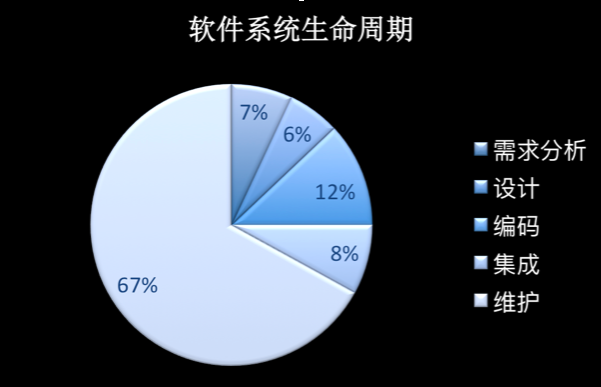

本文章来源于：<https://github.com/Zeb-D/my-review> ，请star 强力支持，你的支持，就是我的动力。

[TOC]

------

## “提出问题”难于“解决问题”

作为技术人员，我们已经习惯于作为问题的解决者给出设计方案，而很少以问题提出者的身份去思考设计方案。团队中常见的典型矛盾，就是产品团队和研发团队之间的矛盾。作为研发团队，我们常吐槽产品团队的需求不合理、不懂技术等。其实我们可以试着把自己的工作再往前移一下，不仅仅是去设计架构、实现产品的需求，同时也试着去实现客户的需求，甚至发现潜在的需求。

这时我们就变成了在设计上提出问题的人，你会发现提出问题的同时，在很多时候也需要同样深入的思考。设计一个好的问题，甚至比解决问题更难。

其实即便是软件开发领域的大神 Frederick P. Brooks Jr.（《人月神话》的作者）也会有同样的感叹。

> “The hardest part of design is deciding what to design.”
>
> – 《The design of design》, by Frederick P. Brooks Jr.

## 决定“不要什么”比“要什么”更难

也许是由于人性的贪婪，对于软件系统我们同样想要更多：更多功能、更好的性能、更好的伸缩性、扩展性等等。作为软件架构师要明白软件架构设计就是一种取舍或平衡。当大家都在往里面加东西的时候，架构师更应该来做这个说“不”的人。

软件设计和定义过程中存在很多取舍，例如：

- 完善功能和尽早发布的取舍。
- 伸缩性和性能的取舍。

著名的 CAP 原则，就是一个很好的取舍指导策略。为了更好的取舍，保持架构风格的一致性，在一开始架构师就应该根据系统的实际需求来定义一些取舍的原则，如：

- 数据一致性拥有最高优先级。
- 提前发布核心功能优于完整发布等。

## 非功能性需求决定架构

因为软件是为了满足客户的功能性需求的，所以很多设计人员可能会认为架构是由要实现的功能性需求决定的。但实际上真正决定软件架构的其实是非功能性需求。

架构师要更加关注非功能性需求，常见的非功能性包括：性能，伸缩性，扩展性和可维护性等，甚至还包括团队技术水平和发布时间要求。能实现功能的设计总是有很多，考虑了非功能性需求后才能筛选出最合适的设计。

## “简单”并不“容易”

很多架构师都会常常提到保持简单，但是有时候我们会混淆简单和容易。简单和容易在英语里也是两个词“simple”和“easy”。

> “Simple can be harder than complex:
>
> You have to work hard to get your thinking clean to make it simple. But it’s worth it in the end because once you get there, you can move mountains.
>
> To be truly simple, you have to go really deep.”
>
> –SteveJobs

真正的一些简单的方法其实来自于对问题和技术更深入的理解。这些方案往往不是容易获得的、表面上的方法。简单可以说蕴含着一种深入的技巧在其中。

首先我们来回顾一下软件生命周期中各个阶段的成本消耗占比。以下是来一个知名统计机构的分析报告。我们可以看到占比最大的是维护部分，对于这一部分的简化将最具有全局意义。

## 永远不要停止编码

架构师也是程序员，代码是软件的最终实现形态，停止编程会逐渐让你忘记作为程序员的感受，更重要的是忘记其中的“痛”，从而容易产生一些不切实际的设计。

大家可能听说过在 Amazon，高级副总裁级别的 Distinguish Engineer（如：James Gosling，Java 之父），他们每年的编码量也非常大，常在 10 万行以上。

## 风险优先

架构设计很重要的一点是识别可能存在的风险，尤其是非功能性需求实现的风险。因为这些风险往往没有功能性需求这么容易在初期被发现，但修正的代价通常要比修正功能性需求大非常多，甚至可能导致项目的失败，前面我们也提到了非功能性需求决定了架构，如数据一致性要求、响应延迟要求等。

我们应该通过原型或在早期的迭代中确认风险能够通过合理的架构得以解决。

绝对不要把风险放到最后，就算是一个项目要失败也要让它快速失败，这也是一种敏捷。

## 从“问题”开始，而不是“技术”

技术人员对于新技术的都有着一种与身俱来的激情，总是乐于去学习新技术，同时也更有激情去使用新技术。但是这也同样容易导致一个通病，就是“当我们有一个锤子的时候看什么都是钉子”，使用一些不适合的技术去解决手边的问题，常常会导致简单问题复杂化。

曾经有一个团队维护过这样一个简单的服务，起初就是一个用 MySQL 作数据存储的简单服务，由团队的一个成员来开发和维护。后来，这位成员对当时新出的 DynamoDB 产生了兴趣，并学习了相关知识。

然后就发生下面这样的事：

- 用DynamoDB替换了MySQL。
- 很快发现DynamoDB并不能很好的支持事务特性，在当时只有一个性能极差的客户端类库来支持事物，由于采用客户端方式，引入了大量的额外交互，导致性能差别达7倍之多。这时候，这个同学就采用了当时在NoSQL领域广泛流行的最终一致技术，通过一个Pub-Sub消息队列来实现最终一致（即当某对象的值发生改变后会产生一个事件，然后关注这一改变的逻辑，就会订阅这个通知，并改变于其相关数据，从而实现不同数据的最终一致）。
- 接着由于DynamoDB无法提供SQL那样方便的查询机制，为了实现数据分析就又引入了EMR/MapReduceJob。

到此，大家可以看到实现一样的功能，但是复杂性大大增加，维护工作也由一个人变成了一个团队。

## 过度忙碌使你落后

对于 IT 人而言忙碌已成为了习惯，加班常挂在嘴边。“996”工作制似乎也变成了公司高效的标志。而事实上过度的忙碌使你落后。经常遇见一些朋友，在一个公司没日没夜的干了几年，没有留一点学习时间给自己。几年之后倒是对公司越来越“忠诚”了，但忙碌的工作同时也导致了没有时间更新知识，使得自己已经落后了，连跳槽的能力和勇气都失去了。

过度忙碌会导致没有时间学习和更新自己的知识，尤其在这个高速发展的时代。我在工作经历中发现过度繁忙通常会带来以下问题：

- 缺乏学习导致工作能力没有提升，而面对的问题却变得日益复杂。
- 技术和业务上没有更大的领先优势，只能被动紧紧追赶。试想一下，要是你都领先同行业五年了，还会在乎通过加班来早一个月发布吗？

反过来上面这些问题会导致你更加繁忙，进而更没有时间提高自己的技术技能，很快就形成了一个恶性循环。

练过健身的朋友都知道，光靠锻炼是不行的，营养补充和锻炼同样重要。个人技术成长其实也一样，实践和学习是一样重要的，当你在一个领域工作了一段时间以后，工作对你而言就主要是实践了，随着你对该领域的熟悉，能学习的到技术会越来越少。所以每个技术人员都要保证充足的学习时间，否则很容易成为井底之蛙，从而陷入前面提到的恶性循环。

最后，以伟大诗人屈原的诗句和大家共勉：“路漫漫其修远兮，吾将上下而求索“。希望我们大家都可以不忘初心，保持匠心！