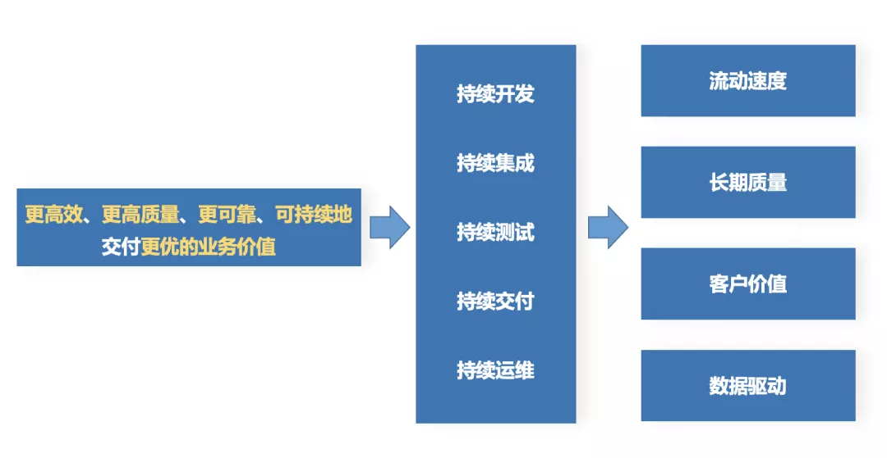
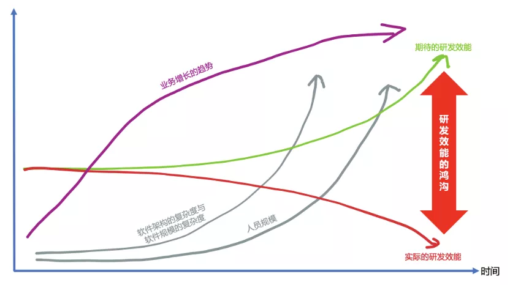
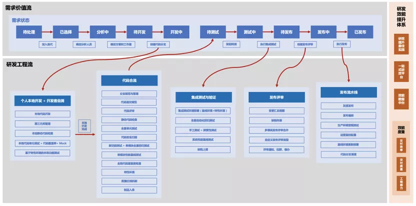
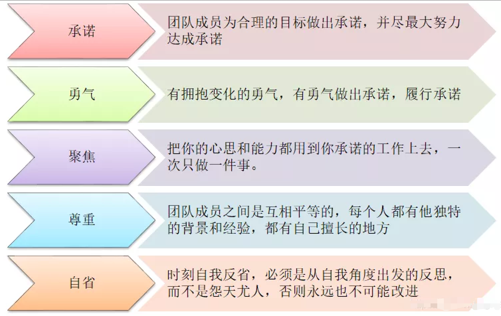
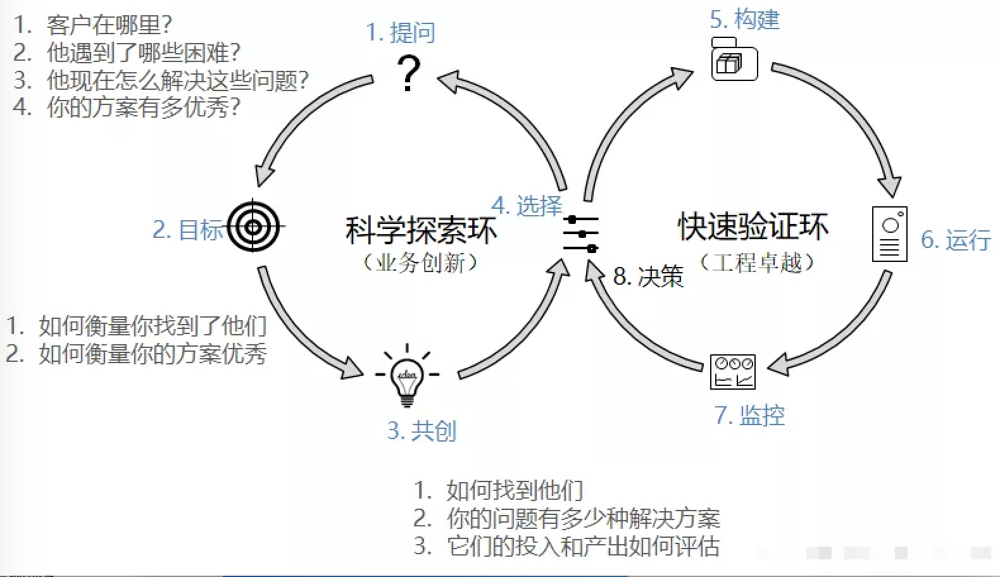
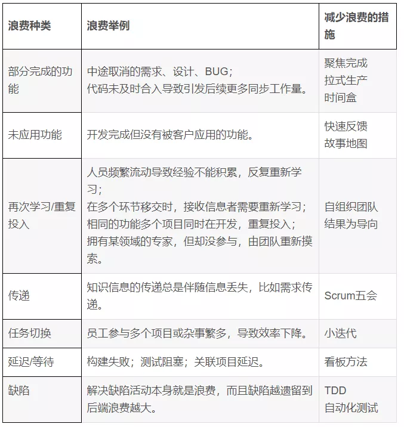
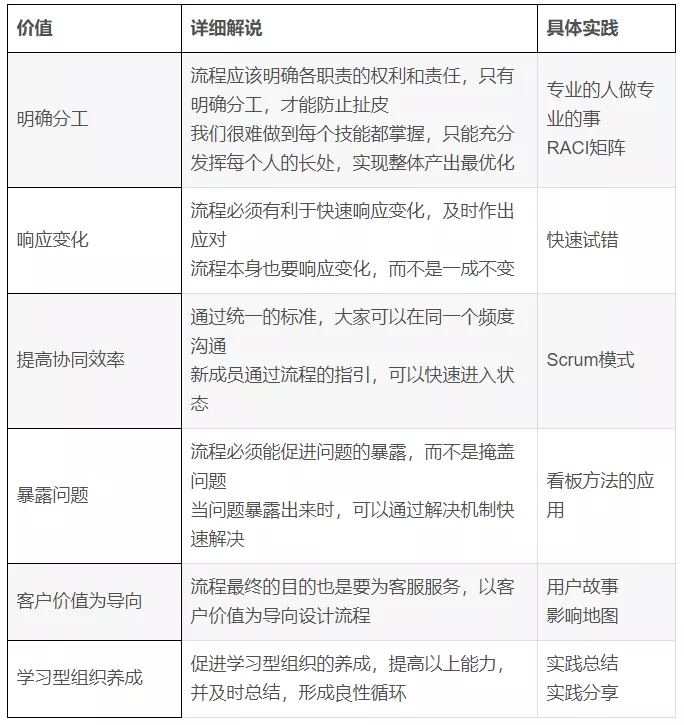
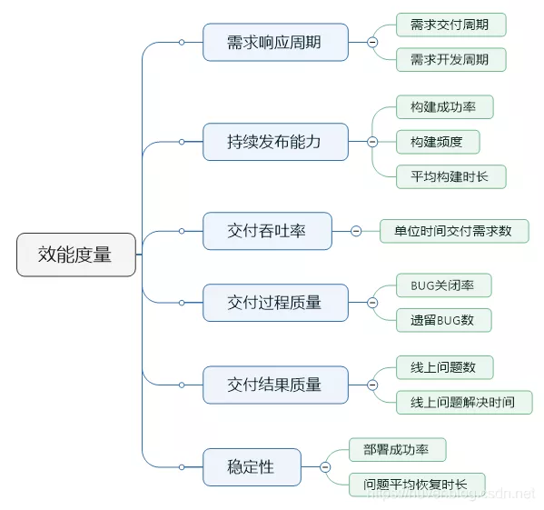

本文章来源于：<https://github.com/Zeb-D/my-review> ，请star 强力支持，你的支持，就是我的动力。

[TOC]

------

### 背景

目前写者也算在IT行业风起风落快10年了，年龄保密，关于研发效能话题，有自己经历过，也有自己发起过，也有道听途说过；

```
一个公司的生命周期，从前面几年属于创业、发展，再到后面求稳，或是稳中求胜或日落西山
```

```
怎么看大家此时的公司处于哪阶段，最简单最粗暴一点就是看公司的组织规模；
```

1、公司持续进人后，突然之间公司的组织架构多了个研发效能组织；

2、某团队招了个高P的某为、某里等管理人才；

3、之前的元老都是半路出身管理的，都向往成熟外面的管理模式，想功成身退释放下自己，或想扩团队，或发力；

4、最近几个月公司层面故障通告越来越多；


以上种种只是大众化的局部，我们看到的现象是：**只要努力搞，没有折腾不垮的团队**。

虽然有很多大厂研发效能做的还不错，成为了大家膜拜的对象，但是我们也看到很多“内卷”现象的发生。

经历了很多故事，我们更能谈谈自己的理解和感悟。但研发效能是目前互联网企业和传统软件企业都高度关注的领域；

我们会看到其中一种假象，似乎**只有推进了研发效能，才能提升研发团队的效率**，才能让自己在和友商的比拼中不至于输在起跑线上。


俗话说"好事多磨"，外面引进的管理模式肯定经过一些磨合最终才会形成公司本土化的管理方法论；

毕竟研发效能的实施没有捷径，需要摸着石头过河，肯定不会能像电影里面演得那样注定会有皆大欢喜的结局。

经历了风雨，不一定能看见彩虹，更有可能会得重感冒。

**研发效能问题今天解决不了，不要着急，因为明天同样也解决不了**。所以就让我们“放心大胆“地看看研发效能到底是如何磨合去搞垮一个团队的。

说白了，所有企业不管怎么折磨，都是围绕"如何打造一个更高效、更高质量、更可靠、可持续交付项目"这个话题。


### WHAT

什么是研发效能？很多复杂概念也不是定义出来的，而是逐步演化出来的，是先有现象再找到合适的表述。

关于效能二字，纵观人类发展史，就是生产力和生产效率不断提升的发展篇章，**到了数字化时代，软件研发效能的重要性被凸显了出来**。如果要用一句话来总结研发效能的话，我们会用“更高效、更高质量、更可靠、可持续地交付更优的业务价值”来总结。



解释一下其中几个关键概念：

- 更高效：价值的流动过程必须高效顺畅，阻力越小越好。
- 更高质量：如果质量不行，流动越快，死的也会越快。
- 更可靠：安全性和合规性要保障好。
- 可持续：输出不能时断时续，小步快跑才是正道，不要憋大招。
- 更优的业务价值：这是从需求层面来说的，你的交付物是不是真正解决了用户的本质问题。比如：“女生减肥不是本质问题，女生爱美才是”。可以体会一下。


在这个概念的引导下，我们**引出持续开发，持续集成，持续测试，持续交付和持续运维的理念，它们是研发效能落地的必要实践**。与此同时，我们还需要从流动速度，长期质量，客户价值以及数据驱动四个维度来对研发效能进行有效的度量。


### WHY

为什么发展期的公司开始搞研发效能？

#### **存在大量重复造轮子**

就像“中台”概念一样，现在很多大企业的产品线非常广，其中存在大量重复的轮子，

如果我们关注业务上的重复轮子，那么就是业务中台；

如果我们关注数据建设上的重复轮子，那么就是数据中台；

如果我们关注研发效能建设上的重复轮子，那就是研效平台，其实研效平台在某种程度上也可以称之为“研发效能中台”，

其目标是实现企业级跨产品跨项目的研发能力复用，避免原来每条产品线都在做研发效能所必须的“0 到 1”，没人有精力去关注更有价值的“1 到 n”。

现代化的研效平台会统一来打造组织级别通用研发能力的最佳实践平台。


#### **toC 产品已经趋向饱和**

从商业视角来看，现在 toC 产品已经趋向饱和，过去大量闲置时间等待被 APP 填满的红利时代已经一去不复返了，以前业务发展极快，那么用烧钱的方式（粗放式研发，人海战术）换取更快的市场占有率达到赢家通吃是最佳选择，那个时代关心的是软件产品输出，研发的效率都可以用钱填上。

而现在 toC 已经逐渐走向红海，同时研发的规模也比以往任何时候都要大，是时候要勒紧裤腰带过日子了，当开源（开源节流中的开源）遇到瓶颈了，节流就应该发挥作用。这个节流就是研发效能的提升，同样的资源，同样的时间来获得更多的产出。


#### **部分企业存在“谷仓困局”**

从组织架构层面看，很多企业都存在“谷仓困局”，研发各个环节内部可能已经做了优化，

但是**跨环节的协作可能就会有大量的流转与沟通成本，从而影响全局效率**。

基于流程优化，打破各个环节看不见的墙，去除不必要的等待，提升价值流动速度正是研发效能在流程优化层面试图解决的一大类问题。


### Depth Analysis

既然如此重要，那接下来的问题是研发效能是否真的能提高？

很不幸，我们的观点比较悲观。我们认为研发效能的绝对值随着以下因素的增长必然会变得越来越差，就像我的头发一样，随着时间的推移必然会越来越少一样。

- 软件架构本身的复杂度提升（微服务，服务网格等）
- 软件规模的不断增长（集群规模，数据规模等）
- 研发团队人员规模不断扩大引发沟通协作难度增长

所以，**我们能做的不是提升研发效能的绝对值，而是尽可能减缓研发效能恶化的程度，使其下降的不至于太快，努力保持现状就是成功。**





#### 如何**减缓研发效能恶化**

比如**鹅厂提出的“研发效能双流模型”这一概念**。双流模型从软件研发的各个阶段提出了研发效能提升的各种工程实践，并且倡导需求价值流和研发工程流的自动联动。



再比如菊厂...


#### Rashomon Effect

理想很丰满，但是现实很骨感，下面一起看看国内研发效能的各种乱象。

##### **迷信单点局部能力，忽略全局优化和拉通的重要性**

研发效能的单点能力其实都不缺，各个领域都有很多不错的垂直能力工具，但是把各个单点能力横向集成与拉通，能够从一站式全流程的维度设计和规划的研发效能成熟平台还是凤毛麟角。

现在国内很多在研效领域有投入的公司很多其实还在建设，甚至是重复建设单点能力的研效工具，这个思路在初期可行，但是单点改进的效果会随着时间收益递减，企业往往缺少从更高视角对研发效能进行整体规划的能力。

很多时候局部优化并不能带来全局优化，有时候还会是全局恶化。


##### **具有普适性的通用研发效能工具其实没有专属工具来的好用**

**既然打造了研发工具，那就需要到业务部门进行推广，让这些研效工具能够被业务部门使用起来**。

其实，很多比较大的业务团队在 CI/CD、测试与运维领域都有自己的人力投入，也开发和维护了不少能够切实满足当下业务的研发工具体系。

此时要把新打造的研效工具来替换业务部门原来的工具，肯定会遇到很强的阻力。

除非新的工具能够比老工具好10倍，用户才可能有意愿替换，但实际情况是新打造的工具为了考虑普适性很有可能还没有原来的工具好，再加上工具替换的学习成本，所以除非是管理层强压，否则推广成功的概率微乎其微。

即使是管理层强压，实际的执行也会大打折扣，接入但不实际使用的情况不在少数。


##### **用“伪”工程实践和“面子工程”来滥竽充数**

如果你去比较国内外研发效能工程实践的差距，你会发现国内公司和硅谷公司的差距还是相当明显的。但是当你逐项（比如单元测试，静态代码扫描，编译加速等）比较双方开展的具体工程实践时，你会惊讶地发现从实践条目的数量来说，国内公司的一点都不亚于硅谷公司，在某些领域甚至有过之而不及。

那为什么这个差距还会如此明显呢？我们认为这其中最关键的点在于，国内的很多工程实践是为了做而做，为的是“政治上的正确”，而不是从本质上认可这一工程实践的实际价值。

这里比较典型的例子就是代码评审和单元测试。虽然很多国内互联网大厂都在推进代码评审和单元测试的落地，但是在实际过程中往往都走偏了。

代码评审变成了一个流程，而实际的评审质量和效果无人问津，评审人的评审也不算工作量，也不担任何责任，这样的代码评审能有什么效果，结果可想而知。单元测试也沦为一种口号，都说要贯彻单测，但是在计划排期的时候压根没有给单测留任何的时间和人力资源，可想而知这样的单测是否能成功开展。

所以，国内公司缺的不是工程实践的多少，而是工程实践执行的深度。**不要用“伪”工程实践和“面子工程”来滥竽充数**。


##### **忽略研发效能工具体系的长尾效应**

再回到研效工具建设的话题上，很多时候管理团队希望能够打造一套一站式普遍适用的研发效能平台，希望公司内大部分业务都能顺利接入，这和想法的确非常好，但是不可否认的，研效平台和工具往往具有非标准的长尾效应，我们很难打造一套统一的研效解决方案来应对所有的业务研发需求，**各种业务研发流程的特殊性是不容忽视的**。

退一万步说，即使我们通过高度可配置化的流程引擎实现了统一研效解决方案，那么这样的系统会因为过于灵活，使用路径过多而易用性变得很差。这两者的矛盾是很难调和的。


##### **盲目跟风**

再来看看一些中小型研发团队，他们看到国内大厂在研效领域不约而同的重兵投入，所以也会跟风。他们往往试图通过引进大厂工具和大厂人才来作为研效的突破口，但实际的效果可能差强人意。

大厂的研效工具体系固然有其先进性，但是是否能够适配你的研发规模和流程是有待商榷的，同样的药给大象吃可以治病，而给你吃可能直接丧命。

很多时候研效工具应该被视为起点，而不是终点，就像你买了一辆跑车，你依旧不能成为赛车手。


##### **迷信外部专家**

引入大厂专家其实也是类似的逻辑，我常常会被问及这样的问题：“你之前主导的研效提升项目都获得了成功，如果请你过来，多久能搞定”？

这其实是一个无解的问题。

**一定程度上，投入大，周期就会短，但是，实施周期不会因为投入无限大而无限变短**。

这些专家可以帮你避开很多曾经踩过的坑，尽量少走弯路，犯过的错误不再次犯，

但是，适合自己的路子还是要靠自己走出来，拔苗助长只会损害长期利益。


##### **研效度量的罪与罚**

最后再来看看度量。研发效能的度量一直以来都是很敏感的话题。科学管理时代我们奉行“没有度量就没有改进”，但是数字时代这一命题是否依然成立需要我们的反思。

现实事物复杂而多面，**度量正是为描述和对比这些具象事实而采取的抽象和量化措施**，从某种意义上来说，度量的结果一定是片面的，反映部分事实。但没有银弹，也没有完美的效能度量。

数据本身不会骗人，但数据的呈现和解读却有很大的空间值得探索。那些不懂数据的人是糟糕的，而最最糟糕的人是那些只看数字的人。

当把度量变成一个指标游戏的时候，永远不要低估人们在追求指标方面“创造性”，总之我们不应该纯粹面向指标去开展工作，而应该看到指标背后更大的目标，或者是制定这些指标背后的真正动机。


##### 技术升级还是思维升级

总体来看，对于研发效能，我认为最重要的不是技术升级，而应该是思维升级，我们身处数字化的变革之中，需要转换的是自己的思维方式，我们需要将科学管理时代的思维彻底转为字节经济时代的思维。


#### Calm Thinking 

##### **工具效率的提升并没有减少我们的工作时长**

新工具新平台在帮助我们提升效率的同时，也不断增加着我们学习的成本。

用后端开发来举例子，以全家桶为基础的spring cloud工程化大幅度提高了后端开发的效率，

但与此同时开发工程师的学习成本却在成倍增加，“又更新了，实在学不动了”一定程度反映了开发的悲哀和无奈。


##### **技术的升级正在不断模糊工作和生活的边界**

早年时候的工作沟通除了面聊以外主要靠邮件，非工作时段老板给你发邮件你有各种正当理由不用及时回复，可是现在及时通讯工具 IM（那个消息已读提示，你懂的）再结合各种 ChatOps 实践，已经让工程师已经无法区分什么是工作什么是生活了，这难道是我们想要的吗？


**随着在研发效能领域的不断投入，会有越来越多的研效工具诞生，所有这些工具都使人与工作之间的链接更加紧密，人越来越像工具，而工具越来越像人**。我们之所以创造工具是想减轻我们自己的工作，但现实却很可能发展成，我们最终沦为被亲手创造的工具奴役。我们致力于的研发效能，究竟会成就我们，还是毁了我们？值得我们深入思考。


### HOW

任何生产力的提升都离不开这三个因素：人、流程和工具，少了其中任何一个因素都无法实现。

- 人，即思想，也就是古人说的“道”，道不同不相为谋，是制高点，也是高层建筑的基石。
- 流程，即方法，也是古人说的“法”。研发效能的提升，也就是要提高投入产出比，既要增加产出，也要减少消耗。
- 工具，即道具、器械，对应“器”。选对工具很重要，趁手的工具往往能起到事半功倍的效果。

#### **第一个要素：人**

- 思想的深度决定了生产力的高度。按照敏捷宣言，个体和交互胜过流程和工具，人的因素是最重要的，但人的思想在短期内又无法提升，需要长期不断投入。

- 我们可以从两个方面着手，逐渐改进：

- - 工程素养

    

  - 做事方法

**做事方法**

- 研发同学要形成PDCA的思维，任何事情都要有始有终，形成闭环
- 乔梁在《持续交付2.0》中提出的持续交付双环模型，我觉得是PDCA环的发展，可以应用到很多领域，比如流程改进
- 持续交付双环在流程改进中的应用




#### **第二个要素：流程**

流程的引入并不是为了给团队增加束缚，而是提高研发效能，即必须起到减少浪费，促进价值产生的作用



**促进价值产生**

流程必须促进价值的产生，即价值产生的催化剂



**流程改进**

- 流程改进一定要避免买椟还珠的行为，改进的目的是减少浪费，促进价值产生，而不是为了符合流程而走流程。
- 如果流程已经阻碍到价值的交付，那么就要考虑优化流程。


#### **第三个要素：工具**

- 工具是三个因素中最容易实现的，可以购买现成的，也可以企业自己开发，比如业界常用的有Jira、TFS、禅道、Tembition等，可以根据自身需求导入。
- 工具毕竟只是流程的载体，不能把心思都花在工具上，而忽略了人和流程，那就舍本逐末了。

**工具和人**

工具是人工作的道具，既要辅助人实现工作目标，也要把工作过程透明出来，方便干系人了解工作进展

所以工具的选型需要考虑几个因素：

- 组织复杂度
- 工具维护成本
- 是否能满足流程需要
- 是否方便获取状态报告

**工具和流程**

- 工具是流程的载体，流程只有整合到工具中才能更高效率的被执行，尤其是流转的自动化
- 正所谓术以载道，好的工具必须是符合企业文化，并能促进流程的自我改良的

**工具和度量**

- 度量是研发活动的镜子，只有完善的度量体系，才能清晰知道哪里存在弱项，哪里是我们改进的重点
- 缺少度量，研发过程必然不可见，更谈不上如何提升研发效能
- 而度量必须通过工具实现，否则度量的效率就会很低下，如果度量本身要花费大量工作，那就得不偿失

**度量原则**

- 度你所做，为优而量，这是度量的根本目标
- 简单，减少度量工作量
- 客观，不易受人为干涉
- 尽量不与考核挂钩

**如何考核**

既然说度量不与考核挂钩，那该如何采集考核数据？

建议从几个客观指标着手



**团队互评**

- 也可以采用团队匿名互评的方法
- 回顾会上，每个人给包括自己在内的所有人进行评价，包括：综合评分、做得好的、待改进点


