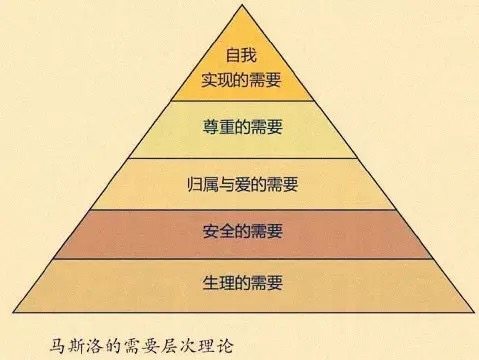
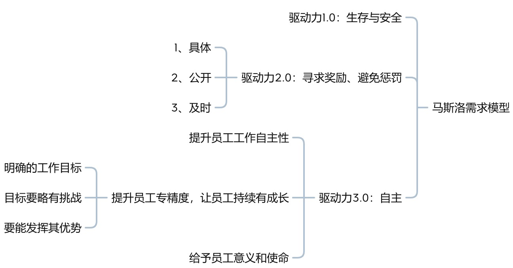

本文章来源于：<https://github.com/Zeb-D/my-review> ，请star 强力支持，你的支持，就是我的动力。

[TOC]

------

马斯洛需求层次理论是管理心理学中人际关系理论、群体动力理论、权威理论、需要层次理论、社会测量理论的五大理论支柱之一。

以往对马斯洛需求层次理论的理解很肤浅：人对需求是有层次的，层次间都有依赖关系。当低层次的需求被满足后，才会去考虑更高一层次的需求。

而且好像也没什么用处。知道之后既不能提升硬技能，也不能升职加薪。

# 马斯洛理论定义

通过《郭东白的架构课》的学习，了解到马斯洛理论的本意是：我们可能同时并行存在着多个需求，这些需求之间并不存在依赖或层次关系。

包含两个重点：

**第一点：不是需求有层次，而是动机有优先级**

如果这些需求得不到满足，那么它们各自会诱发动机。但**动机有优先级，且具备抢占性质**。所以任何时候，只有一个动机在主导着整个人的意识和行为。

**第二点：动机跃迁模型**

人有且只有一个主导动机。这个动机由人的内在需求所驱动，并独占且主导你当前的一切意识和行为，你整个人，包括你的视觉、听觉、嗅觉，你的思考、记忆、行为等。直到这个动机背后的需求被完全满足之后，更高层次的动机才可能进入主导位置。

学习了理论本意后，由于理论抽象度高，需要更具象的事才能更好地理解，经过反复思考，找到了一些日常工作中的常见的场景，可以用为进一步理解此理论的抓手。

# 指导架构

架构活动需要尊重和顺应人性，架构师必须洞察研发人员的人性，在方案设计和架构活动组织中充分考虑研发的人性，才能保障方案的正确性，以及方案的高效实施。

什么样的架构才算是尊重和顺应人性呢？不得不再次搬出当下两个流行的事物：中台和微服务

## 中台

对于中台概念，定义中台为企业级能力复用平台。

在做企业级业务架构时，做出来的模型，需要考虑两点：

1、凡是公用的部分，应该照顾到所有利益相关方的需求；

2、凡是已实现的功能都应该对新的需求方开放并支持必要的扩展。

部门利益是做企业级的最大障碍，跨越这个障碍是对业务架构师设计能力的最高挑战。

> 中台建设虽然需要兼顾各方的利益，但更多主要还是解决企业管理层对于公司长期生存与可持续发展的恐惧与焦虑问题

中台建设的这两个考虑点，似乎是郭东白架构课程中重要价值输出的浓缩版本。

前半段结合马斯洛理论，中台的建设通常都会伴随企业内的组织重构以及利益和职责的再分配，中台必然会触碰到前端业务团队利益，这自然威胁到了业务团队。

尤其很多公司建设中台是跟风式的，本身就没有明确的战略意图，相当于架构活动没有正确目标，甚至没有目标，更没有清晰的构建路径，冒然简单粗暴地下沉前端业务功能，让原本根错综复杂的前端业务团队缺失了安全感，按马斯洛理论，业务团队满足安全需求的动机占据主导位置，可以想象，整个中台的推进速度。

后半段则是任何企业活动的目标，都是为企业带来长期生存的优势。管理层、架构师都得考虑当下的活动是否真的带来生存优势。生存优势我简单理解为降本增效，ROI越高越有优势。

## 微服务

之前谈到微服务常会提到《康威定律与反康威定律》，随着近些年互联网行业的不景色，从以前的拆掉中台到现在的拆掉微服务。

康威定律有个常用示例：如果有四个小组合作开发一个编译器，那么你将得到一款具有四个步骤的编辑器。

结合马斯洛理论，每个小组都有了自己的一亩三分地，也就有了归属感和安全感，从人性角度，团队会更有活力、进取心和责任感。

# 技术管理

作为TL，要做三件重要事情。尤其激活团队。

TL如何激励团队？

都说现在00后是来整顿职场的，所以不能再像过去，员工以生存为目的，无条件接受资本主义压榨。

现在生活条件大大改善，对应马斯洛最底层需求已经完全满足。管理者怎么办呢？会通过内部激励机制，如晋升职级；和红线制度，明确惩罚事项。

有没有更高阶的方式方法呢？脱离上述的靠外部驱动。

马斯洛理论给出指导方针：让员工有更多的归属和尊重。激发他们内部需求。

# 总结

一个看似无用的理论，经过高人的讲解，可以感知到原来这个理论贯穿在每日生活的细节中。

马斯洛理论就是这样，不管是做架构还是做管理，只要有人参与的活动，都渗透着它的威力。