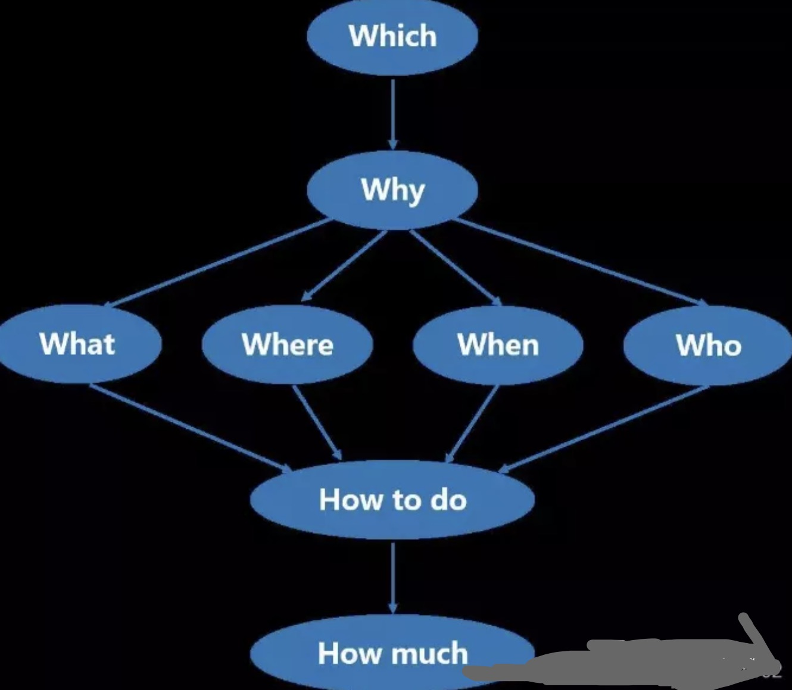
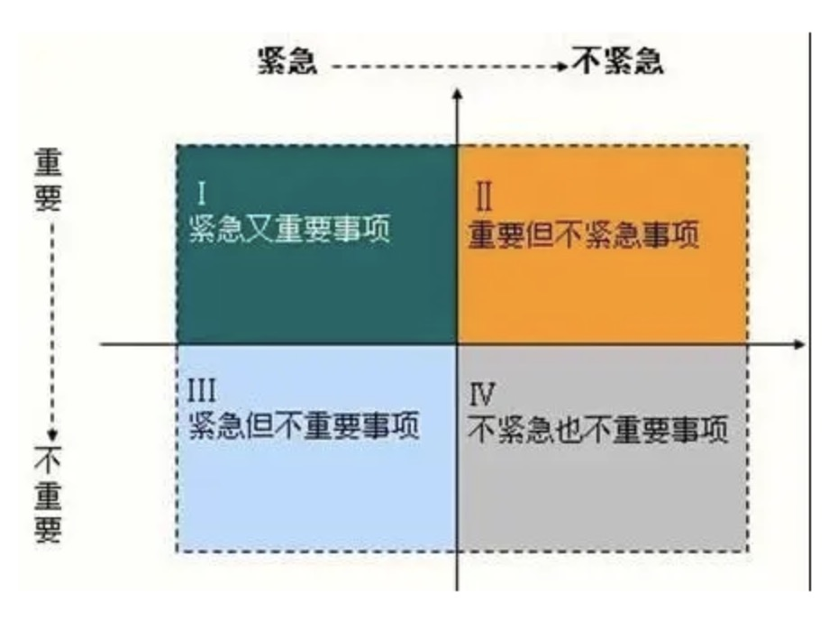

本文章来源于：<https://github.com/Zeb-D/my-review> ，请star 强力支持，你的支持，就是我的动力。

[TOC]

------

### 背景

项目管理七大常用工具工具：SWOT、PDCA、6W2H、SMART、WBS、时间管理、二八原则 。

### SWOT

. Strengths：优势

. Weaknesses：劣势

. Opportunities：机会.

. Threats：威胁

**优势**，是组织机构的内部因素，具体包括：有利的竞争态势；充足的财政来源；良好的企业形象；技术力量；规模经济；产品质量；市场份额；成本优势；广告攻势等。

**劣势**，也是组织机构的内部因素，具体包括：设备老化；管理混乱；缺少关键技术；研究开发落后；资金短缺；经营不善；产品积压；竞争力差等。

**机会**，是组织机构的外部因素，具体包括：新产品；新市场；新需求；外国市场壁垒解除；竞争对手失误等。

**威胁**，也是组织机构的外部因素，具体包括：新的竞争对手；替代产品增多；市场紧缩；行业政策变化；经济衰退；客户偏好改变；突发事件等。

### PDCA

. Plan：计划

. Do：执行

. Check：检查

. Action：处理

**1、计划阶段**。要通过市场调查、用户访问等，摸清用户对产品质量的要求，确定质量政策、质量目标和质量计划等。包括现状调查、分析、确定原因、制定计划。

**2、设计和执行阶段**。实施上一阶段所规定的内容。根据质量标准进行产品设计、试制、试验及计划执行前的人员培训。

**3、检查阶段**。主要是在计划执行过程之中或执行之后，检查执行情况，看是否符合计划的预期结果效果。

**4、处理阶段**。主要是根据检查结果，采取相应的措施。巩固成绩，把成功的经验尽可能纳入标准，进行标准化，遗留问题则转入下一个PDCA循环去解决。

### 6W2H

What：工作的内容和达成的目标

Why：做这项工作的原因

Who：参加这项工作的具体人员，以及负责人

When：在什么时间、什么时间段进行工作

Where：工作发生的地点

Which：哪一种方法或途径

How：用什么方法进行

How much：需要多少成本

**1、目标(which)**——选择对象公司选择什么样的道路？公司选择什么样的产品？

**2、原因(why )**——选择理由为什么要生产这个产品？能不能生产别的？我到底应该生产什么？

**3、对象(what)**——功能与本质这个产品的功能如何？它能满足哪些客户和人群的需求？

**4、场所(where)**——什么地点生产是在哪里干的？为什么偏偏要在这个地方干？换个地方行不行？到底应该在什么地方干？这是选择工作场所应该考虑的。

**5、时间和程序(when)**——什么时候时间与节奏的把握是十分重要的，例如制造企业的just-in-time理念、房地产大盘的分期开发、分期开盘理念。

**6、组织或人(who)**——责任单位、责任人这个事情是谁在干？为什么要让他干？

**7、如何做（how to do）**——如何提高效率如何提高效率？最简单的法则就是采用标准化产品。如果公司的组织比较完备，那么是否还可以采取“帕累托改进？”如果公司的组织还不够完善，是否可以采用“卡尔多-希克斯改进”

**8、价值(how much)**——性价比如何？三十幅共一毂，当其无，有车之用。埏埴以为器，当其无，有器之用。凿户牖以为室，当其无，有室之用。故有之以为利，无之以为用。万物皆有其价值，可以利用，物与物的交换，以价值为基础，有可以换无，无可以换有，一切取决于个人心中的那个性价比。

### SMART

. Specific—— 具体的

. Measurable—— 可测量的

. Attainable ——可达到的

. Relevant—— 相关的

. Time based——时间的

**S**代表具体( **Specific**)，指绩效考核要切中特定的工作指标，不能笼统；

**M**代表可度量( **Measurable**)，指绩效指标是数量化或者行为化的，验证这些绩效指标的数据或者信息是可以获得的；

**A**代表可实现( **Attainable**)，指绩效指标在付出努力的情况下可以实现，避免设立过高或过低的目标；

**R**代表相关性( **Relevant**），指绩效指标是与工作的其它目标是相关联的；绩效指标是与本职工作相关联的；

**T**代表有时限( **Time-bound**)，注重完成绩效指标的特定期限。

### WBS

即Work Breakdown Structure，如何进行WBS分解：目标→任务→工作→活动。

WBS是一个描述思路的规划和设计工具。它帮助项目经理和项目团队确定和有效地管理项目的工作。

1. WBS是一个清晰地表示各项目工作之间的相互联系的结构设计工具。
2. WBS是一个展现项目全貌，详细说明为完成项目所必须完成的各项工作的计划工具。
3. WBS定义了里程碑事件，可以向高级管理层和客户报告项目完成情况，作为项目状况的报告工具。
4. WBS防止遗漏项目的可交付成果。
5. WBS帮助项目经理关注项目目标和澄清职责。
6. WBS建立可视化的项目可交付成果，以便估算工作量和分配工作。
7. WBS帮助改进时间、成本和资源估计的准确度。
8. WBS帮助项目团队的建立和获得项目人员的承诺。
9. WBS为绩效测量和项目控制定义一个基准。
10. WBS辅助沟通清晰的工作责任。
11. WBS为其他项目计划的制定建立框架。
12. WBS帮助分析项目的最初风险。

### 时间管理

A、重要且紧急

B、重要不紧急

C、紧急不重要

D、不重要不紧急

1、有计划地使用时间。

2、目标明确。

3、将要做的事情根据优先程度分先后顺序。

4、将一天从早到晚要做的事情进行罗列。

5、要具有灵活性。

6、遵循你的生物钟。

7、做好的事情要比把事情做好更重要。

8、区分紧急事务与重要事务。

9、对所有没有意义的事情采用有意忽略的技巧。

10、不要想成为完美主义者。

11、 巧妙地拖延。

12、学会说"不"。

13、奖赏自己。

### 二八原则

巴列特定律：“总结果的80%是由总消耗时间中的20%所形成的。” 按事情的“重要程度”编排事务优先次序的准则是建立在“重要的少数与琐碎的多数”的原理的基础上。

(1) “二八管理法则”，企业主要抓好20%的骨干力量的管理，再以20%的少数带动80%的多数员工，以提高企业效率;

(2) “二八决策法则”，抓住企业普遍问题中的最关键性的问题进行决策，以达到纲举目张的效应;

(3) “二八融资法则”，管理者要将有限的资金投入到经营的重点项目，以此不断优化资金投向，提高资金使用效率;

(4) “二八营销法则”，经营者要抓住20%的重点商品与重点用户，渗透营销，牵一发而动全身

