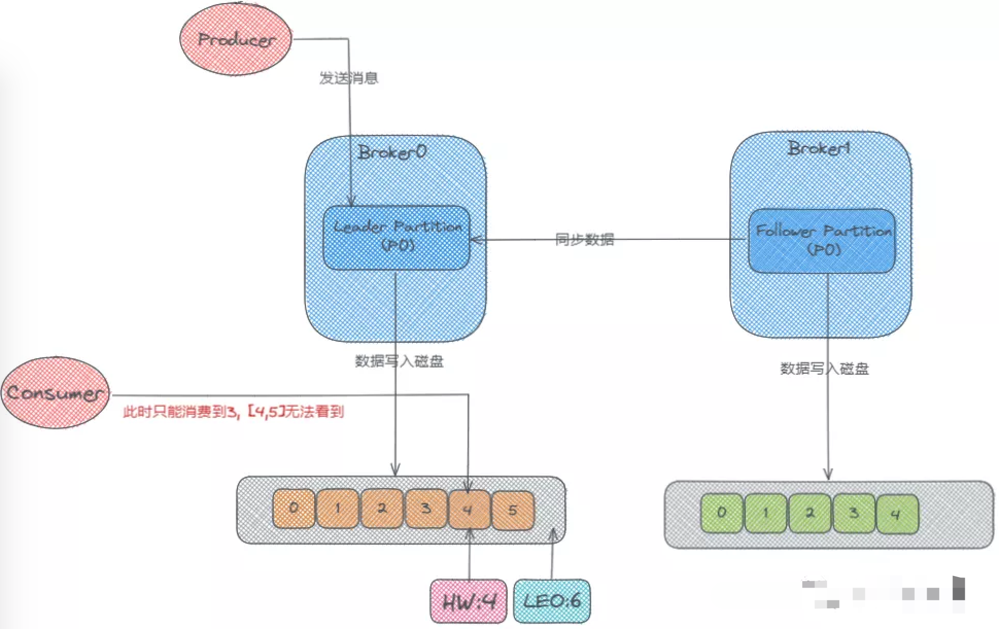
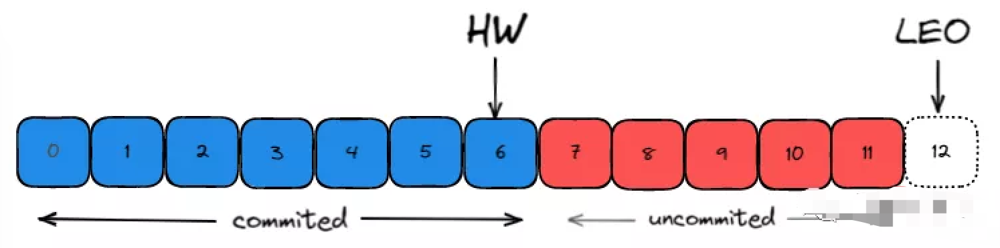
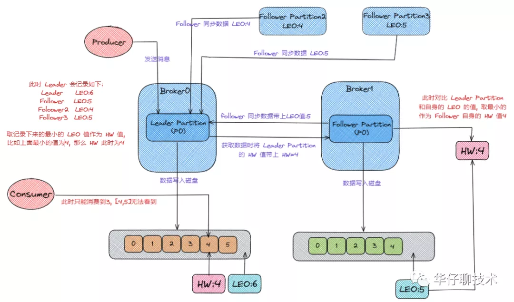
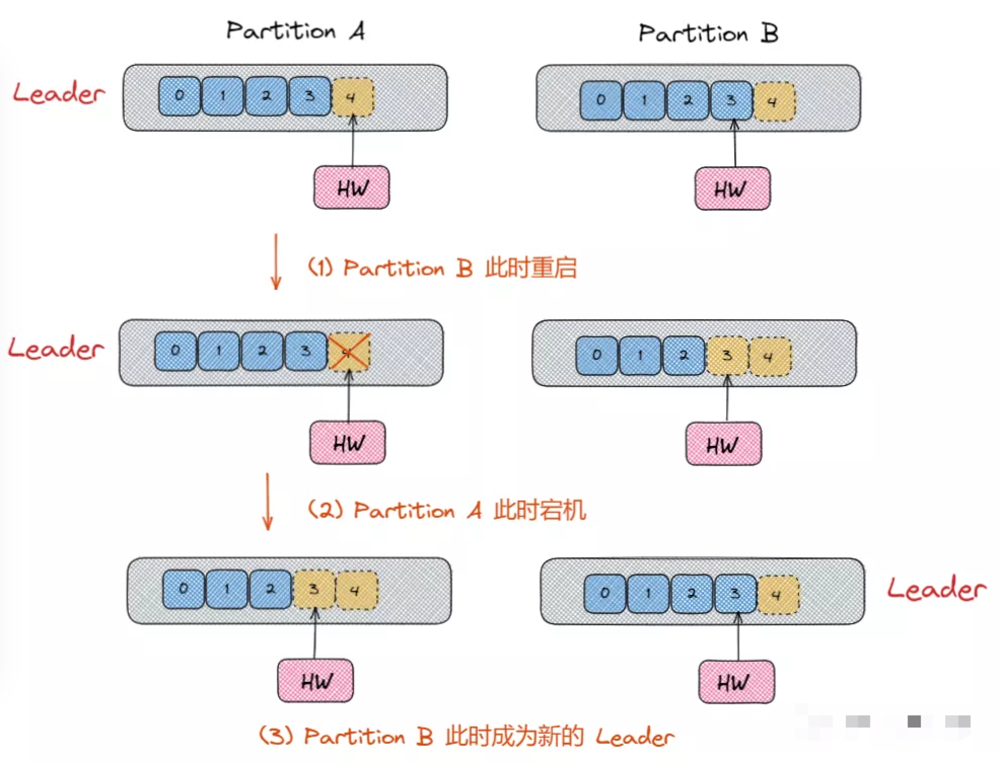
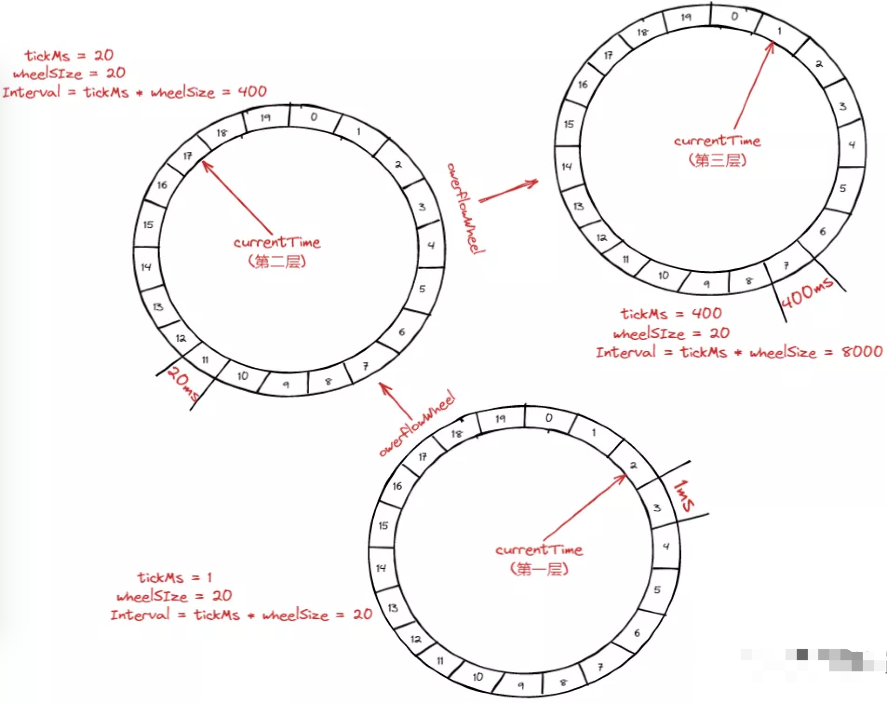
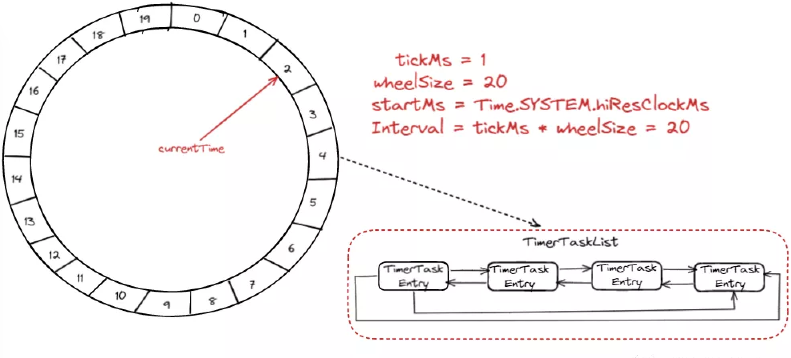

本文章来源于：<https://github.com/Zeb-D/my-review> ，请star 强力支持，你的支持，就是我的动力。

[TOC]

------

### 背景

Kafka 控制器组件(Controller) 即 Broker, 是 Kafka 的核心组件。它的主要作用是在 ZooKeeper 的帮助下管理和协调整个 Kafka 集群。集群中任意一台 Broker(集群节点) 都能充当控制器的角色，但是在运行过程中，只能有一个 Broker 成为控制器，来执行管理和协调的职责。换句话说，每个正常运转的 Kafka 集群，在任意时刻都有且只有一个控制器。

Controller控制器随着Broker机器节点故障会进行转移称为Failover，那么期间partition副本机制又会发生什么？

期间它们又是怎么保证多副本数据一致性呢？

### Controller控制器

首先 Kafka 是依赖 Zookeeper 来维护集群成员的信息：

- Kafka 使用 Zookeeper 的临时节点来选举 Controller
- Zookeeper 在 Broker 加入集群或退出集群时通知 Controller
- Controller 负责在 Broker 加入或离开集群时进行分区 Leader 选举

#### 控制器作用

控制器在 Kafka 中是起协调作用的组件，那么控制器的作用大致可以分为 5 种：

1) Topic管理这里说的Topic管理，是指控制器帮助我们完成对 Kafka 主题的创建、删除以及分区增加的操作, 大部分的后台工作都是控制器来完成的。

2) 分区重分配

   当一个新的 broker 刚加入集群时，不会自动地分担己有 topic 的负载，它只会对后续新增的 topic 生效。

     如果要让新增 broker 为己有的 topic 服务，用户必须手动地调整现有的 topic 的分区分布，将一部分分区搬移到新增 broker 上。这就是所谓的分区重分配`reassignment`操作。

     除了处理 broker 扩容导致的不均衡之外，再均衡还能用于处理 broker 存储负载不均衡的情况，在单个或多个 broker 之间的日志目录之间重新分配分区。用于解决多个代理之间的存储负载不平衡。

3) Leader选举

   触发分区 leader 选举的几种场景：

   - **Offline**：

     创建新分区或分区失去现有 leader

   - **Reassign**：

     用户执行重分配操作

   - **PreferredReplica**：

     将 leader 迁移回首选副本

   - **ControlledShutdown**：

     分区的现有 leader 即将下线

     当上述几种情况发生时，Controller 会遍历所有相关的主题分区并为其指定新的 Leader。然后向所有包含相关主题分区的 Broker 发送更新请求，其中包含了最新的 Leader 与 Follower 副本分配信息。待更新完毕后，新 Leader 会开始处理来自生产者和消费者的请求，而 Follower 开始从新 Leader 那里复制消息。

4) 集群成员管理

   这是控制器提供的集群成员管理功能, 主要包括自动检测新增 Broker、Broker 主动关闭及被动宕机, 而这种自动检测主要是依赖于 Watch 通知功能和 ZooKeeper 临时节点组合实现的。

      比如，控制器组件会利用 Watch 机制 检查 ZooKeeper 的 /brokers/ids 节点下的子节点数量变更。目前，当有新 Broker 启动后，它会在 /brokers 下创建 临时的 znode 节点。一旦创建完毕，ZooKeeper 会通过 Watch 机制将消息通知推送给控制器，这样，控制器就能自动地感知到这个变化。

5) 提供数据服务

   控制器会向其他 Broker 提供数据服务。控制器上保存了最全的集群元数据信息，其他所有 Broker 会定期接收控制器发来的元数据更新请求，从而更新其内存中的缓存数据。

   

#### 控制器数据分布

我们就详细来聊聊，控制器中到底有哪些数据, 如下表所示。

| **分类 **        | **数据描述 **                        |
| ---------------- | ------------------------------------ |
| Broker相关       | 当前存活的broker列表                 |
|                  | 正在关闭中的broker列表               |
|                  | 获取某个broker上的所有分区           |
|                  | 某组broker上的所有副本               |
| Topic相关        | topic列表                            |
|                  | 某个topic的所有分区和所有副本        |
|                  | 移除某个topic的所有信息              |
|                  | 每个分区的Leader和ISR信息            |
| 运维任务副本相关 | 正在进行的Preferred Leader选举的分区 |
|                  | 当前存活的所有副本                   |
|                  | 分配给每个分区的副本列表             |
|                  | 正在进行重分配的分区列表             |
|                  | 某组分区下的所有副本                 |

   从上面表格可以看出,存储的大概有3大类:

- 所有topic信息。包括具体的分区信息，比如 Leader 副本是谁，ISR 集合中有哪些副本等。
- 所有 Broker 信息。包括当前都有哪些运行中的 Broker，哪些正在关闭中的 Broker 等。
- 涉及运维任务的副本分区。包括当前正在进行 Preferred Leader选举以及分区重分配的分区列表等。

#### 控制器故障转移

在 Kafka 集群运行过程中，只能有一台 Broker 充当控制器的角色，这就会存在**单点故障**的风险，那么Kafka 是如何应对单点故障的呢？其实 Kafka 为控制器提供故障转移功能，即**Failover**。

**故障转移指的是，当运行中的控制器突然宕机时，Kafka 能够快速地感知到，并立即启用备用控制器来代替之前失败的控制器**。这个过程就被称为 **Failover**，该过程是自动完成的，无需人工干预。

> 比如在最开始时候，Broker 0 是控制器。
>
> 当 Broker 0 被检测宕机后，ZooKeeper 通过 Watch 机制感知到并删除了 /controller 临时节点。
>
> 之后，所有还存活的 Broker 开始竞选新的控制器。
>
> 这时 Broker 3 最终赢得了选举，成功地在 ZooKeeper 上重建了 /controller 临时节点。
>
> Broker 3 会从 ZooKeeper 中读取集群元数据信息，并初始化到自己的缓存中。
>
> 控制器的 Failover 完成，这时候就可以正常工作了。

------

### Partition Replica同步机制

首先这里有两个Broker，也就是两台服务器，然后它们的分区中分别存储了两个 p0 的副本，一个是 Leader，一个是 Follower, 此时生产者开始往 Leader Partition 发送数据，数据最终写到磁盘上的。

然后 Follower 会从 Leader那里去同步数据，Follower上的数据也会写到磁盘上。

注： Follower 是先从 Leader 那去同步然后再写入磁盘的，所以它磁盘上面的数据肯定会比 Leader 的那块少一些。

这就是分布式数据一致性问题，备份冗余就会发生这种问题；

#### HW和LEO机制

日志复制中的一些重要偏移 (offset) 概念：

- 起始位移**`base offset`**：副本中所含第一条消息的 offset
- 高水位**`high watermark`**：副本最新一条己提交消息的 offset
- 日志末端位移**`log end offset`**：副本中下一条待写入消息的 offset

  在 Kafka 中高水位的作用主要有2个:

- 用来标识分区下的哪些消息是可以被消费者消费的。
- 协助 Kafka 完成副本数据同步

  而LEO一个重要作用就是用来更新HW:

- 如果 Follower 和 Leader 的 LEO 数据同步了, 那么 HW 就可以更新了。
- HW 之前的消息数据对消费者是可见的, 属于 commited 状态, HW 之后的消息数据对消费者是不可见的。

每个副本会同时维护 HW 与 LEO 值：

- Leader 保证只有 HW 及其之前的消息，才对消费者是可见的。
- Follower 宕机后重启时会对其日志截断，只保留 HW 及其之前的日志消息（新版本有改动）
- 对于日志末端位移, 即 Log End Offset (LEO)。它表示副本写入下一条消息的位移值。注意: 数字 12 所在的方框是虚线，说明这个副本当前只有 12 条消息，位移值是从 0 到 11，下一条新消息的位移是 12。显然，介于高水位和 LEO 之间的消息就属于未提交消息。**即同一个副本对象，其高水位值不会大于 LEO 值。**
- 高水位和 LEO 是副本对象的两个重要属性。Kafka 使用 Leader 副本的高水位来定义所在分区的高水位。即分区的高水位就是其 Leader 副本的高水位。

#### HW 和 LEO 更新机制

从上面讲解我们知道了每个副本对象都保存了一组HW值和 LEO 值，但实际上，在 Leader 副本所在的 Broker 上，还保存了其他 Follower 副本的 LEO 值。

> 假设：Broker 0 上保存了某分区的 Leader 副本和所有 Follower 副本的 LEO 值，而 Broker 1 上仅仅保存了该分区的某个 Follower 副本。
>
> Kafka 副本机制在运行过程中，会更新 Broker 1 上 Follower 副本的高水位和 LEO 值，同时也会更新 Broker 0 上 Leader 副本的高水位和 LEO 以及所有 Follower 副本的 LEO，但它不会更新所有 Follower 的高水位值

Kafka之所以要在 Broker 0 上保存这些所有 Follower 副本, 就是为了帮助 Leader 副本确定其高水位，也就是分区高水位。

接下来,我们从Leader 副本 和 Follower 副本两个维度，来总结一下高水位和 LEO 的更新机制。

首先 Follower 在从 Leader 同步数据的同时会带上自己的 LEO 的值，可是在**实际情况中有可能p0的副本可能会是多个**。它们也从 Leader Partition 同步数据并带上自己的LEO。**Leader Partition 就会记录这些 Follower 同步过来的 LEO，然后取最小的 LEO 值作为 HW 值** **。**

之所以要这么做是为了保证如果 Leader Partition 宕机时，集群会从其它的 Follower Partition 里面选举出一个新的 Leader Partition。这时候无论选举了哪一个节点作为 Leader，都能保证存在当前待消费的数据,保证数据的安全性。

那么此时 Follower 自身 HW 的值如何确定，即 **Follower获取数据时也会带上 Leader Partition 的 HW 的值，然后和自身的 LEO 值取一个较小的值作为自身的 HW 值** 。

#### HW 和 LEO 更新问题

我们知道，**Follower 副本的 HW 更新需要一轮额外的拉取请求才能实现**。如果把上一小节图中例子扩展到更多个 Follower 副本，也许需要更多轮拉取请求。

也就是说，Leader 副本 HW 更新和 Follower 副本 HW 更新在时间上是存在错配的。**这种错配是很多“数据丢失”或“数据不一致”问题的根源**。

我们来分析下，这种机制为什么会发生数据不一致的问题：

单纯依靠 HW 是怎么造成数据丢失的？

一开始时，Partition A 和Partition  B 都处于正常状态，A 是 Leader Partition 。

现在我们假设 Leader Partition  和 Follower Partition 都写入了这4条消息，而且 Leader Partition 的 HW 已经更新了，但 Follower Partition 的 HW 还未更新(这种情况是可能能会发生的)。

上面说过，Follower 的 HW 更新与 Leader 的 HW 是存在时间错配的。

如果此时 Partition B 所在的 Broker 宕机，当它重启回来后，Partition B 会执行日志截断操作，将 LEO 值调整为之前的 HW 值，也就是 3。即位移值为 3 的那条消息被副本 B 从磁盘中删除，此时副本 B 的底层磁盘文件中只保存有 3 条消息，即位移值为 [0,1,2] 对应的消息。

当执行完截断操作后，Partition  B 开始从 Partition  A 拉取消息，执行正常的消息同步。如果就在这个时候，Partition  A 所在的 Broker 宕机了，那么 Kafka 就很无奈，只能让Partition B 成为新的 Leader，此时，当 Partition A 回来后，需要执行相同的日志截断操作，即将 HW 调整为与 Partition B 相同的值，也就是 3。这样操作之后，位移值为 3 的那条消息就从这两个 Partition 中被永远地抹掉了。

严格来说，这个场景发生的前提必须是**Broker 端参数 min.insync.replicas 设置为 1**。

此时一旦消息被写入到 Leader 副本的磁盘，就会被认为是“commited状态”，但因存在**时间错配**问题导致 Follower 的 HW 更新是有滞后的。

如果在这个短暂的滞后时间内，接连发生 Broker 宕机，那么这类数据的丢失就是无法避免的。

#### Leader Epoch 机制

这种时间错配是很多“数据丢失”或“数据不一致”问题的根源。因此社区在 0.11 版本正式引入了 **Leader Epoch** 概念，来规避因HW 更新错配导致的各种不一致问题。

所谓 Leader Epoch，我们大致可以认为是 Leader 版本。它由两部分数据组成。

- Epoch: 一个单调递增的版本号。每当副本 Leader 权发生变更时，都会增加该版本号。小版本号的 Leader 被认为是过期 Leader，不能再行使 Leader 权力。
- 起始位移（Start Offset）: Leader 副本在该 Epoch 值上写入的首条消息的位移。

Kafka Broker 会在内存中为每个分区都缓存 Leader Epoch 数据，同时它还会定期地将这些信息**持久化到一个 checkpoint 文件**中。

当 Leader Partition 写入消息到磁盘时，Broker 会尝试更新这部分缓存。

如果该 Leader 是首次写入消息，那么 Broker 会向缓存中增加一个 Leader Epoch 条目，否则就不做更新。这样，每次有 Leader 变更时，新的 Leader 副本会查询这部分缓存，取出对应的 Leader Epoch 的起始位移，以避免数据丢失和不一致的情况。

接下来, 我们来看下如何利用 Leader Epoch 机制来规避这种数据丢失。总结如下图所示:

------

### 延迟任务时间轮机制

Kafka提供了一种延迟任务, 大家知道在 Kafka 中存在着大量的延时操作，比如延迟生产，延迟拉取，延迟删除等，这些延时操作并不是基于 JDK 自带的 Timer 或者 DelayQueue 实现，而是**基于时间轮的概念自己实现了一个延时定时器**；

> JDK 中 Timer 和 DelayQueue 的插入和删除操作的平均时间复杂度为O(nlogn), 并不能满足 Kafka 的高性能要求,而基于时间轮可以将插入和删除操作的时间复杂度都降为 O(1)。

谈到延迟任务调度，最具高并发设计之一是时间轮机制，比如曾经响及一时的框架`disruptor`;

我们先来一张市面上常见的一种层级时间轮（每层时间轮负责的范围及粒度上不一样）：

如上图：

- 第一层时间轮：`tickMs＝ 1ms 、wheelSize=20 、interval=20ms`。
- 第二层时间轮的`tickMs` 为第一层时间轮的`interval`，即20ms，每一层时间轮的`wheelSize`是固定的，都是20，那么第二层时间轮的总体时间跨度就是400ms。
- 依次类推，第三层的时间轮的**`interval`**为400ms，那么总体时间跨度就是8000ms。

一个新的定时任务远远超过了当前的总体时间范围，那么就会发到上层时间轮中；

------

kafka中的具体执行的时间轮是一个存储定时任务的环形队列，底层采用数组实现，

数组中的每个元素可以存放一个定时任务列表（TimerTaskList），TimerTaskList是一个环形的双向链表，链表中的每个元素TimerTaskEntry封装了一个真正的定时任务TimerTask。

时间轮由固定格数（wheelSize）的时间格组成，每一格都代表当前时间轮的基本时间跨度（tickMs），整个时间轮的总体时间跨度（**interval**）就是 **wheelSize\*tickMs**。

时间轮还有一个表盘指针（**currentTime**），其值是**tickMs**的整数倍，用来表示时间轮当前所处的时间，表示当前需要处理的时间格对应的**TimeTaskList** 中的所有任务。

时间轮的**`tickMs`**为1ms，**`wheelSize`**等于20，总体时间跨度**`interval`**就是20ms，初始情况下**`currentTime`**指向时间格0。

此时有一个定时为2ms的任务插进来，就会放到时间格为2的**`TimeTaskList`**中，当**`currentTime`**指向时间格2时，就需要执行时间格为2对应的**`TimeTaskList`**中的任务。

此时若又一个定时为8ms的任务插进来，则会放在时间格10中。

当**`currentTime`**指向时间格10时，同理执行对应的任务。

如果此时又插入了一个定时19ms的任务怎么办呢？

新来的**`TimerTaskEntry`**会复用原来的**`TimerTaskList`**，所以它会插入到原本已经到期的时间格1中。

只要时间范围还在该层时间轮中，简单理解把任务往前放，总之，整个时间轮的跨度是不会变的，随着**`currentTime`**的不断推进，当前时间轮所能处理的时间段也在不断后移，总体时间范围就是**`currentTime`**和**`currentTime + interval`**之间。

