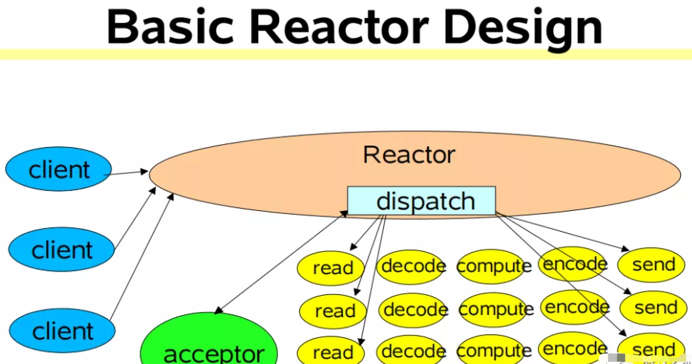

本文章来源于：<https://github.com/Zeb-D/my-review> ，请star 强力支持，你的支持，就是我的动力。

[TOC]

------

### 一、背景

在[kafka-三高架构设计.md](kafka-三高架构设计.md)中高并发小节中多次突出了Reactor多路复用NIO模型，**Acceptor线程**线程上面绑定了**OP_ACCEPT事件** NIO Selector，然后组装成请求轮询放入多个Processor线程去Selector链接请求的**OP_READ事件** 等等流程（细节可看[高并发网络设计](kafka-三高架构设计.md#高并发网络设计)）;


在高性能网络编程领域，经常能看到一个非常著名的模式——Reactor模式。

那么何为「**Reactor模式**」，首先它是基于事件驱动的，有一个或多个并发输入源，有一个Service Handler，有多个Request Handler；这个Service Handler会同步的将输入的请求轮询地分发给相应的Request Handler进行处理。

> 借助于 Doug Lea（就是那位让人无限景仰的大爷）的 "Scalable IO in Java" 中讲述的Reactor模式。
>
> "Scalable IO in Java" 的地址是：http://gee.cs.oswego.edu/dl/cpjslides/nio.pdf

Reactor 模式特别适合应用于处理多个客户端并发向服务器端发送请求的场景；

> Netty框架体现出Reactor这种事件处理模式




支持多个客户端会发送请求给到 Reactor。Reactor 有个请求分发线程 Dispatcher，也就是图中的绿色的 Acceptor，它会将不同的请求下分发到多个工作线程中处理。

在这个架构中，Acceptor 线程只是用来进行请求分发，所以非常轻量级，因此会有很高的吞吐量。而这些工作线程可以根据实际系统负载情况动态调节系统负载能力，从而达到请求处理的平衡性。


Kafka 系统架构采用这样的架构设计方案会不会还是有什么问题，有没有哪个环节会出现系统性能瓶颈呢？ 

对于 Kafka 这种超高并发系统来说，一个 Selector 多路复用器是 Hold 不住的，从上图可以得出，我们监听这些连接、接收请求、处理响应结果都是同一个 Selector 在进行处理，很容易成为系统性能瓶颈。


### 高并发网络架构

Kafka基于常见的Reactor进行了各个局部优化，抽象一个通用的裸架构：


这里多引入了一个多 Selector 处理队列，第一层的 Selector(acceptor) 只负责监听连接，当请求量超级大的时候，第一个 Selector 是不会成为瓶颈， 这里可以大可放心， 这时候它的工作非常单一，是完全能 hold 住的。

对于接收请求、处理请求、返回状态操作都会交由多 Selector 处理队列，也体现了事件驱动IO处理；


#### NIO 通讯机制

我们先从整体上看一下完整的网络通信层架构，如下图所示：


1.Kafka 网络通信架构中用到的组件主要由两大部分构成：SocketServer 和 RequestHandlerPool。

2.SocketServer 组件是 Kafka 超高并发网络通信层中最重要的子模块。它包含 Acceptor 线程、Processor 线程和 RequestChannel 等对象，都是网络通信的重要组成部分。它主要实现了 Reactor 设计模式，主要用来处理外部多个 Clients（这里的 Clients 可能包含 Producer、Consumer 或其他 Broker）的并发请求，并负责将处理结果封装进 Response 中，返还给 Clients。

3.RequestHandlerPool 组件就是我们常说的 I/O 工作线程池，里面定义了若干个 I/O 线程，主要用来执行真实的请求处理逻辑。

> 注意的是：跟 RequestHandler 相比， 上面所说的Acceptor、Processor 线程 还有 RequestChannel 等都不做请求处理， 它们只是请求和响应的「搬运工」。


接下来我们来具体聊聊SocketServer中的实现原理；

------

#### Acceptor 线程

> 以Kafka 2.5版本，源码位置：
>
> https://github.com/apache/kafka/blob/2.5.0-rc3/core/src/main/scala/kafka/network/SocketServer.scala

在经典的 Reactor 设计模式有个 「Dispatcher」 的角色，主要用来接收外部请求并分发给下面的实际处理线程。通过上面分析我们知道在 Kafka 网络架构设计中，这个 Dispatcher 就是「Acceptor 线程」。 

Acceptor 线程是用来接收和创建外部 TCP 连接的线程。在Broker 端每个 SocketServer 实例只会创建一个 Acceptor 线程。它的主要功能就是创建连接，并将接收到的 Request 请求传递给下游的 Processor 线程处理。

```scala
/**
 * Thread that accepts and configures new connections. There is one of these per endpoint.
 */
private[kafka] class Acceptor(val endPoint: EndPoint,
                              val sendBufferSize: Int,
                              val recvBufferSize: Int,
                              brokerId: Int,
                              connectionQuotas: ConnectionQuotas,
                              metricPrefix: String) extends AbstractServerThread(connectionQuotas) with KafkaMetricsGroup {
  // 1. 创建底层的NIO Selector对象，用来监听连接创建请求、读写请求等
  private val nioSelector = NSelector.open()
  // 2. Broker端创建对应的ServerSocketChannel实例,然后将Channel注册到Selector对象上
  val serverChannel = openServerSocket(endPoint.host, endPoint.port)
  // 3. 创建Processor线程池
  private val processors = new ArrayBuffer[Processor]()
  ......
  /**
   * Accept loop that checks for new connection attempts
   */
  def run(): Unit = {
    //注册OP_ACCEPT事件
    serverChannel.register(nioSelector, SelectionKey.OP_ACCEPT)
    // 等待Acceptor线程启动完成
    startupComplete()
    try {
      // 当前使用的Processor序号，从0开始
      var currentProcessorIndex = 0
      while (isRunning) {
        try {
          // 每500毫秒获取一次就绪I/O事件
          val ready = nioSelector.select(500)
          // 如果有I/O事件准备就绪
          if (ready > 0) {
           ........
                  // 调用accept方法创建Socket连接
                  accept(key).foreach { socketChannel =>
                  ........
                      // 指定由哪个Processor线程进行处理
                      processor = synchronized {
                        .........
                        processors(currentProcessorIndex)
                      }
                      // 更新Processor线程序号
                      currentProcessorIndex += 1
                    }        
      .........
    }
  }
```

Acceptor 线程中三个非常关键且重要的属性和方法：

这里重点看下 Acceptor 线程中三个非常关键且重要的属性和方法：

- nioSelector：它就是我们所熟悉的 Java NIO 库中的 Selector 对象实例，所有网络通信组件实现 Java NIO 机制的基础。
- processors：通过源码我们可以知道在Acceptor 线程在初始化时，需要创建对应的 Processor 线程池。由此可以得出，Processor 线程是在 Acceptor 线程中管理和维护的。 
- run方法：它是处理 Reactor 模式中分发逻辑的主要实现方法。

可以看出 Acceptor 线程主要使用了 Java NIO 的 Selector 以及 SocketChannel 的方式循环的轮询准备就绪的 I/O 事件。

这里的 I/O 事件主要是指网络连接创建事件即：SelectionKey.OP_ACCEPT。

注册好事件后，一旦后续接收到连接请求后，Acceptor 线程就会指定一个 Processor 线程，并将该请求交给它并创建网络连接用于后续处理。


#### Processor 线程

Acceptor 只是做了请求入口连接处理的，那么，真正创建网络连接以及分发网络请求是由 Processor 线程来完成的。

```scala
override def run(): Unit = {
    // 等待Processor线程启动完成
    startupComplete()
    try {
      while (isRunning) {
        try {
          // 创建新连接
          configureNewConnections()
          // 发送Response
          processNewResponses()
          // 执行NIO poll，获取对应SocketChannel上准备就绪的I/O操作
          poll()
          // 将接收到的Request放入Request队列
          processCompletedReceives()
          .......
        } catch {
          .........
        }
      }
    } finally {
      ........
    }
  }
  ........
  // 默认连接对接大小
  val ConnectionQueueSize = 20
  // 保存要创建的新连接信息
  private val newConnections = new ArrayBlockingQueue[SocketChannel](connectionQueueSize)
  // 一个临时 Response 队列
  private val inflightResponses = mutable.Map[String, RequestChannel.Response]()
  // Response 队列
  private val responseQueue = new LinkedBlockingDeque[RequestChannel.Response]()
```

从上面 Processor 线程源码，可以看出 Kafka 的代码逻辑实现的非常好，各个子方法的边界非常清楚。

我们简单的看下 Processor 线程初始化时要做的事情。

> 1）newConnections 队列: 它主要是用来保存要创建的新连接信息，也就是SocketChannel 对象，目前是硬编码队列长度大小为20。每当 Processor 线程接收到新的连接请求时，都会将对应的 SocketChannel 对象放入队列，等到后面创建连接时，从该队列中获取 SocketChannel，然后注册新的连接。
>
> 2）inflightResponse 队列：它是一个临时的 Response 队列， 当 Processor 线程将 Repsonse 返回给 Client 之后，要将 Response 放入该队列。它存在的意义：由于有些 Response 回调逻辑要在 Response 被发送回 Request 发送方后，才能执行，因此需要暂存到临时队列。
>
> 3）ResponseQueue 队列：它主要是存放需要返回给Request 发送方的所有 Response 对象。通过源码得知：每个 Processor 线程都会维护自己的 Response 队列。


------


### 请求处理核心流程剖析

上面深入的剖析了 Kafka 高并发网络架构 以及 SocketServer 中的 Acceptor 线程跟 Processor 线程的实现原理， 接下来我们来将请求处理核心流程给串起来。


只有搞透这部分的实现原理，才能帮助我们有针对性的进行 Broker端请求处理的性能调优。

比如：在上面网络架构图，有两个参数跟整个流程有关系，分别是num.network.threads、num.io.threads。如果我们不掌握请求处理的整个流程，就不能更好的对此进行调整，来达到更高的性能要求。

其中 num.io.threads 就是 I/O 工作线程池的大小配置，即 KafkaRequestHandlerPool 线程池，它才是「真正处理 Kafka 请求」的地方。

> 源码位置：https://github.com/apache/kafka/blob/2.5.0-rc3/core/src/main/scala/kafka/server/KafkaRequestHandler.scala

```scala
/**
 * A thread that answers kafka requests.
 */
class KafkaRequestHandler(id: Int, //I/O线程序号
     brokerId: Int,  //所在Broker序号，即broker.id值
     val aggregateIdleMeter: Meter,
     val totalHandlerThreads: AtomicInteger, //I/O线程池大小
     val requestChannel: RequestChannel, //请求处理通道
     apis: KafkaApis, //KafkaApis类，用于真正实现请求处理逻辑的类
     time: Time) extends Runnable with Logging {
 ......
 def run(): Unit = {
    while (!stopped) {
      val startSelectTime = time.nanoseconds
      // 从请求队列中获取下一个待处理的请求
      val req = requestChannel.receiveRequest(300)
      val endTime = time.nanoseconds
      // 统计线程空闲时间
      val idleTime = endTime - startSelectTime
      // 更新线程空闲百分比指标
      aggregateIdleMeter.mark(idleTime / totalHandlerThreads.get)

      req match {
         // 当关闭线程请求处理
        case RequestChannel.ShutdownRequest =>
          ......
        // 当普通请求到来时
        case request: RequestChannel.Request =>
          try {
            request.requestDequeueTimeNanos = endTime
            // 由KafkaApis.handle方法执行相应处理逻辑
            apis.handle(request)
          } catch {
            ....
          } finally {
            // 释放请求对象资源
            request.releaseBuffer()
          }
        case null => // continue
      }
    }
    shutdownComplete.countDown()
  }
 }
```


下面我们结合 Kafka 高并发网络架构图来讲解下一个完整请求处理核心流程：

1）Clients 发送请求给 Acceptor 线程。

2）Acceptor 线程会创建 NIO Selector 对象，并创建 ServerSocketChannel 实例，然后将Channel 和 OP_ACCEPT 事件到 Selector 多路复用器上。

3）Acceptor 线程还会默认创建3个大小的 Processor 线程池，参数：num.network.threads, 并轮询的将请求对象 SocketChannel 放入到连接队列中（newConnections）。

4）这时候连接队列就源源不断有请求数据了，然后不停地执行 NIO Poll, 获取对应 SocketChannel 上已经准备就绪的 I/O 事件。

5）Processor 线程向 SocketChannel 注册了 OP_READ/OP_WRITE 事件，这样 客户端发过来的请求就会被该 SocketChannel 对象获取到，具体就是CompleteReceives。

6）这个时候客户端就可以源源不断进行请求发送了，服务端通过 Selector NIO Poll 不停的获取准备就绪的 I/O 事件。

7）然后根据Channel中获取已经完成的 Receive 对象，构建 Request 对象，并将其存入到 Requestchannel 的 RequestQueue 请求队列中 。

8）这个时候就该 I/O 线程池上场了，Kafka RequestHandler 线程循环地从请求队列中获取 Request 实例，然后交由KafkaApis 的 handle 方法，执行真正的请求处理逻辑，并最终将数据存储到磁盘中。

9）待处理完请求后，KafkaRequestHandler 线程会将 Response 对象放入 Processor 线程的 Response 队列。

10）然后 Processor 线程通过 Request 中的 ProcessorID 不停地从 Response 队列中来定位并取出 Response 对象，返还给 Request 发送方。


### 总结

通过本文的深度剖析，提升系统I/O性能的核心是基于「事件驱动」模型实现。

#### 系统调优

对 Kafka 而言，性能一般是指吞吐量和延时。所以高吞吐量、低延时是我们调优 Kafka 集群的主要目标。

Broker 端调优主要就是合理地设置 Broker 端参数值，以匹配你的生产环境。另外还有一点要说明的就是「**保证服务器端和客户端版本的一致**」，做到这一点，就能获得很多性能收益了。


**num.network.threads**

创建 Processor 处理网络请求线程个数，建议设置为 Broker 当前CPU核心数*2，这个值太低经常出现网络空闲太低而缺失副本。

**num.io.threads**

创建 KafkaRequestHandler 处理具体请求线程个数，建议设置为Broker磁盘个数*2。

**num.replica.fetchers**

建议设置为CPU核心数/4，适当提高可以提升CPU利用率及 Follower同步 Leader 数据当并行度

**compression.type**

建议采用lz4压缩类型，压缩可以提升CPU利用率同时可以减少网络传输数据量。

**log.flush.xxx**
log.flush.scheduler.interval.ms

log.flush.interval.ms

log.flush.interval.messages

这几个参数表示日志数据刷新到磁盘的策略，应该保持默认配置，刷盘策略让操作系统去完成，由操作系统来决定什么时候把数据刷盘；如果设置来这个参数，可能对吞吐量影响非常大

**auto.leader.rebalance.enable**

表示是否开启leader自动负载均衡，默认true；我们应该把这个参数设置为false，因为自动负载均衡不可控，可能影响集群性能和稳定。


# 
