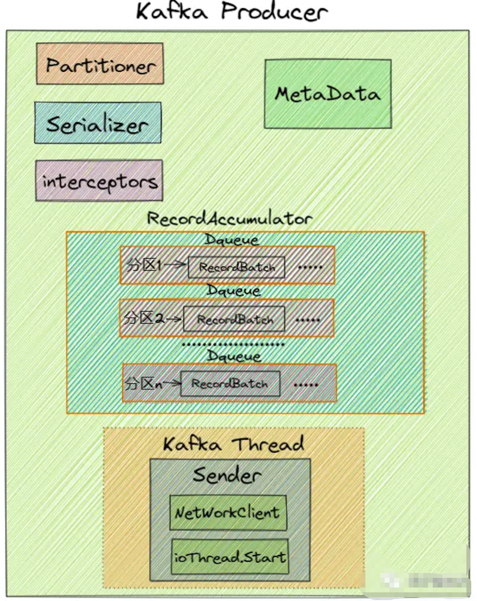
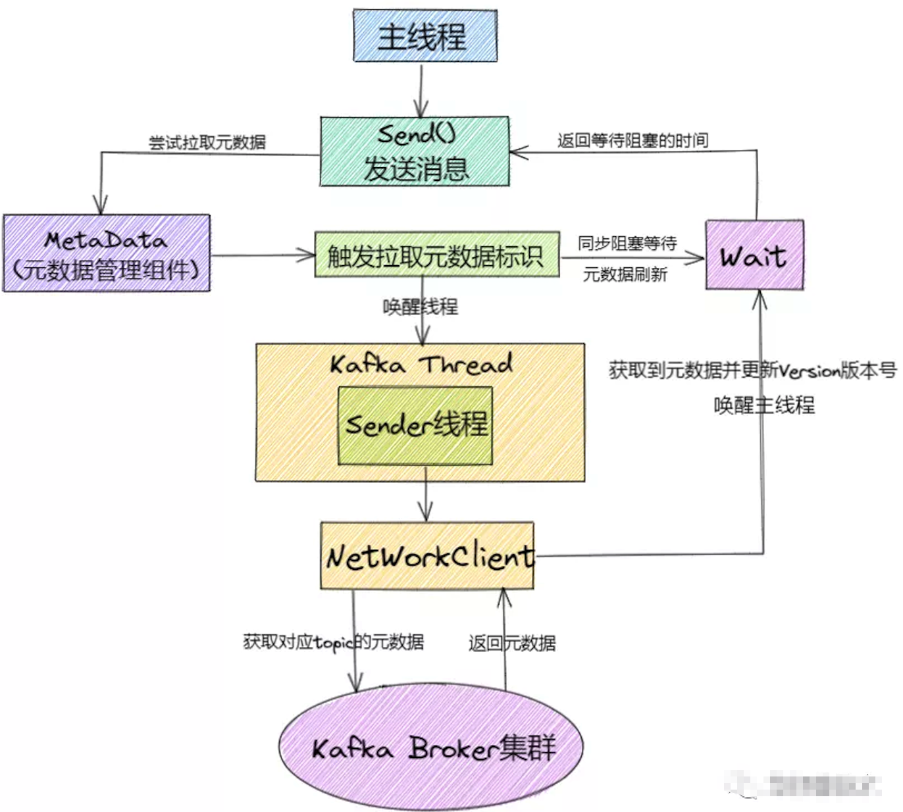

本文章来源于：<https://github.com/Zeb-D/my-review> ，请star 强力支持，你的支持，就是我的动力。

[TOC]

------

### 背景

在 Kafka 中, 我们把产生消息的一方称为Producer 即 生产者, 它是 Kafka 的核心组件之一, 也是消息的来源所在。

它的主要功能是将客户端的请求打包封装发送到 kafka 集群的某个 Topic 的某个分区上。

那么这些生产者产生的消息是怎么传到 Kafka 服务端的呢？初始化和发送过程是怎么样的呢？


### 初始化



Kafka Producer 初始化流程如下:

1)、设置分区器(partitioner), 分区器是支持自定义的

2)、设置重试时间(retryBackoffMs)默认100ms

3)、设置序列化器(Serializer)

4)、设置拦截器(interceptors)

5)、初始化集群元数据(metadata),刚开始空的

6)、设置最大的消息为多大(maxRequestSize), 默认最大1M, 生产环境可以提高到10M

7)、设置缓存大小(totalMemorySize) 默认是32M

8)、设置压缩格式(compressionType)

9)、初始化RecordAccumulator也就是缓冲区指定为32M

10)、定时更新(metadata.update)

11)、创建NetworkClient

12)、创建Sender线程

13)、KafkaThread将Sender设置为守护线程并启动


**KafkaProducer 初始化代码如下:**

```scala
producer = new KafkaProducer<>(props);//1)、设置分区器
this.partitioner = config.getConfiguredInstance(ProducerConfig.PARTITIONER_CLASS_CONFIG, Partitioner.class);
//2)、重试时间 retry.backoff.ms 默认100ms
long retryBackoffMs = config.getLong(ProducerConfig.RETRY_BACKOFF_MS_CONFIG);
//3)、设置序列化器
........
//4)、设置拦截器
List<ProducerInterceptor<K, V>> interceptorList = (List) (new ProducerConfig(userProvidedConfigs)).getConfiguredInstances(ProducerConfig.INTERCEPTOR_CLASSES_CONFIG,ProducerInterceptor.class);
this.interceptors = interceptorList.isEmpty() ? null : new ProducerInterceptors<>(interceptorList);
//5)、生产者需要从服务端那儿拉取kafka的元数据。需要发送网络请求，重试等，
//metadata.max.age.ms（默认5分钟）
//生产者每隔一段时间都要去更新一下集群的元数据。
this.metadata = new Metadata(retryBackoffMs, config.getLong(ProducerConfig.METADATA_MAX_AGE_CONFIG), true, clusterResourceListeners);
//6)、max.request.size 生产者往服务端发送消息的时候，规定一条消息最大多大？
//如果你超过了这个规定消息的大小，你的消息就不能发送过去。
//默认是1M，在生产环境中，我们需要修改这个值为10M。
this.maxRequestSize = config.getInt(ProducerConfig.MAX_REQUEST_SIZE_CONFIG);
//7)、指的是缓存大小 RecordAccumulator 大小
//buffer.memory 默认值是32M，这个值一般是够用，如果有特殊情况的时候，我们可以去修改这个值。
this.totalMemorySize = config.getLong(ProducerConfig.BUFFER_MEMORY_CONFIG);
//8)、kafka是支持压缩数据的，设置压缩格式。提高你的系统的吞吐量，你可以设置压缩格式,一次发送出去的消息就更多。生产者这儿会消耗更多的cpu.
this.compressionType = CompressionType.forName(config.getString(ProducerConfig.COMPRESSION_TYPE_CONFIG));
//9)、创建了一个核心的组件 RecordAccumulator 缓冲区
this.accumulator = new RecordAccumulator(config.getInt(ProducerConfig.BATCH_SIZE_CONFIG),
         this.totalMemorySize,
         this.compressionType,
         config.getLong(ProducerConfig.LINGER_MS_CONFIG),
         retryBackoffMs,
         metrics,
         time); 
//10)、定时去更新元数据, update方法初始化的时候并没有去服务端拉取元数据。
this.metadata.update(Cluster.bootstrap(addresses), time.milliseconds());
ChannelBuilder channelBuilder = ClientUtils.createChannelBuilder(config.values());
/**
 * 11)、初始化了一个重要的管理网路的组件 NetworkClient。
  * (1) connections.max.idle.ms:默认值是9分钟
  * 一个网络连接最多空闲多久，超过这个空闲时间，就关闭这个网络连接。
  * (2) max.in.flight.requests.per.connection:默认是5
  * producer向broker发送数据的时候，其实是有多个网络连接。
  * 每个网络连接可以忍受 producer端发送给broker消息然后消息没有响应的个数。
  * 因为kafka有重试机制，所以有可能会造成数据乱序，如果想要保证有序，这个值要把设置为1.
  * 相当于一条一条的发送，每条发送成功并返回再发别的消息
  * (3) send.buffer.bytes:socket发送数据的缓冲区的大小，默认值是128K
  * (4) receive.buffer.bytes:socket接受数据的缓冲区的大小，默认值是32K。
   */
NetworkClient client = new NetworkClient(
         new Selector(config.getLong(ProducerConfig.CONNECTIONS_MAX_IDLE_MS_CONFIG), this.metrics, time, "producer", channelBuilder),
         this.metadata,
         clientId,
         config.getInt(ProducerConfig.MAX_IN_FLIGHT_REQUESTS_PER_CONNECTION),
         config.getLong(ProducerConfig.RECONNECT_BACKOFF_MS_CONFIG),
         config.getInt(ProducerConfig.SEND_BUFFER_CONFIG),
         config.getInt(ProducerConfig.RECEIVE_BUFFER_CONFIG),
         this.requestTimeoutMs, time);
/***
 * 12)、创建sender线程 并启动
  * (1) retries:重试的次数
  * (2) acks:
  * 0:producer发送数据到broker后就返回响应了，不管写成功还是写失败。
  * 1:producer发送数据到broker后，数据成功写入leader partition以后返回响应。
  * 当刚写完leader partition 并发送响应后leader挂了，follower未拉取到数据就会进行重新选举，造成数据丢失
  * -1:producer发送数据到broker后，数据要写入到leader partition里面，并且数据同步到所有的
  * follower partition后，才返回响应。这种情况下，当无follower时会丢数，保证有多个副本时才能保证不丢数据
  */
this.sender = new Sender(client,
            this.metadata,
            this.accumulator,
            config.getInt(ProducerConfig.MAX_IN_FLIGHT_REQUESTS_PER_CONNECTION) == 1,
            config.getInt(ProducerConfig.MAX_REQUEST_SIZE_CONFIG),
            (short) parseAcks(config.getString(ProducerConfig.ACKS_CONFIG)),
            config.getInt(ProducerConfig.RETRIES_CONFIG),
            this.metrics,
            new SystemTime(),
            clientId,
            this.requestTimeoutMs);
//13)、 启动线程。
this.ioThread.start();
```


### 拉取元数据过程



**Kafka Producer 拉取元数据流程如下:**

1)、主线程调用send()尝试拉取元数据

2)、元数据组件触发拉取元数据信息的标识并同步wait元数据的刷新

3)、唤醒 KafkaThread Sender 线程并 wait 等待拉取完成

4)、KafkaThread Sender 线程通过 

NetWorkClient 从kafka Broker 集群拉取元数据

5)、kafka Broker 集群给NetWorkClient返回元数据响应

6)、拉取到元数据以后，更新version版本号到 MetaData组件，并唤醒主线程

7)、主线程继续往下执行


### Producer 发送消息流程


 

1)、进行 Kafka Producer 初始化，加载默认配置以及设置的配置参数，开启网络线程；

2)、执行拦截器逻辑，预处理消息, 封装 Producer Record

3)、调用Serializer.serialize()方法进行消息的key/value序列化

4)、调用partition()选择合适的分区策略，给消息体 Producer Record 分配要发送的 topic 分区号

5)、从 Kafka Broker 集群获取集群元数据metadata

6)、将消息缓存到RecordAccumulator收集器中, 最后判断是否要发送。这个加入消息收集器，首先得从 `Deque<RecordBatch>` 里找到自己的目标分区，如果没有就新建一个批量消息 Deque 加进入

7)、如果达到发送阈值，唤醒Sender线程，实例化 NetWorkClient 将 batch record 转换成 request client 的发送消息体, 并将待发送的数据按 【Broker Id <=> List】的数据进行归类

8)、与服务端不同的 Broker 建立网络连接，将对应 Broker 待发送的消息 List 发送出去。

9)、批次发送的条件为:缓冲区数据大小达到 batch.size 或者 linger.ms 达到上限，哪个先达到就算哪个。

后续会在源码分析篇章进行分步详细分析, 这里就简单的聊聊发送的整体过程, 这块源码实现还是相当复杂的, 接下来我们看看 Producer 内存池的设计, 是如何巧妙设计并很好的解决Java中头疼的Full GC问题的。


### 内存池设计


这里可以先查看 [kafka-三高架构设计.md中的内存池设计部分](kafka-三高架构设计.md#内存池设计), 然后再看这部分的详解。

说到内存池, 可以将其类比为连接池(DB, Redis)，主要是避免不必要的创建连接的开销, 这样内存池可以对 RecordBatch 做到反复利用, 防止引起Full GC问题。

那我们看看 Kafka 内存池是怎么设计的：

​       Kafka 内存设计有两部分，下面的粉色的是可用的内存（未分配的内存，初始的时候是 32M），上面紫色的是已经被分配了的内存，每个小 Batch 是 16K，然后这一个个的 Batch 就可以被反复利用，不需要每次都申请内存,  两部分加起来是 32M。

**申请内存**

​        从上图 Producer 发送流程的第6步中可以看到会把消息放入 accumulator中, 即调用 accumulator.append() 追加, 然后把消息封装成一个个Batch 进行发送, 然后去申请内存(free.allocate())

  （1）如果申请的内存大小超过了整个缓存池的大小，则抛异常出来

  （2）对整个方法加锁：

```
this.lock.lock();
```

  （3）如果申请的大小是每个 recordBatch 的大小（16K），并且已分配内存不为空，则直接取出来一个返回。

```
if (size == poolableSize && !this.free.isEmpty())
    return this.free.pollFirst();
```

  （4）如果整个内存池大小比要申请的内存大小大 （this.availableMemory + freeListSize >= size），则直接从可用内存（即上图粉色的区域）申请一块内存。并且可用内存要去掉申请的那一块内存。

   还有其他一些条件判断 这里就不一 一赘述了, 后续会在源码篇章进行详细分析。

**释放内存**

​    释放内存的过程相对很简单了，如果释放的是一个批次的大小（16K），则直接加到已分配内存里面; 如果没有，则把内存放到可用内存里面，这部分内存等待虚拟机(JVM)垃圾回收。


**这里大家可能会有个疑问即为什么释放了一个 Batch 大小（16K）内存的时候，才放到已分配内存里面。如果我想释放个 1M 的内存，为什么不能往已分配内存里面呢？**

注意：要么是许多消息把 Batch 撑满了(如16KB)发送出去，要么是一个 Batch 累积消息到一定的时间了，就会立马发出去。如果是一个 1M 的内存 Batch，才攒了几条消息，或者还不到1M, 等待时间到了，就把这个 1M 的内存批次发送出去了。这样内存的使用率是会非常低的。


### 参数调优

我们知道在 Kafka 实际使用中，Producer 端既要保证吞吐量，又要确保无消息丢失，一些核心参数的配置就显得至关重要。接下来我们就来看看生产端都有哪些重要的参数,及调优建议。

**acks**

​     参数说明：对于 Kafka Producer 来说是一个非常重要的参数，它表示指定分区中成功写入消息的副本数量，是 Kafka 生产端消息的持久性的保证

**max.request.size**

​     参数说明：这个参数对于 Kafka Producer 也比较重要，**表示生产端能够发送的最大消息大小，默认值为1048576(1M)**。

​      调优建议：这个配置对于生产环境来说有点小，**为了避免因消息过大导致发送失败，生产环境建议适当调大，比如可以调到10485760(10M)**。

**retries**

​     参数说明：表示生产端消息发送失败时的重试次数，默认值为0，即不重试。**这个参数一般是为了解决因系统瞬时故障导致的消息发送失败，比如网络抖动、Leader 选举及重选举，其中瞬时的 Leader 重选举是比较常见的。因此这个参数的设置对于 Kafka Producer 就显得非常重要**。

​     调优建议：这里建议设置为一个大于0的值，比如3次。

**retry.backoff.ms**

​     参数说明：**设定两次重试之间的时间间隔，避免无效的频繁重试，默认值为100,** **主要跟 retries 配合使用，** 在配置 retries 和 retry.backoff.ms 之前，最好先估算一下可能的异常恢复时间，需要设定总的重试时间要大于异常恢复时间，避免生产者过早的放弃重试。

**connections.max.idele.ms**

​    参数说明：主要用来判断多久之后关闭空闲的链接，默认值540000（ms）即9分钟。

**compression.type**

​     参数说明：**该参数表示生产端是否要对消息进行压缩，默认值为不压缩(none)。**压缩可以显著减少网络IO传输、磁盘IO以及磁盘空间，从而提升整体吞吐量，但也是以牺牲CPU开销为代价的。

​     调优建议：出于提升吞吐量的考虑，建议在生产端对消息进行压缩。**对于Kafka来说，综合考虑吞吐量与压缩比，建议选择lz4压缩。如果追求最高的压缩比则推荐zstd压缩。**

**buffer.memory**

   参数说明：**该参数表示生产端消息缓冲池或缓冲区的大小，默认值为即33554432(32M)**。这个参数基本可以认为是 Producer 程序所使用的内存大小。

​    调优建议：通常我们应尽量保证生产端整体吞吐量，建议适当调大该参数，也意味着生产客户端会占用更多的内存。

**batch.size**

​     参数说明：**该参数表示发送到缓冲区中的消息会被封装成一个一个的Batch，分批次的发送到 Broker 端，默认值为16KB。**因此减小 batch 大小有利于降低消息延时，增加 batch 大小有利于提升吞吐量。

​     调优建议：通常合理调大该参数值，能够显著提升生产端吞吐量，比如可以调整到32KB，调大也意味着消息会有相对较大的延时。

**linger.ms**

​     参数说明：**该参数表示用来控制 Batch 最大的空闲时间，超过该时间的 Batch 也会自动被发送到 Broker 端。**实际情况中, 这是吞吐量与延时之间的权衡。默认值为0，表示消息需要被立即发送，无需关系 batch 是否被填满。 

​      调优建议：通常为了减少请求次数、提升整体吞吐量，建议设置一个大于0的值，比如设置为100，此时会在负载低的情况下带来100ms的延时。  

**request.timeout.ms**

​     参数说明：**这个参数表示生产端发送请求后等待 Broker 端响应的最长时间，默认值为30000，即30s，超时生产端可能会选择重试（如果配置了retries）。**

​     调优建议：该参数默认值就够用了。如果生产端负载很大，可以适当调大以避免超时，比如可以调到60000,即60s。

**max.in.fight.requests.per.connection**

​     参数说明：**这个参数通常用来解决分区乱序的问题, 表示 Producer 与 Broker 之间的每个连接最多缓存的请求数，默认值为5，即每个连接最多可以缓存5个未响应的请求**。

​     调优建议：为了避免消息乱序问题，建议将该参数设置为1，表示生产端在某个 Broker 响应之前将无法再向该 Broker 发送消息请求，这能够有效避免同一分区下的消息乱序问题。