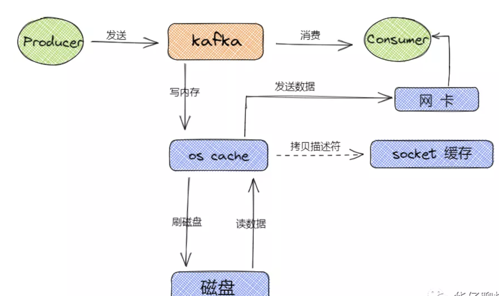

本文章来源于：<https://github.com/Zeb-D/my-review> ，请star 强力支持，你的支持，就是我的动力。

[TOC]

------

### 背景

Kakfa在网络上进行了高并发NIO设计，每个读写请求都会涉及到日志文件的存储，这部分又是如何高性能设计的呢？

对于Kafka 的存储方案，我们先来看看 Kafka 官网是怎么说的：

> Apache Kafka is an open-source distributed event streaming platform used by thousands of companies for high-performance data pipelines, streaming analytics, data integration, and mission-critical applications.
>
> 翻译成中文如下：
>
> Apache Kafka 是一个开源的分布式事件流处理平台，由成千上万的公司用于高性能的数据管道流分析、数据集成和关键任务的应用程序。

Kafka主要解决以下存储需求：

- 存储的主要是消息流（可以是简单的文本格式也可以是其他格式，对于 Broker 存储来说，它并不关心数据本身）
- 要支持海量数据的高效存储、高持久化（保证重启后数据不丢失）
- 要支持海量数据的高效检索（消费的时候可以通过 offset 或者时间戳高效查询并处理）
- 要保证数据的安全性和稳定性、故障转移容错性

在之前的[kafka-三高架构设计讲到顺序写磁盘 + OS Cache](./kafka-三高架构设计.md#顺序写磁盘 + OS Cache)，此处进一步深入理解kafka存储架构设计；

### Kafka 存储架构

#### 存储方案剖析

对于 Kafka 来说，它主要用来处理海量数据流，这个场景的特点主要包括：

- 写操作：写并发要求非常高，基本得达到百万级 TPS，顺序追加写日志即可，无需考虑更新操作
- 读操作：相对写操作来说，比较简单，只要能按照一定规则高效查询即可（offset或者时间戳）

根据上面两点分析，对于写操作来说，直接采用顺序追加写日志的方式就可以满足 Kafka 对于百万TPS写入效率要求。

但是如何解决高效查询这些日志呢？

似乎有一种索引看起来非常适合此场景，即：哈希索引【底层基于Hash Table 实现】，为了提高读速度，我们只需要在内存中维护一个映射关系即可，每次根据 Offset 查询消息的时候，从哈希表中得到偏移量，再去读文件就可以快速定位到要读的数据位置。

但是哈希索引通常是需要常驻内存的，对于Kafka 每秒写入几百万消息数据来说，是非常不现实的，很容易将内存撑爆，造成 oom。

可以设想把消息的 Offset 设计成一个有序的字段，这样消息在日志文件中也就有序存放了，也不需要额外引入哈希表结构，可以直接将消息划分成若干个块，对于每个块，我们只需要索引当前块的第一条消息的 Offset ，这个是不是有点二分查找算法的意思。

即先根据 Offset 大小找到对应的块，然后再从块中顺序查找；

这样就可以快速定位到要查找的消息的位置了，在 Kafka 中，我们将这种索引结构叫做 “稀疏索引”。

#### 存储架构设计

Kafka 最终的存储实现方案，即基于顺序追加写日志 + 稀疏哈希索引。

接下来我们来看看 Kafka 日志存储结构：

从上图可以看出来，Kafka 是基于「主题 + 分区 + 副本 + 分段 + 索引」的结构：

- Kafka 中消息是以主题 Topic 为基本单位进行归类的，这里的 Topic 是逻辑上的概念，实际上在磁盘存储是根据分区 Partition 存储的, 即每个 Topic 被分成多个 Partition，分区 Partition 的数量可以在主题 Topic 创建的时候进行指定。
- Partition 分区主要是为了解决 Kafka 存储的水平扩展问题而设计的，如果一个 Topic 的所有消息都只存储到一个 Kafka Broker 上的话， 对于 Kafka 每秒写入几百万消息的高并发系统来说，这个 Broker 肯定会出现瓶颈， 故障时候不好进行恢复，所以 Kafka 将 Topic 的消息划分成多个 Partition，然后均衡的分布到整个 Kafka Broker 集群中。
- Partition 分区内每条消息都会被分配一个唯一的消息 id，即我们通常所说的 偏移量 Offset，因此 Kafka 只能保证每个分区内部有序性，并不能保证全局有序性。
- 然后每个 Partition 分区又被划分成了多个 LogSegment，这是为了防止 Log 日志过大，Kafka 又引入了日志分段（LogSegment）的概念，将 Log 切分为多个 LogSegement，相当于一个巨型文件被平均分割为一些相对较小的文件，这样也便于消息的查找、维护和清理。这样在做历史数据清理的时候，直接删除旧的 LogSegement 文件就可以了。
- Log 日志在物理上只是以文件夹的形式存储，而每个 LogSegement 对应磁盘上的一个日志文件和两个索引文件，以及可能的其他文件（比如以".snapshot"为后缀的快照索引文件等）。

此处内容在[kafka-基础认识.md中存储机制](kafka-基础认识.md#存储机制)出现过；

#### 日志系统架构设计

根据上面的存储架构剖析，我们知道 Kafka 消息是按主题 Topic 为基础单位归类的，各个 Topic 在逻辑上是独立的，每个 Topic 又可以分为一个或者多个 Partition，每条消息在发送的时候会根据分区规则被追加到指定的分区中；

**日志目录布局**

那么 Kafka 消息写入到磁盘的日志目录布局是怎样的？接触过 Kafka 的老司机一般都知道 Log 对应了一个命名为 `<topic>-<partition> `的文件夹。举个例子，假设现在有一个名为 “topic-order” 的 Topic，该 Topic 中有4个 Partition，那么在实际物理存储上表现为 “topic-order-0”、“topic-order-1”、“topic-order-2”、“topic-order-3” 这4个文件夹。

我们知道首先向 Log 中写入消息是顺序写入的。但是只有最后一个 LogSegement 才能执行写入操作，之前的所有 LogSegement 都不能执行写入操作。

为了更好理解这个概念，我们将最后一个 LogSegement 称为 “activeSegement”，即表示当前活跃的日志分段。

随着消息的不断写入，当 activeSegement 满足一定的条件时，就需要创建新的 activeSegement，之后再追加的消息会写入新的 activeSegement。

为了更高效的进行消息检索，每个 LogSegment 中的日志文件（以 “.log” 为文件后缀）都有对应的几个索引文件：偏移量索引文件（以 “.index” 为文件后缀）、时间戳索引文件（以 “.timeindex” 为文件后缀）、快照索引文件 （以 “.snapshot” 为文件后缀）。

其中每个 LogSegment 都有一个 Offset 来作为基准偏移量（baseOffset），用来表示当前 LogSegment 中第一条消息的 Offset。

偏移量是一个 64 位的 Long 长整型数，日志文件和这几个索引文件都是根据基准偏移量（baseOffset）命名的，名称固定为 20 位数字，没有达到的位数前面用0填充。比如第一个 LogSegment 的基准偏移量为 0，对应的日志文件为 00000000000000000000.log。

注意每个 LogSegment 中不只包含 “.log”、“.index”、“.timeindex” 这几种文件，还可能包含 “.snapshot”、“.txnindex”、“leader-epoch-checkpoint” 等文件, 以及 “.deleted”、“.cleaned”、“.swap” 等临时文件。

#### 日志格式演变

对于一个成熟的消息中间件来说，日志格式不仅影响功能的扩展，还关乎性能维度的优化。所以随着 Kafka 的迅猛发展，其日志格式也在不断升级改进中，Kafka 的日志格式总共经历了3 个大版本：V0，V1 和 V2 版本。

我们知道在 Kafka Partition 分区内部都是由每一条消息进行组成，如果日志格式设计得不够精巧，那么其功能和性能都会大打折扣。

##### **V0 版本**

在 Kafka 0.10.0 之前的版本都是采用这个版本的日志格式的。在这个版本中，每条消息对应一个 Offset 和 message size。

Offset 用来表示它在 Partition分区中的偏移量。message size 表示消息的大小。两者合起来总共 12B，被称为日志头部。日志头部跟 Record 整体被看作为一条消息。如下图所示：

- crc32（4B）：crc32 校验值。校验范围为 magic 至 value 之间。
- magic（1B）：日志格式版本号，此版本的 magic 值为 0。
- attributes（1B）：消息的属性。总共占 1 个字节，低 3 位表示压缩类型：0 表示 NONE、1 表示 GZIP、2 表示 SNAPPY、3 表示 LZ4（LZ4 自 Kafka 0.9.x 版本引入），其余位保留。
- key length（4B）：表示消息的 key 的长度。如果为 -1，则没有设置 key。
- key：可选，如果没有 key 则无此字段。
- value length（4B）：实际消息体的长度。如果为 -1，则消息为空。
- value：消息体。

从上图可以看出，V0 版本的消息最小为 14 字节，小于 14 字节的消息会被 Kafka 认为是非法消息。

下面我来举个例子来计算一条消息的具体大小，消息的各个字段值依次如下：

- CRC：对消息进行 CRC 计算后的值；
- magic：0；
- attribute：0x00（未使用压缩）；
- key 长度：5；
- key：hello；
- value 长度：5；
- value：world。

那么该条消息长度为：4 + 1 + 1 + 4 + 5 + 4 + 5 = 24 字节。

##### **V1 版本**

随着 Kafka 版本的不断迭代发展， 用户发现 V0 版本的日志格式由于没有保存时间信息导致 Kafka 无法根据消息的具体时间进行判断，在进行清理日志的时候只能使用日志文件的修改时间导致可能会被误删。

从 V0.10.0 开始到 V0.11.0 版本之间所使用的日志格式版本为 V1，比 V0 版本多了一个 timestamp 字段，表示消息的时间戳。如下图所示：

V1 版本比 V0 版本多一个 8B 的 timestamp 字段，那么 timestamp 字段作用：

- 对内：会影响日志保存、切分策略；
- 对外：影响消息审计、端到端延迟等功能扩展。

从上图可以看出，V1 版本的消息最小为 22 字节，小于 22 字节的消息会被 Kafka 认为是非法消息。

总的来说比 V0 版本的消息大了 8 字节，如果还是按照 V0 版本示例那条消息计算，则在 V1 版本中它的总字节数为：24 + 8 = 32 字节。

##### **V0、V1 版本的设计缺陷**

通过上面我们分析画出的 V0、V1 版本日志格式，我们会发现它们在设计上的一定的缺陷，比如：

- 空间使用率低：无论 key 或 value 是否存在，都需要一个固定大小 4 字节去保存它们的长度信息，当消息足够多时，会浪费非常多的存储空间。
- 消息长度没有保存：需要实时计算得出每条消息的总大小，效率低下。
- 只保存最新消息位移。
- 冗余的 CRC 校验：即使是批次发送消息，每条消息也需要单独保存 CRC。

##### **V2 版本**

针对上面我们分析的关于 V0、V1 版本日志格式的缺陷，Kafka 在 0.11.0.0 版本对日志格式进行了大幅度重构，使用可变长度类型解决了空间使用率低的问题，增加了消息总长度字段，使用增量的形式保存时间戳和位移，并且把一些字段统一抽取到 RecordBatch 中。

从以上图可以看出，V2 版本的消息批次（RecordBatch），相比 V0、V1 版本主要有以下变动：

- 将 CRC 值从消息中移除，被抽取到消息批次中。
- 增加了 procuder id、producer epoch、序列号等信息主要是为了支持幂等性以及事务消息的。
- 使用增量形式来保存时间戳和位移。
- 消息批次最小为 61 字节，比 V0、V1 版本要大很多，但是在批量消息发送场景下，会提高发送效率，降低使用空间。

综上可以看出 V2 版本日志格式主要是通过可变长度提高了消息格式的空间使用率，并将某些字段抽取到消息批次（RecordBatch）中，同时消息批次可以存放多条消息，从而在批量发送消息时，可以大幅度地节省了磁盘空间。

------

#### 日志清理机制

Kafka 将消息存储到磁盘中，随着写入数据不断增加，磁盘占用空间越来越大，为了控制占用空间就需要对消息做一定的清理操作。从上面 Kafka 存储日志结构分析中每一个分区副本（Replica）都对应一个 Log，而 Log 又可以分为多个日志分段（LogSegment），这样就便于 Kafka 对日志的清理操作。

Kafka提供了两种日志清理策略：

- 日志删除（Log Retention）：按照一定的保留策略直接删除不符合条件的日志分段（LogSegment）。
- 日志压缩（Log Compaction）：针对每个消息的 key 进行整合，对于有相同 key 的不同 value 值，只保留最后一个版本。

这里我们可以通过 Kafka Broker 端参数 log.cleanup.policy 来设置日志清理策略，默认值为 “delete”，即采用日志删除的清理策略。

如果要采用日志压缩的清理策略，就需要将 log.cleanup.policy 设置为 “compact”，这样还不够，必须还要将log.cleaner.enable（默认值为 true）设为 true。

如果想要同时支持两种清理策略， 可以直接将 log.cleanup.policy 参数设置为 “delete,compact”。

##### 日志删除

Kafka 的日志管理器（LogManager）中有一个专门的日志清理任务通过周期性检测和删除不符合条件的日志分段文件（LogSegment），这里我们可以通过 Kafka Broker 端的参数 log.retention.check.interval.ms 来配置，默认值为 300000，即 5 分钟。

在 Kafka 中一共有 3 种保留策略。

###### 基于时间策略：

日志删除任务会周期检查当前日志文件中是否有保留时间超过设定的阈值（retentionMs） 来寻找可删除的日志段文件集合（deletableSegments）。

其中 retentionMs 可以通过 Kafka Broker 端的这几个参数的大小判断的 `log.retention.ms > log.retention.minutes > log.retention.hours` 优先级来设置，默认情况只会配置 log.retention.hours 参数，值为 168 即为 7 天。

> 这里需要注意：
>
> 删除过期的日志段文件，并不是简单的根据该日志段文件的修改时间计算的，而是要根据该日志段中最大的时间戳 largestTimeStamp 来计算的，
>
> 首先要查询该日志分段所对应的时间戳索引文件，查找该时间戳索引文件的最后一条索引数据，
>
> 如果时间戳值大于 0，则取值，否则才会使用最近修改时间（lastModifiedTime）。

删除步骤：

- 首先从 Log 对象所维护的日志段的跳跃表中移除要删除的日志段，用来确保已经没有线程来读取这些日志段。
- 将日志段所对应的所有文件，包括索引文件都添加上 “.deleted” 的后缀。
- 最后交给一个以 “delete-file” 命名的延迟任务来删除这些以 “.deleted” 为后缀的文件。默认 1 分钟执行一次， 可以通过 file.delete.delay.ms 来配置。

###### 基于日志大小策略：

日志删除任务会周期检查当前日志大小是否超过设定的阈值（retentionSize）来寻找可删除的日志段文件集合（deletableSegments）。

其中 retentionSize 这里我们可以通过 Kafka Broker 端的参数 log.retention.bytes 来设置， 默认值为 -1，即无穷大。

> 需要注意的是 
>
> log.retention.bytes 设置的是 Log 中所有日志文件的大小，而不是单个日志段的大小。
>
> 单个日志段可以通过参数 log.segment.bytes 来设置，默认大小为 1G。

删除步骤：

- 首先计算日志文件的总大小 Size 和 retentionSize 的差值，即需要删除的日志总大小。
- 然后从日志文件中的第一个日志段开始进行查找可删除的日志段的文件集合（deletableSegments）。
- 找到后就可以进行删除操作了。

###### 基于日志起始偏移量：

该策略判断依据是日志段的下一个日志段的起始偏移量 baseOffset 是否小于等于 logStartOffset，如果是，则可以删除此日志分段。

如下图所示删除步骤：

- 首先从头开始遍历每个日志段，日志段 1 的下一个日志分段的起始偏移量为 20，小于 logStartOffset 的大小，将日志段 1 加入 deletableSegments。
- 日志段 2 的下一个日志偏移量的起始偏移量为 35，也小于 logStartOffset 的大小，将日志分段 2 页加入 deletableSegments。
- 日志段 3 的下一个日志偏移量的起始偏移量为 50，也小于 logStartOffset 的大小，将日志分段 3 页加入 deletableSegments。
- 日志段 4 的下一个日志偏移量通过对比后，在 logStartOffset 的右侧，那么从日志段 4 开始的所有日志段都不会加入 deletableSegments。
- 待收集完所有的可删除的日志集合后就可以直接删除了。

#### 日志压缩

日志压缩 Log Compaction 对于有相同 key 的不同 value 值，只保留最后一个版本。

如果应用只关心 key 对应的最新 value 值，则可以开启 Kafka 相应的日志清理功能，Kafka 会定期将相同 key 的消息进行合并，只保留最新的 value 值。

Log Compaction 可以类比 Redis 中的 RDB 的持久化模式。我们可以想象下，如果每次消息变更都存 Kafka，在某一时刻，Kafka 异常崩溃后，如果想快速恢复，可以直接使用日志压缩策略，这样在恢复的时候只需要恢复最新的数据即可，这样可以加快恢复速度。

#### 磁盘数据存储

在 Kafka 中，大量使用了 PageCache，这也是 Kafka 能实现高吞吐的重要因素之一，当一个进程准备读取磁盘上的文件内容时，操作系统会先查看待读取的数据页是否在 PageCache 中，

如果命中则直接返回数据，从而避免了对磁盘的 I/O 操作；如果没有命中，操作系统则会向磁盘发起读取请求并将读取的数据页存入 PageCache 中，之后再将数据返回给进程。

同样，如果一个进程需要将数据写入磁盘，那么操作系统也会检查数据页是否在页缓存中，如果不存在，则 PageCache 中添加相应的数据页，最后将数据写入对应的数据页。

被修改过后的数据页也就变成了脏页，操作系统会在合适的时间把脏页中的数据写入磁盘，以保持数据的一致性。

除了消息顺序追加写日志、PageCache 以外， Kafka 还使用了零拷贝（Zero-Copy）技术来进一步提升系统性能， 如下图所示：

#### 磁盘存储写入

  

1)、Clients 发送请求给 Acceptor 线程。

2)、Processor 线程处理请求，并放入请求队列

3)、I/O 线程 处理请求。

4)、KafkaRequestHandler 线程将 Response 放入 Processor 线程的 Response 队列

5)、Processor 线程发送 Response 给 Request 发送方；

实现网络通信的关键部件分别是**Acceptor 线程**和**Processor 线程, IO 线程, **

它们分工明确, 各司其职, 充分解耦, 每个部分都能超高效的处理网络消息请求,从而整体达到超高并发性能要求。

 1)、**Acceptor 线程：**这是接收和创建外部 TCP 连接的线程。每个 SocketServer 实例只会创建一个 Acceptor 线程。它的唯一目的就是创建连接，并将接收到的 Request 传递给下游的 Processor 线程处理。

2)、**Processor 线程：**这是处理单个 TCP 连接上所有请求的线程。每个 SocketServer 实例默认创建 num.network.threads(默认为3) 个Processor 线程。Processor 线程负责将接收到的 Request 添加到 RequestChannel 的 Request 队列上，同时还负责将 Response 返还给 Request 发送方。

3)、经典的 Reactor 模式有个 Dispatcher 的角色，接收外部请求并分发给下面的实际处理线程。**在 Kafka 中，这个 Dispatcher 就是 Acceptor 线程**。

4)、Acceptor 线程在初始化时，需要创建对应的网络 Processor 线程池。这说明 **Processor 线程是在 Acceptor 线程中管理和维护的**。那它就必须要定义相关的方法。Acceptor 源码中，提供了 3 个与 Processor 相关的方法，**分别是 addProcessors、startProcessors 和 removeProcessors**

5)、**Acceptor 线程逻辑的其实是 run 方法，它是处理 Reactor 模式中分发逻辑的主要实现方法。**这块在后续源码分析篇会详细介绍

6)、Acceptor 线程使用 Java NIO 的 Selector + SocketChannel 的方式循环地轮询准备就绪的 I/O 事件。其中这里的 I/O 事件主要是指网络连接创建事件，即源码中的 SelectionKey.OP_ACCEPT。一旦接收到外部连接请求，Acceptor 就会指定一个 Processor 线程，并将该请求交由它，让它创建真正的网络连接。总的来说，Acceptor 线程就做这么点事。

7)、Processor 是真正创建连接以及分发请求的地方。它要做的事情远比 Acceptor 要多得多, 每个 Processor 线程在创建时都会创建 3 个队列,

  **newConnections** (主要保存创建的新连接信息), 

  **inflightResponses** (这是一个临时 Response 队列。当 Processor 线程将 Response 返还给 Request 发送方之后，还要将 Response 放入这个临时队列, 为什么要存在这个临时队列呢? 这是因为有些 Response 回调逻辑要在 Response 被发送回发送方之后，才能执行，因此需要暂存在一个临时队列里面。这就是 inflightResponses 存在的意义),

  **responseQueue** (这是 Response 队列：每个 Processor 线程都会维护自己的 Response 队列，Response 队列里面保存着需要被返还给发送方的所有 Response 对象。**需要注意的是：Request队列是共享的，而response队列是某个Processor线程专享的，并不是每个线程都需要有响应的**。)

**这里简要总结一下：**

1)、接收分发请求主要由SocketServer 组件下的 Acceptor 和 Processor 线程处理。

2)、SocketServer 实现了 Reactor 模式，用于高性能地并发处理 I/O 请求。

3)、SocketServer 底层使用了 Java 的 Selector 实现 NIO 通信。

------

一条消息写入磁盘的整体过程如下图所示：

1)、LoggerManager对象：这是日志管理器, 主要管理Log对象, 以及LogSegment日志分段对象。

2)、Log对象: 每个 replica 会对应一个 log 对象，log 对象是管理当前分区的一个单位，它会包含这个分区的所有 segment 文件（包括对应的 offset 索引和时间戳索引文件），它会提供一些增删查的方法。 

3)、日志写入: 在 Log 中一个重要的方法就是日志的写入方法。Server 将每个分区的消息追加到日志中时，是以 segment 为单位的，当 segment 的大小到达阈值大小之后，会滚动新建一个日志分段（segment）保存新的消息，而分区的消息总是追加到最新的日志分段中。

4)、日志分段:在 Log 的 append() 方法中，会调用 maybeRoll() 方法来判断是否需要进行相应日志分段操作, 如果需要会对日志进行分段存储。

5)、offset 索引文件: 在 Kafka 的索引文件中有这样的特点,**主要采用绝对偏移量+相对偏移量 的方式进行存储的**，每个 segment 最开始绝对偏移量也是其基准偏移量, 另外**数据文件每隔一定的大小创建一个索引条目**，而不是每条消息会创建索引条目，**通过 index.interval.bytes 来配置，默认是 4096，也就是4KB**。

6)、**LogSegment 写入:** 真正的日志写入，还是在 LogSegment 的 append() 方法中完成的，LogSegment 会跟 Kafka 最底层的文件通道、mmap 打交道, 利用OS Cache和零拷贝技术,基于**磁盘顺序写**的方式来进行落盘的, 即将数据追加到文件的末尾,实现高效存储。 

7)、存储机制: 可以先看下[kafka-基础认识.md](kafka-基础认识.md) 中的存储机制部分, 存储格式如上图所示。

### 总结

本文重点分析 Kafka 存储架构，一步步带你揭开了 Kafka 存储架构的神秘面纱。
