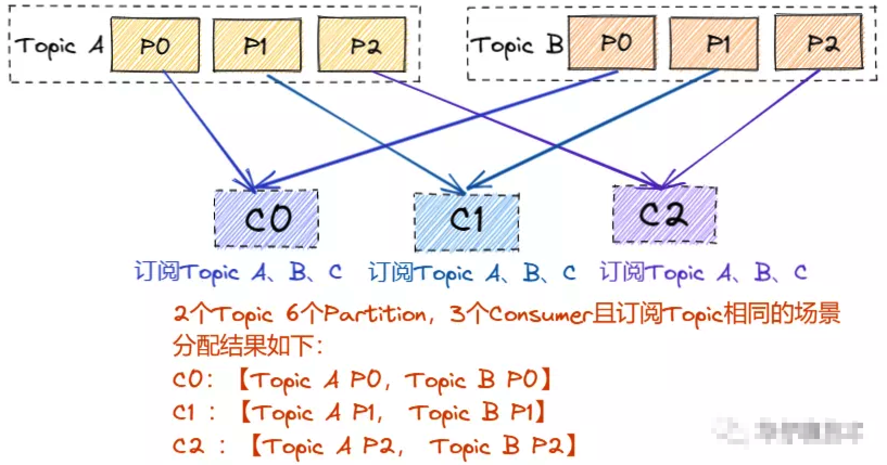

本文章来源于：<https://github.com/Zeb-D/my-review> ，请star 强力支持，你的支持，就是我的动力。

[TOC]

------

### 背景

Producer 产生的消息是怎么被 Consumer 消费的呢？又是基于何种消费方式进行消费，分区分配策略都有哪些，消费者组以及重平衡机制是如何处理的，偏移量如何提交和存储，消费进度如何监控， 如何保证消费处理完成？

#### 消费方式

我们知道消息队列一般有两种实现方式,(1)Push(推模式) (2)Pull(拉模式)，那么 Kafka Consumer 究竟采用哪种方式进行消费的呢？

其实 Kafka Consumer 采用的是主动拉取 Broker 数据进行消费的即 Pull 模式。这两种方式各有优劣，我们来分析一下：

​       1)、为什么不采用Push模式？如果是选择 Push 模式最大缺点就是 Broker 不清楚 Consumer 的消费速度，且推送速率是 Broker 进行控制的， 这样很容易造成消息堆积，如果 Consumer 中执行的任务操作是比较耗时的，那么 Consumer 就会处理的很慢， 严重情况可能会导致系统 Crash。

​        2)、为什么采用Pull模式？如果选择 Pull 模式，这时 Consumer 可以根据自己的情况和状态来拉取数据, 也可以进行延迟处理。

但是 Pull 模式也有不足，Kafka 又是如何解决这一问题？

如果 Kafka Broker 没有消息，这时每次 Consumer 拉取的都是空数据, 可能会一直循环返回空数据。 

针对这个问题，Consumer 在每次调用 Poll() 消费数据的时候，顺带一个 timeout 参数，当返回空数据的时候，会在 Long Polling 中进行阻塞，等待 timeout 再去消费，直到数据到达。  


### Consumer之初始化

```java
public class KafkaConsumerDemo {
public static void main(String[] args) throws InterruptedException {
    Properties props = new Properties();

    // 必须设置的属性
    props.put("bootstrap.servers", "192.168.239.131:9092");
    props.put("key.deserializer", "org.apache.kafka.common.serialization.StringDeserializer");
    props.put("value.deserializer", "org.apache.kafka.common.serialization.StringDeserializer");
    props.put("group.id", "group1");
    
    // 可选设置属性
    props.put("enable.auto.commit", "true");
    // 自动提交offset,每1s提交一次
    props.put("auto.commit.interval.ms", "1000");
    props.put("auto.offset.reset","earliest ");
    props.put("client.id", "zy_client_id");
    KafkaConsumer<String, String> consumer = new KafkaConsumer<>(props);
    // 订阅test1 topic
    consumer.subscribe(Collections.singletonList("test1"));

    while(true) {
        //  从服务器开始拉取数据
        ConsumerRecords<String, String> records = consumer.poll(Duration.ofMillis(100));
        records.forEach(record -> {
            System.out.printf("topic = %s ,partition = %d,offset = %d, key = %s, value = %s%n", record.topic(), record.partition(),
                    record.offset(), record.key(), record.value());
        });
    }
  }
}
```

从代码可以看出初始化 Consumer 有4步：

1. 构造 Propertity 对象，进行 Consumer 相关的配置；
2. 创建 KafkaConsumer 的对象 Consumer；
3. 订阅相应的 Topic 列表；
4. 调用 Consumer 的 poll() 方法拉取订阅的消息

Kafka consumer 消费流程图如下：


### Consumer之消费者组机制

**为什么 Kafka 要设计 Consumer Group, 只有 Consumer 不可以吗？** 

如果某个 Topic 拥有数百万到数千万的数据量， 仅仅依靠 Consumer 进程消费， 消费速度可想而知， 所以需要一个扩展性较好的机制来保障消费进度， 这个时候 Consumer Group 应运而生， **Consumer Group 是 Kafka 提供的可扩展且具有容错性的消费者机制。**

Kafka Consumer Group 特点如下:

1. 每个 Consumer Group 有一个或者多个 Consumer
2. 每个 Consumer Group 拥有一个公共且唯一的 Group ID
3. Consumer Group 在消费 Topic 的时候，Topic 的每个 Partition 只能分配给组内的某个 Consumer，只要被任何 Consumer 消费一次, 那么这条数据就可以认为被当前 Consumer Group 消费成功


#### Partition 分配策略机制

我们知道一个 Consumer Group 中有多个 Consumer，一个 Topic 也有多个 Partition，所以必然会涉及到 Partition 的分配问题: 确定哪个 Partition 由哪个 Consumer 来消费的问题。

Kafka 客户端提供了3 种分区分配策略：RangeAssignor、RoundRobinAssignor 和 StickyAssignor，前两种分配方案相对简单一些StickyAssignor 分配方案相对复杂一些。

##### RangeAssignor

**RangeAssignor 是 Kafka 默认的分区分配算法，它是按照 Topic 的维度进行分配的**，

对于每个 Topic，首先对 Partition 按照分区ID进行排序，然后对订阅这个 Topic 的 Consumer Group 的 Consumer 再进行排序，之后尽量均衡的按照范围区段将分区分配给 Consumer。此时可能会造成先分配分区的 Consumer 进程的任务过重（分区数无法被消费者数量整除）。

分区分配场景分析如下图所示（同一个消费者组下的多个 consumer）：

这种分配方式明显的问题就是随着消费者订阅的Topic的数量的增加，不均衡的问题会越来越严重。


##### **RoundRobinAssignor**

RoundRobinAssignor 的分区分配策略是将 Consumer Group 内订阅的所有 Topic 的 Partition 及所有 Consumer 进行排序后按照顺序尽量均衡的一个一个进行分配。

如果 Consumer Group 内，每个 Consumer 订阅都订阅了相同的Topic，那么分配结果是均衡的。如果订阅 Topic 是不同的，那么分配结果是不保证“尽量均衡”的，因为某些 Consumer 可能不参与一些 Topic 的分配。

分区分配场景分析如下图所示：

​    1) 当组内每个 Consumer 订阅的 Topic 是相同情况：



   2) 当组内每个订阅的 Topic 是不同情况，这样就可能会造成分区订阅的倾斜:


##### **StickyAssignor**

 StickyAssignor 分区分配算法是 Kafka Java 客户端提供的分配策略中**最复杂**的一种，可以通过 partition.assignment.strategy 参数去设置，从 0.11 版本开始引入，目的就是在执行新分配时，尽量在上一次分配结果上少做调整，其主要实现了以下2个目标：

​    1)、Topic Partition 的分配要尽量均衡。

​    2)、当 Rebalance(重分配，后面会详细分析) 发生时，尽量与上一次分配结果保持一致。

​    注意：当两个目标发生冲突的时候，优先保证第一个目标，这样可以使分配更加均匀，其中第一个目标是3种分配策略都尽量去尝试完成的， 而第二个目标才是该算法的精髓所在。


下面我们举例来聊聊 RoundRobinAssignor 跟 StickyAssignor的区别。

 分区分配场景分析如下图所示：

​       1）组内每个 Consumer 订阅的 Topic 是相同情况，RoundRobinAssignor 跟StickyAssignor分配一致：


当上述情况发生 Rebalance 情况后，可能分配会不太一样，假如这时候C1发生故障下线：

RoundRobinAssignor：


StickyAssignor：


大概可以理解，把下线的C1集合列表分配到轮流分配给C0、C1；


2) 当组内每个 Consumer 订阅的 Topic 是不同情况:

RoundRobinAssignor：


 StickyAssignor：


当上述情况发生 Rebalance 情况后，可能分配会不太一样，假如这时候C1发生故障下线：

RoundRobinAssignor：


StickyAssignor：


从上面结果可以看出，RoundRoubin 的分配策略在 Rebalance (重分配)之后造成了严重的分配倾斜。**因此在生产环境上如果想要减少重分配带来的开销，可以选用 StickyAssignor 的分区分配策略。**   


#### Consumer之消费者组重分配机制

对于 Consumer Group 来说，可能随时都会有 Consumer 加入或退出，那么 Consumer 列表的变化必定会引起 Partition 的重新分配。

我们将这个分配过程叫做 Consumer Rebalance，但是这个分配过程需要借助 Broker 端的 Coordinator 协调者组件，在 Coordinator 的帮助下完成整个消费者组的分区重分配，也是通过监听ZooKeeper 的 `/admin/reassign_partitions `节点触发的。

##### Rebalance 触发与通知

Rebalance 的触发条件有三种:

1. 当 Consumer Group 组成员数量发生变化(主动加入或者主动离组，故障下线等)

2. 当订阅主题数量发生变化

3. 当订阅主题的分区数发生变化

   

Rebalance 如何通知其他 consumer 进程？

Rebalance 的通知机制就是靠 Consumer 端的心跳线程，它会定期发送心跳请求到 Broker 端的 Coordinator,当协调者决定开启 Rebalance 后，

它会将“REBALANCE_IN_PROGRESS”封装进心跳请求的响应中发送给 Consumer ,当 Consumer 发现心跳响应中包含了“REBALANCE_IN_PROGRESS”，就知道 Rebalance 开始了。


##### 协议 (protocol) 说明

其实 Rebalance 本质上也是一组协议。Consumer Group 与 Coordinator 共同使用它来完成 Consumer Group 的 Rebalance。下面我看看这5种协议都是什么，完成了什么功能： 

1. Heartbeat请求：Consumer 需要定期给 Coordinator 发送心跳来证明自己还活着。
2. LeaveGroup请求：主动告诉 Coordinator 要离开 Consumer Group
3. SyncGroup请求：Group Leader Consumer 把分配方案告诉组内所有成员
4. JoinGroup请求：成员请求加入组
5. DescribeGroup请求：显示组的所有信息，包括成员信息，协议名称，分配方案，订阅信息等。通常该请求是给管理员使用。

Coordinator 在 Rebalance 的时候主要用到了前面4种请求


##### Consumer Group 状态机

Rebalance 一旦发生，必定会涉及到 Consumer Group 的状态流转，此时 Kafka 为我们设计了一套完整的状态机机制，来帮助 Broker Coordinator 完成整个重平衡流程。

了解整个状态流转过程可以帮助我们深入理解 Consumer Group 的设计原理。

5种状态，定义分别如下：

**Empty 状态**

 Empty 状态表示当前组内无成员， 但是可能存在 Consumer Group 已提交的位移数据，且未过期，这种状态只能响应 JoinGroup 请求。

**Dead 状态**

Dead 状态表示组内已经没有任何成员的状态，组内的元数据已经被 Broker Coordinator 移除，这种状态响应各种请求都是一个Response：UNKNOWN_MEMBER_ID。

**PreparingRebalance 状态**

​     PreparingRebalance 状态表示准备开始新的 Rebalance, 等待组内所有成员重新加入组内。

**CompletingRebalance 状态**

 CompletingRebalance 状态表示组内成员都已经加入成功，正在等待分配方案，旧版本中叫“AwaitingSync”。

**Stable 状态**

​     Stable 状态表示 Rebalance 已经完成， 组内 Consumer 可以开始消费了。

5种状态流转图如下：


#### Rebalance 流程分析

通过上面5种状态可以看出，**Rebalance 主要分为两个步骤：加入组(对应JoinGroup请求)和等待 Leader Consumer 分配方案(SyncGroup 请求)。**

​      1)、JoinGroup 请求: 组内所有成员向 Coordinator 发送 JoinGroup 请求，请求加入组，顺带会上报自己订阅的 Topic，这样 Coordinator 就能收集到所有成员的 JoinGroup 请求和订阅 Topic 信息，Coordinator 就会从这些成员中选择一个担任这个Consumer Group 的 Leader(一般情况下，第一个发送请求的 Consumer 会成为 Leader)，**这里说的Leader 是指具体的某一个 consumer，它的任务就是收集所有成员的订阅 Topic 信息，然后制定具体的消费分区分配方案**。待选出 Leader 后，Coordinator 会把 Consumer Group 的订阅 Topic 信息封装进 JoinGroup 请求的 Response 中，然后发给 Leader ，然后由 Leader 统一做出分配方案后，进入到下一步，如下图：


​	2)、SyncGroup 请求:  Leader 开始分配消费方案，**即哪个 Consumer 负责消费哪些 Topic 的哪些 Partition**。一旦完成分配，Leader 会将这个分配方案封装进 SyncGroup 请求中发给 Coordinator ，其他成员也会发 SyncGroup 请求，只是内容为空，待 Coordinator 接收到分配方案之后会把方案封装进 SyncGroup 的 Response 中发给组内各成员, 这样各自就知道应该消费哪些 Partition 了，如下图：


------

#### Rebalance 场景分析

关于 Rebalance 的状态流转与流程分析，接下来我们通过时序图来重点分析几个场景来加深对 Rebalance 的理解。

场景一：新成员(c1)加入组


场景二：成员(c2)主动离组


场景三：成员(c2)超时被踢出组


场景四：成员(c2)提交位移数据


#### Consumer之位移提交机制

##### 位移提交 Offset 概念

我们来聊聊 Consumer 的位移提交机制，在聊位移提交之前，我们回顾一下 **位移** 和 **消费者位移** 之间的区别。通常所说的位移是指 Topic Partition 在 Broker 端的存储偏移量，而消费者位移则是指某个 Consumer Group 在不同 Topic Partition 上面的消费偏移量（也可以理解为消费进度），它记录了 Consumer 要消费的下一条消息的位移。

​       **Consumer 需要向 Kafka 上报自己的位移数据信息，我们将这个上报过程叫做提交位移（Committing Offsets）**。它是为了保证 Consumer的消费进度正常，当 Consumer 发生故障重启后， 可以直接从之前提交的 Offset 位置开始进行消费而不用重头再来一遍（Kafka 认为小于提交的 Offset 的消息都已经成功消费了），Kafka 设计了这个机制来保障消费进度。**我们知道 Consumer 可以同时去消费多个分区的数据，所以位移提交是按照分区的粒度进行上报的，也就是说** **Consumer 需要为分配给它的每个分区提交各自的位移数据。**


##### 多种提交方式分析

 Kafka Consumer 提供了多种提交方式，**从用户角度来说：位移提交可以分为自动提交和手动提交，但从 Consumer 的角度来说，位移提交可以分为同步提交和异步提交**， 接下来我们就来聊聊自动提交和手动提交方式：

###### 自动提交

自动提交是指 Kafka Consumer 在后台默默地帮我们提交位移，用户不需要关心这个事情。启用自动提交位移，在 初始化 KafkaConsumer 的时候，通过设置参数 `enable.auto.commit = true` (默认为true)，开启之后还需要另外一个参数进行配合即`auto.commit.interval.ms`，这个参数表示 Kafka Consumer 每隔 X 秒自动提交一次位移，这个值默认是5秒。

​      自动提交看起来是挺美好的, 那么**自动提交会不会出现消费数据丢失的情况呢？**在设置了 **enable.auto.commit = true** 的时候，Kafka 会保证在开始调用 Poll() 方法时，提交上一批消息的位移，再处理下一批消息, 因此它能保证不出现消费丢失的情况。但**自动提交位移也有设计缺陷，那就是它可能会出现重复消费**。就是在自动提交间隔之间发生 Rebalance 的时候，此时 Offset 还未提交，待 Rebalance 完成后， 所有 Consumer 需要将发生 Rebalance 前的消息进行重新消费一次。


###### 手动提交

与自动提交相对应的就是手动提交了。开启手动提交位移的方法就是在初始化KafkaConsumer 的时候设置参数 **enable.auto.commit = false，**但是只设置为 false 还不行，它只是告诉 Kafka Consumer 不用自动提交位移了，你还需要在处理完消息之后调用相应的  Consumer API 手动进行提交位移，**对于手动提交位移，又分为同步提交和异步提交。**

   **1)、同步提交API：**

​         **KafkaConsumer#commitSync()，**该方法会提交由 KafkaConsumer#poll() 方法返回的最新位移值，它是一个同步操作，会一直阻塞等待直到位移被成功提交才返回，如果提交的过程中出现异常，该方法会将异常抛出。这里我们知道在调用 **commitSync() 方法的时机**是在处理完 Poll() 方法返回所有消息之后进行提交，如果过早的提交了位移就会出现消费数据丢失的情况。

   **2)、异步提交API：**

​        `KafkaConsumer#commitAsync()`，该方法是异步方式进行提交的，调用 commitAsync() 之后，它会立即返回，并不会阻塞，因此不会影响 Consumer 的 TPS。另外 Kafka 针对它提供了callback，方便我们来实现提交之后的逻辑，比如记录日志或异常处理等等。由于它是一个异步操作， 假如出现问题是不会进行重试的，这时候重试位移值可能已不是最新值，所以重试无意义。

   **3)、混合提交模式：**

​        **从上面分析可以得出 commitSync 和 commitAsync 都有自己的缺陷，**我们需要将 commitSync 和 commitAsync 组合使用才能到达最理想的效果，既不影响 Consumer TPS，又能利用 commitSync 的自动重试功能来避免一些瞬时错误（网络抖动，GC，Rebalance 问题)，**在生产环境中建议大家使用混合提交模式来提高 Consumer的健壮性**。


#### Consumer之__consumer_offsets存储

##### __consumer_offsets 概念

我们知道 Consumer 消费完数据后需要进行位移提交， 那么提交的位移数据究竟存储在哪里， 又是以何种方式进行存储的，接下来我们就看看新旧版本 Kafka 对于 Offset 存储方式。

​        我们知道 Kafka 旧版本（0.8版本之前）是重度依赖 Zookeeper 来实现各种各样的协调管理，当然旧版本的 Consumer Group 是把位移保存在 ZooKeeper 中，减少 Broker 端状态存储开销，鉴于 Zookeeper 的存储架构设计来说， 它不适合频繁写更新，而 Consumer Group 的位移提交又是高频写操作，这样会拖慢 ZooKeeper 集群的性能， **于是在新版 Kafka 中， 社区重新设计了 Consumer Group 的位移管理方式，采用了将位移保存在 Kafka 内部（这是因为 Kafka Topic 天然支持高频写且持久化），这就是所谓大名鼎鼎的__consumer_offsets**。

​      __consumer_offsets：用来保存 Kafka Consumer 提交的位移信息，另外它是由 Kafka 自动创建的，和普通的 Topic 相同，它的消息格式也是 Kafka 自己定义的，我们无法进行修改。这里我们很好奇它的消息格式究竟是怎么样的？

##### __consumer_offsets 消息格式

1. 所谓的消息格式我们可以简单理解为是一个 KV 对。Key 和 Value 分别表示消息的键值和消息体。
2. 那么 Key 存什么呢？既然是存储 Consumer 的位移信息，在 Kafka 中，Consumer 数量会很多，那么必须有字段来标识这个位移数据是属于哪个 Consumer的，怎么来标识 Consumer 字段呢？前面在讲解 Consumer Group 的时候我们知道它共享一个公共且唯一的**Group ID**，那么只保存它就可以了吗？我们知道 Consumer 提交位移是在分区的维度进行的，很显然，key中还应该保存 Consumer 要提交位移的分区。
3. 总结：位移主题的 Key 中应该保存 3 部分内容：`<Group ID，主题名，分区号 >`
4. value 可以简单认为存储的是offset值，当然底层还存储其他一些元数据，帮助 Kafka 来完成一些其他操作，比如删除过期位移数据等。

**__consumer_offsets 消息格式示意图：**


##### __consumer_offsets创建过程

当 Kafka 集群中的第一个 Consumer 启动时，Kafka 会自动创建__consumer_offsets。前面说过，它就是普通的 Topic， 它也有对应的分区数，如果由 Kafka 自动创建的，那么分区数又是怎么设置的呢？

这个依赖 Broker 端参数 offsets.topic.num.partitions (默认值是50)，因此 Kafka 会自动创建一个有 50 个分区的`__consumer_offsets `。这就是我们在 Kafka 日志路径下看到有很多`consumer_offsets-xxx` 这样的目录的原因。既然有分区数，必然就会有对应的副本数，这个是依赖 Broker 端另一个参数 `offsets.topic.replication.factor`(默认值为3)。总结一下，如果__consumer_offsets 由 Kafka 自动创建的，那么该 Topic 的分区数是 50，副本数是 3，而具体 Group 的消费情况要存储到哪个 Partition ，根据`abs(GroupId.hashCode()) % NumPartitions`来计算的，这样就可以保证 Consumer Offset 信息与 Consumer Group 对应的 Coordinator 处于同一个 Broker 节点上。


##### 查看__consumer_offsets数据

Kafka 默认提供了脚本供用户查看 Consumer 信息, 具体的查看方式如下：

```shell
//1.查看 kafka 消费者组列表：
./bin/kafka-consumer-groups.sh --bootstrap-server <kafka-ip>:9092 --list

//2.查看 kafka 中某一个消费者组(test-group-1)的消费情况：
./bin/kafka-consumer-groups.sh --bootstrap-server <kafka-ip>:9092 --group test-group-1 --describe

//3.计算 group.id 对应的 partition 的公式为：
abs(GroupId.hashCode()) % NumPartitions //其中GroupId:test-group-1 NumPartitions:50

//3.找到 group.id 对应的 partition 后，就可以指定分区消费了
//kafka 0.11以后
./bin/kafka-console-consumer.sh --bootstrap-server message-1:9092 --topic __consumer_offsets --formatter "kafka.coordinator.group.GroupMetadataManager\$OffsetsMessageFormatter" --partition xx
//kafka 0.11以前
./bin/kafka-console-consumer.sh --bootstrap-server message-1:9092 --topic __consumer_offsets --formatter "kafka.coordinator.GroupMetadataManager\$OffsetsMessageFormatter" --partition xx

//4.获取指定consumer group的位移信息 
//kafka 0.11以后
kafka-simple-consumer-shell.sh --topic __consumer_offsets --partition xx --broker-list <kafka-ip>:9092 --formatter "kafka.coordinator.group.GroupMetadataManager\$OffsetsMessageFormatter"
//kafka 0.11以前
kafka-simple-consumer-shell.sh --topic __consumer_offsets --partition xx --broker-list <kafka-ip>:9092 --formatter "kafka.coordinator.GroupMetadataManager\$OffsetsMessageFormatter"

//5.脚本执行后输出的元数据信息 
//格式：[消费者组 : 消费的topic : 消费的分区] :: [offset位移], [offset提交时间], [元数据过期时间]
[order-group-1,topic-order,0]::[OffsetMetadata[36672,NO_METADATA],CommitTime 1633694193000,ExpirationTime 1633866993000]
```


#### Consumer之消费进度监控

最重要的事情即**消费进度的监控**, 或者说**监控其滞后程度**（Consumer 当前落后于 Producer 的程度），这里有个专业名词叫 **Consumer Lag**。举例说明: Kafka Producer 向某 Topic 成功生产了 1000 万条消息，这时 Consumer 当前消费了 900 万条消息，那么可以认为 Consumer 滞后了 100 万条消息，即 Lag 等于 100 万。

​      **对 Consumer 来说，Lag 应该算是最重要的监控指标了**。它直接反映了一个 Consumer 的运行情况。Lag 值越小表示该 Consumer 能够及时的消费 Producer 生产出来的消息，滞后程度很小；如果该值有增大的趋势说明可能会有堆积，严重会拖慢下游的处理速度。

对于这么重要的指标，我们该怎么监控它呢？主要有 以下几 种方法：

1. 使用 Kafka 自带的命令行工具 kafka-consumer-groups 脚本
2. 使用 Kafka Java Consumer API 编程
3. 使用 Kafka 自带的 JMX 监控指标，如开源组件：https://github.com/linkedin/burrow
4. 如果是云产品的话， 可以直接使用云产品自带的监控功能

   