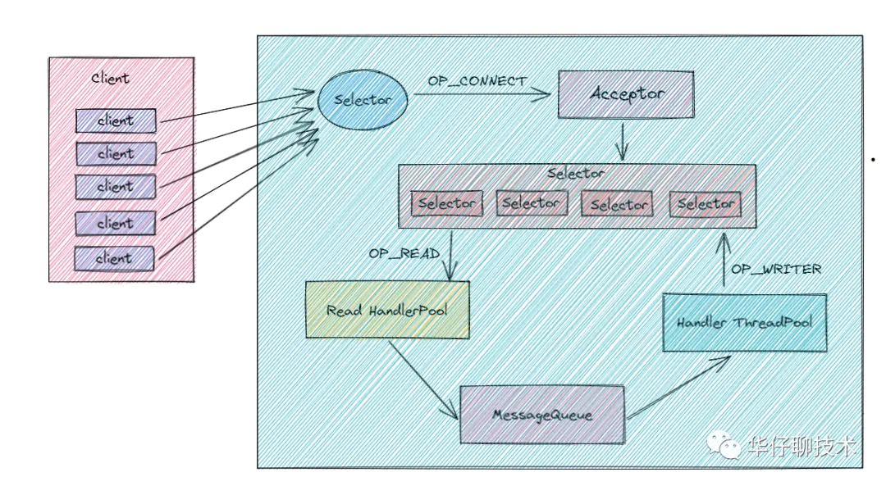
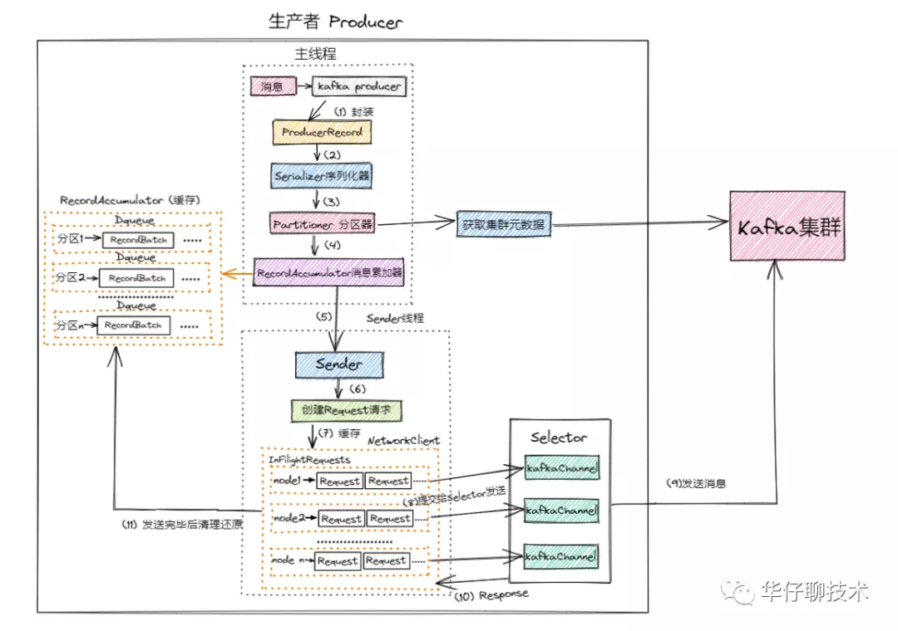
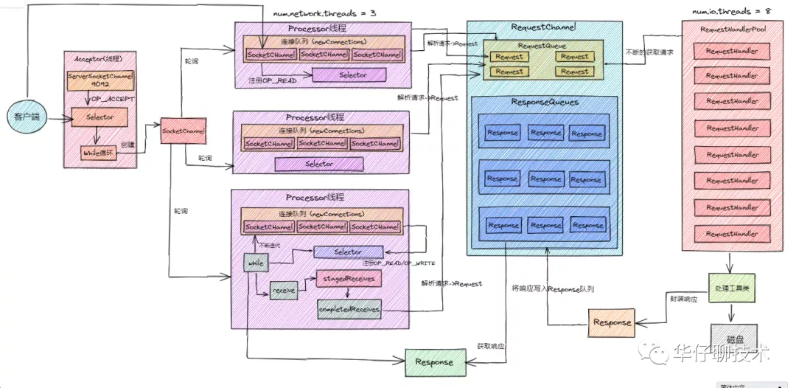
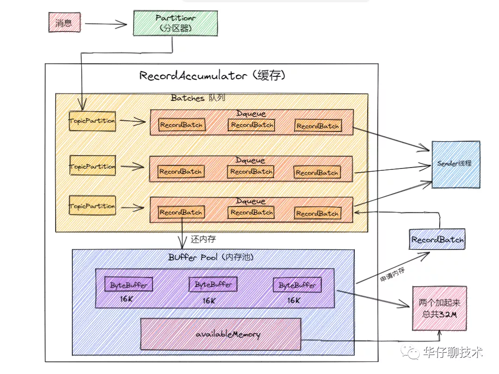
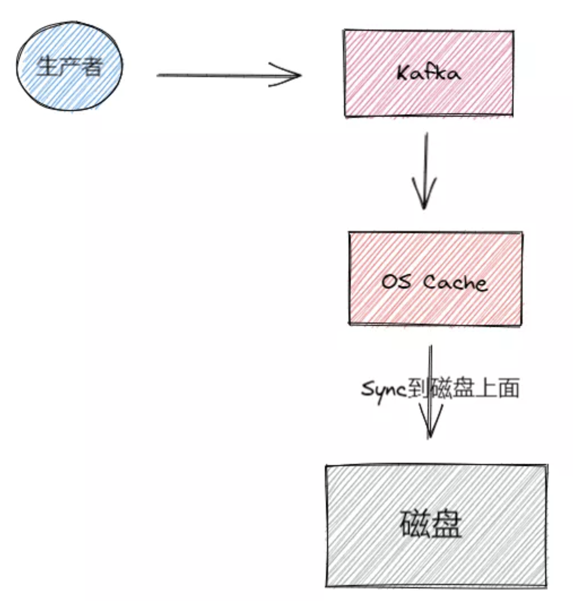
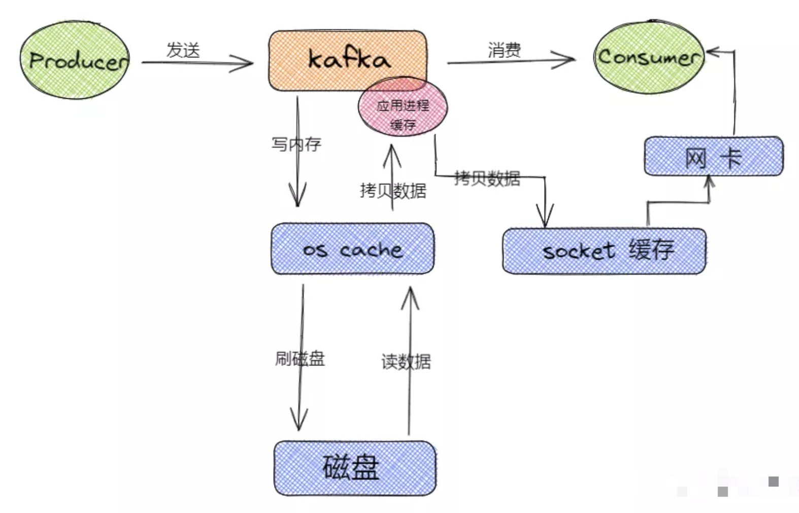
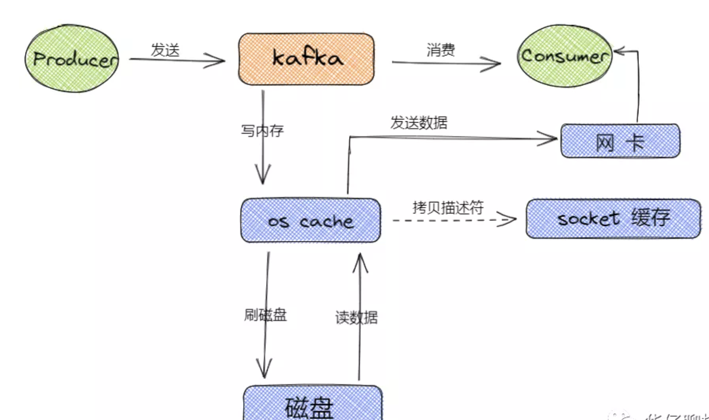
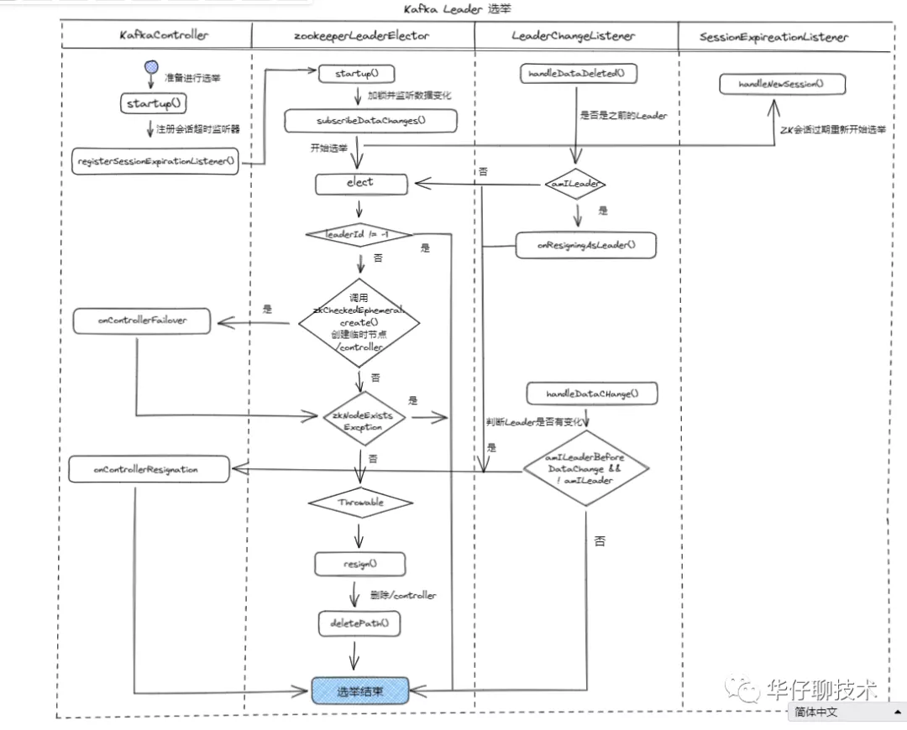
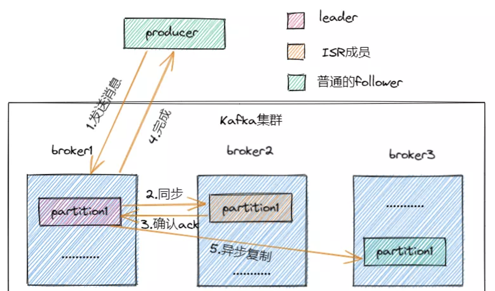

本文章来源于：<https://github.com/Zeb-D/my-review> ，请star 强力支持，你的支持，就是我的动力。

[TOC]

------

### 概述

Kafka 向来以高并发，高性能，高可用而自称，并在越来越多的场景中应用，这时候就对其稳定性的要求就越高。

高并发意味着能处理很多读写请求，高性能意味着每个请求的耗时很短，

有了极快的处理速度外加上高可用就是一个完美的集群实现；

接下来就以这三个方面为大家一一呈现里面的细节。


### 高并发设计

#### Reactor多路复用模型

#####  Java NIO

 Java NIO由以下几个核心部分组成 :

1) Channels;

2) Buffers；

3) Selectors;

Channel 和 Java 中的 Stream 一样, 用于传输数据的数据流, 数据可以Channel 读取到Buffer 中, 也可以从 Buffer 写到 Channel 中；

Selector 允许单线程处理多个 Channel。使用 Selector，首先得向Selector 注册 Channel，

然后调用它的 select() 方法。此方法会一直阻塞到某个注册的 Channel 有事件就绪。

一旦这个方法返回，线程就可以处理这些事件，事件的例子如新连接进来，数据接收等；


##### Kafka Reactor 

Kafka SocketServer 是基于Java NIO 开发的，采用了 Reactor 的模式(已被大量实践证明非常高效，在 Netty 和 Mina 中广泛使用)。Kafka Reactor 的模式包含三种角色：

1) Acceptor;

2) Processor;

3) Handler;

Kafka Reacator 包含了1个 Acceptor 负责接受客户端请求，

N个Processor 线程负责读写数据(即为每个 Connection 创建出一个 Processor 去单独处理,每个Processor中均引用独立的Selector)，

M个Handler来处理业务逻辑。

在Acceptor和Processor，Processor和Handler之间都有队列来缓冲请求。

如下图所示是kafka 简版的 Reactor模型架构图：




生产者发送到 Kafka集群的详细流程如下图所示：




1) 首先来一条消息后,生产者源码里面会对消息进行封装成 ProducerRecord对象。 

2) 封装成对象后会对该对象进行序列化[涉及网络传输], 调用Serializer组件进行序列化, 序列化后进行发送。

3) 在发送前要确定一件事, 到底要把这条消息发送到哪个主题的哪个分区, 这个时候就需要通过 Partitioner 分区器 从 Kafka Broker集群中获取集群元数据,  获取到元数据后就可以进行发送了。

4) 在0.8版本之前, 这个时候来了一条消息就会封装成一个请求发送到Broker, 这种情况下, 性能是非常差的, 在0.8版本之后, 进行简单的改进, 性能得到了指数级上升, 即来了一条消息后不会立马发送出去, 而是先写入到一个缓存(RecordAccumulator)队列中,封装成一个个批次(RecordBatch)。

5) 这个时候会有一个sender线程会将多个批次封装成一个请求(Request), 然后进行发送, 这样会减少很多请求,提高吞吐量。**这个时候有个问题, 一条消息过来后没有立即发送出去,而是封装成了批次, 这样会不会有延迟的问题, 默认的batch.size是16K, 写满会立即发送, 如果写不满, 也会在规定的时间进行发送(linger.ms = 500ms)**

6) 发送的时候 每个Request请求对应多路复用器(Selector)中的每个kafka channel 然后将数据发送给Broker集群

7) 在封装Batch批次和Request请求的过程中, 还涉及一个重要的设计理念即内存池方案, 在后面的服务端内存池部分进行详细说明


#### 高并发网络设计

来分析下 Kafka的超高并发网络架构设计, 此架构设计是 Kafka中最经典的。



这里我们将 Kafka 的网络架构抽象成如上图所示的三层架构, 整个请求流转的路径如下： 

1) 客户端发送请求过来, 在Kafka 服务端会有个**Acceptor线程**, 这个线程上面绑定了**OP_ACCEPT事件**, 用来监听发送过来的请求, 下面有个**while死循环**会源源不断的监听**Selector**是否有请求发送过来, 接收到**请求链接后封装成socketchannel**, 然后将socketChannel发送给网络第一层架构中。

2) 在第一层架构中有**3个一模一样的Processor线程**, 这个线程的里面都有一个连接队列,里面存放socketchannel, **存放规则为轮询存放,** 随着请求的不断增加, 连接队列里面就会有很多个socketchannel,  这个时候**socketchannel就会在每个selector上面注册OP_READ事件**,  参考上图第一层的第三个Processor线程, 即**每个线程**里面还有一个**while循环**会遍历每个socketchannel, 监听到事件后就会接收到客户端发送过来的请求, 这个时候**Processor线程会对请求进行解析**(发送过来的请求是二进制的, 上面已经说过, 跨网络传输需要进行序列化) , 并**解析封装成Request对象**发送到上图所示的**网络第二层架构中**。

3) 在第二层架构中会有两个队列, 一个**RequestQueue(请求队列)**, 一个是**ResponseQueue(返回队列)**, 在请求队列中会存放一个个Request请求, 起到缓冲的作用, 这个时候就到了网络第三层架构中。

4) 在第三层架构中有个**RequestHandler线程池**, 里面默认有**8个RequestHandler线程**, 这8个线程启动后会不断的从第二层的RequestQueue队列中获取请求, 解析请求体里面的数据, 通过内置工具类将数据写入到磁盘

5) 写入成功后还要**响应客户端**, 这个时候会封装一个**Response对象**, 会将返回结果存放到第二层的**ResponseQueue队列**中, 此时默认有**3个小的Response队列**, **这里面的个数是同第一层架构中的Processor线程一一对应的**。

6) 这个时候第一层的Processor线程中**while循环**就会遍历**Response请求**, 遍历完成后就会在**selector**上注册**OP_WRITE**事件, 这个时候就会将响应请求发送回客户端。

> 在整个过程中涉及到2个参数:**num.network.threads = 3 和 num.io.threads = 8**  如果感觉默认参数性能不够好的话, 可以对这2个参数进行优化：
>
> 比如将**num.network.threads = 9, num.io.threads = 32(和CPU个数要一致),  每个RequestHandler线程可以处理2000QPS,  2000 \* 8 = 1.6万QPS , 扩容后可以支撑6.4万QPS, 通过扩容后Kafka可以支撑6万QPS**


### 高性能设计

上面的kafka高并发设计意味着能接受更多的IO请求，怎么通过内存、硬盘上一些IO优化，使得请求处理吞吐量提高；

#### 压缩传输

默认情况下, 在 Kafka 生产者中不启用压缩 Compression 不仅可以更快地从生产者传输到代理, 还可以在复制过程中进行更快的传输。压缩有助于提高吞吐量, 降低延迟并提高磁盘利用率。

在 Kafka 中, 压缩可能会发生在两个地方: 生产者端和Broker端, 一句话总结下压缩和解压缩, 即 Producer 端压缩, Broker 端保持, Consumer 端解压缩。

 Kafka 支持多种压缩算法: lz4, snappy, gzip；

从Kafka 2.1.0 开始新增了 ZStandard 算法, 该算法是 Facebook 开源的压缩算法, 能提供超高的压缩比。

Producer、Broker、Consumer 要使用相同的压缩算法, 在 Producer 向 Broker 写入数据, Consumer 向 Broker 读取数据的时候可以不用解压缩, 只需要在最终 Consumer 到消息的时候才进行解压缩, 这样可以节省大量的网络和磁盘开销。


#### 内存池设计

上面的高并发设计中讲了一条消息生产的详细流程, 中间涉及到了批次(Batch)和请求(Request)；

此过程中必然会产生众多的短生命的对象，基本上JVM GC还是用CMS，因为对象内存分配导致STW进行内存mark-compact，那么kafka又是如何进行规避这种问题；



这里就详细讲述下内存池的实现过程：

1) 来一条消息会先进行封装然后序列化最后会计算出分区号, 并把这个消息存储到缓存里面

2) 这个缓存里面也是有设计的 即批次队列, 那么这个批次队列是使用什么策略存储呢? **一个分区对应一个队列, 这里有个重要的数据结构:Batches, 这个数据结构是Key-value形式, key是消息主题的分区, value是一个队列, 里面存储的发送到对应分区的批次**

3) 那么假设这个时候 我们有个2个topic, 每个topic有2个分区, 那么是不是总共有4个的分区即4个队列, 每个队列里面都有一个个批次, 这个时候消息算出来分区后就会写入队列的最新一个批次

4) Sender线程就会检测这个批次(Batch)是否已经写满,或者时间是否到达, 如果满足Sender线程就会取出封装成Request就会发送

5) 封装批次会用到内存, Sender发送完毕内存会进行回收, 在Java中如果频繁操作内存和回收,会遇到头疼的FullGC的问题, 工作线程的性能就会降低, 整个生产者的性能就会受到影响, **Kafka的解决方案就是内存池, 对内存块的使用跟数据库的连接池一样**

6) 整个Buffer Poll 内存池大小是**32M** , 内存池分为两个部分, 一个部分是内存队列, 队列里面有一个个**内存块(16K)**, 另外一部分是可用内存,  一条消息过来后会向内存池申请内存块, 申请完后封装批次并写入数据, sender线程就会发送并响应, 然后清空内存放回内存池里面进行反复使用, 这样就大大减少了GC的频率, 保证了生产者的稳定和高效, 性能会大大提高 


#### 顺序写磁盘 + OS Cache

我们也知道kafka是使用scala写的，那它不可避免使用了JVM操作，写数据这里会有顺序的，虽然有支持各种RandomAccess 接口【随机访问】，这种随机访问会带来内存定位磁盘位置的损耗；

首先 Kafka 为了保证磁盘写入性能，是采用追加文件末尾按照顺序的方式来写数据的话，这种磁盘顺序写的性能基本上可以跟写内存的性能本身也是差不多的，再通过基于操作系统的页缓存来实现文件写入的。

操作系统本身有一层缓存，叫做 page cache，是在内存里的缓存，我们也可以称之为 os cache，意思就是操作系统自己管理的缓存。

那么在写磁盘文件的时候，就可以先直接写入 os cache 中，也就是仅仅写入内存中，接下来由操作系统自己决定什么时候把 os cache 里的数据真的刷入到磁盘中, 这样大大提高写入效率和性能。 

如下图所示:

另外还有一个非常关键的操作,就是 kafka 在写数据的时候是以**磁盘顺序写**的方式来进行落盘的, 即将数据追加到文件的末尾, 而不是在文件的随机位置来修改数据,

对于普通机械磁盘, 如果是随机写的话, 涉及到磁盘寻址的问题,导致性能确实极低, 

但是如果只是按照顺序的方式追加文件末尾的话, 这种磁盘顺序写的性能基本可以跟写内存的性能差不多的。




#### 零拷贝技术(zero-copy)

在消费流程, 从 Kafka 消费数据, 在消费的时候实际上就是从 Kafka 的磁盘文件读取数据然后发送给下游的消费者。大概过程（未使用零拷贝技术）如下:



1) 先检查要读取的数据是否在 os cache 中, 如果不在的话就从磁盘文件读取数据后放入 os cache。

2) 接着从 os cache 里面 copy 数据到应用程序进程的缓存里面, 在从应用程序进程的缓存里 copy 数据到操作系统层面的 socket缓存里面, 最后再从 socket 缓存里面读取数据后发送到网卡, 最后从网卡发送到下游的消费者。

kafka 为了解决这个问题, 在读取数据的时候就引入了**零拷贝技术**。

即让操作系统的 os cache 中的数据**直接发送到**网卡后传出给下游的消费者，中间跳过了两次拷贝数据的步骤，

从而减少拷贝的 CPU 开销, 减少用户态内核态的上下文切换次数, 

从而优化数据传输的性能, 而Socket缓存中仅仅会拷贝一个描述符过去，不会拷贝数据到Socket缓存。如下图所示:



常见的零拷贝思路主要有两种实现方式:

1) 直接I/O: 数据直接跳过内核, 在用户空间与 I/O 设备之间进行传递, 内核在这种情况下只是进行必要的辅助工作

2) copy-on-write: 写时复制, 数据不需要提前进行拷贝, 而是在当需要修改的时候再进行部分数据的拷贝

这里, Kafka 主要使用到了 **mmap** 和 **sendfile** 的方式来实现零拷贝, 对应java里面的 MappedByteBuffer 和 FileChannel.transferIO。(unsafte类)

使用 java NIO 实现的 **零拷贝,** 如下：

```
 public abstract long transferTo(long position, long count,
                                    WritableByteChannel target)throws IOException;
```

transferTo() 方法会将数据从文件通道传输到了给定的可写字节通道。

在其内部它依赖底层操作系统对零拷贝的支持；在 Linux 系统中，此调用被传递到 sendfile() 系统调用中；


### 高可用设计

#### 选举机制

Kafka 中的选举大致分为三大类: 控制器的选举, Leader 的选举, 消费者的选举。

在讲解 Leader 选举之前, 先说说 Kafka 控制器, 即 Broker。

它除了具有一般 Broker 的功能外, 还具有选举分区Leader节点的功能, 在启动 Kafka 系统时候, 其中一个 Broker 会被选举为控制器, 负责管理主题分区和副本的状态, 还会执行重分配的任务。

控制器的启动顺序如下:

1) 第一个启动的节点，会在 Zookeeper 系统里面创建一个临时节点 /controller ，并写入该节点的注册信息，使该节点成为控制器。

2) 其他的节点在陆续启动时，也会尝试在 Zookeeper 系统中创建 /controller 节点，但是 /controller 节点已经存在，所以会抛出 “创建/controller节点失败异常” 的信息。创建失败的节点会根据返回的结果，判断出在 Kafka 集群中已经有一个控制器被成功创建了，所以放弃创建 /controller 节点，这样就确保了 Kafka 集群控制器的唯一性。

3) 其他的节点，也会在控制器上注册相应的监听器，各个监听器负责监听各自代理节点的状态变化。当监听到节点状态发生变化时，会触发相应的监听函数进行处理。

那么Leader节点的选举过程, 选举控制器的核心思路是：

各个节点公平竞争抢占 Zookeeper 系统中创建 /controller临时节点，最先创建成功的节点会成为控制器，并拥有选举主题分区Leader节点的功能。选举流程如下图所示:




#### 副本机制

 副本机制简单来说就是备份机制，就是在分布式集群中保存着相同的数据备份。那么副本机制的好处就是提供数据冗余,  副本机制是kafka确保系统高可用和高持久的重要基石。

   为了保证高可用，kafka 的分区是多副本的，如果其中一个副本丢失了，那么还可以从其他副本中获取分区数据(要求对应副本的数据必须是完整的)。这是 Kafka 数据一致性的基础, 下面将详解介绍 Kafka 的副本机制。

   Kafka 使用 Zookeeper 来维护集群 Brokers 的信息，每个 Broker 都有一个唯一的标识**`broker.id`**，用于标识自己在集群中的身份。Brokers 会通过 Zookeeper 选举出一个叫**`Controller Broker`**节点，它除了具备其它Brokers的功能外，还**负责管理主题分区及其副本的状态**。

   在 Kafka 中 Topic 被分为多个分区（Partition），分区是 Kafka 最基本的存储单位。在创建主题的时候可使用**`replication-factor`**参数指定分区的副本个数。分区副本总会有一个 Leader 副本，所有的消息都直接发送给Leader 副本，其它副本都需要通过复制 Leader 中的数据来保证数据一致。当 Leader 副本不可用时，其中一个 Follower 将会被选举并成为新的 Leader。


#### ISR机制



每个分区都有一个 ISR(in-sync Replica) 列表，用于维护所有同步的、可用的副本。

Leader 副本必然是同步副本，**也就是说, ISR 不只是追随者副本集合, 它比如包括 Leader 副本。**

**甚至在某些情况下, ISR 只有Leader 这一个副本,** 而对于 Follower 副本来说，它需要满足以下条件才能被认为是同步副本：

1) 必须定时向 Zookeeper 发送心跳；

  2 在规定的时间内从 Leader 副本 "低延迟" 地获取过消息。


Kafka 判断 Follower 是否与 Leader 同步的条件就是 Broker 端参数 **replica.lag.time.max.ms** 参数值。

这个参数的含义就是 Follower 副本能够落后 Leader 副本的最长时间间隔, 当前**默认值为10秒**, 

也就是说, 只要一个Follower 副本落后 Leader 副本的时间不连续超过10秒, 

Kafka 就认为两者是同步的, 即使 Follower 副本中保持的消息要少于 Leader 副本中的消息。

Kafka中ISR的管理最终都会反馈到 Zookeeper节点上。具体位置为：`/brokers/topics/[topic]/partitions/[partition]/state`。目前有两个地方会对这个Zookeeper的节点进行维护：

1) Controller来维护：Kafka 集群中的其中一个 Broker 会被选举为Controller，主要负责 Partition 管理和副本状态管理，也会执行重分配 Partition 之类的管理任务。在符合某些特定条件下，Controller 下的 LeaderSelector 会选举新的 Leader，ISR 和新的 leader_epoch 及controller_epoch 写入 Zookeeper 的相关节点中。同时发起 leaderAndIsrRequest 通知所有的 Replicas。

2) Leader来维护：Leader 有单独的线程定期检测 ISR 中 Follower 是否脱离 ISR , 如果发现 ISR 变化，则会将新的 ISR 信息返回到 Zookeeper 的相关节点中。

如果副本不满足上面条件的话，就会被从 ISR 列表中移除，直到满足条件才会被再次加入。所以就可能会存在 Follower 不可能与 Leader 实时同步的风险。


#### ACK机制

这个acks参数在kafka的使用中，是非常核心以及关键的一个参数，决定了很多东西, 这个acks跟副本机制,同步机制,ISR机制都密切相关, 如果无法理解这些,是无法充分理解acks参数的含义。

首先这个acks参数，是在Kafka Producer，也就是生产者客户端里设置的。

那么也就是说，你往kafka写数据的时候，就可以来设置这个acks参数。这个参数实际上有三种常见的值可以设置，分别是：0、1 和 all。

acks = 0

  如果acks设置为0，那么 Producer 是不会等待 Broker 的反馈。该消息会被立刻添加到 Socket Buffer 中就认为已经发送完成。在这种情况下，服务器端是否收到请求是无法保证的，并且参数 Retries 也不会生效（因为客户端无法获得失败信息）。

  这个时候每个记录返回的 Offset 总是被设置为-1。这个模式下 Kafka 的吞吐量最大，并发最高，但是数据非常容易丢失，通常适用在一些记录应用日志，对数据要求不高的业务场景。


acks = 1

  如果acks设置为1，这个时候 Leader 节点会将记录先写入本地日志，并且在所有 Follower 节点反馈之前就先确认成功。在这种情况下，如果 Leader 节点在接收记录之后，并且在 Follower 节点复制数据完成之前发生错误，那么这条记录会丢失。这个模式和 Mysql 的主从异步复制一样，主从之间会有数据差异，此配置为 Kafka 默认配置。它平衡了数据安全和性能。


acks = all & min.insync.replicas >= 2

   如果acks设置为all，这个时候 Leader 节点会等待所有同步中的LSR副本确认之后再确认这条记录是否发送完成。只要至少有一个同步副本存在，记录就不会丢失。

   如果说 Leader 这时候刚接收到了消息，但是 Follower 没有收到消息，此时 Leader 宕机了，那么客户端会感知到这个消息没发送成功，他会重试再次发送消息过去。

  其中Broker有个配置项min.insync.replicas(默认值为1)代表了正常写入生产者数据所需要的最少ISR个数, 当ISR中的副本数量小于min.insync.replicas时，Leader停止写入生产者生产的消息，并向生产者抛出NotEnoughReplicas异常，阻塞等待更多的 Follower 赶上并重新进入ISR, 因此能够容忍min.insync.replicas-1个副本同时宕机

   这种方式是牺牲了性能为代价，适合对数据要求比较高的业务场景。
