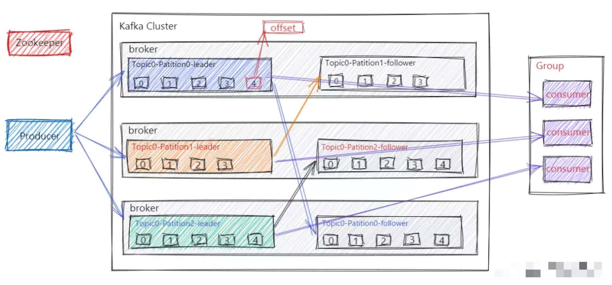
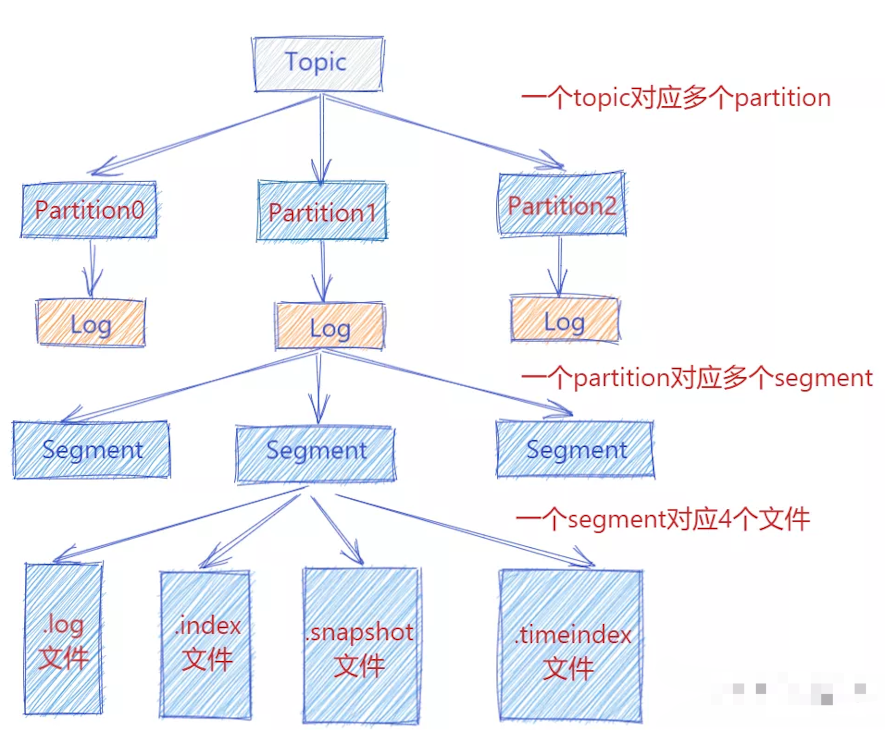
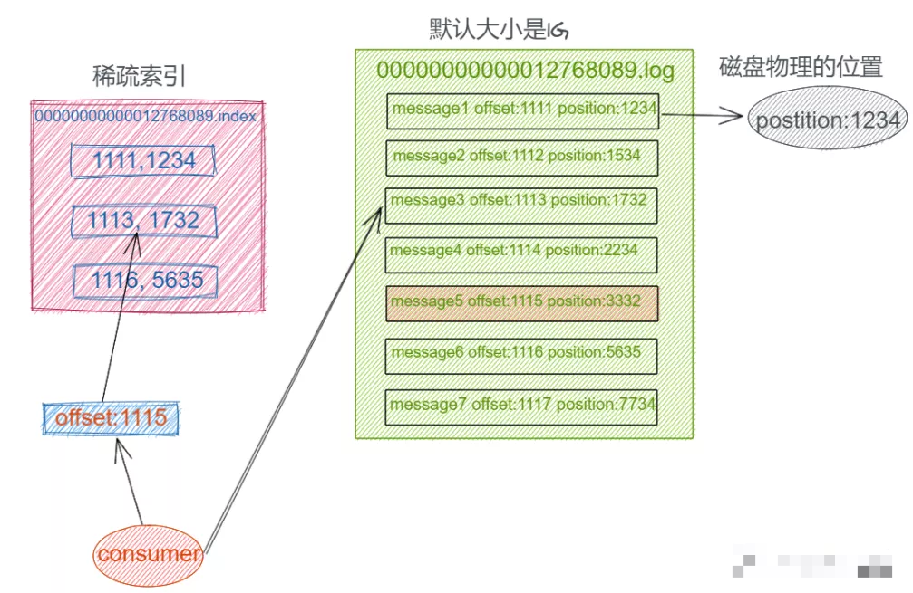
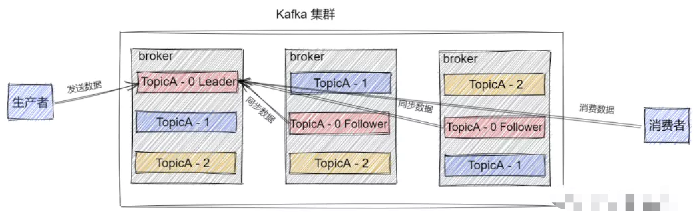

本文章来源于：<https://github.com/Zeb-D/my-review> ，请star 强力支持，你的支持，就是我的动力。

[TOC]

------


### 简介

  Kafka 是一个分布式的基于发布/订阅模式的消息队列（Message Queue），主要应用与大数据实时处理领域。其主要设计目标如下：

1.  以时间复杂度为O(1)的方式提供消息持久化能力，即使对TB级以上数据也能保证常数时间的访问性能
2.  高吞吐率。即使在非常廉价的机器上也能做到单机支持每秒100K条消息的传输
3.  支持Kafka Server间的消息分区，及分布式消费，同时保证每个partition内的消息顺序传输，同时支持离线数据处理和实时数据处理


### 消息队列的好处

1. 解耦：允许我们独立修改队列两边的处理过程而互不影响。
2. 冗余：有些情况下，我们在处理数据的过程会失败造成数据丢失。消息队列把数据进行持久化直到它们已经被完全处理，通过这一方式规避了数据丢失风险, 确保你的数据被安全的保存直到你使用完毕
3. 峰值处理能力：不会因为突发的流量请求导致系统崩溃，消息队列能够使服务顶住突发的访问压力, 有助于解决生产消息和消费消息的处理速度不一致的情况
4. 异步通信：消息队列允许用户把消息放入队列但不立即处理它, 等待后续进行消费处理。


**基础知识**

Kafka 一些重要概念，普及 Kafka 整体的认识和感知：

1. Producer：即消息生产者，向 Kafka Broker 发消息的客户端。
2. Consumer：即消息消费者，从 Kafka Broker 读消息的客户端。
3. Consumer Group：即消费者组，消费者组内每个消费者负责消费不同分区的数据，以提高消费能力。一个分区只能由组内一个消费者消费，不同消费者组之间互不影响。
4. Broker：一台 Kafka 机器就是一个 Broker。一个集群是由多个 Broker 组成的且一个 Broker 可以容纳多个 Topic。
5. Topic：可以简单理解为队列，Topic 将消息分类，生产者和消费者面向的都是同一个 Topic。
6. Partition：为了实现Topic扩展性，提高并发能力，一个非常大的 Topic 可以分布到多个 Broker 上，一个 Topic 可以分为多个 Partition 进行存储，每个 Partition 是一个有序的队列。
7. Replica：即副本，为实现数据备份的功能，保证集群中的某个节点发生故障时，该节点上的 Partition 数据不丢失，且 Kafka 仍然能够继续工作，为此Kafka提供了副本机制，一个 Topic 的每个 Partition 都有若干个副本，一个 Leader 副本和若干个 Follower 副本。
8. Leader：即每个分区多个副本的主副本，生产者发送数据的对象，以及消费者消费数据的对象，都是 Leader。
9. Follower：即每个分区多个副本的从副本，会实时从 Leader 副本中同步数据，并保持和 Leader 数据的同步。Leader 发生故障时，某个 Follower 还会被选举并成为新的 Leader , 且不能跟 Leader 在同一个broker上, 防止崩溃数据可恢复。
10. Offset：消费者消费的位置信息，监控数据消费到什么位置，当消费者挂掉再重新恢复的时候，可以从消费位置继续消费。
11. ZooKeeper服务：Kafka 集群能够正常工作，需要依赖于 ZooKeeper，ZooKeeper 帮助 Kafka 存储和管理集群元数据信息。在最新版本中, 已经慢慢要脱离 ZooKeeper。


### 集群架构

先来了解下kafka的工作流程, Kafka集群会将消息流存储在 Topic 的中，每条记录会由一个Key、一个Value和一个时间戳组成。



Kafka 中消息是以 Topic 进行分类的，生产者生产消息，消费者消费消息，读取和消费的都是同一个 Topic。

但是Topic 是逻辑上的概念， Partition 是物理上的概念，每个 Partition 对应一个 log 文件，该 log 文件中存储的就是 Producer 生产的数据。

**Producer 端生产的数据会不断顺序追加到该 log 文件末尾，并且每条数据都会记录有自己的 Offset**。

而消费者组中的每个消费者，也都会实时记录当前自己消费到了哪个 Offset，方便在崩溃恢复时，可以继续从上次的 Offset 位置消费。


### 存储机制



此时 Producer 端生产的消息会不断追加到 log 文件末尾，这样文件就会越来越大, 为了防止 log 文件过大导致数据定位效率低下，那么Kafka 采取了分片和索引机制。

它将每个 Partition 分为多个 Segment，每个 Segment 对应4个文件：“.index” 索引文件, “.log” 数据文件, “.snapshot” 快照文件, “.timeindex” 时间索引文件。

这些文件都位于同一文件夹下面，该文件夹的命名规则为：topic 名称-分区号。

例如, heartbeat心跳上报服务 这个 topic 有三个分区，则其对应的文件夹为 heartbeat-0，heartbeat-1，heartbeat-2这样。

```
➜  kafka ls
kafka-logs-c44e37ec1550
➜  kafka
➜  kafka cd kafka-logs-c44e37ec1550
➜  kafka-logs-c44e37ec1550 ls
cleaner-offset-checkpoint         replication-offset-checkpoint.tmp
log-start-offset-checkpoint       strconv-0
meta.properties                   test-0
recovery-point-offset-checkpoint  ydkafka-0
replication-offset-checkpoint
➜  kafka-logs-c44e37ec1550
➜  kafka-logs-c44e37ec1550 cd ydkafka-0
➜  ydkafka-0 ll
total 48
-rw-r--r--  1 yd  wheel    10M  9 30  2019 00000000000000000000.index
-rw-r--r--  1 yd  wheel   8.1K  9 30  2019 00000000000000000000.log
-rw-r--r--  1 yd  wheel    10M  9 30  2019 00000000000000000000.timeindex
-rw-r--r--  1 yd  wheel    10B  9 30  2019 00000000000000000060.snapshot
-rw-r--r--  1 yd  wheel     8B  9 30  2019 leader-epoch-checkpoint
```

index, log, snapshot, timeindex 文件以当前 Segment 的第一条消息的 Offset 命名。

其中 “.index” 文件存储大量的索引信息，“.log” 文件存储大量的数据，索引文件中的元数据指向对应数据文件中 Message 的物理偏移量。

下图为index 文件和 log 文件的结构示意图：




### Replica

kafka中的 Partition 为了保证数据安全，每个 Partition 可以设置多个副本。

此时我们对分区0,1,2分别设置3个副本（注:设置两个副本是比较合适的）。

而且每个副本都是有"角色"之分的，它们会选取一个副本作为 Leader 副本，而其他的作为 Follower 副本，我们的 Producer 端在发送数据的时候，只能发送到Leader Partition里面 ，然后Follower Partition会去Leader那自行同步数据, Consumer 消费数据的时候，也只能从 Leader 副本那去消费数据的。




### Controller

Kafka Controller，其实就是一个 Kafka 集群中一台 Broker，它除了具有普通Broker 的消息发送、消费、同步功能之外，还需承担一些额外的工作。

Kafka 使用公平竞选的方式来确定 Controller ，最先在 ZooKeeper 成功创建临时节点 /controller 的Broker会成为 Controller ，一般而言，Kafka集群中第一台启动的 Broker 会成为Controller，并将自身 Broker 编号等信息写入ZooKeeper临时节点/controller。


### Offset

Consumer 在消费过程中可能会出现断电宕机等故障，在 Consumer 恢复后，需要从故障前的 Offset 位置继续消费。所以 Consumer 需要实时记录自己消费到了哪个 Offset，以便故障恢复后继续消费。

在 Kafka 0.9 版本之前，Consumer 默认将 Offset 保存在 ZooKeeper 中，

但是从 0.9 版本开始，Consumer 默认将 Offset 保存在 Kafka 一个内置的 Topic 中，该 Topic 为 __consumer_offsets, 以支持高并发的读写。


