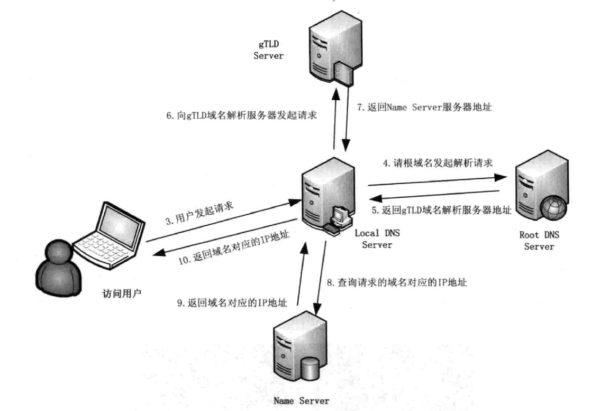
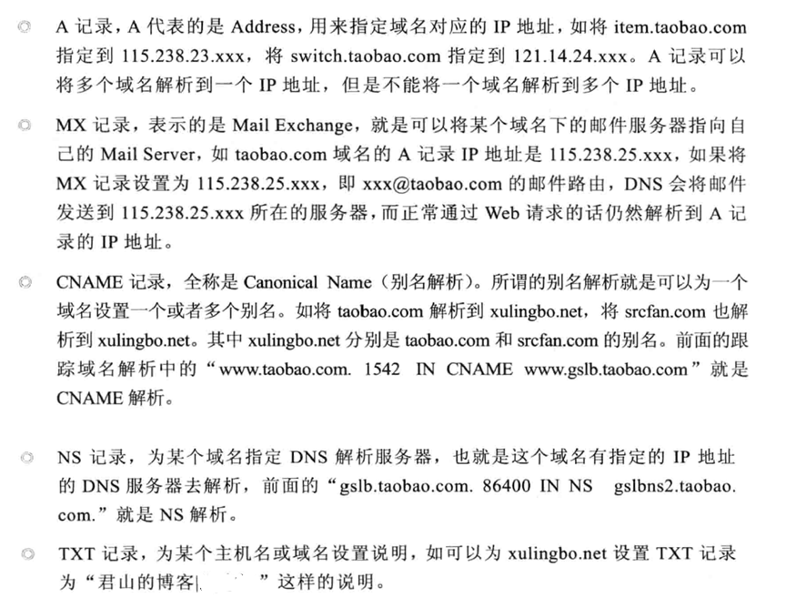

# DNS域名解析

互联网都是通过URL来发布和请求资源的，而URL中的域名需要解析成IP地址才能与远程主机建立连接。

那我们一起参观下DNS域名解析过程吧

## DNS域名解析过程

当一个用户在浏览器中输入 www.yd.com 时，DNS解析将会近10个步骤：

- 第1步，浏览器会检查缓存中有没有这个域名对应的解析过的IP地址，如果缓存中有，这个解析过程就结束。当然缓存在浏览器的域名也是有限制的，不仅浏览器缓存大小有限制，而且缓存是有时间的，域名被缓存的时间限制可以通过TTL属性来设置（不同浏览器设置入口不一样），当然缓存时间过长过短也不好，比如太长，一旦域名被解析的IP有变化，会导致缓存的IP无效，不能正常解析，缓存时间过短，就会导致重新解析域名频率过高。
- 第2步，如果用户的浏览器缓存中没有，浏览器会查找操作系统缓存中是否有这个域名对应DNS解析结果。其实操作系统也会存在一个域名解析过程，如Windows中可以通过C:\Windows\System32\drivers\etc\hosts 文件（Linux 在/etc/hosts）来设置的，你可以将任何域名解析到任何能访问的Ip地址。这里会发生**域名劫持**，如heck可以修改这个文件。
- 第3步，**如何知道域名服务器呢**？在我们网络配置中都会有“DNS服务器地址”这一项，这地址就是用于解决前面的2个步骤无法解析时，怎么办呢？操作系统会把这个域名发送给这里设置的LDNS(本地区的域名服务器)。这个DNS通常都提供给你本地互联网接入的一个DNS解析服务（就是供你接入互联网的应用提供商--SPA 提供该服务 的）。不过你可以在Windows通过ipconfig （如果不能看到 DNS 服务器 这属性，请使用ipconfig -all）查询到该地址，在Linux可以查看 /etc/resolv.conf 文件中的nameserver 属性。
- 第4步，如果第3步 LDNS仍然没有命中，就直接到 Root Server 域名解析服务器请求解析
- 第5步，根域名服务器返回给本地域名服务器一个所查询域的主域名服务器(gTLD Server)地址。gTLD 是国际顶级域名服务器，如.com 、.cn 、.org 等，全球只有13台左右（所以现在专家们想推出IPv6，增加根域名服务器）。
- 第6步，本地域名服务器（Local DNS Server）再向上一步返回的gTLD服务器发送请求。
- 第7步，接受请求的gTLD服务器查找并返回此域名对应的Name Server 域名服务器的地址，这个Name Server 通常就是你注册的域名服务器。例如你在某个域名服务提供商申请的域名，那么域名解析任务就由这个域名提供商的服务器来完成。
- 第8步，Name server 域名服务器会查询存储的域名和IP的映射关系表，正常情况下，都根据域名得到目标IP记录，连同一个TTL值返回给DNS域名服务器。
- 第9步，返回该域名对应的IP和TTL值，Local DNS Server 会缓存这个域名和IP的映射，缓存时间有TTL值控制。
- 第10步，把解析的结果返回给用户，用户根据TTL值缓存在本地系统缓存中，域名解析过程Over！

敲了这么多字，看枯燥了，那就贴DNS域名解析过程图吧。

 

## 跟踪域名解析过程

在Linux和Windows下都可以使用nslookup 命令（这命令在Java中在Inet4AddressImpl.lookupAllHostAddr(String hostname) 本地方法使用到）来查询域名的解析结果。

在Linux下还可以使用dig 命令来查询DNS的解析过程。

大家有兴趣 可以手动 试试。

## 清除缓存的域名

我们只能清除本地机器中缓存

在Windows下，可以使用ipconfig/flushdns

在Linux下，可以使用 /etc/init.d/nscd restart 

在java中的JVM也会缓存DNS的解析结果，这个是缓存在InetAddress类完成的，而且缓存时间比较特殊，不过它支持两种缓存策略：

- 正确解析结果缓存
- 失败的解析结果缓存

这两个缓存时间由两个配置项来控制的，配置文件是 %JAVA_HOME/lib/security/java.security

配置项分别为： networkaddress.cache.ttl  和networkaddress.cache.negative.ttl ，它们的默认值 分别是 -1（永不失效）和10 （缓存10秒）。

 

## 域名解析方式

大家追踪域名解析过程，产生的域名解析记录。

这解析记录主要分为A、MX、CNAME、NS、TXT记录。

 

本文章纯手动，请转载注明：<https://github.com/Zeb-D/my-review>

