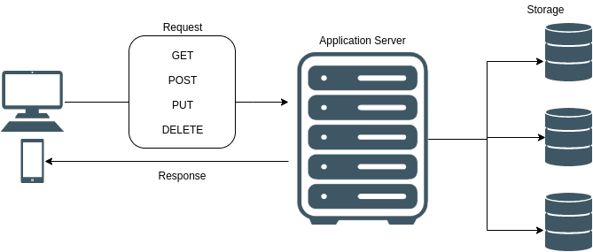

本文章来源于：<https://github.com/Zeb-D/my-review> ，请star 强力支持，你的支持，就是我的动力。

[TOC]

------


## 一、你的 API 应该用哪项技术？

自从 2015 年 Facebook 开源 GraphQL 规范以来，它就在前端 Web 开发中迅速流行起来。

**为什么这种新技术会突然流行起来？**


**与传统 REST API 相比，GraphQL 提供了哪些优势？**


我们将讨论 GraphQL 的设计原则，比较 GraphQL 与 REST 中的相同请求，并深入探讨 GraphQL 相对其他架构的优点。


为理解 GraphQL 作为 API 架构的好处，我们要讨论 API 在客户端 - 服务器结构中的作用。API（应用程序编程接口）是一个中间层，它允许服务器从客户端接收结构化数据请求，并针对请求的数据发送结构化的响应。设计 API 架构的方法有很多种。


让我们来研究一下促使 GraphQL 适合现代化 Web 应用程序的重要基本设计原则。


## 二、GraphQL 服务器的设计原则


GraphQL 规范概括了 5 个设计原则，这使其成为现代前端开发的良好解决方案。我们看一下 GraphQL 的设计原则，并以 Facebook 新闻推送作为我们的用例。

1. **查询为分层结构**，使用将查询与响应数据1对1匹配的分层和嵌套字段格式。查询和响应的形状类似于树，可查询每个项的其他嵌套字段。在 Facebook 的新闻推送中，这种结构允许一个查询返回一个帖子列表、每个特定帖子的评论，以及每个评论的点赞。
2. **该结构以产品为中心，关注前端希望如何接收数据，并构建交付所需的运行时**。这使得 Facebook 的新闻推送可通过一次请求从后端获取需要的所有数据，使服务器按照 GraphQL 的规范从不同的端点获取数据。
3. **它使用特定于应用程序的类型系统**，该系统使开发人员能在执行前确保查询使用了有效类型，并且语法正确。例如，新闻推送的 GraphQL 模式要求字段“user”必须包含一个字符串，而“likes”必须包含一个数字。如果查询试图添加不同类型的输入，GraphQL 将在执行查询前抛出一个错误。
4. **GraphQL 查询是在客户端指定的，因此，客户端确切知道它将以何种格式接收数据**。这意味着，如果前端请求的格式是包含用户名、评论和点赞的 post 数据，那么来自 Facebook 新闻推送的请求会构建在一个对象中，而不是像其他架构那样构建多个单独的数据块。
5. **使用 GraphQL 的服务器结构必须是内省的**，或者可由 GraphQL 自己查询。于是才有了像 [GraphiQL](https://github.com/graphql/graphiql) 或 [GraphQL playground](https://www.apollographql.com/docs/apollo-server/testing/graphql-playground/) 这样的强大工具。这两种工具都可以让 Facebook 开发人员准确地看到在他们的服务器上使用了哪些查询和字段。

为讨论向 GraphQL 的转变，以及这些设计原则如何给开发带来好处。

我们首先深入了解传统的 REST API 架构和它的不足之处。


## 三、传统的 RESTful 架构


REST 架构的设计范式侧重于分配 HTTP 请求方法（GET、POST、PUT、PATCH、DELETE）和 URL 端点之间的关系。



在 REST 架构中，方法和端点的每个组合得到不同的封装功能。如果客户端需要的数据特定端点 / 方法不提供，则可能需要额外请求。从 REST 请求返回的数据格式依赖于端点—不能保证这些数据会按照前端需要的方式进行格式化。为使用来自响应的数据（格式与缺省情况下从端点返回的格式不同），必须在客户端编写数据解析和数据操作。


接下来，让我们看看 GraphQL 规范与 REST 的不同之处，以及它的优点。这些优点使这个新架构成为特别适合解决客户端和服务器之间数据交付问题的解决方案。


## 四、GraphQL 架构


与 RESTful API 一样，GraphQL API 设计用于处理 HTTP 请求并对这些请求提供响应。无论如何，这就是相似之处。REST API 构建在请求方法和端点之间的连接上，而 GraphQL API 被设计为只通过一个端点，始终使用 POST 请求进行查询，其 URL 通常是 yourdomain.com/graphql。


请求到达 GraphQL 端点后，客户端请求的载荷完全在请求体中处理。这个请求体必须遵循 GraphQL 规范，API 必须有适当的服务器端逻辑来处理这些请求并提供适当的响应。


这提供了比 RESTful API 更流畅的客户端体验，后者可能要求客户端针对多个数据块发出多个请求，并在数据返回后进行操作。


为了阐明 GraphQL 是如何实现这一点的，让我们分解一下 GraphQL 服务器的结构。


## 五、GraphQL 服务器


启用 GraphQL 逻辑的服务器端逻辑由定义了服务器功能的 Documents 组成。这些 Documents 包含可执行文件和类型系统定义。顾名思义，类型系统定义为每个数据字段定义可接受的类型和格式输入及结果。


可执行文件包含要处理的可能的操作列表，其中包括操作类型（查询、修改或订阅）、操作名称、要查询或写入的字段和一个选择集，该选择集准确定义了将从操作返回的数据。选择集是 GraphQL 的最大价值所在——它们允许客户端查询特定的数据集并接收包含所请求信息的响应：不多不少。


有关 GraphQL 规范的结构和语法的更多信息，请参阅 [GraphQL 的文档](https://graphql.github.io/graphql-spec/June2018/#sec-Overview)。


接下来，我们将看下 GraphQL 中查询的结构。


## 六、GraphQL 查询解析


下面是一个结构化的 GraphQL 查询，用于获取特定书籍的数据，包括作者的姓和名。


```
GET /graphql?query={ books(id:12) { authors { firstName, lastName } title, yearPublished, length } 
{ 
  Query {                 //  operation type
  books (id:12) {         //  operation endpoint
     authors {            //  requested fields
        firstName
        lastName
     } 
     title
     yearPublished    
    }
  }
}

```


这一切都可以通过一个查询由 GraphQL 服务器逻辑解析和处理完成。当把它与 REST 架构中相同结构的请求进行比较时，GraphQL 的优势就开始显现出来了。


让我们看看下面的 REST 请求结构，然后重点讨论其中的一些差异！


## 七、REST 请求解析


要向 REST API 发出相同的请求，客户端首先需要向能够返回图书数据的端点发送一个请求，并将图书 id 作为参数传入：


```
GET /books/12
```


这个请求可能会返回一个包含特定图书所有数据的对象，例如：


```
{ 
  “title” : “The Hitchhiker's Guide to the Galaxy”,
  “authorID”: 42,
  “yearPublished” : 1978,
  “length”: 208,
  “genre”: “Science Fiction”
}

```


在我们的例子里，与相同的 GraphQL 查询相比，该响应有两个缺点：


1. REST 响应包含类似 genre 这样的额外数据，返回的信息超出了我们的需求。
2. REST 需要再发送一个请求来获得我们实际上正在查找的数据：这个特定作者的所有书籍。


为了获得这些数据，我们需要使用我们的 authorID 发出一个额外的请求：


```
GET /authors/42
```


这个请求的响应应该包含我们正在查找的所有数据：


```
{ 
  “firstName” : “Douglas”,
  “lastName”: “Adams”
}
```


现在我们已经有了需要的所有书籍和作者数据，响应解析由客户端完成。现在，前端应用程序必须将来自不同端点的数据组合在一起，用于实现期望的功能。总的来说，与 REST API 相比，GraphQL 提供的性能优势可以为前端开发人员带来回报。使用 GraphQL 规范创建服务器可能需要更多的设置以及编写预测性的服务器端逻辑来解析和处理请求。


虽然 GraphQL 的设置成本可能比传统的 REST 架构要高，但是，更易于维护的代码、健壮的开发工具和精简的客户端查询所带来的好处通常会超过成本。


**英文原文：**


[GraphQL vs. REST API Architecture](https://medium.com/swlh/graphql-vs-rest-api-architecture-3b95a77512f5)