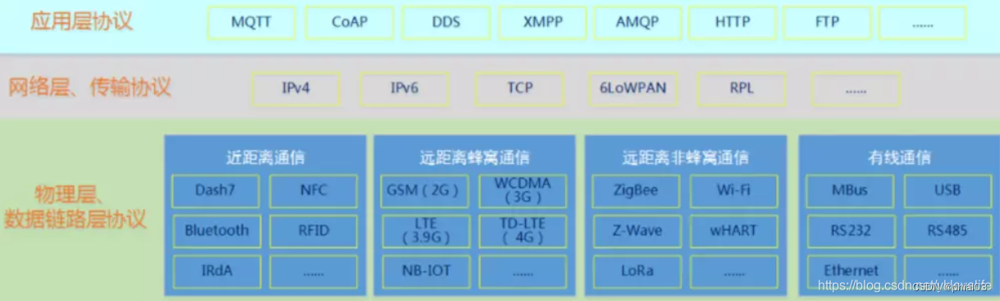
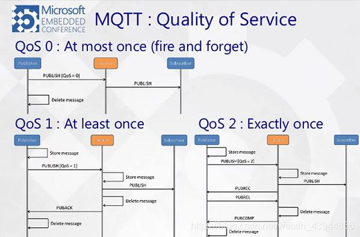
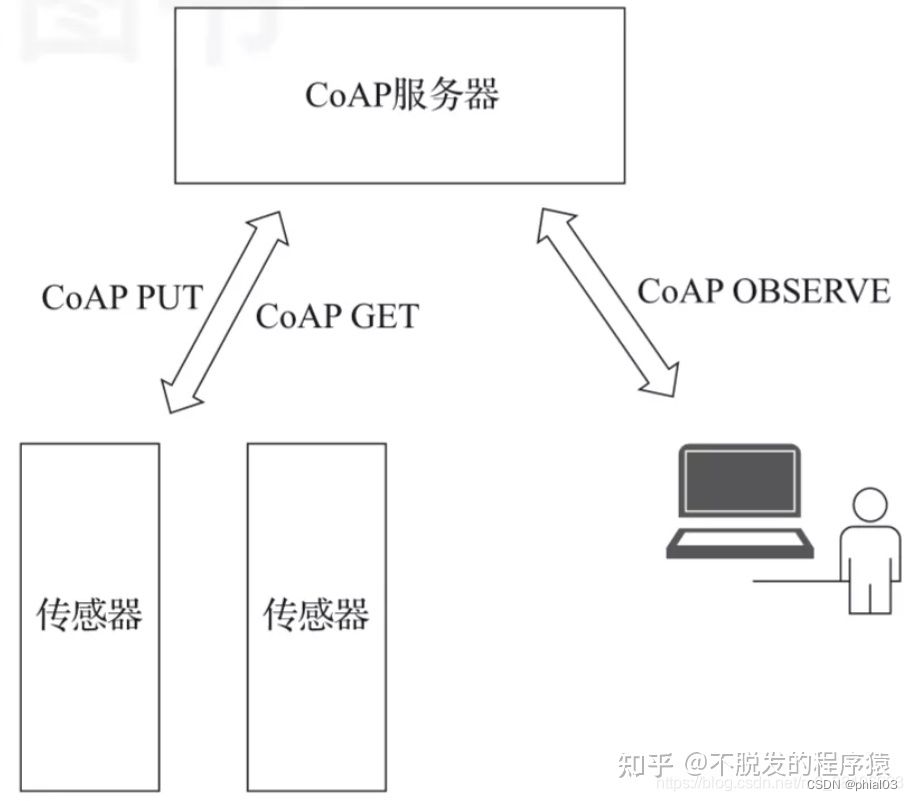
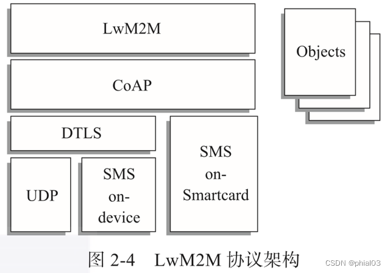
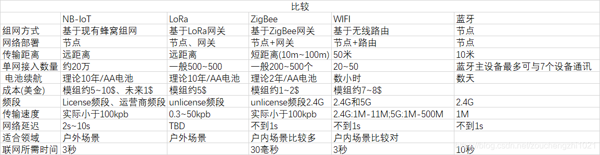
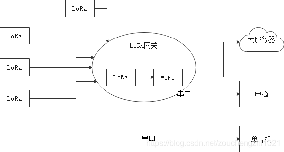

本文章来源于：https://github.com/Zeb-D/my-review ，请star 强力支持，你的支持，就是我的动力。

[TOC]

------

### 一、按网络四层协议分类

物理层协议：NB-IoT，LORA，WIFI，蓝牙，zigbee，4G，这几个都需要芯片模组支持（硬件支持）

应用层协议：MQTT，COAP，HTTP，这些需要开发服务器，或者对接云平台厂商（软件支持）

### 二、按需要网关来分类

直连：NB-IoT，4G（芯片可以直接连上移动，联通，电信运营商）

网关代理：LORA，WIFI，zigbee（不能直接连上电信运营商，需要通过一个网关中转才能连上电信运营商）

蓝牙：比较特别，是两个蓝牙设备之间互联

### 三、物理层协议对比

常见物联网协议
主流物联网协议

#### （1）NB-IoT，4G对比

NB-IoT：低功耗，传输小数据，传输速度底，芯片模组和套餐便宜

4G：传输速度快和可以传输大的数据，但是功耗高，价格贵

#### （2）WIFI和zigbee对比：

wifi ：功耗高，传输数据快，一个路由只能加入较少设备

zigbee：功耗低，传输数据慢，可以中继，一个zigbee网关可以加入成千上万的zigbee设备

#### LoRa WAN协议

LoRaWAN协议是由LoRa联盟提出并推动的一种低功率广域网协议

LoRa和我们之前介绍的几种协议有所不同。MQTT协议、CoAP协议都是运行在应用层，底层使用TCP协议或者UDP协议进行数据传输，整个协议栈运行在IP网络上。而LoRaWAN协议则是物理层/数据链路层协议，它解决的是设备如何接入互联网的问题，并不运行在IP网络上。

LoRa（Long Range）是一种无线通信技术，它具有使用距离远、功耗低的特点。在上面的场景下，用户就可以使用LoRaWAN技术进行组网，在工程设备上安装支持LoRa的模块。

通过LoRa的中继设备将数据发往位于隧道外部的、有互联网接入的LoRa网关，LoRa网关再将数据封装成可以在IP网络中通过TCP协议或者UDP协议传输的数据协议包（比如MQTT协议），然后发往云端的数据中心。

#### NB-IoT协议

NB-IoT（Narrow Band Internet of Things）协议和LoRaWAN协议一样，是将设备接入互联网的物理层/数据链路层的协议。

与LoRA不同的是，NB-IoT协议构建和运行在蜂窝网络上，消耗的带宽较低，可以直接部署到现有的GSM网络或者LTE网络。设备安装支持NB-IoT的芯片和相应的物联网卡，然后连接到NB-IoT基站就可以接入互联网。而且NB-IoT协议不像LoRaWAN协议那样需要网关进行协议转换，接入的设备可以直接使用IP网络进行数据传输。

NB-IoT协议相比传统的基站，增益提高了约20dB，可以覆盖到地下车库、管道、地下室等之前信号难以覆盖的地方。

### 四、网络层传输协议

#### TCP

TCP是一种面向连接、可靠的、基于字节流的传输层通信协议

特点：

面向连接
可靠通信方式
基于流的方式
缺点：

花销大
设备必须时刻保持连接状态（功耗大）
消耗时间比较久

#### UDP

用户数据报协议，支持一个无连接的传输协议，UDP更适合对功率小、可靠性要求不高的场合

特点：

*不需要连接，不可靠
*速度快
*不需要应答

缺点：

不可靠

### 五、应用层协议

#### 1、MQTT

mqtt 消息队里遥感勘测传输（MQ Telemetry Transport，简称MQTT）是一个基于TCP协议、发布/订阅模式的应用层传输协议。MQTT协议是轻量、简单、开放和易于实现的，这些特点使它适用范围非常广泛。

在很多情况下，包括受限的环境中，如：机器与机器（M2M）通信和物联网（IoT）、卫星链路通信传感器、偶尔拨号的医疗设备、智能家居、及一些小型化设备中已广泛使用

> 特别适合于网络代价昂贵、带宽低、不可靠的环境。
> 
> 能在处理和内存资源有限的嵌入式设备中运行。
> 使用发布/订阅消息模式，提供一对多的消息发布，从而解除应用程序耦合。
> 
> 使用TCP/IP提供网络连接，
> 
> 提供3种消息的QoS（Quality of Service）：至多一次、最少一次、只有一次
> 
> 收发消息都是异步的，发送方不需要等待接收方应答
> 
> 提供Last Will 和 Testament特性通知有关各方客户端异常中断的机制。

具体详解见[IOT网络协议之MQTT.md](./IOT网络协议之MQTT.md)

#### 2、CoAP

CoAP 是一个基于 REST 模型的网络传输协议。主要用于轻量级 M2M 通信。由于物联网中的很多设备都是资源受限型的，即只有少量的内存空间和有限的计算能力，所以传统的 HTTP 协议应用在物联网上就显得过于庞大而不适用，CoAP 应运而生。

就用户可见性而言，CoAP 模拟了 HTTP 协议，并从这个角度来看，读数传感器数据本质上是像做一个 HTTP 请求。

CoAP 被认为是一种不会过时的技术协议，根据 Grtner 预测，500 亿台设备将会连接到互联网，未来进一步发展将迫切需要低成本、低能耗的设备。CoAP协议被设计用于与 10 kb RAM 一样的系统。

CoAP 更有趣的功能之一是能够发现网络中的节点。这对于低功耗无线传感器网络的自治和自我修复设计非常有用。关于无线传感器网络的可扩展性问题，可以使用 CoAP 协议来发现节点常规的冗余。

CoAP 是建立在 UDP 栈上，这是与 HTTP 或 MQTT 相比最主要的区别。它可以更加快速和更好的资源优化，而非资源密集型。

然而，在 CoAP 协议下 QoS 因素保持不变情况下，CoAP 相比 HTTP/MQTT 更加不可靠。但是 4 字节的头文件对于连续流系统如环境监测传感器网络是一个不错的选择。

- CoAP协议网络传输层UDP
- 它基于REST，server的资源地址和互联网一样也有类似url的格式。客户端同样有POST，GET，PUT,DELETE方法来访问server，对HTTP做了简化。
- CoAP是二进制格式，HTTP是文本格式，CoAP比HTTP更加紧凑
- 轻量化、CoAP最小长度仅仅4KB，一个HTTP的头都几十个B了
- 支持可靠传输，数量重传、块传输。确保数据可靠到达
- 非长连接通信，适用于低功耗物联网场景

​                   CoAP	MQTT
通信机制	同步	异步
连接方式	UDP	TCP
使用场景	物联网	更适合推送
功耗	       低	高
支持平台	阿里云、百度、腾讯QQ物联等	华为、中兴、移动
反向控制	不支持	支持

MQTT协议是保持连接的，所以及时性相对很好。
CoAP协议是无连接响应式通讯，因此不能主动推送，要等客户端访问才可以携带回去，及时性相对较差。

#### 3、HTTP

HTTP是基于客户/服务器模式，且面向连接的（建立在TCP之上）。典型的HTTP事务处理有如下的过程：

1.客户与服务器建立连接
2.客户向服务器提出请求
3.服务器接收请求，并根据请求返回相应的文件作为应答
4.客户端读取数据解析数据包
5.客户与服务器关闭连接

缺点：
必须有客户端主动向服务器发送请求，服务器无法主动通知客户端
使用HTTP需要更多硬件资源（硬件成本更高）

结论：
不适合物联网

#### 4、LwM2M

LwM2它的全称是Lightweight Machine-To-Machine，协议底层使用CoAP协议传输数据和信令。而在LwM2M协议的架构中，CoAP协议可以运行在UDP或者SMS（短信）之上，通过DTLS（数据报传输层安全）来实现数据的安全传输。

LwM2M协议架构主要包含3种实体——LwM2M Bootstrap Server、LwM2M Server和LwM2M Client。

LwM2M Bootstrap Server负责引导LwM2M Client注册并接入LwM2M Server，之后LwM2M Server和LwM2M Client就可以通过协议指定的接口进行交互了。

重要含义：

> 轻量级的
> 适用于物联网设备
> 适用于资源有限的终端设备管理的轻量级物联网协议

### 六、物联网组网技术

#### （1）WIFI

优点：
设备可接入互联网
避免布线

缺点：
距离近（50米）
功耗大
必须有热点
连接数量少（一般最多16台设备）

应用场景：
天猫精灵、独立工作的家电

#### （2）蓝牙

缺点：
功耗大
连接过程繁琐
安全性低
距离近（50米）
不可直接接入互联网
连接数量少

应用场景：
蓝牙音箱、键盘

#### （3）ZigBee

ZigBee是一种低速短距离传输的无线协议

优点：
低速、低耗电、低成本
支持大量节点（最多65000个）
自组网

缺点：
不可接入互联网
短距离（10到100米）
穿透性差

应用场景：
智能家居（小米）

#### （4）2G/4G/5G移动网络

优点：
远距离（10KM）
可接入互联网
移动性强

缺点：
4G/5G成本高，功耗大
2G即将退网

应用场景：
共享单车、丰巢

#### （5）NB-IoT

窄带物联网（Narrow Band Internet of Things,NB-IoT）可直接部署于GSM网络（2G）、UMTS网络或LTE网络（4G），以降级部署成本、实现平滑升级。

优点：
远距离（10KM）
低功率
可接入互联网（手机卡）
移动性强

缺点：
需要基站支持，这几年高速发展、慢慢覆盖全国
某些地区没信号

#### （6）LoRa

LoRa是低功耗局域网无线标准

优点：
远距离（城镇2~5KM，郊区15KM）
低功耗（据说电池可工作10年）
安全（AES128加密）

缺点：
速度慢
不可接入互联网
应用场景：

农业信息化、环境监测、智能抄表

##### （7）网关

LoRa或ZigBee不能直接接入互联网，所以需要用到网关

网关又称网间连接器、协议转换器。网关在网络层以上实现网络互联，是复杂的网络互联设备，仅用于两个高层协议的网络互联；

