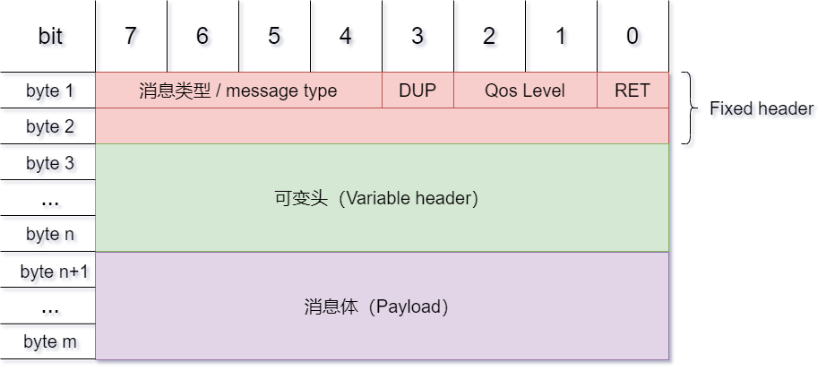
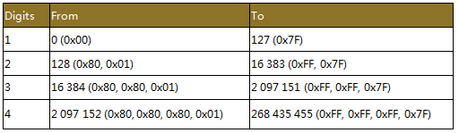
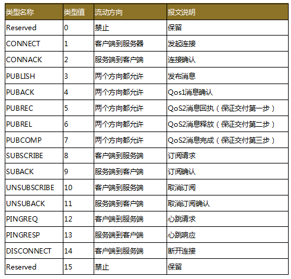
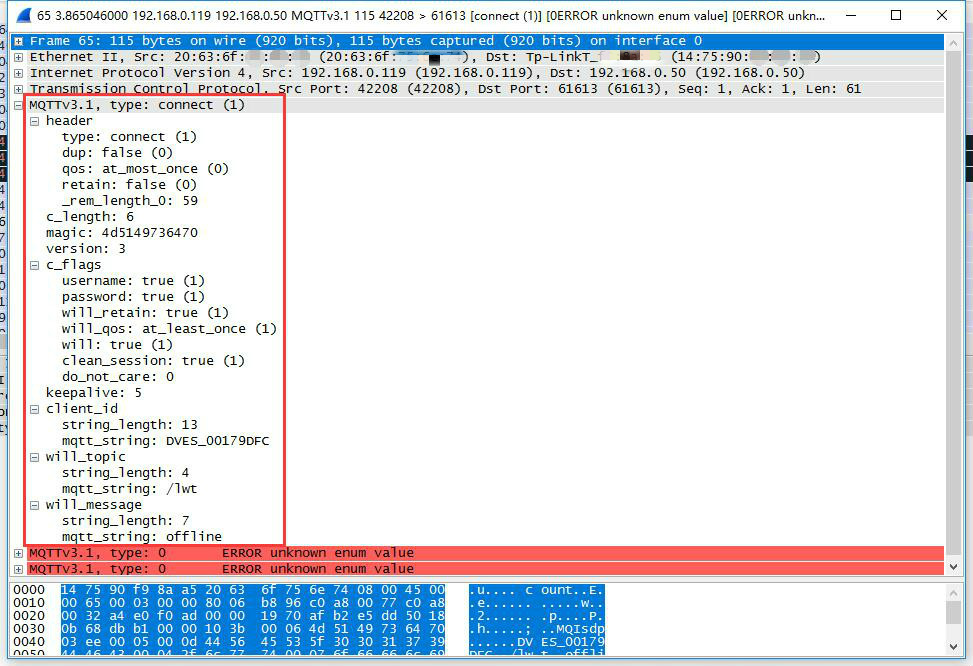
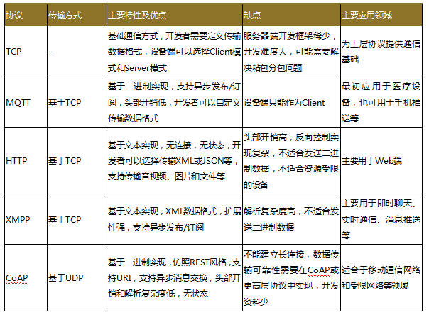

[TOC]

------

### MQTT是什么？

MQTT（Message Queuing Telemetry Transport，消息队列遥测传输协议），是一种基于发布/订阅（Publish/Subscribe）模式的轻量级通讯协议，该协议构建于TCP/IP协议上，由IBM在1999年发布，目前最新版本为v3.1.1。

MQTT最大的优点在于可以以极少的代码和有限的带宽，为远程设备提供实时可靠的消息服务。做为一种低开销、低带宽占用的即时通讯协议，MQTT在物联网、小型设备、移动应用等方面有广泛的应用。

当然，在物联网开发中，MQTT不是唯一的选择，与MQTT互相竞争的协议有XMPP和CoAP协议等，文章末尾会有一个比较和说明。

### MQTT是哪一层的协议？

众所周知，TCP/IP参考模型可以分为四层：应用层、传输层、网络层、链路层。TCP和UDP位于传输层，应用层常见的协议有HTTP、FTP、SSH等。MQTT协议运行于TCP之上，属于应用层协议，因此只要是支持TCP/IP协议栈的地方，都可以使用MQTT。

### MQTT消息格式

每条MQTT命令消息的消息头都包含一个固定的报头，有些消息会携带一个可变报文头和一个负荷。消息格式如下：

固定报文头 | 可变报文头 | 负荷



#### 固定报文头（Fixed Header）

MQTT固定报文头最少有两个字节，

第一字节包含消息类型（Message Type）和QoS级别等标志位。

第二字节开始是剩余长度字段，该长度是后面的可变报文头加消息负载的总长度，该字段最多允许四个字节。

剩余长度字段单个字节最大值为二进制0b0111 1111，16进制0x7F。也就是说，单个字节可以描述的最大长度是127字节。为什么不是256字节呢？因为MQTT协议规定，单个字节第八位（最高位）若为1，则表示后续还有字节存在，第八位起“延续位”的作用。

例如，数字64，编码为一个字节，十进制表示为64，十六进制表示为0×40。数字321（65+2*128）编码为两个字节，重要性最低的放在前面，第一个字节为65+128=193（0xC1），第二个字节是2（0x02），表示2×128。

由于MQTT协议最多只允许使用四个字节表示剩余长度（如表1），并且最后一字节最大值只能是0x7F不能是0xFF，所以能发送的最大消息长度是256MB，而不是512MB。



#### 可变报文头（Variable Header）

可变报文头主要包含协议名、协议版本、连接标志（Connect Flags）、心跳间隔时间（Keep Alive timer）、连接返回码（Connect Return Code）、主题名（Topic Name）等，后面会针对主要部分进行讲解。

#### 有效负荷（Payload）

Payload直译为负荷，可能让人摸不着头脑，实际上可以理解为消息主体（body）。

当MQTT发送的消息类型是CONNECT（连接）、PUBLISH（发布）、SUBSCRIBE（订阅）、SUBACK（订阅确认）、UNSUBSCRIBE（取消订阅）时，则会带有负荷。

### MQTT的主要特性

#### MQTT的消息类型（Message Type）

固定报文头中的第一个字节包含连接标志（Connect Flags），连接标志用来区分MQTT的消息类型。

MQTT协议拥有14种不同的消息类型（如表2），可简单分为连接及终止、发布和订阅、QoS 2消息的机制以及各种确认ACK。至于每一个消息类型会携带什么内容，这里不多阐述。




#### 消息质量（QoS）

MQTT消息质量有三个等级，QoS 0，QoS 1和 QoS 2。

QoS 0：最多分发一次。消息的传递完全依赖底层的TCP/IP网络，协议里没有定义应答和重试，消息要么只会到达服务端一次，要么根本没有到达。
QoS 1：至少分发一次。服务器的消息接收由PUBACK消息进行确认，如果通信链路或发送设备异常，或者指定时间内没有收到确认消息，发送端会重发这条在消息头中设置了DUP位的消息。
QoS 2：只分发一次。这是最高级别的消息传递，消息丢失和重复都是不可接受的，使用这个服务质量等级会有额外的开销。

通过下面的例子可以更深刻的理解上面三个传输质量等级。

比如目前流行的共享单车智能锁，智能锁可以定时使用QoS level 0质量消息请求服务器，发送单车的当前位置，如果服务器没收到也没关系，反正过一段时间又会再发送一次。

之后用户可以通过App查询周围单车位置，找到单车后需要进行解锁，这时候可以使用QoS level 1质量消息，手机App不断的发送解锁消息给单车锁，确保有一次消息能达到以解锁单车。

最后用户用完单车后，需要提交付款表单，可以使用QoS level 2质量消息，这样确保只传递一次数据，否则用户就会多付钱了。


#### 遗愿标志（Will Flag）

在可变报文头的连接标志位字段（Connect Flags）里有三个Will标志位：Will Flag、Will QoS和Will Retain Flag，这些Will字段用于监控客户端与服务器之间的连接状况。如果设置了Will Flag，就必须设置Will QoS和Will Retain标志位，消息主体中也必须有Will Topic和Will Message字段。

那遗愿消息是怎么回事呢？服务器与客户端通信时，当遇到异常或客户端心跳超时的情况，MQTT服务器会替客户端发布一个Will消息。当然如果服务器收到来自客户端的DISCONNECT消息，则不会触发Will消息的发送。
因此，Will字段可以应用于设备掉线后需要通知用户的场景。

#### 连接保活心跳机制（Keep Alive Timer）

MQTT客户端可以设置一个心跳间隔时间（Keep Alive Timer），表示在每个心跳间隔时间内发送一条消息。如果在这个时间周期内，没有业务数据相关的消息，客户端会发一个PINGREQ消息，相应的，服务器会返回一个PINGRESP消息进行确认。

如果服务器在一个半（1.5）心跳间隔时间周期内没有收到来自客户端的消息，就会断开与客户端的连接。心跳间隔时间最大值大约可以设置为18个小时，0值意味着客户端不断开。

#### MQTT其他特点

异步发布/订阅实现
发布/订阅模式解耦了发布消息的客户（发布者）与订阅消息的客户（订阅者）之间的关系，这意味着发布者和订阅者之间并不需要直接建立联系。
这个模式有以下好处：

发布者与订阅者只需要知道同一个消息代理即可；
发布者和订阅者不需要直接交互；
发布者和订阅者不需要同时在线。
由于采用了发布/订阅实现，MQTT可以双向通信。也就是说MQTT支持服务端反向控制设备，设备可以订阅某个主题，然后发布者对该主题发布消息，设备收到消息后即可进行一系列操作。

#### 二进制格式实现

MQTT基于二进制实现而不是字符串，比如HTTP和XMPP都是基于字符串实现。由于HTTP和XMPP拥有冗长的协议头部，而MQTT固定报文头仅有两字节，所以相比其他协议，发送一条消息最省流量。

### MQTT的安全

由于MQTT运行于TCP层之上并以明文方式传输，这就相当于HTTP的明文传输，使用Wireshark可以完全看到MQTT发送的所有消息，消息指令一览无遗，如图1所示。


图1 Wireshark抓取MQTT数据包
这样可能会产生以下风险：

设备可能会被盗用；
客户端和服务端的静态数据可能是可访问的（可能会被修改）；
协议行为可能有副作用（如计时器攻击）；
拒绝服务攻击；
通信可能会被拦截、修改、重定向或者泄露；
虚假控制报文注入。
作为传输协议，MQTT仅关注消息传输，提供合适的安全功能是开发者的责任。安全功能可以从三个层次来考虑——应用层、传输层、网络层。

应用层：在应用层上，MQTT提供了客户标识（Client Identifier）以及用户名和密码，可以在应用层验证设备。
传输层：类似于HTTPS，MQTT基于TCP连接，也可以加上一层TLS，传输层使用TLS加密是确保安全的一个好手段，可以防止中间人攻击。客户端证书不但可以作为设备的身份凭证，还可以用来验证设备。
网络层：如果有条件的话，可以通过拉专线或者使用VPN来连接设备与MQTT代理，以提高网络传输的安全性。
认证

#### MQTT支持两种层次的认证：

应用层：MQTT支持客户标识、用户名和密码认证；
传输层：传输层可以使用TLS，除了加密通讯，还可以使用X509证书来认证设备。
客户标识
MQTT客户端可以发送最多65535个字符作为客户标识（Client Identifier），一般来说可以使用嵌入式芯片的MAC地址或者芯片序列号。虽然使用客户标识来认证可能不可靠，但是在某些封闭环境或许已经足够了。


#### 用户名和密码

MQTT协议支持通过CONNECT消息的username和password字段发送用户名和密码。

用户名及密码的认证使用起来非常方便，不过由于它们是以明文形式传输，所以使用抓包工具就可以轻易的获取。

一般来说，使用客户标识、用户名和密码已经足够了，比如支持MQTT协议连接的OneNET云平台，就是使用了这三个字段作为认证。如果感觉还不够安全，还可以在传输层进行认证。

#### 在传输层认证

在传输层认证是这样的：MQTT代理在TLS握手成功之后可以继续发送客户端的X509证书来认证设备，如果设备不合法便可以中断连接。使用X509认证的好处是，在传输层就可以验证设备的合法性，在发送CONNECT消息之前便可以阻隔非法设备的连接，以节省后续不必要的资源浪费。而且，MQTT协议运行在使用TLS时，除了提供身份认证，还可以确保消息的完整性和保密性。

### 选择用户数据格式

MQTT协议只实现了传送消息的格式，并没有限制用户协议需要按照一定的风格，因此在MQTT协议之上，我们需要定义一套自己的通信协议。比如说，发布者向设备发布一条打开消息，设备可以回复一个消息并携带返回码，这样的消息格式是使用二进制、字符串还是JSON格式呢？下面就简单做个选型参考。

#### 十六进制/二进制

MQTT原本就是基于二进制实现的，所以用户协议使用二进制实现是一个不错的选择。虽然失去了直观的可读性，但可以将流量控制在非常小。其实对于单片机开发者来说十六进制并不陌生，因为单片机寄存器都是以位来操作的，芯片间通信也会使用十六进制/二进制。而对于没有单片机开发经验的工程师来说，十六进制/二进制可能就太原始了。下面我们继续看看还有没有其他方案。

#### 字符串

对单片机开发者来说，字符串也是一个选择。比如通过串口传输的AT指令就是基于字符串通信的。使用字符串方便了人阅读，但是对高级语言开发者来说，字符串依旧不是最佳选择，恐怕键值对（Key-Value）才是最优形式。

#### JSON

JSON中文全称是JavaScript对象标记语言，在这门语言中，一切都是对象。因此，任何支持的类型都可以通过JSON来表示，例如字符串、数字、对象、数组等。其语法规则是：

对象表示为键值对；
数据由逗号分隔；
花括号保存对象；
方括号保存数组。
JSON层次结构简洁清晰，易于阅读和编写，同时也易于机器解析和生成，有效提升网络传输效率。

对于单片机开发者，主流的微控制器软件开发工具Keil有提供JSON库，可以用于STC、STM32等微控制器开发，所以在微控制器上解析JSON不需要自己写一个JSON解析器或者移植了。

如果实在懒得使用JSON库生成或解析，也可以直接使用C语言中的sprintf生成JSON字符串，比如：

```
sprintf(buf, "{\"String\":\"%s\", \"Value\":%d}", "Hello World!", 12345);
```


这样就可以生成一个{“String”:”Hello World!”, “Value”:12345}JSON字符串了。

#### XML

MQTT协议只负责通信部分，用户协议可以自己选择，当然也可以选择复杂又冗长的XML格式。可是既然要选择MQTT+XML，为什么不考虑换为XMPP呢？

#### 小结

综上所述，MQTT+JSON是目前最优方案。协议简洁清晰、易于阅读、解析和生成等，也考虑了服务器端开发者和设备端开发者的开发成本。


### 有关MQTT的云平台和工具

#### 支持MQTT的云平台

目前，百度、阿里、腾讯的云平台都逐渐有了物联网开发套件：腾讯QQ物联平台内测中，阿里云物联网套件公测中，两者都需要进行申请试用，而百度云物联网套件已经支持MQTT并且可以免费试用一段时间。除了BAT三大家，下面再介绍一些其他支持MQTT的物联网云平台。

OneNET云平台：OneNET是由中国移动打造的PaaS物联网开放平台。平台能够帮助开发者轻松实现设备接入与设备连接，快速完成产品开发部署，为智能硬件、智能家居产品提供完善的物联网解决方案。OneNET云平台已经于2014年10月正式上线。
云巴：云巴（Cloud Bus）是一个跨平台的双向实时通信系统，为物联网、App和Web提供实时通信服务。云巴基于MQTT，支持Socket.IO协议，支持RESTful API。

#### MQTT服务器

如果不想使用云平台，只是纯粹地玩一下MQTT，或者只想在内网对设备进行监控，那么可以自己本地部署一个MQTT服务器。下面介绍几款MQTT服务器：

Apache-Apollo：一个代理服务器，在ActiveMQ基础上发展而来，可以支持STOMP、AMQP、MQTT、Openwire、SSL和WebSockets等多种协议，并且Apollo提供后台管理页面，方便开发者管理和调试。
EMQ：EMQ 2.0，号称百万级开源MQTT消息服务器，基于Erlang/OTP语言平台开发，支持大规模连接和分布式集群，发布订阅模式的开源MQTT消息服务器。
HiveMQ：一个企业级的MQTT代理，主要用于企业和新兴的机器到机器M2M通讯和内部传输，最大程度的满足可伸缩性、易管理和安全特性，提供免费的个人版。HiveMQ提供了开源的插件开发包。
Mosquitto：一款实现了消息推送协议MQTT v3.1的开源消息代理软件，提供轻量级的、支持可发布/可订阅的消息推送模式。

#### MQTT调试工具

知道了各大平台的MQTT，同时自己也可以在内网部署MQTT服务器，那接下来没有调试工具怎么行呢，难道要用自己喜欢的语言编写一个？当然不需要。MQTT调试工具可以考虑使用HiveMQ的MQTT客户端——HiveMQ Websockets Client，这是一款基于WebSocket的浏览器MQTT客户端，支持主题订阅和发布。



### MQTT与其他协议

目前各大平台都开始支持MQTT协议，MQTT相比其他协议有什么优势呢？物联网设备能不能用其他的协议呢？下面是MQTT与其他部分协议的比较，给大家作为参考。

#### MQTT与TCP Socket

虽然MQTT运行于TCP层之上，看起来这两者之间根本没有比较性，但笔者觉得还是有必要叙述一番，因为大多数从事硬件或嵌入式开发的工程师，都是直接在TCP层上通信的。从事嵌入式开发工作的人都应该知道LwIP，LwIP是一套用于嵌入式系统的开放源代码TCP/IP协议栈，LwIP在保证嵌入式产品拥有完整的TCP/IP功能的同时，又能保证协议栈对处理器资源的有限消耗，其运行一般仅需要几十KB的RAM和40KB左右的ROM。

也就是说，只要是嵌入式产品使用了LwIP，就支持TCP/IP协议栈，进而可以使用MQTT协议。

由于TCP协议有粘包和分包问题，所以传输数据时需要自定义协议，如果传输的数据报超过MSS（最大报文段长度），一定要给协议定义一个消息长度字段，确保接收端能通过缓冲完整收取消息。一个简单的协议定义：消息头部+消息长度+消息正文。

当然，使用MQTT协议则不需要考虑这个问题，这些MQTT都已经处理好了，MQTT最长可以一次性发送256MB数据，不用考虑粘包分包的问题。

总之，TCP和MQTT本身并不矛盾，只不过基于Socket开发需要处理更多的事情，而且大多数嵌入式开发模块本身也只会提供Socket接口供厂家自定义协议。

#### MQTT与HTTP

HTTP最初的目的是提供一种发布和接收HTML页面的方法，主要用于Web。HTTP是典型的C/S通讯模式：请求从客户端发出，服务端只能被动接收，一条连接只能发送一次请求，获取响应后就断开连接。该协议最早是为了适用Web浏览器的上网浏览场景而设计的，目前在PC、手机、Pad等终端上都应用广泛。由于这样的通信特点，HTTP技术在物联网设备中很难实现设备的反向控制，不过非要实现也不是不行，下面看一下Web端的例子。

目前，在微博等SNS网站上有海量用户公开发布的内容，当发布者发布消息，数据传到服务器更新时，就需要给关注者尽可能的实时更新内容。Web网站基于HTTP协议，使用HTTP协议探测服务器上是否有内容更新，就必须频繁地让客户端请求服务器进行确认。在浏览器中要实现这种效果，可以使用Comet技术，Comet是基于HTTP长连接的“服务器推”技术，主要有两种实现模型：基于AJAX的长轮询（long-polling）方式和基于Iframe及htmlfile的流（streaming）方式。这两种技术模型在这里不详细展开，有兴趣的读者可以查阅相关资料。

如果要实现设备的反向控制，可能就要用到前面提到的Comet技术。由于需要不断的请求服务器，会导致通信开销非常大，加上HTTP冗长的报文头，在节省流量上实在没有优势。

当然，如果只是单纯地让设备定时上报数据而不做控制，也是可以使用HTTP协议的。


#### MQTT与XMPP

最有可能与MQTT竞争的是XMPP协议。XMPP（可扩展通讯与表示协议）是一项用于实时通讯的开放技术，它使用可扩展标记语言（XML）作为交换信息的基本格式。其优点是协议成熟、强大、可扩展性强。目前主要应用于许多聊天系统中，在消息推送领域，MQTT和XMPP互相竞争。下面列举MQTT与XMPP各自的特性：

XMPP协议基于繁重的XML，报文体积大且交互繁琐；而MQTT协议固定报头只有两个字节，报文体积小、编解码容易；
XMPP基于JID的点对点消息传输；MQTT协议基于主题(Topic)发布\订阅模式，消息路由更为灵活；
XMPP协议采用XML承载报文，二进制必须进行Base64编码或其他方式处理；MQTT协议未定义报文内容格式，可以承载JSON、二进制等不同类型报文，开发者可以针对性的定义报文格式；
MQTT协议支持消息收发确认和QoS保证，有更好的消息可靠性保证；而XMPP主协议并未定义类似机制；
在嵌入式设备开发中大多使用的是C语言开发，C语言解析XML是非常困难的。MQTT基于二进制实现且未定义报文内容格式，可以很好的兼顾嵌入式C语言开发者；而XMPP基于XML，开发者需要配合协议格式，不能灵活开发。
综上所述，在嵌入式设备中，由于需要一个灵巧简洁，对设备开发者和服务端开发者都友好的协议，MQTT比XMPP更具有优势。

#### MQTT与CoAP

CoAP也是一个能与MQTT竞争的协议。其模仿HTTP的REST模型，服务端以URI方式创建资源，客户端可以通过GET、PUT、POST、DELETE方式访问这些资源，并且协议风格也和HTTP极为相似，例如一个设备有温度数据，那么这个温度可以被描述为：

CoAP://:/sensors/temperature
其中为设备的IP，为端口。

不过，如果使用CoAP可能会让物联网后台的情况变得复杂，比如MQTT可以实现一个最简单的IoT架构：Device + MQTT服务器 + APP，手机端或Web端可以直接从MQTT服务器订阅想要的主题。而CoAP可能需要这样的架构：CoAP + Web + DataBase + App，使用CoAP必须经过DataBase才能转给第三方。

至于CoAP和MQTT孰优孰劣，这里不作定论。不过目前来说，CoAP资料还是略少。而且，MQTT除了可以应用于物联网领域，在手机消息推送、在线聊天等领域都可以有所作为。


#### 小结

经过以上的比较，我们可以得出如下结论：MQTT基于异步发布/订阅的实现解耦了消息发布者和订阅者，基于二进制的实现节省了存储空间及流量，同时MQTT拥有更好的消息处理机制，可以替代TCP Socket一部分应用场景。相对于HTTP和XMPP，MQTT可以选择用户数据格式，解析复杂度低，同时MQTT也可用于手机推送等领域。手机作为与人连接的入口，正好建立了人与物的连接，可谓一箭双雕。当然，其他协议也可以作为一个辅助的存在，HTTP可以为只需定时上传数据的设备服务，CoAP则更适用于非常受限的移动通信网络，表3直观地展示了上文提到的几种协议之间的优劣异同。



#### 结语

最后，让我们把视角转向各大互联网公司云平台。目前，阿里、百度、腾讯都把MQTT协议作为物联网前置接入套件单独列出来，作为标准云服务提供，物联网云端套件对MQTT的支持日趋完善。设备端开发者只需根据平台提供的MQTT接口和文档即可把设备接入互联网，从而实现人与物的连接。由此可以认为，MQTT极有可能成为物联网时代的头号协议。