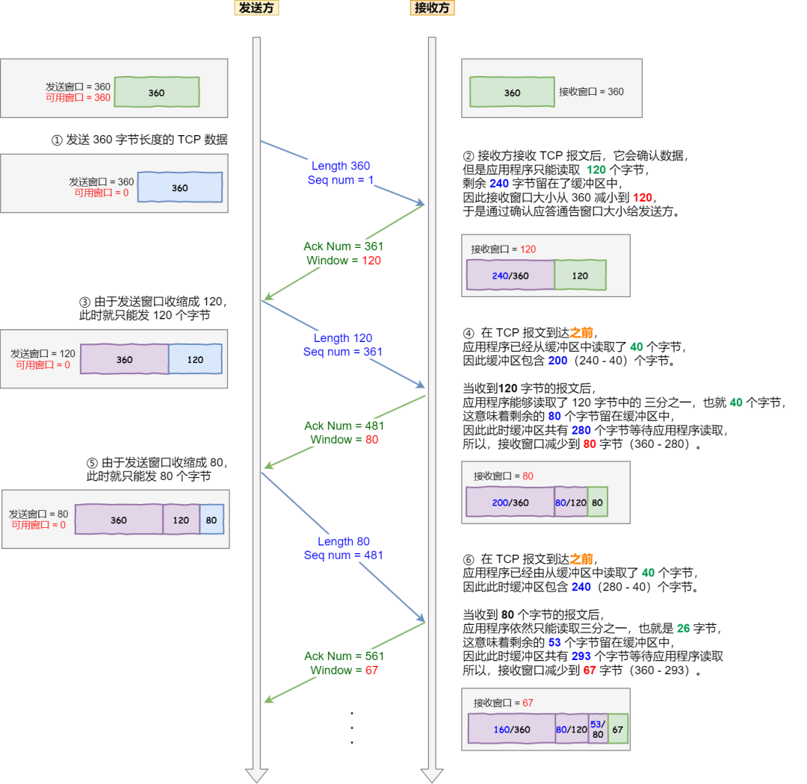
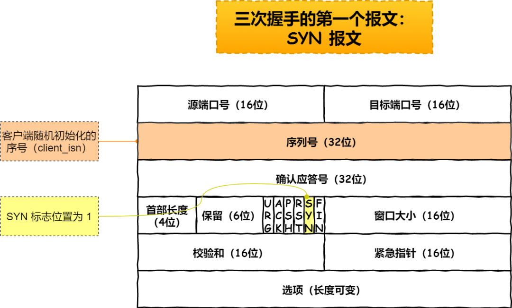

本文章来源于：https://github.com/Zeb-D/my-review ，请star 强力支持，你的支持，就是我的动力。

[TOC]


------

### 前言

不知几次看了TCP相关的资料，奈何过往云烟抛之脑后，现深入理解TCP主要两个核心问题即三次握手和四次挥手；

从熟悉TPC基本常识到理解TCP如何建立链接又是如何释放链接，最后我们常见网络框架又是怎样与TCP几个状态相互结合的

------


### TCP 基本认识

#### TCP 头格式

先来看看 TCP 头的格式，标注颜色的表示与本文关联比较大的字段，其他字段不做详细阐述。


**序列号**：在建立连接时由计算机生成的随机数作为其初始值，通过 SYN 包传给接收端主机，每发送一次数据，就「累加」一次该「数据字节数」的大小。**用来解决网络包乱序问题。**

**确认应答号**：指下一次「期望」收到的数据的序列号，发送端收到这个确认应答以后可以认为在这个序号以前的数据都已经被正常接收。**用来解决不丢包的问题。**

**控制位：**

- *ACK*：该位为 `1` 时，「确认应答」的字段变为有效，TCP 规定除了最初建立连接时的 `SYN` 包之外该位必须设置为 `1` 。
- *RST*：该位为 `1` 时，表示 TCP 连接中出现异常必须强制断开连接。
- *SYN*：该位为 `1` 时，表示希望建立连接，并在其「序列号」的字段进行序列号初始值的设定。
- *FIN*：该位为 `1` 时，表示今后不会再有数据发送，希望断开连接。当通信结束希望断开连接时，通信双方的主机之间就可以相互交换 `FIN` 位为 1 的 TCP 段。


##### 为什么需要 TCP 协议？TCP 工作在哪一层？

`IP` 层是「不可靠」的，它不保证网络包的交付、不保证网络包的按序交付、也不保证网络包中的数据的完整性。

如果需要保障网络数据包的可靠性，那么就需要由上层（传输层）的 `TCP` 协议来负责。

因为 TCP 是一个工作在**传输层**的**可靠**数据传输的服务，它能确保接收端接收的网络包是**无损坏、无间隔、非冗余和按序的。**


#### TCP概念

TCP 是**面向连接的、可靠的、基于字节流**的传输层通信协议。 

- **面向连接**：一定是「一对一」才能连接，不能像 UDP 协议可以一个主机同时向多个主机发送消息，也就是一对多是无法做到的；
- **可靠的**：无论的网络链路中出现了怎样的链路变化，TCP 都可以保证一个报文一定能够到达接收端；
- **字节流**：消息是「没有边界」的，所以无论我们消息有多大都可以进行传输。并且消息是「有序的」，当「前一个」消息没有收到的时候，即使它先收到了后面的字节，那么也不能扔给应用层去处理，同时对「重复」的报文会自动丢弃。


##### 什么是 TCP 连接？

> 我们来看看 RFC 793 是如何定义「连接」的：
>
> *Connections: The reliability and flow control mechanisms described above require that TCPs initialize and maintain certain status information for each data stream.  The combination of this information, including sockets, sequence numbers, and window sizes, is called a connection.*
>
> 简单来说就是，**用于保证可靠性和流量控制维护的某些状态信息，这些信息的组合，包括Socket、序列号和窗口大小称为连接。**

所以我们可以知道，建立一个 TCP 连接是需要客户端与服务器端达成上述三个信息的共识。

- **Socket**：由 IP 地址和端口号组成
- **序列号**：用来解决乱序问题等
- **窗口大小**：用来做流量控制


##### 如何唯一确定一个 TCP 连接呢？

TCP 四元组可以唯一的确定一个连接，四元组包括如下：

- 源地址
- 源端口
- 目的地址
- 目的端口

源地址和目的地址的字段（32位）是在 IP 头部中，作用是通过 IP 协议发送报文给对方主机。

源端口和目的端口的字段（16位）是在 TCP 头部中，作用是告诉 TCP 协议应该把报文发给哪个进程。


##### 有一个 IP 的服务器监听了一个端口，它的 TCP 的最大连接数是多少？

服务器通常固定在某个本地端口上监听，等待客户端的连接请求。

因此，客户端 IP 和 端口是可变的，其理论值计算公式如下:

```
max_tcp_conn = client_ip_size * client_port_size
```

对 IPv4，客户端的 IP 数最多为 `2` 的 `32` 次方，客户端的端口数最多为 `2` 的 `16` 次方，也就是服务端单机最大 TCP 连接数，约为 `2` 的 `48` 次方。

当然，服务端最大并发 TCP 连接数远不能达到理论上限。

- 首先主要是**文件描述符限制**，Socket 都是文件，所以首先要通过 `ulimit` 配置文件描述符的数目；
- 另一个是**内存限制**，每个 TCP 连接都要占用一定内存，操作系统的内存是有限的。


##### UDP 和 TCP 的区别与分别的应用场景？

UDP 不提供复杂的控制机制，利用 IP 提供面向「无连接」的通信服务。

UDP 协议真的非常简，头部只有 `8` 个字节（ 64 位），UDP 的头部格式如下：


- 目标和源端口：主要是告诉 UDP 协议应该把报文发给哪个进程。
- 包长度：该字段保存了 UDP 首部的长度跟数据的长度之和。
- 校验和：校验和是为了提供可靠的 UDP 首部和数据而设计。


###### TCP与UDP区别

**TCP 和 UDP 区别：**

*1. 连接*

- TCP 是面向连接的传输层协议，传输数据前先要建立连接。
- UDP 是不需要连接，即刻传输数据。

*2. 服务对象*

- TCP 是一对一的两点服务，即一条连接只有两个端点。
- UDP 支持一对一、一对多、多对多的交互通信

*3. 可靠性*

- TCP 是可靠交付数据的，数据可以无差错、不丢失、不重复、按需到达。
- UDP 是尽最大努力交付，不保证可靠交付数据。

*4. 拥塞控制、流量控制*

- TCP 有拥塞控制和流量控制机制，保证数据传输的安全性。
- UDP 则没有，即使网络非常拥堵了，也不会影响 UDP 的发送速率。

*5. 首部开销*

- TCP 首部长度较长，会有一定的开销，首部在没有使用「选项」字段时是 `20` 个字节，如果使用了「选项」字段则会变长的。
- UDP 首部只有 8 个字节，并且是固定不变的，开销较小。

*6. 传输方式*

- TCP 是流式传输，没有边界，但保证顺序和可靠。
- UDP 是一个包一个包的发送，是有边界的，但可能会丢包和乱序。

*7. 分片不同*

- TCP 的数据大小如果大于 MSS 大小，则会在传输层进行分片，目标主机收到后，也同样在传输层组装 TCP 数据包，如果中途丢失了一个分片，只需要传输丢失的这个分片。
- UDP 的数据大小如果大于 MTU 大小，则会在 IP 层进行分片，目标主机收到后，在 IP 层组装完数据，接着再传给传输层，但是如果中途丢了一个分片，则就需要重传所有的数据包，这样传输效率非常差，所以通常 UDP 的报文应该小于 MTU。


###### TCP 和 UDP 应用场景

由于 TCP 是面向连接，能保证数据的可靠性交付，因此经常用于：

- `FTP` 文件传输
- `HTTP` / `HTTPS`

由于 UDP 面向无连接，它可以随时发送数据，再加上UDP本身的处理既简单又高效，因此经常用于：

- 包总量较少的通信，如 `DNS` 、`SNMP` 等
- 视频、音频等多媒体通信
- 广播通信


###### UDP 头部没有「首部长度」字段，而 TCP 头部有「首部长度」字段？

原因是 TCP 有**可变长**的「选项」字段，而 UDP 头部长度则是**不会变化**的，无需多一个字段去记录 UDP 的首部长度。


###### UDP 头部有「包长度」字段，而 TCP 头部则没有「包长度」字段？

先说说 TCP 是如何计算负载数据长度：

```
TCP数据长度 = IP总长度 - IP首部长度 - TCP首部长度
```

其中 IP 总长度 和 IP 首部长度，在 IP 首部格式是已知的。TCP 首部长度，则是在 TCP 首部格式已知的，所以就可以求得 TCP 数据的长度。

大家这时就奇怪了问：“ UDP 也是基于 IP 层的呀，那 UDP 的数据长度也可以通过这个公式计算呀？为何还要有「包长度」呢？”

这么一问，确实感觉 UDP 「包长度」是冗余的。

**因为为了网络设备硬件设计和处理方便，首部长度需要是 `4`字节的整数倍。**

如果去掉 UDP 「包长度」字段，那 UDP 首部长度就不是 `4` 字节的整数倍了，所以小林觉得这可能是为了补全 UDP 首部长度是 `4` 字节的整数倍，才补充了「包长度」字段。

------


#### 重传机制

TCP 实现可靠传输的方式之一，是通过序列号与确认应答。

在 TCP 中，当发送端的数据到达接收主机时，接收端主机会返回一个确认应答消息，表示已收到消息。

但在错综复杂的网络，并不一定能如上图那么顺利能正常的数据传输，万一数据在传输过程中丢失了呢？

所以 TCP 针对数据包丢失的情况，会用**重传机制**解决。

接下来说说常见的重传机制：

- 超时重传
- 快速重传
- SACK
- D-SACK


##### 超时重传

重传机制的其中一个方式，就是在发送数据时，设定一个定时器，当超过指定的时间后，没有收到对方的 `ACK` 确认应答报文，就会重发该数据，也就是我们常说的**超时重传**。

TCP 会在以下两种情况发生超时重传：

- 数据包丢失
- 确认应答丢失


###### 超时时间应该设置为多少呢？

我们先来了解一下什么是 `RTT`（Round-Trip Time 往返时延）

`RTT` 就是**数据从网络一端传送到另一端所需的时间**，也就是包的往返时间。

超时重传时间是以 `RTO` （Retransmission Timeout 超时重传时间）表示。

- 当超时时间 **RTO 较大**时，重发就慢，丢了老半天才重发，没有效率，性能差；
- 当超时时间 **RTO 较小**时，会导致可能并没有丢就重发，于是重发的就快，会增加网络拥塞，导致更多的超时，更多的超时导致更多的重发。

精确的测量超时时间 `RTO` 的值是非常重要的，这可让我们的重传机制更高效。

根据上述的两种情况，我们可以得知，**超时重传时间 RTO 的值应该略大于报文往返  RTT 的值**。

至此，可能大家觉得超时重传时间 `RTO` 的值计算，也不是很复杂嘛。

好像就是在发送端发包时记下 `t0` ，然后接收端再把这个 `ack` 回来时再记一个 `t1`，于是 `RTT = t1 – t0`。没那么简单，**这只是一个采样，不能代表普遍情况**。

实际上「报文往返 RTT 的值」是经常变化的，因为我们的网络也是时常变化的。也就因为「报文往返 RTT 的值」 是经常波动变化的，所以「超时重传时间 RTO 的值」应该是一个**动态变化的值**。


我们来看看 Linux 是如何计算 `RTO` 的呢？

估计往返时间，通常需要采样以下两个：

- 需要 TCP 通过采样 RTT 的时间，然后进行加权平均，算出一个平滑 RTT 的值，而且这个值还是要不断变化的，因为网络状况不断地变化。
- 除了采样 RTT，还要采样 RTT 的波动范围，这样就避免如果 RTT 有一个大的波动的话，很难被发现的情况。

RFC6289 建议使用以下的公式计算 RTO：

```
1、首次计算RTO，其中R1为第一次测量的RTT
SRTT = R1
DevRTT = R1/2
RTO = μ * SRTT + α * DevRTT = μ * R1 + α *(R1/2) 
```

```
2、后续计算RTO，其中R2为最新测量的RTT
SRTT = R1 + α*（R2-R1)
DevRTT = (1-β)*DevRTT + β*(|RTT-SRTT|) = (1-β)*(R1/2) + β*(|R2-R1|)
RTO = μ * SRTT + α * DevRTT
```

其中 `SRTT` 是计算平滑的RTT ，`DevRTR` 是计算平滑的RTT 与 最新 RTT 的差距。

> 在 Linux 下，**α = 0.125，β = 0.25， μ = 1，∂ = 4**。别问怎么来的，问就是大量实验中调出来的。

如果超时重发的数据，再次超时的时候，又需要重传的时候，TCP 的策略是**超时间隔加倍。**

也就是**每当遇到一次超时重传的时候，都会将下一次超时时间间隔设为先前值的两倍。两次超时，就说明网络环境差，不宜频繁反复发送。**

超时触发重传存在的问题是，超时周期可能相对较长。那是不是可以有更快的方式呢？

于是就可以用「快速重传」机制来解决超时重发的时间等待。


##### 快速重传

TCP 还有另外一种**快速重传（Fast Retransmit）机制**，它**不以时间为驱动，而是以数据驱动重传**。

所以，快速重传的工作方式是当收到三个相同的 ACK 报文时，会在定时器过期之前，重传丢失的报文段。

快速重传机制只解决了一个问题，就是超时时间的问题，但是它依然面临着另外一个问题。就是**重传的时候，是重传之前的一个，还是重传所有的问题。**

为了解决不知道该重传哪些 TCP 报文，于是就有 `SACK` 方法。


##### SACK 方法

还有一种实现重传机制的方式叫：`SACK`（ Selective Acknowledgment 选择性确认）。

这种方式需要在 TCP 头部「选项」字段里加一个 `SACK` 的东西，它**可以将缓存的地图发送给发送方**，这样发送方就可以知道哪些数据收到了，哪些数据没收到，知道了这些信息，就可以**只重传丢失的数据**。

如下图，发送方收到了三次同样的 ACK 确认报文，于是就会触发快速重发机制，通过 `SACK` 信息发现只有 `200~299` 这段数据丢失，则重发时，就只选择了这个 TCP 段进行重复。

如果要支持 `SACK`，必须双方都要支持。在 Linux 下，可以通过 `net.ipv4.tcp_sack` 参数打开这个功能（Linux 2.4 后默认打开）。


##### Duplicate SACK

Duplicate SACK 又称 `D-SACK`，其主要**使用了 SACK 来告诉「发送方」有哪些数据被重复接收了。**

下面举例两个栗子，来说明 `D-SACK` 的作用。

*栗子一号：ACK 丢包*

- 「接收方」发给「发送方」的两个 ACK 确认应答都丢失了，所以发送方超时后，重传第一个数据包（3000 ~ 3499）
- **于是「接收方」发现数据是重复收到的，于是回了一个 SACK = 3000~3500**，告诉「发送方」 3000~3500 的数据早已被接收了，因为 ACK 都到了 4000 了，已经意味着 4000 之前的所有数据都已收到，所以这个 SACK 就代表着 `D-SACK`。
- 这样「发送方」就知道了，数据没有丢，是「接收方」的 ACK 确认报文丢了。


*栗子二号：网络延时*

- 数据包（1000~1499） 被网络延迟了，导致「发送方」没有收到 Ack 1500 的确认报文。
- 而后面报文到达的三个相同的 ACK 确认报文，就触发了快速重传机制，但是在重传后，被延迟的数据包（1000~1499）又到了「接收方」；
- **所以「接收方」回了一个 SACK=1000~1500，因为 ACK 已经到了 3000，所以这个 SACK 是 D-SACK，表示收到了重复的包。**
- 这样发送方就知道快速重传触发的原因不是发出去的包丢了，也不是因为回应的 ACK 包丢了，而是因为网络延迟了。

可见，`D-SACK` 有这么几个好处：

1. 可以让「发送方」知道，是发出去的包丢了，还是接收方回应的 ACK 包丢了;
2. 可以知道是不是「发送方」的数据包被网络延迟了;
3. 可以知道网络中是不是把「发送方」的数据包给复制了;

在 Linux 下可以通过 `net.ipv4.tcp_dsack` 参数开启/关闭这个功能（Linux 2.4 后默认打开）。


#### 滑动窗口

##### 引入窗口概念的原因

我们都知道 TCP 是每发送一个数据，都要进行一次确认应答。当上一个数据包收到了应答了， 再发送下一个。

这个模式就有点像我和你面对面聊天，你一句我一句。但这种方式的缺点是效率比较低的。

所以，这样的传输方式有一个缺点：数据包的**往返时间越长，通信的效率就越低**。

为解决这个问题，TCP 引入了**窗口**这个概念。即使在往返时间较长的情况下，它也不会降低网络通信的效率。

那么有了窗口，就可以指定窗口大小，窗口大小就是指**无需等待确认应答，而可以继续发送数据的最大值**。

窗口的实现实际上是操作系统开辟的一个缓存空间，发送方主机在等到确认应答返回之前，必须在缓冲区中保留已发送的数据。如果按期收到确认应答，此时数据就可以从缓存区清除。

> 假设窗口大小为 `3` 个 TCP 段，那么发送方就可以「连续发送」 `3` 个 TCP 段，并且中途若有 ACK 丢失，可以通过「下一个确认应答进行确认」。
>
> ACK 600 确认应答报文丢失，也没关系，因为可以通话下一个确认应答进行确认，只要发送方收到了 ACK 700 确认应答，就意味着 700 之前的所有数据「接收方」都收到了。这个模式就叫**累计确认**或者**累计应答**。


##### 窗口大小由哪一方决定？

TCP 头里有一个字段叫 `Window`，也就是窗口大小。

**这个字段是接收端告诉发送端自己还有多少缓冲区可以接收数据。于是发送端就可以根据这个接收端的处理能力来发送数据，而不会导致接收端处理不过来。**

所以，通常窗口的大小是由接收方的决定的。

发送方发送的数据大小不能超过接收方的窗口大小，否则接收方就无法正常接收到数据。

```
1、ACK确认窗口
2、已发送但未收到ACK确认
3、未发送但接受方可接受范围
4、接受方尚不能接受
```


程序是如何表示发送方的四个部分的呢？

- `SND.WND`：表示发送窗口的大小（大小是由接收方指定的）；
- `SND.UNA`：是一个绝对指针，它指向的是已发送但未收到确认的第一个字节的序列号，也就是 #2 的第一个字节。
- `SND.NXT`：也是一个绝对指针，它指向未发送但可发送范围的第一个字节的序列号，也就是 #3 的第一个字节。
- 指向 #4 的第一个字节是个相对指针，它需要 `SND.UNA` 指针加上 `SND.WND` 大小的偏移量，就可以指向 #4 的第一个字节了。

那么可用窗口大小的计算就可以是：

**可用窗口大 = SND.WND -（SND.NXT - SND.UNA）**


接收窗口和发送窗口的大小是相等的吗？

并不是完全相等，接收窗口的大小是**约等于**发送窗口的大小的。

因为滑动窗口并不是一成不变的。比如，当接收方的应用进程读取数据的速度非常快的话，这样的话接收窗口可以很快的就空缺出来。那么新的接收窗口大小，是通过 TCP 报文中的 Windows 字段来告诉发送方。那么这个传输过程是存在时延的，所以接收窗口和发送窗口是约等于的关系。


#### 流量控制

发送方不能无脑的发数据给接收方，要考虑接收方处理能力。

如果一直无脑的发数据给对方，但对方处理不过来，那么就会导致触发重发机制，从而导致网络流量的无端的浪费。

为了解决这种现象发生，**TCP 提供一种机制可以让「发送方」根据「接收方」的实际接收能力控制发送的数据量，这就是所谓的流量控制。**

下面举个栗子，为了简单起见，假设以下场景：

- 客户端是接收方，服务端是发送方
- 假设接收窗口和发送窗口相同，都为 `200`
- 假设两个设备在整个传输过程中都保持相同的窗口大小，不受外界影响


根据上图的流量控制，说明下每个过程：

1. 客户端向服务端发送请求数据报文。这里要说明下，本次例子是把服务端作为发送方，所以没有画出服务端的接收窗口。
2. 服务端收到请求报文后，发送确认报文和 80 字节的数据，于是可用窗口 `Usable` 减少为 120 字节，同时 `SND.NXT` 指针也向右偏移 80 字节后，指向 321，**这意味着下次发送数据的时候，序列号是 321。**
3. 客户端收到 80 字节数据后，于是接收窗口往右移动 80 字节，`RCV.NXT` 也就指向 321，**这意味着客户端期望的下一个报文的序列号是 321**，接着发送确认报文给服务端。
4. 服务端再次发送了 120 字节数据，于是可用窗口耗尽为 0，服务端无法在继续发送数据。
5. 客户端收到 120 字节的数据后，于是接收窗口往右移动 120 字节，`RCV.NXT` 也就指向 441，接着发送确认报文给服务端。
6. 服务端收到对 80 字节数据的确认报文后，`SND.UNA` 指针往右偏移后指向 321，于是可用窗口 `Usable` 增大到 80。
7. 服务端收到对 120 字节数据的确认报文后，`SND.UNA` 指针往右偏移后指向 441，于是可用窗口 `Usable` 增大到 200。
8. 服务端可以继续发送了，于是发送了 160 字节的数据后，`SND.NXT` 指向 601，于是可用窗口  `Usable` 减少到 40。
9. 客户端收到 160 字节后，接收窗口往右移动了 160 字节，`RCV.NXT` 也就是指向了 601，接着发送确认报文给服务端。
10. 服务端收到对 160 字节数据的确认报文后，发送窗口往右移动了 160 字节，于是 `SND.UNA` 指针偏移了 160 后指向 601，可用窗口 `Usable` 也就增大至了 200。


##### 操作系统缓冲区与滑动窗口的关系

前面的流量控制例子，我们假定了发送窗口和接收窗口是不变的，但是实际上，发送窗口和接收窗口中所存放的字节数，都是放在操作系统内存缓冲区中的，而操作系统的缓冲区，会**被操作系统调整**。

当应用进程没办法及时读取缓冲区的内容时，也会对我们的缓冲区造成影响。


那操心系统的缓冲区，是如何影响发送窗口和接收窗口的呢？

*我们先来看看第一个例子。*

当应用程序没有及时读取缓存时，发送窗口和接收窗口的变化。

考虑以下场景：

- 客户端作为发送方，服务端作为接收方，发送窗口和接收窗口初始大小为 `360`；
- 服务端非常的繁忙，当收到客户端的数据时，应用层不能及时读取数据。

当服务端系统资源非常紧张的时候，操心系统可能会直接减少了接收缓冲区大小，这时应用程序又无法及时读取缓存数据，那么这时候就有严重的事情发生了，会出现数据包丢失的现象。

所以，如果发生了先减少缓存，再收缩窗口，就会出现丢包的现象。

**为了防止这种情况发生，TCP 规定是不允许同时减少缓存又收缩窗口的，而是采用先收缩窗口，过段时间在减少缓存，这样就可以避免了丢包情况。**


##### 窗口关闭

TCP 通过让接收方指明希望从发送方接收的数据大小（窗口大小）来进行流量控制。

**如果窗口大小为 0 时，就会阻止发送方给接收方传递数据，直到窗口变为非 0 为止，这就是窗口关闭。**

窗口关闭潜在的危险

接收方向发送方通告窗口大小时，是通过 `ACK` 报文来通告的。

那么，当发生窗口关闭时，接收方处理完数据后，会向发送方通告一个窗口非 0 的 ACK 报文，如果这个通告窗口的 ACK 报文在网络中丢失了，那麻烦就大了。


这会导致发送方一直等待接收方的非 0 窗口通知，接收方也一直等待发送方的数据，如不不采取措施，这种相互等待的过程，会造成了死锁的现象。


##### TCP 是如何解决窗口关闭时，潜在的死锁现象呢？

为了解决这个问题，TCP 为每个连接设有一个持续定时器，**只要 TCP 连接一方收到对方的零窗口通知，就启动持续计时器。**

如果持续计时器超时，就会发送**窗口探测 ( Window probe ) 报文**，而对方在确认这个探测报文时，给出自己现在的接收窗口大小。

- 如果接收窗口仍然为 0，那么收到这个报文的一方就会重新启动持续计时器；
- 如果接收窗口不是 0，那么死锁的局面就可以被打破了。

窗口探查探测的次数一般为 3 此次，每次次大约 30-60 秒（不同的实现可能会不一样）。如果 3 次过后接收窗口还是 0 的话，有的 TCP 实现就会发 `RST` 报文来中断连接。


##### 糊涂窗口综合症

如果接收方太忙了，来不及取走接收窗口里的数据，那么就会导致发送方的发送窗口越来越小。

到最后，**如果接收方腾出几个字节并告诉发送方现在有几个字节的窗口，而发送方会义无反顾地发送这几个字节，这就是糊涂窗口综合症**。

要知道，我们的 `TCP + IP` 头有 `40` 个字节，为了传输那几个字节的数据，要达上这么大的开销，这太不经济了。

就好像一个可以承载 50 人的大巴车，每次来了一两个人，就直接发车。除非家里有矿的大巴司机，才敢这样玩，不然迟早破产。要解决这个问题也不难，大巴司机等乘客数量超过了 25 个，才认定可以发车。

现举个糊涂窗口综合症的栗子，考虑以下场景：

接收方的窗口大小是 360 字节，但接收方由于某些原因陷入困境，假设接收方的应用层读取的能力如下：

- 接收方每接收 3 个字节，应用程序就只能从缓冲区中读取 1 个字节的数据；
- 在下一个发送方的 TCP 段到达之前，应用程序
  还从缓冲区中读取了 40 个额外的字节；



每个过程的窗口大小的变化，在图中都描述的很清楚了，可以发现窗口不断减少了，并且发送的数据都是比较小的了。

所以，糊涂窗口综合症的现象是可以发生在发送方和接收方：

- 接收方可以通告一个小的窗口
- 而发送方可以发送小数据

于是，要解决糊涂窗口综合症，就解决上面两个问题就可以了

- 让接收方不通告小窗口给发送方
- 让发送方避免发送小数据


怎么让接收方不通告小窗口呢？

接收方通常的策略如下:

当「窗口大小」小于 min( MSS，缓存空间/2 ) ，也就是小于 MSS 与 1/2 缓存大小中的最小值时，就会向发送方通告窗口为 `0`，也就阻止了发送方再发数据过来。

等到接收方处理了一些数据后，窗口大小 >= MSS，或者接收方缓存空间有一半可以使用，就可以把窗口打开让发送方发送数据过来。


怎么让发送方避免发送小数据呢？

发送方通常的策略:

使用 Nagle 算法，该算法的思路是延时处理，它满足以下两个条件中的一条才可以发送数据：

- 要等到窗口大小 >= `MSS` 或是 数据大小 >= `MSS`
- 收到之前发送数据的 `ack` 回包

只要没满足上面条件中的一条，发送方一直在囤积数据，直到满足上面的发送条件。

另外，Nagle 算法默认是打开的，如果对于一些需要小数据包交互的场景的程序，比如，telnet 或 ssh 这样的交互性比较强的程序，则需要关闭 Nagle 算法。

可以在 Socket 设置 `TCP_NODELAY` 选项来关闭这个算法（关闭 Nagle 算法没有全局参数，需要根据每个应用自己的特点来关闭）

```
setsockopt(sock_fd, IPPROTO_TCP, TCP_NODELAY, (char *)&value, sizeof(int));
```


#### 拥塞控制

##### 为什么要有拥塞控制呀，不是有流量控制了吗？

前面的流量控制是避免「发送方」的数据填满「接收方」的缓存，但是并不知道网络的中发生了什么。

一般来说，计算机网络都处在一个共享的环境。因此也有可能会因为其他主机之间的通信使得网络拥堵。

**在网络出现拥堵时，如果继续发送大量数据包，可能会导致数据包时延、丢失等，这时 TCP 就会重传数据，但是一重传就会导致网络的负担更重，于是会导致更大的延迟以及更多的丢包，这个情况就会进入恶性循环被不断地放大….**

所以，TCP 不能忽略网络上发生的事，它被设计成一个无私的协议，当网络发送拥塞时，TCP 会自我牺牲，降低发送的数据量。

于是，就有了**拥塞控制**，控制的目的就是**避免「发送方」的数据填满整个网络。**

为了在「发送方」调节所要发送数据的量，定义了一个叫做「**拥塞窗口**」的概念。


##### 什么是拥塞窗口？和发送窗口有什么关系呢？

**拥塞窗口 cwnd**是发送方维护的一个 的状态变量，它会根据**网络的拥塞程度动态变化的**。

我们在前面提到过发送窗口 `swnd` 和接收窗口 `rwnd` 是约等于的关系，那么由于入了拥塞窗口的概念后，此时发送窗口的值是swnd = min(cwnd, rwnd)，也就是拥塞窗口和接收窗口中的最小值。

拥塞窗口 `cwnd` 变化的规则：

- 只要网络中没有出现拥塞，`cwnd` 就会增大；
- 但网络中出现了拥塞，`cwnd` 就减少；


##### 那么怎么知道当前网络是否出现了拥塞呢？

其实只要「发送方」没有在规定时间内接收到 ACK 应答报文，也就是**发生了超时重传，就会认为网络出现了用拥塞。**


##### 拥塞控制有哪些控制算法？

拥塞控制主要是四个算法：

- 慢启动
- 拥塞避免
- 拥塞发生
- 快速恢复


###### 慢启动

TCP 在刚建立连接完成后，首先是有个慢启动的过程，这个慢启动的意思就是一点一点的提高发送数据包的数量，如果一上来就发大量的数据，这不是给网络添堵吗？

慢启动的算法记住一个规则就行：**当发送方每收到一个 ACK，就拥塞窗口 cwnd 的大小就会加 1。**

这里假定拥塞窗口 `cwnd` 和发送窗口 `swnd` 相等，下面举个栗子：

- 连接建立完成后，一开始初始化 `cwnd = 1`，表示可以传一个 `MSS` 大小的数据。
- 当收到一个 ACK 确认应答后，cwnd 增加 1，于是一次能够发送 2 个
- 当收到 2 个的 ACK 确认应答后， cwnd 增加 2，于是就可以比之前多发2 个，所以这一次能够发送 4 个
- 当这 4 个的 ACK 确认到来的时候，每个确认 cwnd 增加 1， 4 个确认 cwnd 增加 4，于是就可以比之前多发 4 个，所以这一次能够发送 8 个。

可以看出慢启动算法，发包的个数是**指数性的增长**。

有一个叫慢启动门限  `ssthresh` （slow start threshold）状态变量。

- 当 `cwnd < ssthresh` 时，使用慢启动算法。
- 当 `cwnd >= ssthresh` 时，就会使用「拥塞避免算法」。


###### 拥塞避免算法

前面说道，当拥塞窗口 `cwnd` 「超过」慢启动门限 `ssthresh` 就会进入拥塞避免算法。

一般来说 `ssthresh` 的大小是 `65535` 字节。

那么进入拥塞避免算法后，它的规则是：**每当收到一个 ACK 时，cwnd 增加 1/cwnd。**

接上前面的慢启动的栗子，现假定 `ssthresh` 为 `8`：

- 当 8 个 ACK 应答确认到来时，每个确认增加 1/8，8 个 ACK 确认 cwnd 一共增加 1，于是这一次能够发送 9 个 `MSS` 大小的数据，变成了**线性增长。**

所以，我们可以发现，拥塞避免算法就是将原本慢启动算法的指数增长变成了线性增长，还是增长阶段，但是增长速度缓慢了一些。

就这么一直增长着后，网络就会慢慢进入了拥塞的状况了，于是就会出现丢包现象，这时就需要对丢失的数据包进行重传。

当触发了重传机制，也就进入了「拥塞发生算法」。


###### 拥塞发生

当网络出现拥塞，也就是会发生数据包重传，重传机制主要有两种：

- 超时重传
- 快速重传

这两种使用的拥塞发送算法是不同的，接下来分别来说说。

> 发生超时重传的拥塞发生算法

当发生了「超时重传」，则就会使用拥塞发生算法。

这个时候，sshresh 和 cwnd 的值会发生变化：

- `ssthresh` 设为 `cwnd/2`，
- `cwnd` 重置为 `1`

接着，就重新开始慢启动，慢启动是会突然减少数据流的。这真是一旦「超时重传」，马上回到解放前。但是这种方式太激进了，反应也很强烈，会造成网络卡顿。

> 发生快速重传的拥塞发生算法

还有更好的方式，前面我们讲过「快速重传算法」。当接收方发现丢了一个中间包的时候，发送三次前一个包的 ACK，于是发送端就会快速地重传，不必等待超时再重传。

TCP 认为这种情况不严重，因为大部分没丢，只丢了一小部分，则 `ssthresh` 和 `cwnd` 变化如下：

- `cwnd = cwnd/2` ，也就是设置为原来的一半;
- `ssthresh = cwnd`;
- 进入快速恢复算法


###### 快速恢复

快速重传和快速恢复算法一般同时使用，快速恢复算法是认为，你还能收到 3 个重复 ACK 说明网络也不那么糟糕，所以没有必要像 `RTO` 超时那么强烈。

正如前面所说，进入快速恢复之前，`cwnd` 和 `ssthresh` 已被更新了：

- `cwnd = cwnd/2` ，也就是设置为原来的一半;
- `ssthresh = cwnd`;

然后，进入快速恢复算法如下：

- 拥塞窗口 `cwnd = ssthresh + 3` （ 3 的意思是确认有 3 个数据包被收到了）
- 重传丢失的数据包
- 如果再收到重复的 ACK，那么 cwnd 增加 1
- 如果收到新数据的 ACK 后，设置 cwnd 为 ssthresh，接着就进入了拥塞避免算法

> 发生快速重传的拥塞发生算法

还有更好的方式，前面我们讲过「快速重传算法」。当接收方发现丢了一个中间包的时候，发送三次前一个包的 ACK，于是发送端就会快速地重传，不必等待超时再重传。

TCP 认为这种情况不严重，因为大部分没丢，只丢了一小部分，则 `ssthresh` 和 `cwnd` 变化如下：

- `cwnd = cwnd/2` ，也就是设置为原来的一半;
- `ssthresh = cwnd`;
- 进入快速恢复算法


------


### TCP 连接建立

#### TCP 三次握手过程和状态变迁

TCP 是面向连接的协议，所以使用 TCP 前必须先建立连接，而**建立连接是通过三次握手来进行的。**


- 一开始，客户端和服务端都处于 `CLOSED` 状态。先是服务端主动监听某个端口，处于 `LISTEN` 状态

  

- 客户端会随机初始化序号（`client_isn`），将此序号置于 TCP 首部的「序号」字段中，同时把 `SYN` 标志位置为 `1` ，表示 `SYN` 报文。接着把第一个 SYN 报文发送给服务端，表示向服务端发起连接，该报文不包含应用层数据，之后客户端处于 `SYN-SENT` 状态。


- 服务端收到客户端的 `SYN` 报文后，首先服务端也随机初始化自己的序号（`server_isn`），将此序号填入 TCP 首部的「序号」字段中，其次把 TCP 首部的「确认应答号」字段填入 `client_isn + 1`, 接着把 `SYN` 和 `ACK` 标志位置为 `1`。最后把该报文发给客户端，该报文也不包含应用层数据，之后服务端处于 `SYN-RCVD` 状态。


- 客户端收到服务端报文后，还要向服务端回应最后一个应答报文，首先该应答报文 TCP 首部 `ACK` 标志位置为 `1` ，其次「确认应答号」字段填入 `server_isn + 1` ，最后把报文发送给服务端，这次报文可以携带客户到服务器的数据，之后客户端处于 `ESTABLISHED` 状态。
- 服务器收到客户端的应答报文后，也进入 `ESTABLISHED` 状态。

从上面的过程可以发现**第三次握手是可以携带数据的，前两次握手是不可以携带数据的**，这也是面试常问的题。

一旦完成三次握手，双方都处于 `ESTABLISHED` 状态，此时连接就已建立完成，客户端和服务端就可以相互发送数据了。


##### 如何在 Linux 系统中查看 TCP 状态？

TCP 的连接状态查看，在 Linux 可以通过 `netstat -napt` 命令查看。


##### 为什么是三次握手？不是两次、四次？

相信大家比较常回答的是：“因为三次握手才能保证双方具有接收和发送的能力。”

这回答是没问题，但这回答是片面的，并没有说出主要的原因。

在前面我们知道了什么是 **TCP 连接**：

- 用于保证可靠性和流量控制维护的某些状态信息，这些信息的组合，包括**Socket、序列号和窗口大小**称为连接。

所以，重要的是**为什么三次握手才可以初始化Socket、序列号和窗口大小并建立 TCP 连接。**

接下来以三个方面分析三次握手的原因：

- 三次握手才可以阻止重复历史连接的初始化（主要原因）
- 三次握手才可以同步双方的初始序列号
- 三次握手才可以避免资源浪费


###### *原因一：避免历史连接*

我们来看看 RFC 793 指出的 TCP 连接使用三次握手的**首要原因**：

*The principle reason for the three-way handshake is to prevent old duplicate connection initiations from causing confusion.*

简单来说，三次握手的**首要原因是为了防止旧的重复连接初始化造成混乱。**

网络环境是错综复杂的，往往并不是如我们期望的一样，先发送的数据包，就先到达目标主机，反而它很骚，可能会由于网络拥堵等乱七八糟的原因，会使得旧的数据包，先到达目标主机，那么这种情况下 TCP 三次握手是如何避免的呢？


客户端连续发送多次 SYN 建立连接的报文，在**网络拥堵**情况下：

- 一个「旧 SYN 报文」比「最新的 SYN 」 报文早到达了服务端；
- 那么此时服务端就会回一个 `SYN + ACK` 报文给客户端；
- 客户端收到后可以根据自身的上下文，判断这是一个历史连接（序列号过期或超时），那么客户端就会发送 `RST` 报文给服务端，表示中止这一次连接。


**如果是两次握手连接，就无法阻止历史连接**，那为什么 TCP 两次握手为什么无法阻止历史连接呢？

主要是因为在两次握手的情况下，「被动发起方」没有中间状态给「主动发起方」来阻止历史连接，导致「被动发起方」可能建立一个历史连接，造成资源浪费。

两次握手的情况下，「被动发起方」在收到 SYN 报文后，就进入 ESTABLISHED 状态，意味着这时可以给对方发送数据给，但是「主动发」起方此时还没有进入 ESTABLISHED 状态，假设这次是历史连接，主动发起方判断到此次连接为历史连接，那么就会回 RST 报文来断开连接，而「被动发起方」在第一次握手的时候就进入 ESTABLISHED 状态，所以它可以发送数据的，但是它并不知道这个是历史连接，它只有在收到 RST 报文后，才会断开连接。


可以看到，上面这种场景下，「被动发起方」在向「主动发起方」发送数据前，并没有阻止掉历史连接，导致「被动发起方」建立了一个历史连接，又白白发送了数据，妥妥地浪费了「被动发起方」的资源。

因此，**要解决这种现象，最好就是在「被动发起方」发送数据前，也就是建立连接之前，要阻止掉历史连接，这样就不会造成资源浪费，而要实现这个功能，就需要三次握手**。

所以，TCP 使用三次握手建立连接的最主要原因是**防止「历史连接」初始化了连接。**


###### *原因二：同步双方初始序列号*

TCP 协议的通信双方， 都必须维护一个「序列号」， 序列号是可靠传输的一个关键因素，它的作用：

- 接收方可以去除重复的数据；
- 接收方可以根据数据包的序列号按序接收；
- 可以标识发送出去的数据包中， 哪些是已经被对方收到的；

可见，序列号在 TCP 连接中占据着非常重要的作用，所以当客户端发送携带「初始序列号」的 `SYN` 报文的时候，需要服务端回一个 `ACK` 应答报文，表示客户端的 SYN 报文已被服务端成功接收，那当服务端发送「初始序列号」给客户端的时候，依然也要得到客户端的应答回应，**这样一来一回，才能确保双方的初始序列号能被可靠的同步。**


四次握手其实也能够可靠的同步双方的初始化序号，但由于**第二步和第三步可以优化成一步**，所以就成了「三次握手」。

而两次握手只保证了一方的初始序列号能被对方成功接收，没办法保证双方的初始序列号都能被确认接收。


###### *原因三：避免资源浪费*

如果只有「两次握手」，当客户端的 `SYN` 请求连接在网络中阻塞，客户端没有接收到 `ACK` 报文，就会重新发送 `SYN` ，由于没有第三次握手，服务器不清楚客户端是否收到了自己发送的建立连接的 `ACK` 确认信号，所以每收到一个 `SYN` 就只能先主动建立一个连接，这会造成什么情况呢？

如果客户端的 `SYN` 阻塞了，重复发送多次 `SYN` 报文，那么服务器在收到请求后就会**建立多个冗余的无效链接，造成不必要的资源浪费。**


即两次握手会造成消息滞留情况下，服务器重复接受无用的连接请求 `SYN` 报文，而造成重复分配资源。

###### *小结*

TCP 建立连接时，通过三次握手**能防止历史连接的建立，能减少双方不必要的资源开销，能帮助双方同步初始化序列号**。序列号能够保证数据包不重复、不丢弃和按序传输。

不使用「两次握手」和「四次握手」的原因：

- 「两次握手」：无法防止历史连接的建立，会造成双方资源的浪费，也无法可靠的同步双方序列号；
- 「四次握手」：三次握手就已经理论上最少可靠连接建立，所以不需要使用更多的通信次数。


#### 每次建立 TCP 连接时，初始化的序列号都要求不一样呢？

主要原因是为了防止历史报文被下一个相同四元组的连接接收。

假设每次建立连接，客户端和服务端的初始化序列号都是从 0 开始：


过程如下：

- 客户端和服务端建立一个 TCP 连接，在客户端发送数据包被网络阻塞了，而此时服务端的进程重启了，于是就会发送 RST 报文来断开连接。
- 紧接着，客户端又与服务端建立了与上一个连接相同四元组的连接；
- 在新连接建立完成后，上一个连接中被网络阻塞的数据包正好抵达了服务端，刚好该数据包的序列号正好是在服务端的接收窗口内，所以该数据包会被服务端正常接收，就会造成数据错乱。

可以看到，**如果每次建立连接，客户端和服务端的初始化序列号都是一样的话，很容易出现历史报文被下一个相同四元组的连接接收的问题**。


如果每次建立连接客户端和服务端的初始化序列号都「不一样」，就有大概率因为历史报文的序列号「不在」对方接收窗口，从而很大程度上避免了历史报文，比如下图：


相反，如果每次建立连接客户端和服务端的初始化序列号都「一样」，就有大概率遇到历史报文的序列号刚「好在」对方的接收窗口内，从而导致历史报文被新连接成功接收。

所以，每次初始化序列号不一样能够很大程度上避免历史报文被下一个相同四元组的连接接收，注意是很大程度上，并不是完全避免了。

另一方面是为了安全性，防止黑客伪造的相同序列号的 TCP 报文被对方接收。


#### 初始序列号 ISN 是如何随机产生的？

起始 `ISN` 是基于时钟的，每 4 毫秒 + 1，转一圈要 4.55 个小时。

RFC793 提到初始化序列号 ISN 随机生成算法：`ISN = M + F(localhost, localport, remotehost, remoteport)`。

- `M` 是一个计时器，这个计时器每隔 4 毫秒加 1。
- `F` 是一个 Hash 算法，根据源 IP、目的 IP、源端口、目的端口生成一个随机数值。要保证 Hash 算法不能被外部轻易推算得出，用 MD5 算法是一个比较好的选择。

可以看到，随机数是会基于时钟计时器递增的，基本不可能会随机成一样的初始化序列号。


#### 既然 IP 层会分片，为什么 TCP 层还需要 MSS 呢？

我们先来认识下 MTU 和 MSS


- `MTU`：一个网络包的最大长度，以太网中一般为 `1500` 字节；
- `MSS`：除去 IP 和 TCP 头部之后，一个网络包所能容纳的 TCP 数据的最大长度；


如果在 TCP 的整个报文（头部 + 数据）交给 IP 层进行分片，会有什么异常呢？

当 IP 层有一个超过 `MTU` 大小的数据（TCP 头部 + TCP 数据）要发送，那么 IP 层就要进行分片，把数据分片成若干片，保证每一个分片都小于 MTU。把一份 IP 数据报进行分片以后，由目标主机的 IP 层来进行重新组装后，再交给上一层 TCP 传输层。


**那么当如果一个 IP 分片丢失，整个 IP 报文的所有分片都得重传**。

因为 IP 层本身没有超时重传机制，它由传输层的 TCP 来负责超时和重传。

当接收方发现 TCP 报文（头部 + 数据）的某一片丢失后，则不会响应 ACK 给对方，那么发送方的 TCP 在超时后，就会重发「整个 TCP 报文（头部 + 数据）」。

因此，可以得知由 IP 层进行分片传输，是非常没有效率的。

所以，为了达到最佳的传输效能 TCP 协议在**建立连接的时候通常要协商双方的 MSS 值**，当 TCP 层发现数据超过 MSS 时，则就先会进行分片，当然由它形成的 IP 包的长度也就不会大于 MTU ，自然也就不用 IP 分片了。

```
16:01:31.357849 IP 192.168.0.102.53073 > 192.168.0.1.http: Flags [S], seq 2919721105, win 65535, options [mss 1460,nop,wscale 6,nop,nop,TS val 290694962 ecr 0,sackOK,eol], length 0
16:01:31.380382 IP 192.168.0.1.http > 192.168.0.102.53073: Flags [S.], seq 3239956241, ack 2919721106, win 14480, options [mss 1460,sackOK,TS val 16827817 ecr 290694962,nop,wscale 2], length 0
```

经过 TCP 层分片后，如果一个 TCP 分片丢失后，**进行重发时也是以 MSS 为单位**，而不用重传所有的分片，大大增加了重传的效率。


####  SYN 攻击及避免？

*SYN 攻击*

我们都知道 TCP 连接建立是需要三次握手，假设攻击者短时间伪造不同 IP 地址的 `SYN` 报文，服务端每接收到一个 `SYN` 报文，就进入`SYN_RCVD` 状态，但服务端发送出去的 `ACK + SYN` 报文，无法得到未知 IP 主机的 `ACK` 应答，久而久之就会**占满服务端的 SYN 接收队列（未连接队列）**，使得服务器不能为正常用户服务。


##### *避免 SYN 攻击方式一*

其中一种解决方式是通过修改 Linux 内核参数，控制队列大小和当队列满时应做什么处理。

- 当网卡接收数据包的速度大于内核处理的速度时，会有一个队列保存这些数据包。控制该队列的最大值如下参数：

```
net.core.netdev_max_backlog
```

- SYN_RCVD 状态连接的最大个数：

```
net.ipv4.tcp_max_syn_backlog
```

- 超出处理能时，对新的 SYN 直接回报 RST，丢弃连接：

```
net.ipv4.tcp_abort_on_overflow
```


##### *避免 SYN 攻击方式二*

我们先来看下 Linux 内核的 `SYN` （未完成连接建立）队列与 `Accpet` （已完成连接建立）队列是如何工作的？


正常流程：

- 当服务端接收到客户端的 SYN 报文时，会将其加入到内核的「 SYN 队列」；
- 接着发送 SYN + ACK 给客户端，等待客户端回应 ACK 报文；
- 服务端接收到 ACK 报文后，从「 SYN 队列」移除放入到「 Accept 队列」；
- 应用通过调用 `accpet()` socket 接口，从「 Accept 队列」取出连接。


应用程序过慢：

- 如果应用程序过慢时，就会导致「 Accept 队列」被占满。


受到 SYN 攻击：

- 如果不断受到 SYN 攻击，就会导致「 SYN 队列」被占满。


`tcp_syncookies` 的方式可以应对 SYN 攻击的方法：

```
net.ipv4.tcp_syncookies = 1
```


- 当 「 SYN 队列」满之后，后续服务器收到 SYN 包，不进入「 SYN 队列」；
- 计算出一个 `cookie` 值，再以 SYN + ACK 中的「序列号」返回客户端，
- 服务端接收到客户端的应答报文时，服务器会检查这个 ACK 包的合法性。如果合法，直接放入到「 Accept 队列」。
- 最后应用通过调用 `accpet()` socket 接口，从「 Accept 队列」取出的连接。

------


### TCP 连接断开

#### TCP 四次挥手过程和状态变迁

对于 TCP 连接也是这样， TCP 断开连接是通过**四次挥手**方式。双方都可以主动断开连接，断开连接后主机中的「资源」将被释放。


- 客户端打算关闭连接，此时会发送一个 TCP 首部 `FIN` 标志位被置为 `1` 的报文，也即 `FIN` 报文，之后客户端进入 `FIN_WAIT_1` 状态。
- 服务端收到该报文后，就向客户端发送 `ACK` 应答报文，接着服务端进入 `CLOSED_WAIT` 状态。
- 客户端收到服务端的 `ACK` 应答报文后，之后进入 `FIN_WAIT_2` 状态。
- 等待服务端处理完数据后，也向客户端发送 `FIN` 报文，之后服务端进入 `LAST_ACK` 状态。
- 客户端收到服务端的 `FIN` 报文后，回一个 `ACK` 应答报文，之后进入 `TIME_WAIT` 状态
- 服务器收到了 `ACK` 应答报文后，就进入了 `CLOSED` 状态，至此服务端已经完成连接的关闭。
- 客户端在经过 `2MSL` 一段时间后，自动进入 `CLOSED` 状态，至此客户端也完成连接的关闭。

每个方向都需要**一个 FIN 和一个 ACK**，因此通常被称为**四次挥手**。

这里一点需要注意是：**主动关闭连接的，才有 TIME_WAIT 状态。**


##### 为什么挥手需要四次？

再来回顾下四次挥手双方发 `FIN` 包的过程，就能理解为什么需要四次了。

- 关闭连接时，客户端向服务端发送 `FIN` 时，仅仅表示客户端不再发送数据了但是还能接收数据。
- 服务器收到客户端的 `FIN` 报文时，先回一个 `ACK` 应答报文，而服务端可能还有数据需要处理和发送，等服务端不再发送数据时，才发送 `FIN` 报文给客户端来表示同意现在关闭连接。

从上面过程可知，服务端通常需要等待完成数据的发送和处理，所以服务端的 `ACK` 和 `FIN` 一般都会分开发送，从而比三次握手导致多了一次。


##### 为什么 TIME_WAIT 等待的时间是 2MSL？

`MSL` 是 Maximum Segment Lifetime，**报文最大生存时间**，它是任何报文在网络上存在的最长时间，超过这个时间报文将被丢弃。

因为 TCP 报文基于是 IP 协议的，而 IP 头中有一个 `TTL` 字段，是 IP 数据报可以经过的最大路由数，每经过一个处理他的路由器此值就减 1，当此值为 0 则数据报将被丢弃，同时发送 ICMP 报文通知源主机。

> MSL 与 TTL 的区别：MSL 的单位是时间，而 TTL 是经过路由跳数。所以 **MSL 应该要大于等于 TTL 消耗为 0 的时间**，以确保报文已被自然消亡。

TIME_WAIT 等待 2 倍的 MSL，比较合理的解释是：网络中可能存在来自发送方的数据包，当这些发送方的数据包被接收方处理后又会向对方发送响应，所以**一来一回需要等待 2 倍的时间**。

比如如果被动关闭方没有收到断开连接的最后的 ACK 报文，就会触发超时重发 Fin 报文，另一方接收到 FIN 后，会重发 ACK 给被动关闭方， 一来一去正好 2 个 MSL。

`2MSL` 的时间是从**客户端接收到 FIN 后发送 ACK 开始计时的**。如果在 TIME-WAIT 时间内，因为客户端的 ACK 没有传输到服务端，客户端又接收到了服务端重发的 FIN 报文，那么 **2MSL 时间将重新计时**。

在 Linux 系统里 `2MSL` 默认是 `60` 秒，那么一个 `MSL` 也就是 `30` 秒。**Linux 系统停留在 TIME_WAIT 的时间为固定的 60 秒**。

其定义在 Linux 内核代码里的名称为 TCP_TIMEWAIT_LEN：

```
#define TCP_TIMEWAIT_LEN (60*HZ) /* how long to wait to destroy TIME-WAIT 
                                    state, about 60 seconds  */
```

如果要修改 TIME_WAIT 的时间长度，只能修改 Linux 内核代码里 TCP_TIMEWAIT_LEN 的值，并重新编译 Linux 内核。


##### 为什么需要 TIME_WAIT 状态？

主动发起关闭连接的一方，才会有 `TIME-WAIT` 状态。

需要 TIME-WAIT 状态，主要是两个原因：

- 防止具有相同「四元组」的「旧」数据包被收到；
- 保证「被动关闭连接」的一方能被正确的关闭，即保证最后的 ACK 能让被动关闭方接收，从而帮助其正常关闭；


###### *原因一：防止旧连接的数据包*

假设 TIME-WAIT 没有等待时间或时间过短，被延迟的数据包抵达后会发生什么呢？


- 如上图黄色框框服务端在关闭连接之前发送的 `SEQ = 301` 报文，被网络延迟了。
- 这时有相同端口的 TCP 连接被复用后，被延迟的 `SEQ = 301` 抵达了客户端，那么客户端是有可能正常接收这个过期的报文，这就会产生数据错乱等严重的问题。

所以，TCP 就设计出了这么一个机制，经过 `2MSL` 这个时间，**足以让两个方向上的数据包都被丢弃，使得原来连接的数据包在网络中都自然消失，再出现的数据包一定都是新建立连接所产生的。**


###### *原因二：保证连接正确关闭*

> 在 RFC 793 指出 TIME-WAIT 另一个重要的作用是：
>
> *TIME-WAIT - represents waiting for enough time to pass to be sure the remote TCP received the acknowledgment of its connection termination request.*

也就是说，TIME-WAIT 作用是**等待足够的时间以确保最后的 ACK 能让被动关闭方接收，从而帮助其正常关闭。**

假设 TIME-WAIT 没有等待时间或时间过短，断开连接会造成什么问题呢？


- 如上图红色框框客户端四次挥手的最后一个 `ACK` 报文如果在网络中被丢失了，此时如果客户端 `TIME-WAIT` 过短或没有，则就直接进入了 `CLOSED` 状态了，那么服务端则会一直处在 `LASE_ACK` 状态。
- 当客户端发起建立连接的 `SYN` 请求报文后，服务端会发送 `RST` 报文给客户端，连接建立的过程就会被终止。

如果 TIME-WAIT 等待足够长的情况就会遇到两种情况：

- 服务端正常收到四次挥手的最后一个 `ACK` 报文，则服务端正常关闭连接。
- 服务端没有收到四次挥手的最后一个 `ACK` 报文时，则会重发 `FIN` 关闭连接报文并等待新的 `ACK` 报文。

所以客户端在 `TIME-WAIT` 状态等待 `2MSL` 时间后，就可以**保证双方的连接都可以正常的关闭。**


##### TIME_WAIT 过多有什么危害？

如果服务器有处于 TIME-WAIT 状态的 TCP，则说明是由服务器方主动发起的断开请求。

过多的 TIME-WAIT 状态主要的危害有两种：

- 第一是内存资源占用；
- 第二是对端口资源的占用，一个 TCP 连接至少消耗一个本地端口；

第二个危害是会造成严重的后果的，要知道，端口资源也是有限的，一般可以开启的端口为 `32768～61000`，也可以通过如下参数设置指定：

```
net.ipv4.ip_local_port_range
```

**如果发起连接一方的 TIME_WAIT 状态过多，占满了所有端口资源，则会导致无法创建新连接。**

客户端（发起连接方）受端口资源限制：

- 客户端TIME_WAIT过多，就会导致端口资源被占用，因为端口就65536个，被占满就会导致无法创建新的连接。

服务端受系统资源限制：

- 由于一个四元组表示 TCP 连接，理论上服务端可以建立很多连接，服务端确实只监听一个端口。但是连接过多，会占用系统资源。


##### 如何优化 TIME_WAIT？

这里给出优化 TIME-WAIT 的几个方式，都是有利有弊：

- 打开 net.ipv4.tcp_tw_reuse 和 net.ipv4.tcp_timestamps 选项；
- net.ipv4.tcp_max_tw_buckets
- 程序中使用 SO_LINGER ，应用强制使用 RST 关闭。

###### *方式一：net.ipv4.tcp_tw_reuse 和 tcp_timestamps*

如下的 Linux 内核参数开启后，则可以**复用处于 TIME_WAIT 的 socket 为新的连接所用**。

有一点需要注意的是，**tcp_tw_reuse 功能只能用客户端（连接发起方），因为开启了该功能，在调用 connect() 函数时，内核会随机找一个 time_wait 状态超过 1 秒的连接给新的连接复用。**

```
net.ipv4.tcp_tw_reuse = 1
```

使用这个选项，还有一个前提，需要打开对 TCP 时间戳的支持，即

```
net.ipv4.tcp_timestamps=1（默认即为 1）
```

这个时间戳的字段是在 TCP 头部的「选项」里，用于记录 TCP 发送方的当前时间戳和从对端接收到的最新时间戳。

由于引入了时间戳，我们在前面提到的 `2MSL` 问题就不复存在了，因为重复的数据包会因为时间戳过期被自然丢弃。

###### *方式二：net.ipv4.tcp_max_tw_buckets*

这个值默认为 18000，**当系统中处于 TIME_WAIT 的连接一旦超过这个值时，系统就会将后面的 TIME_WAIT 连接状态重置**，这个方法比较暴力。

###### *方式三：程序中使用 SO_LINGER*

我们可以通过设置 socket 选项，来设置调用 close 关闭连接行为。

```
struct linger so_linger;
so_linger.l_onoff = 1;
so_linger.l_linger = 0;
setsockopt(s, SOL_SOCKET, SO_LINGER, &so_linger,sizeof(so_linger));
```

如果`l_onoff`为非 0， 且`l_linger`值为 0，那么调用`close`后，会立该发送一个`RST`标志给对端，该 TCP 连接将跳过四次挥手，也就跳过了`TIME_WAIT`状态，直接关闭。

但这为跨越`TIME_WAIT`状态提供了一个可能，不过是一个非常危险的行为，不值得提倡。


#### 保活机制

**如果已经建立了连接，但是客户端突然出现故障了怎么办？**

TCP 有一个机制是**保活机制**。

这个机制的原理是这样的：

> 定义一个时间段，在这个时间段内，如果没有任何连接相关的活动，TCP 保活机制会开始作用，每隔一个时间间隔，发送一个探测报文，该探测报文包含的数据非常少，如果连续几个探测报文都没有得到响应，则认为当前的 TCP 连接已经死亡，系统内核将错误信息通知给上层应用程序。

在 Linux 内核可以有对应的参数可以设置保活时间、保活探测的次数、保活探测的时间间隔，以下都为默认值：

```
net.ipv4.tcp_keepalive_time=7200
net.ipv4.tcp_keepalive_intvl=75  
net.ipv4.tcp_keepalive_probes=9
```

- tcp_keepalive_time=7200：表示保活时间是 7200 秒（2小时），也就 2 小时内如果没有任何连接相关的活动，则会启动保活机制
- tcp_keepalive_intvl=75：表示每次检测间隔 75 秒；
- tcp_keepalive_probes=9：表示检测 9 次无响应，认为对方是不可达的，从而中断本次的连接。

也就是说在 Linux 系统中，最少需要经过 2 小时 11 分 15 秒才可以发现一个「死亡」连接。

这个时间是有点长的，我们也可以根据实际的需求，对以上的保活相关的参数进行设置。

如果开启了 TCP 保活，需要考虑以下几种情况：

第一种，对端程序是正常工作的。当 TCP 保活的探测报文发送给对端, 对端会正常响应，这样 **TCP 保活时间会被重置**，等待下一个 TCP 保活时间的到来。

第二种，对端程序崩溃并重启。当 TCP 保活的探测报文发送给对端后，对端是可以响应的，但由于没有该连接的有效信息，**会产生一个 RST 报文**，这样很快就会发现 TCP 连接已经被重置。

第三种，是对端程序崩溃，或对端由于其他原因导致报文不可达。当 TCP 保活的探测报文发送给对端后，石沉大海，没有响应，连续几次，达到保活探测次数后，**TCP 会报告该 TCP 连接已经死亡**。

------


### Socket 编程

#### 针对 TCP 应该如何 Socket 编程？


- 服务端和客户端初始化 `socket`，得到文件描述符；
- 服务端调用 `bind`，将绑定在 IP 地址和端口;
- 服务端调用 `listen`，进行监听；
- 服务端调用 `accept`，等待客户端连接；
- 客户端调用 `connect`，向服务器端的地址和端口发起连接请求；
- 服务端 `accept` 返回用于传输的 `socket` 的文件描述符；
- 客户端调用 `write` 写入数据；服务端调用 `read` 读取数据；
- 客户端断开连接时，会调用 `close`，那么服务端 `read` 读取数据的时候，就会读取到了 `EOF`，待处理完数据后，服务端调用 `close`，表示连接关闭。

这里需要注意的是，服务端调用 `accept` 时，连接成功了会返回一个已完成连接的 socket，后续用来传输数据。

所以，监听的 socket 和真正用来传送数据的 socket，是「两个」 socket，一个叫作**监听 socket**，一个叫作**已完成连接 socket**。

成功连接建立之后，双方开始通过 read 和 write 函数来读写数据，就像往一个文件流里面写东西一样。


#### listen 时候参数 backlog 的意义？

Linux内核中会维护两个队列：

- 未完成连接队列（SYN 队列）：接收到一个 SYN 建立连接请求，处于 SYN_RCVD 状态；
- 已完成连接队列（Accpet 队列）：已完成 TCP 三次握手过程，处于 ESTABLISHED 状态；


```
int listen (int socketfd, int backlog)
```

- 参数一 socketfd 为 socketfd 文件描述符
- 参数二 backlog，这参数在历史版本有一定的变化

在早期 Linux 内核 backlog 是 SYN 队列大小，也就是未完成的队列大小。

在 Linux 内核 2.2 之后，backlog 变成 accept 队列，也就是已完成连接建立的队列长度，**所以现在通常认为 backlog 是 accept 队列。**

**但是上限值是内核参数 somaxconn 的大小，也就说 accpet 队列长度 = min(backlog, somaxconn)。**


#### accept 发生在三次握手的哪一步？

我们先看看客户端连接服务端时，发送了什么？


- 客户端的协议栈向服务器端发送了 SYN 包，并告诉服务器端当前发送序列号 client_isn，客户端进入 SYN_SENT 状态；
- 服务器端的协议栈收到这个包之后，和客户端进行 ACK 应答，应答的值为 client_isn+1，表示对 SYN 包 client_isn 的确认，同时服务器也发送一个 SYN 包，告诉客户端当前我的发送序列号为 server_isn，服务器端进入 SYN_RCVD 状态；
- 客户端协议栈收到 ACK 之后，使得应用程序从 `connect` 调用返回，表示客户端到服务器端的单向连接建立成功，客户端的状态为 ESTABLISHED，同时客户端协议栈也会对服务器端的 SYN 包进行应答，应答数据为 server_isn+1；
- 应答包到达服务器端后，服务器端协议栈使得 `accept` 阻塞调用返回，这个时候服务器端到客户端的单向连接也建立成功，服务器端也进入 ESTABLISHED 状态。

从上面的描述过程，我们可以得知**客户端 connect 成功返回是在第二次握手，服务端 accept 成功返回是在三次握手成功之后。**


#### 客户端调用 close 了，连接是断开的流程是什么？

我们看看客户端主动调用了 `close`，会发生什么？


- 客户端调用 `close`，表明客户端没有数据需要发送了，则此时会向服务端发送 FIN 报文，进入 FIN_WAIT_1 状态；
- 服务端接收到了 FIN 报文，TCP 协议栈会为 FIN 包插入一个文件结束符 `EOF` 到接收缓冲区中，应用程序可以通过 `read` 调用来感知这个 FIN 包。这个 `EOF` 会被**放在已排队等候的其他已接收的数据之后**，这就意味着服务端需要处理这种异常情况，因为 EOF 表示在该连接上再无额外数据到达。此时，服务端进入 CLOSE_WAIT 状态；
- 接着，当处理完数据后，自然就会读到 `EOF`，于是也调用 `close` 关闭它的套接字，这会使得服务端发出一个 FIN 包，之后处于 LAST_ACK 状态；
- 客户端接收到服务端的 FIN 包，并发送 ACK 确认包给服务端，此时客户端将进入 TIME_WAIT 状态；
- 服务端收到 ACK 确认包后，就进入了最后的 CLOSE 状态；
- 客户端经过 `2MSL` 时间之后，也进入 CLOSE 状态；


### 常见思考题

#### TIME_WAIT状态下能否接受延时数据包

Q1、客户端TCP主动shutdown函数，只关闭写端情况下，假设服务端在第二三次挥手之间发送的数据，或者第四次挥手前的数据，因为网络问题导致第三次挥手的FIN包先到达，那么客户端进入TIME_WAIT状态，那么这些延迟的数据包还能正常接受和处理吗？

问题解析：

> 客户端（主动关闭方）在 TIME_WAIT 状态下，如果收到服务端的数据包时，会怎么处理？
>
> 这个问题迷惑性在于，客户端是使用了 shutdown 函数关闭了写方向，而读方向并没有关闭，也就是说客户端在挥手过程中，如果收到服务端的数据包，那么应用程序在调用 read 函数时，是可以读取到数据的。
>
> 如果问题中的数据包没有被网络延迟，在第三次挥手之前被客户端收到了，那么客户端就可以在应用程序读取到该数据。

**客户端进入 TIME_WAIT 状态后，如果收到了服务端的数据包，客户端的内核会发送该数据包的 ACK 确认报文，然后丢掉该数据包。**


原理解析：

Linux 内核在收到 TCP 报文后，会执行 `tcp_v4_rcv` 函数，在该函数和 TIME_WAIT 状态相关的主要代码如下所示：


该代码的过程：

1. 接收到SKb包后，会调用__inet_lookup_skb()查找对应的sock结构；
2. 如果连接的状态是 TIME_WAIT，会跳转到 do_time_wait 处理；
3. 由 tcp_timewait_state_process() 函数来处理 SKB 包，处理后根据返回值来做相应的处理。

在看 tcp_timewait_state_process() 函数中的处理之前，需要先看一看不同的返回值会对应什么样的处理：

- 如果返回值是 **TCP_TW_SYN**，则说明接收到的是一个「合法」的SYN包（也就是说这个 SYN 包可以接受），这时会首先查找内核中是否有对应的监听套接字，如果存在相应的监听套接字，则会释放TIME_WAIT状态的传输控制结构，跳转到 process 处开始处理，开始建立一个新的连接。如果没有找到监听套接字会执行到 TCP_TW_ACK 分支。
- 如果返回值是**TCP_TW_ACK**，则会调用 tcp_v4_timewait_ack() 发送ACK，然后跳转到 discard_it，丢掉数据包。
- 如果返回值是**TCP_TW_RST**，则会调用 tcp_v4_send_reset() 给对端发送 RST 包，然后丢掉数据包。
- 如果返回值是**TCP_TW_SUCCESS**，则会直接丢掉数据包。

所以，关键的地方就在于，当连接在 TIME_WAIT 状态时，收到了 TCP 数据包，tcp_timewait_state_process() 函数的返回值是什么。

tcp_timewait_state_process() 函数处理过程非常的多，我这里就不详细介绍里面的具体处理了，我这里直接说结论。

**主动关闭方在 TIME_WAIT 状态下，收到了 TCP 数据包的话，tcp_timewait_state_process() 函数会返回 TCP_TW_ACK，所以接下来会调用 tcp_v4_timewait_ack() 发送 ACK，然后跳转到 discard_it，丢掉数据包。**

可能有的同学会好奇，都要丢弃数据包了，为什么还要回 ACK？

我觉得可能是避免对方因为没有收到数据包的确认报文，而触发超时重传包，毕竟已经在挥手的最末尾阶段了，就安安稳稳的结束吧。

在 TIME_WAIT 状态下，还有个意思的事情是，当收到「合法」的 SYN 包，并且开启了 sysctl_tcp_tw_reuse 内核参数，就会直接释放掉 TIME_WAIT 的资源，然后进行新建连接的处理。


#### TCP处于ESTABLISHED状态，客户端断电与进程Crash掉有什么区别？

问题关键词：1、没有开启 keepalive；2、一直没有数据交互；3、进程崩溃；4、主机崩溃；

> 主要考察TCP链接保活机制：
>
> 如果两端的 TCP 连接一直没有数据交互，达到了触发 TCP 保活机制的条件，那么内核里的 TCP 协议栈就会发送探测报文。
>
> - 如果**对端程序是正常工作**的。当 TCP 保活的探测报文发送给对端, 对端会正常响应，这样 **TCP 保活时间会被重置**，等待下一个 TCP 保活时间的到来。
> - 如果**对端主机崩溃，或对端由于其他原因导致报文不可达**。当 TCP 保活的探测报文发送给对端后，石沉大海，没有响应，连续几次，达到保活探测次数后，**TCP 会报告该 TCP 连接已经死亡**。
>
> 所以，TCP 保活机制可以在双方没有数据交互的情况，通过探测报文，来确定对方的 TCP 连接是否存活。

问题解析：

如果其中一方的进程发生了崩溃如`kill -9`，这个过程操作系统是可以感知的到的，于是就会发送 FIN 报文给对方，然后与对方进行 TCP 四次挥手。

在没有使用 TCP 保活机制，且双方不传输数据的情况下，一方的 TCP 连接处在 ESTABLISHED 状态时，并不代表另一方的 TCP 连接还一定是正常的。

**客户端主机宕机，又迅速重启**

服务端重传报文的过程中，刚好客户端主机重启完成，这时客户端的内核就会接收重传的报文，：

- 如果客户端主机上**没有**进程监听该 TCP 报文的目标端口号，由于找不到目标端口，客户端内核就会**回复 RST 报文，重置该 TCP 连接**；
- 如果客户端主机上**有**进程监听该 TCP 报文的目标端口号，由于客户端主机重启后，之前的 TCP 连接的数据结构已经丢失了，客户端内核里协议栈会发现找不到该 TCP 连接的 socket 结构体，于是就会**回复 RST 报文，重置该 TCP 连接。**

所以，只要有一方重启完成后，收到之前 TCP 连接的报文，都会回复 RST 报文，以断开连接。


**客户端主机宕机，一直没有重启**

这种情况，服务端超时重传报文的次数达到一定阈值后，内核就会判定出该 TCP 有问题，然后通过 Socket 接口告诉应用程序该 TCP 连接出问题了。

内核会根据 tcp_retries2 设置的值，计算出一个最大超时时间。

**在重传报文且一直没有收到对方响应的情况时，先达到「最大重传次数」或者「最大超时时间」这两个的其中一个条件后，就会停止重传**。


#### TCP第一次挥手的SYN什么情况会被丢弃？

问题描述：

客户端向服务端发起了连接，但是连接并没有建立起来，通过抓包分析发现，服务端是收到 SYN 报文了，但是并没有回复 SYN+ACK（TCP 第二次握手），说明 SYN 报文被服务端忽略了，然后客户端就一直在超时重传 SYN 报文，直到达到最大的重传次数。


接下来，我就给出我遇到过 SYN 报文被丢弃的两种场景：

- 开启 tcp_tw_recycle 参数，并且在 NAT 环境下，造成 SYN 报文被丢弃
- accpet 队列满了，造成 SYN 报文被丢弃


**tcp_tw_recycle**

TCP 四次挥手过程中，主动断开连接方会有一个 TIME_WAIT 的状态，这个状态会持续 2 MSL 后才会转变为 CLOSED 状态。

在 Linux  操作系统下，TIME_WAIT 状态的持续时间是 60 秒，这意味着这 60 秒内，客户端一直会占用着这个端口。要知道，端口资源也是有限的，一般可以开启的端口为 32768~61000 ，也可以通过如下参数设置指定范围：

```
 net.ipv4.ip_local_port_range
```

那么，如果如果主动断开连接方的 TIME_WAIT 状态过多，占满了所有端口资源，则会导致无法创建新连接。

但是 TIME_WAIT 状态也不是摆设作用，它的作用有两个：

- 防止具有相同四元组的旧数据包被收到，也就是防止历史连接中的数据，被后面的连接接受，否则就会导致后面的连接收到一个无效的数据，
- 保证「被动关闭连接」的一方能被正确的关闭，即保证最后的 ACK 能让被动关闭方接收，从而帮助其正常关闭;

不过，Linux 操作系统提供了两个可以系统参数来快速回收处于 TIME_WAIT 状态的连接，这两个参数都是默认关闭的：

- net.ipv4.tcp_tw_reuse，如果开启该选项的话，客户端（连接发起方） 在调用 connect() 函数时，**内核会随**机找一个 time_wait 状态超过 1 秒的连接给新的连接复用**，所以该选项只适用于连接发起方。
- net.ipv4.tcp_tw_recycle，如果开启该选项的话，允许处于 TIME_WAIT 状态的连接被快速回收；

要使得这两个选项生效，有一个前提条件，就是要打开 TCP 时间戳，即 net.ipv4.tcp_timestamps=1（默认即为 1）。

对于服务器来说，如果同时开启了 recycle 和 timestamps 选项，则会开启一种称之为「 **per-host 的 PAWS 机制**」。

>  tcp_timestamps 选项开启之后， PAWS 机制会自动开启，它的作用是防止 TCP 包中的序列号发生绕回。
>
> 正常来说每个 TCP 包都会有自己唯一的 SEQ，出现 TCP 数据包重传的时候会复用 SEQ 号，这样接收方能通过 SEQ 号来判断数据包的唯一性，也能在重复收到某个数据包的时候判断数据是不是重传的。**但是 TCP 这个 SEQ 号是有限的，一共 32 bit，SEQ 开始是递增，溢出之后从 0 开始再次依次递增**。
>
> 所以当 SEQ 号出现溢出后单纯通过 SEQ 号无法标识数据包的唯一性，某个数据包延迟或因重发而延迟时可能导致连接传递的数据被破坏；
>
> PAWS 就是为了避免这个问题而产生的，在开启 tcp_timestamps 选项情况下，一台机器发的所有 TCP 包都会带上发送时的时间戳，PAWS 要求连接双方维护最近一次收到的数据包的时间戳（Recent TSval），每收到一个新数据包都会读取数据包中的时间戳值跟 Recent TSval 值做比较，**如果发现收到的数据包中时间戳不是递增的，则表示该数据包是过期的，就会直接丢弃这个数据包**。

> **per-host 是对「对端 IP 做 PAWS 检查」**，而非对「IP + 端口」四元组做 PAWS 检查。
>
> 但是如果客户端网络环境是用了 NAT 网关，那么客户端环境的每一台机器通过 NAT 网关后，都会是相同的 IP 地址，在服务端看来，就好像只是在跟一个客户端打交道一样，无法区分出来。
>
> Per-host PAWS 机制利用TCP option里的 timestamp 字段的增长来判断串扰数据，而 timestamp 是根据客户端各自的 CPU tick 得出的值。
>
> 当客户端 A 通过 NAT 网关和服务器建立 TCP 连接，然后服务器主动关闭并且快速回收 TIME-WAIT 状态的连接后，**客户端 B 也通过 NAT 网关和服务器建立 TCP 连接，注意客户端 A  和 客户端 B 因为经过相同的 NAT 网关，所以是用相同的 IP 地址与服务端建立 TCP 连接，如果客户端 B 的 timestamp 比 客户端 A 的 timestamp 小，那么由于服务端的 per-host 的 PAWS 机制的作用，服务端就会丢弃客户端主机 B 发来的 SYN 包**。
>
> 因此，tcp_tw_recycle 在使用了 NAT 的网络下是存在问题的，如果它是对 TCP 四元组做 PAWS 检查，而不是对「相同的 IP 做 PAWS 检查」，那么就不会存在这个问题了。

tcp_tw_recycle 在 Linux 4.12 版本后，直接取消了这一参数。


**accpet 队列满了**

在 TCP 三次握手的时候，Linux 内核会维护两个队列，分别是：

- 半连接队列，也称 SYN 队列；
- 全连接队列，也称 accepet 队列；

**在服务端并发处理大量请求时，如果 TCP accpet 队列过小，或者应用程序调用 accept() 不及时，就会造成 accpet 队列满了 ，这时后续的连接就会被丢弃，这样就会出现服务端请求数量上不去的现象。**

我们可以通过 ss 命令来看 accpet 队列大小，在「LISTEN 状态」时，`Recv-Q/Send-Q` 表示的含义如下：

- Recv-Q：当前 accpet 队列的大小，也就是当前已完成三次握手并等待服务端 `accept()` 的 TCP 连接个数；
- Send-Q：当前 accpet 最大队列长度；

如果 Recv-Q 的大小超过 Send-Q，就说明发生了 accpet 队列满的情况。

要解决这个问题，我们可以：

- 调大 accpet 队列的最大长度，调大的方式是通过**调大 backlog 以及 somaxconn 参数。**
- 检查系统或者代码为什么调用 accept()  不及时；

[关于 SYN 队列和 accpet 队列测试](https://mp.weixin.qq.com/s?__biz=MzUxODAzNDg4NQ==&mid=2247484569&idx=1&sn=1ca4daeb8043a957850ab7a8f4f1120e&scene=21#wechat_redirect)


------


参考资料：https://mp.weixin.qq.com/s/Yq4mVDRyMmcc3bJpXOWEww
