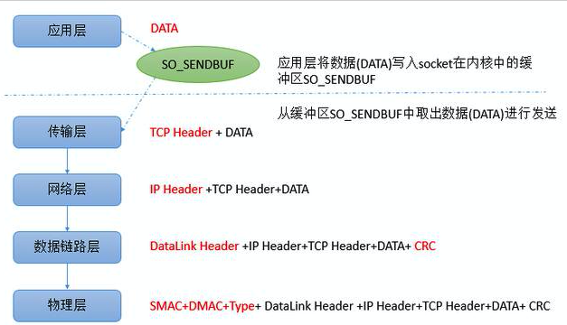

本文章来源于：<https://github.com/Zeb-D/my-review> ，请star 强力支持，你的支持，就是我的动力。

[TOC]

### 一、TCP粘包、拆包背景

假设客户端分别发送了两个数据包D1和D2给服务端，由于服务端一次读取到字节数是不确定的，

**故可能存在以下四种情况：**

1. 服务端分两次读取到了两个独立的数据包，分别是D1和D2，没有粘包和拆包
2. 服务端一次接受到了两个数据包，D1和D2粘合在一起，称之为TCP粘包
3. 服务端分两次读取到了数据包，第一次读取到了完整的D1包和D2包的部分内容，第二次读取到了D2包的剩余内容，这称之为TCP拆包
4. 服务端分两次读取到了数据包，第一次读取到了D1包的部分内容D1_1，第二次读取到了D1包的剩余部分内容D1_2和完整的D2包。

特别要注意的是，如果TCP的接受滑窗非常小，而数据包D1和D2比较大，很有可能会发生第五种情况，即服务端分多次才能将D1和D2包完全接受，期间发生多次拆包。

### 二、 粘包、拆包产生原因

**产生原因主要有这3种：**

- 滑动窗口
- MSS/MTU限制
- Nagle算法

#### **1、滑动窗口**

TCP流量控制主要使用滑动窗口协议，滑动窗口是接受数据端使用的窗口大小，用来告诉发送端接收端的缓存大小，以此可以控制发送端发送数据的大小，从而达到流量控制的目的。这个窗口大小就是我们一次传输几个数据。对所有数据帧按顺序赋予编号，发送方在发送过程中始终保持着一个发送窗口，只有落在发送窗口内的帧才允许被发送；同时接收方也维持着一个接收窗口，只有落在接收窗口内的帧才允许接收。这样通过调整发送方窗口和接收方窗口的大小可以实现流量控制。

**现在来看一下滑动窗口是如何造成粘包、拆包的？**

**粘包：**假设发送方的每256 bytes表示一个完整的报文，接收方由于数据处理不及时，这256个字节的数据都会被缓存到SO_RCVBUF(接收缓存区）中。如果接收方的SO_RCVBUF中缓存了多个报文，那么对于接收方而言，这就是粘包。

**拆包：**考虑另外一种情况，假设接收方的窗口只剩了128，意味着发送方最多还可以发送128字节，而由于发送方的数据大小是256字节，因此只能发送前128字节，等到接收方ack后，才能发送剩余字节。这就造成了拆包。

#### **2、MSS和MTU分片**

**MSS:** 是Maximum Segement Size缩写，表示TCP报文中data部分的最大长度，是TCP协议在OSI五层网络模型中传输层对一次可以发送的最大数据的限制。

**MTU:** 最大传输单元是Maxitum Transmission Unit的简写，是OSI五层网络模型中链路层(datalink layer)对一次可以发送的最大数据的限制。

当需要传输的数据大于MSS或者MTU时，数据会被拆分成多个包进行传输。由于MSS是根据MTU计算出来的，**因此当发送的数据满足MSS时，必然满足MTU。**

为了更好的理解，我们先介绍一下在5层网络模型中应用通过TCP发送数据的流程：

对于应用层来说，只关心发送的数据DATA，将数据写入socket在内核中的发送缓冲区SO_SNDBUF即返回，操作系统会将SO_SNDBUF中的数据取出来进行发送。传输层会在DATA前面加上TCP Header,构成一个完整的TCP报文。

当数据到达网络层(network layer)时，网络层会在TCP报文的基础上再添加一个IP Header，也就是将自己的网络地址加入到报文中。到数据链路层时，还会加上Datalink Header和CRC。

**当到达物理层时，会将SMAC(Source Machine，数据发送方的MAC地址)，DMAC(Destination Machine，数据接受方的MAC地址 )和Type域加入。**

可以发现数据在发送前，每一层都会在上一层的基础上增加一些内容：

> MTU是以太网传输数据方面的限制，每个以太网帧都有最小的大小64bytes最大不能超过1518bytes。
>
> 刨去以太网帧的帧头 （DMAC目的MAC地址48bit=6Bytes+SMAC源MAC地址48bit=6Bytes+Type域2bytes）14Bytes和帧尾 CRC校验部分4Bytes（这个部分有时候大家也把它叫做FCS），那么剩下承载上层协议的地方也就是Data域最大就只能有1500Bytes这个值 我们就把它称之为MTU。
>
> 由于MTU限制了一次最多可以发送1500个字节，而TCP协议在发送DATA时，还会加上额外的TCP Header和Ip Header，因此刨去这两个部分，就是TCP协议一次可以发送的实际应用数据的最大大小，也就是MSS。

> > **MSS长度=MTU长度-IP Header-TCP Header**

> TCP Header的长度是20字节，IPv4中IP Header长度是20字节，IPV6中IP Header长度是40字节，因此：在IPV4中，以太网MSS可以达到1460byte；在IPV6中，以太网MSS可以达到1440byte。

需要注意的是MSS表示的一次可以发送的DATA的最大长度，而不是DATA的真实长度。发送方发送数据时，当SO_SNDBUF中的数据量大于MSS时，操作系统会将数据进行拆分，使得每一部分都小于MSS，这就是拆包，然后每一部分都加上TCP Header，构成多个完整的TCP报文进行发送，当然经过网络层和数据链路层的时候，还会分别加上相应的内容。

**需要注意:** 默认情况下，与外部通信的网卡的MTU大小是1500个字节。而本地回环地址的MTU大小为65535，这是因为本地测试时数据不需要走网卡，所以不受到1500的限制。

#### **3、 Nagle算法**

TCP/IP协议中，无论发送多少数据，总是要在数据(DATA)前面加上协议头(TCP Header+IP Header)，同时，对方接收到数据，也需要发送ACK表示确认。

即使从键盘输入的一个字符，占用一个字节，可能在传输上造成41字节的包，其中包括1字节的有用信息和40字节的首部数据。这种情况转变成了4000%的消耗，这样的情况对于重负载的网络来是无法接受的。

为了尽可能的利用网络带宽，TCP总是希望尽可能的发送足够大的数据。（一个连接会设置MSS参数，因此，TCP/IP希望每次都能够以MSS尺寸的数据块来发送数据）。

**Nagle算法就是为了尽可能发送大块数据，避免网络中充斥着许多小数据块。**

Nagle算法的基本定义是任意时刻，最多只能有一个未被确认的小段。 所谓“小段”，指的是小于MSS尺寸的数据块，所谓“未被确认”，是指一个数据块发送出去后，没有收到对方发送的ACK确认该数据已收到。

**Nagle算法的规则：**

1. 如果SO_SNDBUF(发送缓冲区）中的数据长度达到MSS，则允许发送；
2. 如果该SO_SNDBUF中含有FIN，表示请求关闭连接，则先将SO_SNDBUF中的剩余数据发送，再关闭；
3. 设置了TCP_NODELAY=true选项，则允许发送。TCP_NODELAY是取消TCP的确认延迟机制，相当于禁用了Nagle 算法。
4. 未设置TCP_CORK选项时，若所有发出去的小数据包（包长度小于MSS）均被确认，则允许发送;
5. 上述条件都未满足，但发生了超时（一般为200ms），则立即发送。

