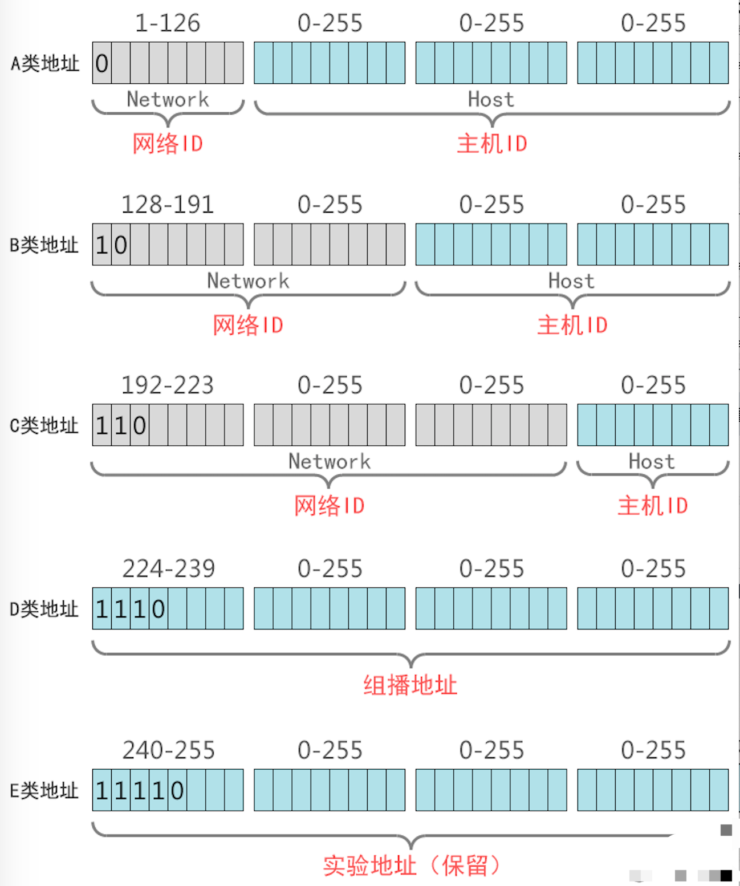
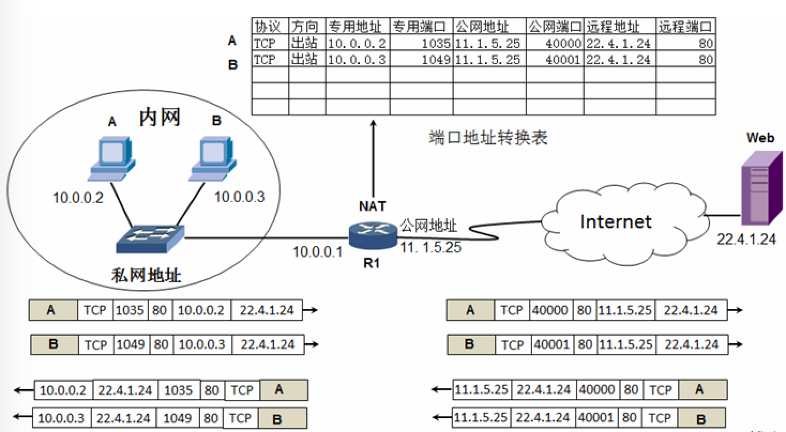

本文章来源于：<https://github.com/Zeb-D/my-review> ，请star 强力支持，你的支持，就是我的动力。

[TOC]

------

### 一、IP地址和MAC地址

#### 1、MAC地址

MAC（Media Access Control，介质访问控制）地址，或称为物理地址，也叫硬件地址，用来定义网络设备的位置，MAC地址是网卡出厂时设定的，是固定的（但可以通过在设备管理器中或注册表等方式修改，同一网段内的MAC地址必须唯一）。MAC地址采用十六进制数表示，长度是6个字节（48位），分为前24位和后24位。

1、前24位叫做组织唯一标志符（Organizationally Unique Identifier，即OUI），是由IEEE的注册管理机构给不同厂家分配的代码，区分了不同的厂家。
2、后24位是由厂家自己分配的，称为扩展标识符。同一个厂家生产的网卡中MAC地址后24位是不同的。

MAC地址对应于OSI参考模型的第二层数据链路层，工作在数据链路层的交换机维护着计算机MAC地址和自身端口的数据库，交换机根据收到的数据帧中的“目的MAC地址”字段来转发数据帧。

#### 2、IP地址

IP地址（Internet Protocol Address），缩写为IP Adress，是一种在Internet上的给主机统一编址的地址格式，也称为网络协议（IP协议）地址。它为互联网上的每一个网络和每一台主机分配一个逻辑地址，常见的IP地址，分为IPv4与IPv6两大类，当前广泛应用的是IPv4，目前IPv4几乎耗尽，下一阶段必然会进行版本升级到IPv6；如无特别注明，一般我们讲的的IP地址所指的是IPv4。

IP地址对应于OSI参考模型的第三层网络层，工作在网络层的路由器根据目标IP和源IP来判断是否属于同一网段，如果是不同网段，则转发数据包。

#### 3、IP地址格式和表示

在计算机二进制中，1个字节 = 8位 = 8bit（比特）

①IP地址格式和表示
IP地址(IPv4)由32位二进制数组成，分为4段（4个字节），每一段为8位二进制数（1个字节）
每一段8位二进制，中间使用英文的标点符号“.”隔开

由于二进制数太长，为了便于记忆和识别，把每一段8位二进制数转成十进制，大小为0至255。
IP地址的这种表示法叫做“点分十进制表示法”。
IP地址表示为：xxx.xxx.xxx.xxx
举个栗子：210.21.196.6就是一个IP地址的表示。

②理解2的指数幂
2的幂也称为2的指数，还可以称为2的次方，如2的2次方、2的3次方等等，任何数的0次方都等于1。
在IP地址中，0次方到7次方刚好为8位，这对于IP地址二进制转换为十进制非常方便。
举个栗子：11010010 = 1×27+1×26+0×25+1×24+0×23+0×22+1×21+0×20 = 128+64+0+16+0+0+2+0 = 210

我们需要记住上图的2的幂的结果，不需要死记硬背，这个是有技巧的，从上图来看，很容易发现，由于是2的幂，所有相邻的幂的前后都是相差2倍，所以只要知道其中一个幂值，就知道相邻的幂的值。

#### 4、IP地址的组成

IP地址=网络地址+主机地址，比如：

计算机的IP地址由两部分组成，一部分为网络标识，一部分为主机标识，同一网段内的计算机网络部分相同，主机部分不同同时重复出现。路由器连接不同网段，负责不同网段之间的数据转发，交换机连接的是同一网段的计算机。通过设置网络地址和主机地址，在互相连接的整个网络中保证每台主机的IP地址不会互相重叠，即IP地址具有了唯一性。

#### 5、IP地址与MAC地址区别

长度不同：IP地址为32位（二进制），MAC地址为48位（十六进制）。
分配依据不同：IP地址的分配是基于网络拓扑，MAC地址的分配是基于制造商。
寻址协议层不同：IP地址应用于OSI第三层（网络层），而MAC地址应用在OSI第二层（数据链路层）。

#### 6、IP地址与MAC地址的作用和关系

IP和MAC两者之间分工明确，默契合作，完成通信过程。在数据通信时，IP地址专注于网络层，网络层设备（如路由器）根据IP地址，将数据包从一个网络传递转发到另外一个网络上；而MAC地址专注于数据链路层，数据链路层设备（如交换机）根据MAC地址，将一个数据帧从一个节点传送到相同链路的另一个节点上。IP和MAC地址这种映射关系由ARP（Address Resolution Protocol，地址解析协议）协议完成，ARP根据目的IP地址，找到中间节点的MAC地址，通过中间节点传送，从而最终到达目的网络。

计算机在和其他计算机通信之前，首先要判断目标IP地址和自己的IP地址是否在一个网段，这决定了数据链层的目标MAC地址是目标计算机的还是路由器接口的MAC地址。数据包的目标IP地址决定了数据包最终到达哪一个计算机，而目标MAC地址决定了该数据包下一跳由哪个设备接收，不一定是终点。

### 二、IP地址的分类

#### 1、IP地址分类详解

IP地址分A、B、C、D、E五类，其中A、B、C这三类是比较常用的IP地址，D、E类为特殊地址。

①、A类地址
A类地址第1字节为网络地址（最高位固定是0），另外3个字节为主机地址。
A类地址范围：1.0.0.0 - 126.255.255.255，其中0和127作为特殊地址。
A类网络默认子网掩码为255.0.0.0，也可写作/8。
A类网络最大主机数量是256×256×256-2=166777214（减去1个主机位为0的网络地址和1个广播地址）。
在计算机网络中，主机ID全部为0的地址为网络地址，而主机ID全部为1的地址为广播地址，这2个地址是不能分配给主机用的。

②、B类地址
B类地址第1字节（最高位固定是10）和第2字节为网络地址，另外2个字节为主机地址。
B类地址范围：128.0.0.0 - 191.255.255.255。
B类网络默认子网掩码为255.255.0.0，也可写作/16。
B类网络最大主机数量256×256-2=65534。
③、C类地址
C类地址第1字节（最高位固定是110）、第2字节和第3个字节，另外1个字节为主机地址。
C类地址范围：192.0.0.0 - 223.255.255.255。
C类网络默认子网掩码为255.255.255.0，也可写作/24。
C类网络最大主机数量256-2=254。
④、D类地址
D类地址不分网络地址和主机地址，它的第1个字节的最高位固定是1110。
D类地址用于组播（也称为多播）的地址，无子网掩码。
D类地址范围：224.0.0.0 - 239.255.255.255。
⑤、E类地址
E类地址也不分网络地址和主机地址，它的第1个字节的最高位固定是11110。
E类地址范围：240.0.0.0 - 255.255.255.255。
其中240.0.0.0-255.255.255.254作为保留地址，主要用于Internet试验和开发，255.255.255.255作为广播地址。
2、IP地址分类思维导图
IP地址总结学习思维导图如下：

### 三、保留的特殊IP地址

以下这些特殊IP地址都是不能分配给主机用的地址：

主机ID全为0的地址：特指某个网段，比如：192.168.10.0 255.255.255.0，指192.168.10.0网段。
主机ID全为1的地址：特指该网段的全部主机，比如：192.168.10.255，如果你的计算机发送数据包使用主机ID全是1的IP地址，数据链层地址用广播地址FF-FF-FF-FF-FF-FF。
127.0.0.1：是本地环回地址，指本机地址，一般用来测试使用。回送地址(127.x.x.x)是本机回送地址(Loopback Address)，即主机IP堆栈内部的IP地址。
169.254.0.0：169.254.0.0-169.254.255.255实际上是自动私有IP地址。
0.0.0.0：如果计算机的IP地址和网络中的其他计算机地址冲突，使用ipconfig命令看到的就是0.0.0.0，子网掩码也是0.0.0.0。

### 四、公网和私网IP地址

#### 公网IP地址

公有地址分配和管理由Inter NIC（Internet Network Information Center 因特网信息中心）负责。各级ISP使用的公网地址都需要向Inter NIC提出申请，有Inter NIC统一发放，这样就能确保地址块不冲突。

#### 私网IP地址

创建IP寻址方案的人也创建了私网IP地址。这些地址可以被用于私有网络，在Internet没有这些IP地址，Internet上的路由器也没有到私有网络的路由表。

A类：10.0.0.0 255.0.0.0，保留了1个A类网络。
B类：172.16.0.0 255.255.0.0～172.31.0.0 255.255.0.0，保留了16个B类网络。
C类：192.168.0.0 255.255.255.0～192.168.255.0 255.255.255.0，保留了256个C类网络。
PS：私网地址访问Internet需要做NAT或PAT网络地址转换

> 参考资料：https://blog.51cto.com/u_6930123/2112403