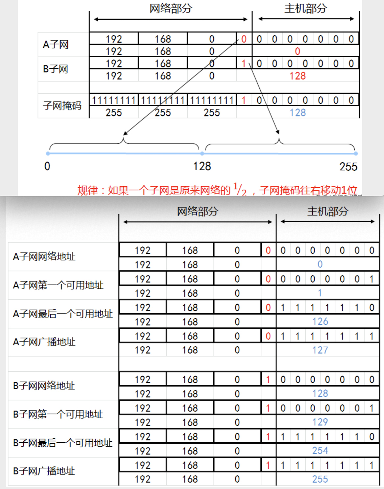
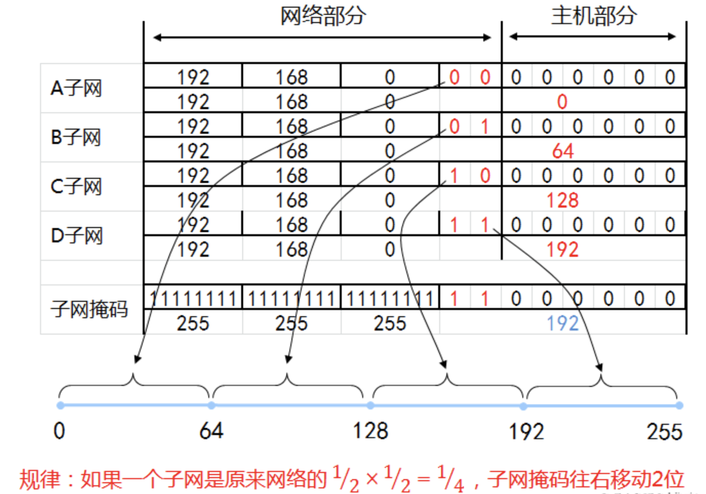
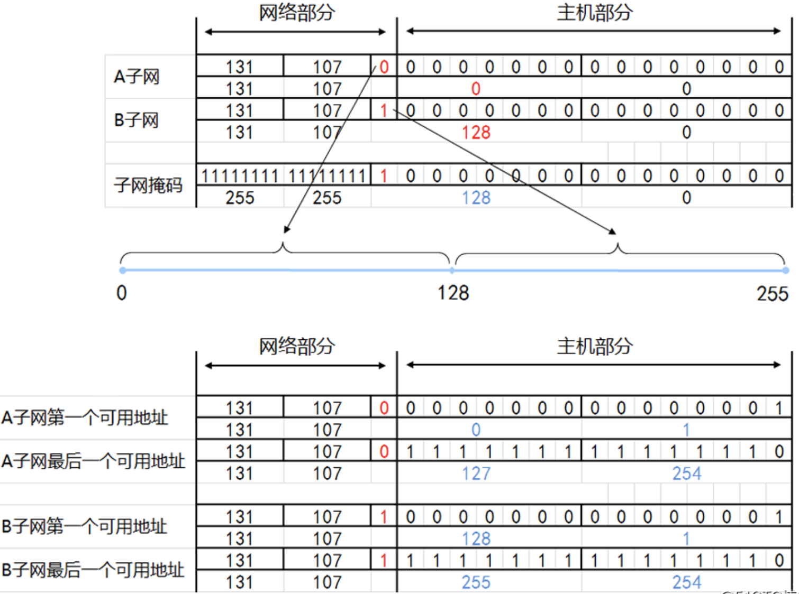
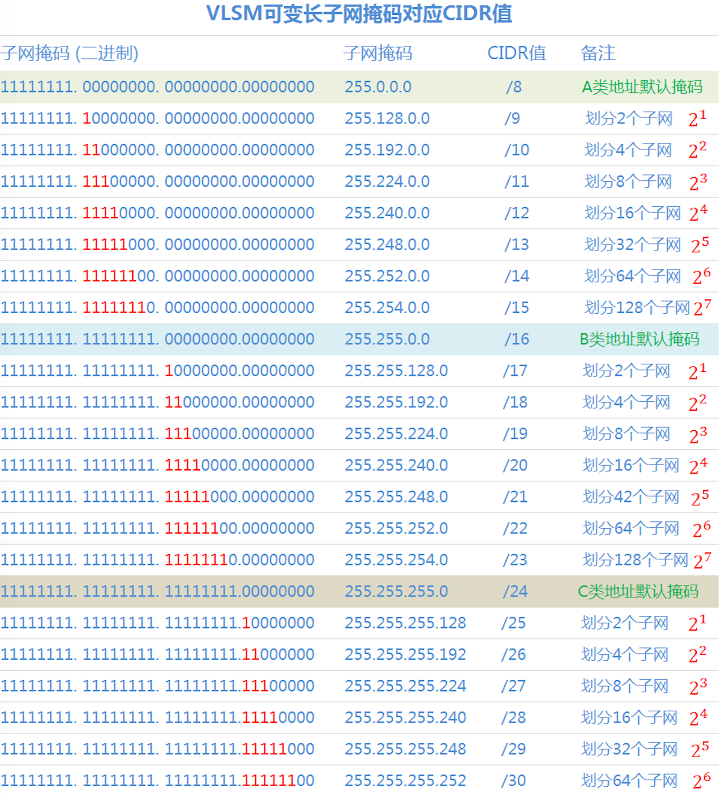

本文章来源于：<https://github.com/Zeb-D/my-review> ，请star 强力支持，你的支持，就是我的动力。

[TOC]

------

#### 1、为什么要划分子网？

IPv4地址如果只使用有类（A、B、C类）来划分，会造成大量的浪费或者不够用，为了解决这个问题，可以在有类网络的基础上，通过对IP地址的主机号进行再划分，把一部分划入网络号，就能划分各种类型大小的网络了。

#### 2、IPv4子网划分与聚合

为了解决IPv4的不足，提高网络划分的灵活性，诞生了两种非常重要的技术，那就是VLSM（可变长子网掩码）和CIDR（无类别域间路由），把传统标准的IPv4有类网络演变成一个更为高效，更为实用的无类网络。关于VLSM和CIDR的介绍参考上篇 [子网掩码详解](./网络工程-子网掩码详解.md)有讲述。

VLSM用于IPv4子网的划分，也就是把一个大的网络划分成多个小的子网；而CIDR则用于IPv4子网的聚合，当然主要是指路由方面的聚合，也就是路由汇总。通过CIDR可以把多个小的子网路由条目汇总成一个大网络的路由条目，以减少路由器中路由条目的数量，提高路由效率。

### 二、子网划分方法

我们所讲的子网划分其实就是基于VLSM可变长子网掩码的划分，子网划分又分为等长子网划分和变长子网划分。

#### 1、VLSM子网划分的基本思想

通过VLSM实现子网划分的基本思想很简单：就是借用现有网段的主机位的最左边某几位作为子网位，划分出多个子网。

①、把原来有类网络IPv4地址中的“网络ID”部分向“主机ID”部分借位

②、把一部分原来属于“主机ID”部分的位变成“网络ID”的一部分（通常称之为“子网ID”）。

③、原来的“网络ID”+“子网ID”=新“网络ID”。“子网ID”的长度决定了可以划分子网的数量。

如下示例图：

#### 2、全0子网与全1子网

①、“全0子网”代表的是对应子网的“子网ID”部分各位都是0，是第一个子网。

②、“全1子网”代表的是对应子网的“子网ID”部分各位都是1，是最后一个子网。

③、按照RFC950参考规定，划分子网后，只有n-2个可用的子网（n表示总的子网数）。

④、后来RFC1878参考规定，划分子网后，可以有n个可用的子网（n表示总的子网数）。

> RFC950参考规定：第一个子网（也就是“全0子网”）和最后一个子网（也就是“全1子网”）不可用，为的就是避免全0子网的网络地址和全1子网的广播地址分别与没有划分子网前的网络地址和广播地址相冲突。 但是在后来RFC1878规定中，该项规定已被废止了，现在的设备基本上都普遍支持RFC1878。

### 三、等长子网和变长子网划分

子网划分的任务包括：

①、确定子网掩码的长度。

②、确定子网下的主机可用地址范围（第一个可用IP和最后一个可用IP）。

③、确定网络地址（主机位全为0）和广播地址（主机位全为1），不能分配计算机主机用。

#### Ⅰ、等长子网划分

等长子网划分就是将一个有类网络等分成多个网络，也就是等分成多个子网，所有子网的子网掩码都相同。

##### 1、C类网络子网划分示例

①、等分为两个子网
将192.168.0.0 255.255.255.0这个网络等分成2个子网，并写出每个子网的地址信息？

分析：

该网络子网掩码为/24，要划分为2个子网，要借用主机位1位作为子网位。

因为二进制数0和1按一位排列组合，只有这2种，分别为：0，1，如下图所示。

0是A子网
1是B子网

借用主机1位，所以子网掩码+1位，由原来的255.255.255.0 （/24）变为255.255.255.128（/25）

结论：C类网络等分成2个子网，子网掩码往右移动1位，就能等分成2个子网，即2^1。

最终结果：

A子网的网络地址：192.168.0.0/25，可用地址（192.168.0.1～192.168.0.126），广播地址：192.168.0.127。

B子网的网络地址：192.168.0.128/25，可用地址（192.168.0.129～192.168.0.254），广播地址：192.168.0.255。

②、等分为四个子网
同样将192.168.0.0 255.255.255.0 这个网络等分成4个子网

分析：要想分成4个子网，需要将子网掩码往右移动两位

这样第1位和第2位就变为网络位，就可以分成4个子网

因为二进制数0和1按两位排列组合，只有这4种，分别为：00，01，10，11，如下图所示。

00是A子网
01是B子网
10是C子网
11是D子网

借用主机2位，所以子网掩码+2位，由原来的255.255.255.0 （/24）变为255.255.255.192 （/26）

结论：C类网络等分成4个子网，子网掩码往右移动2位，就能等分成4个子网，即2^2。

最终结果：

A子网的网络地址：192.168.0.0/26，可用地址（192.168.0.1～192.168.0.62），广播地址：192.168.0.63/26。

B子网的网络地址：192.168.0.64/26，可用地址（192.168.65～192.168.0.126），广播地址：192.168.0.127。

C子网的网络地址：192.168.0.128/26，可用地址（192.168.129～192.168.0.190），广播地址：192.168.0.191。

D子网的网络地址：192.168.0.192/26，可用地址（192.168.193/26～192.168.0.254），广播地址：192.168.0.255。

③、等分为八个子网
把一个C类网络等分成8个子网，如下图所示，子网掩码需要往右移3位。

这样才能划分出8个子网，主机位的第1位、第2位和第3位都变成网络位。

结论：C类网络等分成8个子网，子网掩码往右移动3位，就能等分成8个子网，即2^3。

最终结果：

子网掩码：255.255.255.224 （/27）

A子网的网络地址：192.168.0.0/27，可用地址（192.168.0.1～192.168.0.30），广播地址：192.168.0.31。

B子网的网络地址：192.168.0.32/27，可用地址（192.168.33～192.168.0.62），广播地址：192.168.0.63。

C子网的网络地址：192.168.0.64/27，可用地址（192.168.65～192.168.0.94），广播地址：192.168.0.95。

D子网的网络地址：192.168.0.96/27，可用地址（192.168.97～192.168.0.126），广播地址：192.168.0.127。

E子网的网络地址：192.168.0.128/27，可用地址（192.168.129～192.168.0.158），广播地址：192.168.0.159。

F子网的网络地址：192.168.0.160/27，可用地址（192.168.161～192.168.0.190），广播地址：192.168.0.191。

G子网的网络地址：192.168.0.192/27，可用地址（192.168.193～192.168.0.222），广播地址：192.168.0.223。

H子网的网络地址：192.168.0.224/27，可用地址（192.168.225～192.168.0.254），广播地址：192.168.0.255。

##### 2、B类网络子网划分示例

将131.107.0.0/16等分成2个子网，写出各个子网的第一个和最后一个可用的IP地址？

分析：要划分为2个子网，就要借用主机位1位作为子网位。

0是A子网
1是B子网

借用主机1位，所以子网掩码+1位，由原来的255.255.0.0 （/16）变为255.255.128.0（/17）

结论：B类网络等分成2个子网，子网掩码往右移动1位，就能等分成2个子网，即2^1。

最终结果：

A子网
网络地址：131.107.0.0/17，
可用地址（131.107.0.1 ~ 131.107.127.254）
广播地址：131.107.127.255

B子网
网络地址：131.107.128.0/17
可用地址（131.107.128.1 ~ 131.107.255.254）
广播地址：131.107.255.255

##### 3、A类网络子网划分示例

将A类网络42.0.0.0/8等分成4个子网，写出各个子网的第一个和最后一个可用的IP地址？

分析：要划分为4个子网，就要借用主机位2位作为子网位

00是A子网
01是B子网
10是C子网
11是D子网

借用主机2位，所以子网掩码+2位，由原来的255.0.0.0 （/8）变为255.192.0.0（/10）

结论：A类网络等分成4个子网，子网掩码往右移动2位，就能等分成4个子网，即2^2。

最终结果：

A子网的网络地址：42.0.0.0/10，可用地址（42.0.0.1 ~ 42.63.255.254），广播地址：42.63.255.255

B子网的网络地址：42.64.0.0/10，可用地址（42.64.0.1 ~ 42.127.255.254），广播地址：42.127.255.255

C子网的网络地址：42.128.0.0/10，可用地址（42.128.0.1 ~ 42.191.255.254），广播地址：42.191.255.255

D子网的网络地址：42.192.0.0/10，可用地址（42.192.0.1 ~ 42.255.255.254），广播地址：42.255.255.255

#### Ⅱ、变长子网划分

VLSM规定了如何在一个进行了子网划分的网络中，不同子网使用不同的子网掩码。这对于网络内部不同网段需要不同大小子网的情形来说很有效，这种划分子网的方式叫变长子网划分。

变长子网划分其实就是在等长子网的划分上，分别取不同等分子网中的某个或者多个子网。

#### 1、变长子网划分示例

如上示例划分分析结果：
A子网
网络地址：192.168.10.32，255.255.255.224（/27），可用地址（192.168.10.33 ~ 192.168.10.62），广播地址：192.168.10.63
相当于取了等长子网划分为8个子网中的一个子网

B子网
网络地址：192.168.10.64，255.255.255.192（/26），可用地址（192.168.10.65 ~ 192.168.10.126），广播地址：192.168.10.127
相当于取了等长子网划分为4个子网中的一个子网

C子网
网络地址：192.168.10.128，255.255.255.128（/25），可用地址（192.168.10.129 ~ 192.168.10.254），广播地址：192.168.10.255
相当于取了等长子网划分为2个子网中的一个子网

D子网
网络地址：192.168.10.0，255.255.255.252（/30），可用地址（192.168.10.1 ~ 192.168.10.2），广播地址：192.168.10.3
相当于取了等长子网划分为64个子网中的第一个子网

E子网
网络地址：192.168.10.4，255.255.255.252（/30），可用地址（192.168.10.5 ~ 192.168.10.6），广播地址：192.168.10.7
相当于取了等长子网划分为64个子网中的第二个子网

#### 2、变长子网划分总结

①、变长子网划分规律
如果一个子网地址块是原来网段的(1/2)^n，子网掩码就在原网段的基础上右移n位，不等长子网，子网掩码也不同。

②、点到点网络的子网掩码
每个子网是原来网络的(1/2)×(1/2)×(1/2)×(1/2)×(1/2)×(1/2)，也就是(1/2)^6，子网掩码往右移动6位。

例如：11111111.11111111.11111111.11111100写成十进制子网掩码也就是255.255.255.252。

### 四、子网划分总结和技巧

#### 1、确定划分子网数

子网数 = 2^n，n代表子网掩码往右移动的位数
例如：
要划分2个子网，子网掩码需要往右移动1位，2^1=2
要划分4个子网，子网掩码需要往右移动2位，2^2=4
要划分8个子网，子网掩码需要往右移动3位，2^3=8
…
子网数只能为2倍的关系划分。

#### 2、确定子网划分后的地址

每个子网地址块大小（IP_block）= 2^(8-n)
每个子网可用地址个数（IP_num）= 2^(8-n)-2
①、子网的网络地址 = 从0到255，取每段地址块的首个值
②、子网的广播地址 = 下一个子网的网络地址-1
③、子网的可用地址 = 子网的网络地址到子网的广播地址区间

例如：
要划分为4个网段（2^2），子网掩码右移2位
每个子网地址块大小（IP_block）= 2^(8-4) = 64
每个子网可用地址个数（IP_num）= 2^(8-4)-2 = 62
每段取值分别为：0，64，128，192
第一个子网
①、网络地址 = 0
②、广播地址 = 63
③、可用地址 = 1到62

第二个子网
①、网络地址 = 64
②、广播地址 = 127
③、可用地址 = 65到126

第三个子网
①、网络地址 = 128
②、广播地址 = 191
③、可用地址 = 129到190

第四个子网
①、网络地址 = 192
②、广播地址 = 255
③、可用地址 = 193到254

#### 3、确定子网掩码

划分后的子网掩码CIDR = 原网络的子网掩码CIDR+n，如要写成十进制：256-2^(8-n)
例如：
原来子网掩码：255.255.255.0（/24），往右移动3位，则划分为8个子网
子网掩码就变为为 /27，256-2^(8-3) = 256-2^5 = 256-32 = 224
最后子网掩码结果：255.255.255.224（/27）

如还有不明白的，请参照上面给出的VLSM可变长子网掩码对应CIDR值这个图就一目了然。

> 参考资料：https://blog.51cto.com/u_6930123/2113151