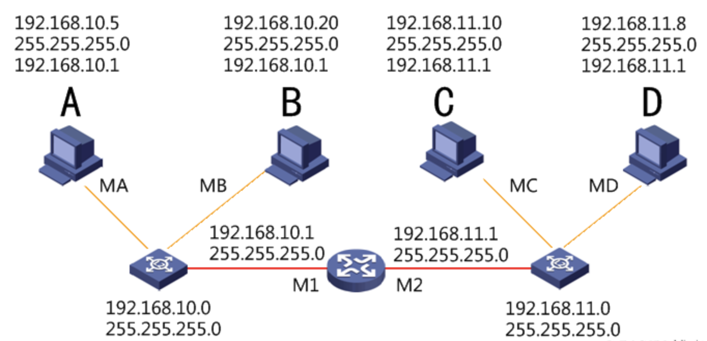
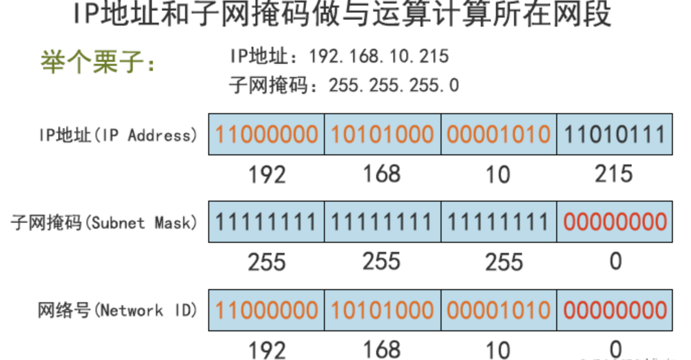

本文章来源于：<https://github.com/Zeb-D/my-review> ，请star 强力支持，你的支持，就是我的动力。

[TOC]

------

### 一、子网掩码

IP地址是以网络号和主机号来标示网络上的主机的，我们把网络号相同的主机称之为本地网络，网络号不相同的主机称之为远程网络主机，本地网络中的主机可以直接相互通信；远程网络中的主机要相互通信必须通过本地网关（Gateway）来传递转发数据。

#### 1、子网掩码的概念及作用

①、子网掩码（Subnet Mask）又叫网络掩码、地址掩码，必须结合IP地址一起对应使用。

②、只有通过子网掩码，才能表明一台主机所在的子网与其他子网的关系，使网络正常工作。

③、子网掩码和IP地址做“与”运算，分离出IP地址中的网络地址和主机地址，用于判断该IP地址是在本地网络上，还是在远程网络网上。

④、子网掩码还用于将网络进一步划分为若干子网，以避免主机过多而拥堵或过少而IP浪费。

#### 2、子网掩码的组成

①、同IP地址一样，子网掩码是由长度为32位二进制数组成的一个地址。

②、子网掩码32位与IP地址32位相对应，IP地址如果某位是网络地址，则子网掩码为1，否则为0。

③、举个栗子：如：11111111.11111111.11111111.00000000

注：左边连续的1的个数代表网络号的长度，（使用时必须是连续的，理论上也可以不连续），右边连续的0的个数代表主机号的长度。

#### 3、子网掩码的表示方法

①、点分十进制表示法
二进制转换十进制，每8位用点号隔开
例如：子网掩码二进制11111111.11111111.11111111.00000000，表示为255.255.255.0

②、CIDR斜线记法

IP地址/n

例1：192.168.1.100/24，其子网掩码表示为255.255.255.0，二进制表示为11111111.11111111.11111111.00000000

例2：172.16.198.12/20，其子网掩码表示为255.255.240.0，二进制表示为11111111.11111111.11110000.00000000

不难发现，例1中共有24个１，例2中共有20个１，所以n是这么来的。运营商ISP常用这样的方法给客户分配IP地址。

注：n为1到32的数字，表示子网掩码中网络号的长度，通过n的个数确定子网的主机数=2^(32-n)-2（-2的原因：主机位全为0时表示本网络的网络地址，主机位全为1时表示本网络的广播地址，这是两个特殊地址）。

#### 4、为什么要使用子网掩码？

前面说道，子网掩码可以分离出IP地址中的网络地址和主机地址，那为什么要分离呢？因为两台主机要通信，首先要判断是否处于同一网段，即网络地址是否相同。如果相同，那么可以把数据包直接发送到目标主机，否则就需要路由网关将数据包转发送到目的地。

可以这么简单的理解：A主机要与B主机通信，A和B各自的IP地址与A主机的子网掩码进行And与运算，看得出的结果：

1、结果如果相同，则说明这两台主机是处于同一个网段，这样A可以通过ARP广播发现B的MAC地址，B也可以发现A的MAC地址来实现正常通信。

2、如果结果不同，ARP广播会在本地网关终结，这时候A会把发给B的数据包先发给本地网关，网关再根据B主机的IP地址来查询路由表，再将数据包继续传递转发，最终送达到目的地B。

计算机的网关（Gateway）就是到其他网段的出口，也就是路由器接口IP地址。路由器接口使用的IP地址可以是本网段中任何一个地址，不过通常使用该网段的第一个可用的地址或最后一个可用的地址，这是为了尽可能避免和本网段中的主机地址冲突。

在如下拓扑图示例中，

A与B，C与D，都可以直接相互通信（都是属于各自同一网段，不用经过路由器），

但是A与C，A与D，B与C，B与D它们之间不属于同一网段，所以它们通信是要经过本地网关，

然后路由器根据对方IP地址，在路由表中查找恰好有匹配到对方IP地址的直连路由，于是从另一边网关接口转发出去实现互连。

#### 5、子网掩码的分类

①、缺省子网掩码

也叫默认子网掩码，即未划分子网，对应的网络号的位都置 1 ，主机号都置 0 。

未做子网划分的IP地址：网络号＋主机号

A类网络缺省子网掩码： 255.0.0.0，用CIDR表示为/8

B类网络缺省子网掩码： 255.255.0.0，用CIDR表示为/16

C类网络缺省子网掩码： 255.255.255.0，用CIDR表示为/24

②、自定义子网掩码

将一个网络划分子网后，把原本的主机号位置的一部分给了子网号，余下的才是给了子网的主机号。其形式如下：

做子网划分后的IP地址：网络号＋子网号＋子网主机号

举个栗子：

如：192.168.1.100/25，其子网掩码表示：255.255.255.128

意思就是将192.168.1.0这个网段的主机位的最高1位划分为了子网。

#### 6、子网掩码和IP地址的关系

子网掩码是用来判断任意两台主机的IP地址是否属于同一网络的依据，就是拿双方主机的IP地址和自己主机的子网掩码做与运算，如结果为同一网络，就可以直接通信。

And按位与运算：

与运算是计算机中一种基本的逻辑运算方式，符号表示为&，也可以表示为 and。

参加运算的两个数据，按二进制位进行“与”运算。

运算规则：0&0=0；0&1=0；1&0=0；1&1=1；

即：两位同时为“1”，结果才为“1”，否则为0

如何根据IP地址和子网掩码，计算网络地址：

①、将IP地址与子网掩码转换成二进制数。

②、将二进制形式的 IP 地址与子网掩码做“与”运算。

③、将得出的结果转化为十进制，便得到网络地址。

如下图：

**网络地址计算小技巧：**IP地址和子网掩码做与运算，把IP地址的主机位直接归0，就快速得到网络地址。所以只要一看到IP地址和子网掩码，就能马上确认网络地址。

### 二、CIDR与VLSM

理解和掌握了子网掩码这部分知识后，这里要补充下CIDR和VLSM，这对于我们下篇讲述的子网划分，简直了就是放大招啊！

#### 1、有类和无类网络，超网和子网

，我们先了解这几个概念，对于CIDR和VLSM以及子网划分都是很有用的。

◆ 有类网络：也叫主类网络或标准网络，就是指把IP地址能归结到的A类、B类、C类IP，使用的是标准的默认子网掩码。

◆ 无类网络：相对于有类网络，无类网络IP地址的掩码是变长的。在有类网络的基础上，拿出一部分主机ID作为子网ID。

◆ 超网：把多个小网络组合成一个大网络，称为超网（SuperNetting），也可以说子网掩码长度小于相对应的有类网络的叫超网。

◆ 子网：有类网络划分成更小后的网络，称为子网（Subnet），也可以说子网掩码长度大于相对应的有类网络的叫子网。

#### 2、CIDR无类别域间路由

CIDR（Classless Inter-Domain Routing，无类别域间路由）本质是消除了传统的A类、B类和C类地址以及划分子网的概念，将多个地址块聚合在一起生成一个更大的网络，从而包含更多的主机。

CIDR采用8-30位可变网络ID（最大可用的只能为30位，即保留2位给主机位），而不是A、B、C类网络ID所用的固定的8、16和24位。

CIDR表示方法：IP地址/n，n表示IP地址中的前n位代表网络部分（n个二进制数1），其余（32-n）位代表主机部分。这种方法称为“斜线记法”，它又称为CIDR记法。

举个栗子：子网掩码255.255.255.192，用CIDR表示是多少呢？

①、首先确认的是这是个C类网络地址（C类的默认子网掩码为255.255.255.0）

②、前面三个字节都是255，转换成二进制都为1，即11111111.11111111.11111111，即24位1。

③、后面一个字节是192，转换成二进制为11000000，即1占用了2位。

④、子网掩码共占用了26位1，所以用CIDR表示为/26。

⑤、如果网络地址为192.168.10.0，再加上CIDR，最后表示为192.168.10.0/26。

CIDR支持路由聚合，能够将路由表中的许多路由条目合并为成更少的数目，因此可以限制路由器中路由表的增大，减少路由通告，减轻路由器的负担。

#### 3、VLSM可变长子网掩码

VLSM（Variable Length Subnet Mask，可变长子网掩码）规定了在一个有类（A、B、C类）网络内包含多个子网掩码的能力，以及对一个子网的再进行子网划分的能力。

每一个IP地址都包含了2部分：网络号和主机号。在有类网络中，32bit的IP地址被分为4段，每段8bit来表示。这使得作为网络号的前缀必须是8位，16位或者24位。当网络号是24位的时候，主机号只有8位，也就是说，可分配的最小的地址块是256个（2^8=256，而实际可分配的主机地址还要减去两个，一个是网络地址，一个是广播地址，最后为254个），这个数量对于大多数企业来说是不够的。

而比这个大一点的IP地址块是网络号为16位的时候，这个时候可分配的地址块是65536（2^16=65536），这个数量对于大多数公司又太多了。这导致无论公司选择哪种类型的网络，都可能对IP地址造成大量的浪费。

IP地址如果只使用有类（A、B、C类）来划分，会造成大量的浪费或者不够用。VLSM的诞生有效的解决了这个问题，可以在有类网络的基础上，通过对IP地址的主机号进行再划分，把一部分划入网络号，就能划分各种类型大小的网络了。网络号也不再仅局限在8、16和24位这几个数，而是灵活变化的大小了。

#### 4、CIDR与VLSM的区别

在使用CIDR聚合地址时，将原来有类IP地址中的网络位划出一部分作为主机位使用。

在使用VLSM划分子网时，将原来有类IP地址中的主机位按照需要划出一部分作为网络位使用。

CIDR：子网掩码往左边移，掩码netmask缩短了。

VLSM：子网掩码往右边移，掩码netmask增长了。

CIDR是把几个有类网络合成一个大的网络（超网），用于路由地址聚合。

VLSM是把一个有类网络分成几个小型网络（子网），用于更高效划分子网。

#### CIDR与VLSM总结

在某种程度上来说，CIDR和VLSM它们之间可以看做是逆过程。

CIDR是把几个小网络聚合成一个大网络来做表示，而VLSM则是把一个大网络继续细分为几个小网络进行IP地址分配。

CIDR能让路由器的路由条目得到有效的减少，从而减少路由通告，降低路由器负担，而VLSM则是充分利用IP进行地址分配来解决IP地址不被浪费的问题，节约IP地址空间，更为有效的使用。

> 参考资料：https://blog.51cto.com/u_6930123/2112748