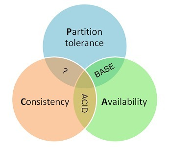

# CAP理论

 

### CAP理论概述

CAP理论是由2000年7月,加州大学伯克利分校的Eric Brewer教授在ACM PODC会议上提出CAP猜想 2年后,麻省理工学院的Seth Gliber和Nancy 从理论上证明了CAP.之后,CAP理论正式成为分布式计算 领域的公认定理.

**一致性(Consistency)**

**可用性(Availability)**

**分区容错性(Partition tolerance)**

 

 

## Consistency 一致性

一致性是指"all nodes see the same data at the same time",即更新操作成功并返回客户端完成后,所有节点在同一时间的数据完全一致 对于一致性,可以分为客户端和服务端两个不同的视角:

- 从客户端来看: 一致性主要指的是多并发访问时更新过的数据如何读取的问题
- 从服务端来看: 则是更新如何复制分不到整个系统,以保证数据最终一致
- 一致性是因为有并发读才有问题,因此理解一致性的问题时,一定要注意结合考虑并发的场景
- 强一致性:对于关系型数据库,要求更新过的数据都能被后续的访问能看到
- 弱一致性:如果能容忍后续的部分或者全部访问不到
- 最终一致性:如果过一段时间后才能访问到更新的数据,只要保证数据的最终一致性就好了

 

## Availability 可用性

- 对于一个可用性的分布式系统,每一个非故障的节点必须对每一个请求作出响应.
- 也就是,该系统使用的任何算法必须最终终止,当同时要求分区容忍时,这是一个很强的定义
- 即使是网络错误,每个请求必须终止 **好的可用性主要是指系统能够很好的为用户服务,不出现用户操作失败或者访问超时等用户体验不好的情况**

 

## Partition Tolerance 分区容错性

分区容错性是指"the system continues to operate despite arbitrary message loss or failure of part of the system", 即分布式系统在遇到某节点或网络故障的时候,仍然能够满足一致性和可用性的服务.

 

 

**一个分布式系统最多只能同时满足一致性(Consistency),可用性(Availability)和分区容错性(Partition tolerance)这三项中的两项.**

