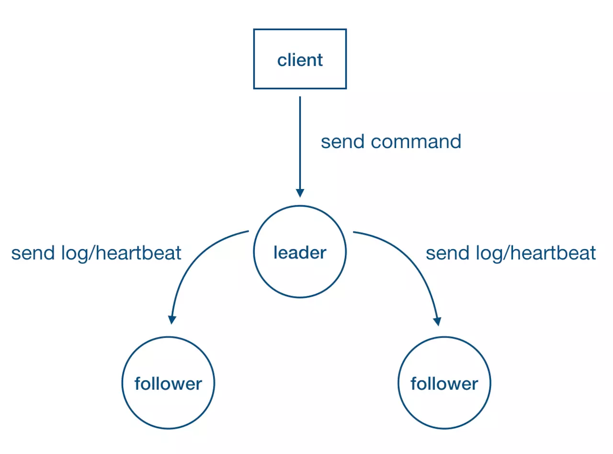
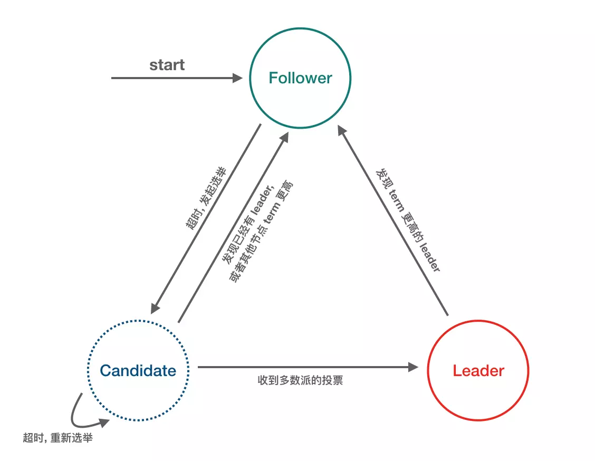
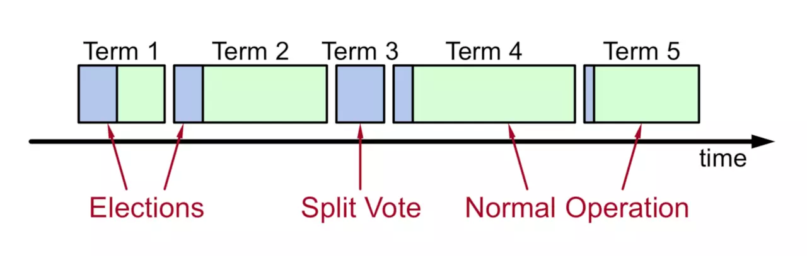

本文章来源于：<https://github.com/Zeb-D/my-review> ，请star 强力支持，你的支持，就是我的动力。

[TOC]

------

### 背景

#### 理解分布式

- **多个参与者** 针对 **某一件事** 达成完全 **一致** ：一件事，一个结论
- 已达成一致的结论，不可推翻

#### 分布式共识算法

- [Paxos](./什么是PAXOS.md)：被认为是分布式共识算法的根本，其他都是其变种，但是 Paxos 论文中只给出了单个提案的过程，并没有给出复制状态机中需要的 multi-paxos 的相关细节的描述，实现 Paxos 具有很高的工程复杂度（如多点可写，允许日志空洞等）。
- [Zab](../中间件/zk/ZAB协议.md)：被应用在 Zookeeper 中，业界使用广泛，但没有抽象成通用的 library。[理解ZAB与PAXOS区别](../中间件/zk/ZAB与Paxos.md)。
- Raft：以容易理解著称，业界也涌现出很多 Raft 实现，比如大名鼎鼎的 etcd, braft, tikv 等。


### 什么是 Raft？

[Raft](https://link.juejin.im?target=https%3A%2F%2Fraft.github.io%2F) 是一种更易于理解的分布式共识算法，核心协议本质上还是师承 Paxos 的精髓，不同的是依靠 Raft 模块化的拆分以及更加简化的设计，Raft 协议相对更容易实现。

模块化的拆分主要体现在：Raft 把一致性协议划分为 Leader 选举、MemberShip 变更、日志复制、Snapshot 等几个几乎完全解耦的模块。

更加**简化的设计**则体现在：

Raft 不允许类似 Paxos 中的乱序提交、简化系统中的角色状态（只有 Leader、Follower、Candidate 三种角色）、限制仅 Leader 可写入、使用随机化的超时时间来设计 Leader Election 等等。

### Strong Leader

- 系统中必须存在且同一时刻只能有一个 Leader，只有 Leader 可以接受 Clients 发过来的请求（这点和ZAB协议是非常不一样的）；
- Leader 负责主动与所有 Followers 通信，负责将“提案”发送给所有 Followers，同时收集多数派的 Followers 应答；
- Leader 还需向所有 Followers 主动发送心跳维持领导地位(保持存在感)。



### 基本概念

#### Raft-node 的 3 种角色/状态



1. Follower：完全被动，不能发送任何请求，只接受并响应来自 Leader 和 Candidate 的 Message，每个节点启动后的初始状态一定是 Follower；
2. Leader：处理所有来自客户端的请求，以及复制 Log 到所有 Followers；
3. Candidate：用来竞选一个新 Leader （Candidate 由 Follower 触发超时而来）。

#### Message 的 3 种类型

1. RequestVote RPC：由 Candidate 发出，用于发送投票请求；
2. AppendEntries (Heartbeat) RPC：由 Leader 发出，用于 Leader 向 Followers 复制日志条目，也会用作 Heartbeat （日志条目为空即为 Heartbeat）；
3. InstallSnapshot RPC：由 Leader 发出，用于快照传输，虽然多数情况都是每个服务器独立创建快照，但是Leader 有时候必须发送快照给一些落后太多的 Follower，这通常发生在 Leader 已经丢弃了下一条要发给该Follower 的日志条目(Log Compaction 时清除掉了) 的情况下。

#### 任期逻辑时钟

1. 时间被划分为一个个任期 (term)，term id 按时间轴单调递增；
2. 每一个任期的开始都是 Leader 选举，选举成功之后，Leader 在任期内管理整个集群，也就是 **“选举 + 常规操作”**；
3. 每个任期最多一个 Leader，可能没有 Leader (spilt-vote 导致)。



### 延伸

#### 什么是 SOFAJRaft？

SOFAJRaft 是一个基于 [Raft](https://link.juejin.im?target=https%3A%2F%2Fraft.github.io%2F) 一致性算法的生产级高性能 Java 实现，支持 MULTI-RAFT-GROUP，适用于高负载低延迟的场景。 使用 SOFAJRaft 你可以专注于自己的业务领域，由 SOFAJRaft 负责处理所有与 Raft 相关的技术难题，并且 SOFAJRaft 非常易于使用，你可以通过几个示例在很短的时间内掌握它。

SOFAJRaft 是从百度的 [braft](https://link.juejin.im?target=https%3A%2F%2Fgithub.com%2Fbrpc%2Fbraft) 移植而来，做了一些优化和改进，感谢百度 braft 团队开源了如此优秀的 C++ Raft 实现。

#### SOFAJRaft 整体功能&性能优化


##### 功能支持

1.Leader election：Leader 选举，这个不多说，上面已介绍过 Raft 中的 Leader 机制。

2.Log replication and recovery：日志复制和日志恢复。

- Log replication 就是要保证已经被 commit 的数据一定不会丢失，即一定要成功复制到多数派。
- Log recovery 包含两个方面：

2）Prev term 日志恢复：主要针对 Leader 切换前后的日志一致性。

3.Snapshot and log compaction：定时生成 snapshot，实现 log compaction 加速启动和恢复，以及 InstallSnapshot 给 Followers 拷贝数据，如下图：


*本图出自《In Search of an Understandable Consensus Algorithm》*

4.Membership change：用于集群线上配置变更，比如增加节点、删除节点、替换节点等。

5.Transfer leader：主动变更 leader，用于重启维护，leader 负载平衡等。

6.Symmetric network partition tolerance：对称网络分区容忍性。


如上图 S1 为当前 leader，网络分区造成 S2 不断增加本地 term，为了避免网络恢复后 S2 发起选举导致正在良心 工作的 leader step-down，从而导致整个集群重新发起选举，SOFAJRaft 中增加了 pre-vote 来避免这个问题的发生。

- SOFAJRaft 中在 request-vote 之前会先进行 pre-vote(currentTerm + 1, lastLogIndex, lastLogTerm)，多数派成功后才会转换状态为 candidate 发起真正的 request-vote，所以分区后的节点，pre-vote 不会成功，也就不会导致集群一段时间内无法正常提供服务。

7.Asymmetric network partition tolerance：非对称网络分区容忍性。


​    如上图 S1 为当前 leader，S2 不断超时触发选主，S3 提升 term 打断当前 lease，从而拒绝 leader 的更新。

- 在 SOFAJRaft 中增加了一个 tick 的检查，每个 follower 维护一个时间戳记录下收到 leader 上数据更新的时间(也包括心跳)，只有超过 election timeout 之后才允许接受 request-vote 请求。

8.Fault tolerance：容错性，少数派故障不影响系统整体可用性，包括但不限于：

- 机器掉电
- 强杀应用
- 慢节点(GC, OOM 等)
- 网络故障
- 其他各种奇葩原因导致 raft 节点无法正常工作

9.Workaround when quorate peers are dead：多数派故障时，整个 grop 已不具备可用性，安全的做法是等待多数节点恢复，只有这样才能保证数据安全；但是如果业务更加追求系统可用性，可以放弃数据一致性的话，SOFAJRaft 提供了手动触发 reset_peers 的指令以迅速重建整个集群，恢复集群可用。

10.Metrics：SOFAJRaft 内置了基于 [Metrics](https://link.juejin.im?target=https%3A%2F%2Fmetrics.dropwizard.io%2F4.0.0%2Fgetting-started.html) 类库的性能指标统计，具有丰富的性能统计指标，利用这些指标数据可以帮助用户更容易找出系统性能瓶颈。

11.Jepsen：除了几百个单元测试以及部分 chaos 测试之外, SOFAJRaft 还使用 [jepsen](https://link.juejin.im?target=https%3A%2F%2Fgithub.com%2Fjepsen-io%2Fjepsen) 这个分布式验证和故障注入测试框架模拟了很多种情况，都已验证通过：

- 随机分区，一大一小两个网络分区
- 随机增加和移除节点
- 随机停止和启动节点
- 随机 kill -9 和启动节点
- 随机划分为两组，互通一个中间节点，模拟分区情况
- 随机划分为不同的 majority 分组

##### 性能优化

除了功能上的完整性，SOFAJRaft 还做了很多性能方面的优化，这里有一份 KV 场景（get/put）的 [Benchmark](https://link.juejin.im?target=https%3A%2F%2Fgithub.com%2Falipay%2Fsofa-jraft%2Fwiki%2FBenchmark-%25E6%2595%25B0%25E6%258D%25AE) 数据, 在小数据包，读写比例为 9:1，保证线性一致读的场景下，三副本最高可以达到 40w+ 的 ops。

这里挑重点介绍几个优化点：

\1. Batch： 我们知道互联网两大优化法宝便是 Cache 和 Batch，SOFAJRaft 在 Batch 上花了较大心思，整个链路几乎都是 Batch 的，依靠 disruptor 的 MPSC 模型批量消费，对整体性能有着极大的提升，包括但不限于：

- 批量提交 task

- 批量网络发送

- 本地 IO batch 写入

  要保证日志不丢，一般每条 log entry 都要进行 fsync 同步刷盘，比较耗时，SOFAJRaft 中做了合并写入的优化。

- 批量应用到状态机

- 需要说明的是，虽然 SOFAJRaft 中大量使用了 Batch 技巧，但对单个请求的延时并无任何影响，SOFAJRaft 中不会对请求做延时的攒批处理。

\2. Replication pipeline：流水线复制，通常 Leader 跟 Followers 节点的 Log 同步是串行 Batch 的方式，每个 Batch 发送之后需要等待 Batch 同步完成之后才能继续发送下一批(ping-pong)，这样会导致较长的延迟。SOFAJRaft 中通过 Leader 跟 Followers 节点之间的 pipeline 复制来改进，非常有效降低了数据同步的延迟，提高吞吐。经我们测试，开启 pipeline 可以将吞吐提升 30% 以上，详细数据请参照 Benchmark。

\3. Append log in parallel：在 SOFAJRaft 中 Leader 持久化 log entries 和向 Followers 发送 log entries 是并行的。

\4. Fully concurrent replication：Leader 向所有 Follwers 发送 Log 也是完全相互独立和并发的。

- Asynchronous：SOFAJRaft 中整个链路几乎没有任何阻塞，完全异步的，是一个完全的 callback 编程模型。
- ReadIndex：优化 Raft read 走 Raft log 的性能问题，每次 read，仅记录 commitIndex，然后发送所有 peers heartbeat 来确认 Leader 身份，如果 Leader 身份确认成功，等到 appliedIndex >= commitIndex，就可以返回 Client read 了，基于 ReadIndex Follower 也可以很方便的提供线性一致读，不过 commitIndex 是需要从 Leader 那里获取，多了一轮 RPC；关于线性一致读文章后面会详细分析。
- Lease Read：SOFAJRaft 还支持通过租约 (lease) 保证 Leader 的身份，从而省去了 ReadIndex 每次 heartbeat 确认 Leader 身份，性能更好，但是通过时钟维护 lease 本身并不是绝对的安全（时钟漂移问题，所以 SOFAJRaft 中默认配置是 ReadIndex，因为通常情况下 ReadIndex 性能已足够好）。

#### SOFAJRaft 设计


\1. Node：Raft 分组中的一个节点，连接封装底层的所有服务，用户看到的主要服务接口，特别是 `apply(task)`用于向 raft group 组成的复制状态机集群提交新任务应用到业务状态机。

2.存储：上图靠下的部分均为存储相关。

- Log 存储，记录 Raft 用户提交任务的日志，将日志从 Leader 复制到其他节点上。

1. - LogStorage 是存储实现，默认实现基于 RocksDB 存储，你也可以很容易扩展自己的日志存储实现；
   - LogManager 负责对底层存储的调用，对调用做缓存、批量提交、必要的检查和优化。

- Metadata 存储，元信息存储，记录 Raft 实现的内部状态，比如当前 term、投票给哪个节点等信息。
- Snapshot 存储，用于存放用户的状态机 snapshot 及元信息，可选：

1. - SnapshotStorage 用于 snapshot 存储实现；
   - SnapshotExecutor 用于 snapshot 实际存储、远程安装、复制的管理。

\3. 状态机

- StateMachine：用户核心逻辑的实现，核心是 `onApply(Iterator)` 方法, 应用通过 `Node#apply(task)` 提交的日志到业务状态机；
- FSMCaller：封装对业务 StateMachine 的状态转换的调用以及日志的写入等,一个有限状态机的实现,做必要的检查、请求合并提交和并发处理等。

\4. 复制

- Replicator：用于 Leader 向 Followers 复制日志，也就是 Raft 中的 AppendEntries 调用，包括心跳存活检查等；
- ReplicatorGroup：用于单个 Raft group 管理所有的 replicator，必要的权限检查和派发。

\5. RPC：RPC 模块用于节点之间的网络通讯

- RPC Server：内置于 Node 内的 RPC 服务器，接收其他节点或者客户端发过来的请求，转交给对应服务处理；
- RPC Client：用于向其他节点发起请求，例如投票、复制日志、心跳等。

\6. KV Store：KV Store 是各种 Raft 实现的一个典型应用场景，SOFAJRaft 中包含了一个嵌入式的分布式 KV 存储实现（SOFAJRaft-RheaKV）。

##### SOFAJRaft Group

单个节点的 SOFAJRaft-node 是没什么实际意义的，下面是三副本的 SOFAJRaft 架构图：


##### SOFAJRaft Multi Group

单个 Raft group 是无法解决大流量的读写瓶颈的，SOFAJRaft 自然也要支持 multi-raft-group。


#### SOFAJRaft 实现细节解析之高效的线性一致读

什么是线性一致读? 所谓线性一致读，一个简单的例子就是在 t1 的时刻我们写入了一个值，那么在 t1 之后，我们一定能读到这个值，不可能读到 t1 之前的旧值 (想想 Java 中的 volatile 关键字，说白了线性一致读就是在分布式系统中实现 Java volatile 语义)。


如上图 Client A、B、C、D 均符合线性一致读，其中 D 看起来是 stale read，其实并不是，D 请求横跨了 3 个阶段，而读可能发生在任意时刻，所以读到 1 或 2 都行。

**重要：接下来的讨论均基于一个大前提，就是业务状态机的实现必须是满足线性一致性的，简单说就是也要具有 Java volatile 的语义**。

\1. 要实现线性一致读，首先我们简单直接一些，是否可以直接从当前 Leader 节点读?

- 仔细一想，这显然行不通，因为你无法确定这一刻当前的 "Leader" 真的是 Leader，比如在网络分区的情况下，它可能已经被推翻王朝却不自知。

\2. 最简单易懂的实现方式：同 “写” 请求一样，“读” 请求也走一遍 Raft 协议 (Raft Log)


*本图出自《Raft: A Consensus Algorithm for Replicated Logs》*

- 这一定是可以的，但性能上显然不会太出色，走 Raft Log 不仅仅有日志落盘的开销，还有日志复制的网络开销，另外还有一堆的 Raft “读日志” 造成的磁盘占用开销，这在读比重很大的系统中通常是无法被接受的。

\3. ReadIndex Read

- 这是 Raft 论文中提到的一种优化方案，具体来说：

1. - Leader 将自己当前 Log 的 commitIndex 记录到一个 Local 变量 ReadIndex 里面；
   - 接着向 Followers 发起一轮 heartbeat，如果半数以上节点返回了对应的 heartbeat response，那么 Leader 就能够确定现在自己仍然是 Leader (证明了自己是自己)；
   - Leader 等待自己的状态机执行，直到 applyIndex 超过了 ReadIndex，这样就能够安全的提供 Linearizable Read 了，也不必管读的时刻是否 Leader 已飘走 (思考：为什么等到 applyIndex 超过了 ReadIndex 就可以执行读请求?)；
   - Leader 执行 read 请求，将结果返回给 Client。

- 通过 ReadIndex，也可以很容易在 Followers 节点上提供线性一致读：

1. - Follower 节点向 Leader 请求最新的 ReadIndex；
   - Leader 执行上面前 3 步的过程(确定自己真的是 Leader)，并返回 ReadIndex 给 Follower；
   - Follower 等待自己的 applyIndex 超过了 ReadIndex；
   - Follower 执行 read 请求，将结果返回给 Client。（SOFAJRaft 中可配置是否从 Follower 读取，默认不打开）

- ReadIndex小结：

1. - 相比较于走 Raft Log 的方式，ReadIndex 省去了磁盘的开销，能大幅度提升吞吐，结合 SOFAJRaft 的 batch + pipeline ack + 全异步机制，三副本的情况下 Leader 读的吞吐可以接近于 RPC 的吞吐上限；
   - 延迟取决于多数派中最慢的一个 heartbeat response，理论上对于降低延时的效果不会非常显著。

4. Lease Read

- Lease Read 与 ReadIndex 类似，但更进一步，不仅省去了 Log，还省去了网络交互。它可以大幅提升读的吞吐也能显著降低延时。
- 基本的思路是 Leader 取一个比 election timeout 小的租期(最好小一个数量级)，在租约期内不会发生选举，这就确保了 Leader 不会变，所以可以跳过 ReadIndex 的第二步，也就降低了延时。可以看到 Lease Read 的正确性和时间是挂钩的，因此时间的实现至关重要，如果时钟漂移严重，这套机制就会有问题。
- 实现方式：

1. - 定时 heartbeat 获得多数派响应，确认 Leader 的有效性 (在 SOFAJRaft 中默认的 heartbeat 间隔是 election timeout 的十分之一)；
   - 在租约有效时间内，可以认为当前 Leader 是 Raft Group 内的唯一有效 Leader，可忽略 ReadIndex 中的 heartbeat 确认步骤(2)；
   - Leader 等待自己的状态机执行，直到 applyIndex 超过了 ReadIndex，这样就能够安全的提供 Linearizable Read 了 。

在 SOFAJRaft 中发起一次线性一致读请求的代码展示：

```
// KV 存储实现线性一致读
public void readFromQuorum(String key, AsyncContext asyncContext) {
    // 请求 ID 作为请求上下文传入
    byte[] reqContext = new byte[4];
    Bits.putInt(reqContext, 0, requestId.incrementAndGet());
    // 调用 readIndex 方法, 等待回调执行
    this.node.readIndex(reqContext, new ReadIndexClosure() {
        @Override
        public void run(Status status, long index, byte[] reqCtx) {
            if (status.isOk()) {
                try {
                    // ReadIndexClosure 回调成功，可以从状态机读取最新数据返回
                    // 如果你的状态实现有版本概念，可以根据传入的日志 index 编号做读取
                    asyncContext.sendResponse(new ValueCommand(fsm.getValue(key)));
                } catch (KeyNotFoundException e) {
                    asyncContext.sendResponse(GetCommandProcessor.createKeyNotFoundResponse());
                }
            } else {
                // 特定情况下，比如发生选举，该读请求将失败
                asyncContext.sendResponse(new BooleanCommand(false, status.getErrorMsg()));
            }
        }
    });
}复制代码
```

#### SOFAJRaft 应用场景

1. Leader 选举；
2. 分布式锁服务，比如 Zookeeper，在 SOFAJRaft 中的 RheaKV 模块提供了完整的分布式锁实现；
3. 高可靠的元信息管理，可直接基于 SOFAJRaft-RheaKV 存储；
4. 分布式存储系统，如分布式消息队列、分布式文件系统、分布式块系统等等。

##### 使用案例

1. RheaKV：基于 SOFAJRaft 实现的嵌入式、分布式、高可用、强一致的 KV 存储类库。
2. AntQ Streams QCoordinator：使用 SOFAJRaft 在 Coordinator 集群内做选举、使用 SOFAJRaft-RheaKV 做元信息存储等功能。
3. Schema Registry：高可靠 schema 管理服务，类似 kafka schema registry，存储部分基于 SOFAJRaft-RheaKV。
4. SOFA 服务注册中心元信息管理模块：IP 数据信息注册，要求写数据达到各个节点一致，并且在少数派节点挂掉时保证不影响数据正常存储。

#### 实践

##### 一、基于 SOFAJRaft 设计一个简单的 KV Store


#### 二、基于 SOFAJRaft 的 RheaKV 的设计


##### 功能名词

**PD**

- 全局的中心总控节点，负责整个集群的调度，不需要自管理的集群可不启用 PD (一个 PD 可管理多个集群，基于 clusterId 隔离)。

**Store**

- 集群中的一个物理存储节点，一个 Store 包含一个或多个 Region。

**Region**

- 最小的 KV 数据单元，每个 Region 都有一个左闭右开的区间 [startKey, endKey), 可根据请求流量/负载/数据量大小等指标自动分裂以及自动副本搬迁。

##### 特点

- 嵌入式
- 强一致性
- 自驱动


- 自诊断, 自优化, 自决策

以上几点(尤其2、3) 基本都是依托于 SOFAJRaft 自身的功能来实现，详细介绍请参考 [SOFAJRaft 文档](https://link.juejin.im?target=https%3A%2F%2Fgithub.com%2Falipay%2Fsofa-jraft%2Fwiki) 。


### 参考

https://juejin.im/post/5c88756a6fb9a049f9136c1a