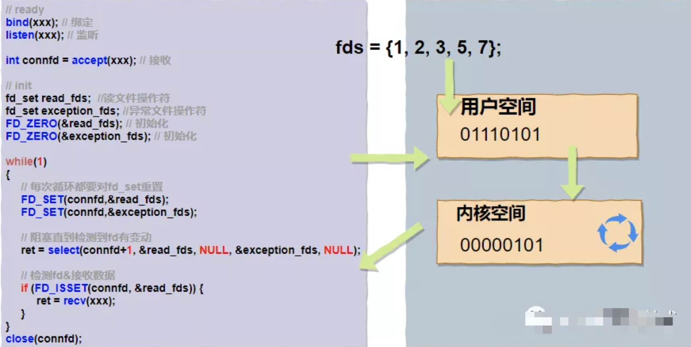
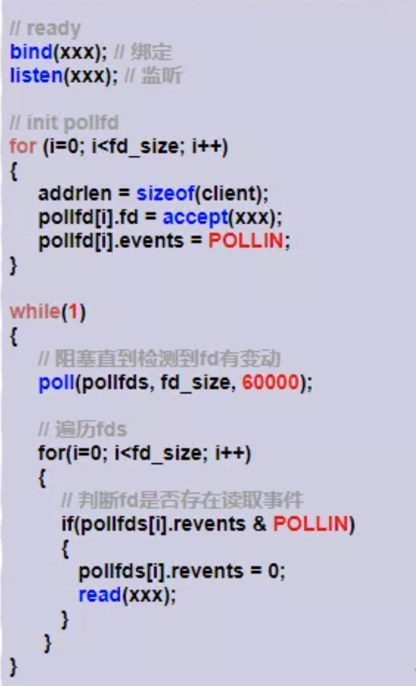
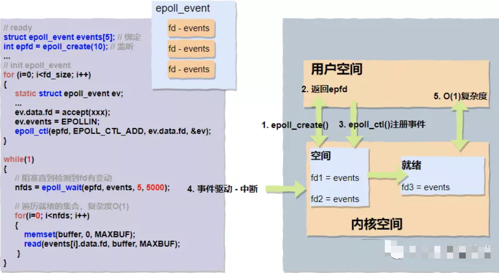

本文章来源于：<https://github.com/Zeb-D/my-review> ，请star 强力支持，你的支持，就是我的动力。

[TOC]

------

### 一、背景

目前作者所在的IOT，其中设备链接的`levimq`一个自研集群号称能扛住十亿级智能设备的链接，

像这种核心集群最关注的是链接、处理，目前采用多层架构进行冷热逻辑处理；在此之前，该集群的架构也是进行了好几代重构；

其中也解决了Linux 中经典的 C10K 和 C1000K 问题才能做到单机支持 C10M，进而集群的十亿级(压测过)；


### 二、概念

inux 网络基于 TCP/IP 模型，构建了其网络协议栈，把繁杂的网络功能划分为应用层、传输层、网络层、网络接口层等四个不同的层次，既解决了网络环境中设备异构的问题，也解耦了网络协议的复杂性。


在应用程序通过套接字接口发送或者接收网络包时，这些网络包都要经过协议栈的逐层处理（系统调用及用户态切换）。我们通常用带宽、吞吐、延迟、PPS 等来衡量网络性能。
什么是经典的 C10K 和 C1000K 问题，以更好理解 Linux 网络的工作原理，并进一步分析，如何做到单机支持 C10M。
注意，C10K 和 C1000K 的首字母 C 是 Client 的缩写。C10K 就是单机同时处理 1 万个请求（并发连接 1 万）的问题，而 C1000K 也就是单机支持处理 100 万个请求（并发连接 100 万）的问题。


#### C10K

[C10K](http://www.kegel.com/c10k.html) 问题最早由 Dan Kegel 在 1999 年提出。那时的服务器还只是 32 位系统，运行着 Linux 2.2 版本（后来又升级到了 2.4 和 2.6，而 2.6 才支持 x86_64），只配置了很少的内存（2GB）和千兆网卡。
怎么在这样的系统中支持并发 1 万的请求呢？
从资源上来说，对 2GB 内存和千兆网卡的服务器来说，

同时处理 10000 个请求，只要每个请求处理占用不到 200KB（2GB/10000）的内存和 100Kbit （1000Mbit/10000）的网络带宽就可以。

所以，物理资源是足够的，接下来自然是软件的问题，特别是网络的 I/O 模型问题。


#### 分析

说到 I/O 的模型，文件 I/O，其实网络 I/O 模型也类似。在 C10K 以前，Linux 中网络处理都用同步阻塞的方式，也就是每个请求都分配一个进程或者线程。请求数只有 100 个时，这种方式自然没问题，但增加到 10000 个请求时，10000 个进程或线程的调度、上下文切换乃至它们占用的内存，都会成为瓶颈。
既然每个请求分配一个线程的方式不合适，那么，为了支持 10000 个并发请求，这里就有两个问题需要我们解决。
第一，怎样在一个线程内处理多个请求，也就是要在一个线程内响应多个网络 I/O。以前的同步阻塞方式下，一个线程只能处理一个请求，到这里不再适用，是不是可以用非阻塞 I/O 或者异步 I/O 来处理多个网络请求呢？

第二，怎么更节省资源地处理客户请求，也就是要用更少的线程来服务这些请求。是不是可以继续用原来的 100 个或者更少的线程，来服务现在的 10000 个请求呢？

当然，事实上，现在 C10K 的问题早就解决了，可以先自己思考一下这两个问题，是不是已经有了解决思路呢？


### 三、优化

#### I/O 模型优化

异步、非阻塞 I/O 的解决思路，你应该听说过，其实就是我们在网络编程中经常用到的 I/O 多路复用（I/O Multiplexing）。I/O 多路复用是什么意思呢？

别急，详细了解前，我先来讲两种 I/O 事件通知的方式：

水平触发和边缘触发，它们常用在套接字接口的文件描述符中。

水平触发：只要文件描述符可以非阻塞地执行 I/O ，就会触发通知。也就是说，应用程序可以随时检查文件描述符的状态，然后再根据状态，进行 I/O 操作。

边缘触发：只有在文件描述符的状态发生改变（也就是 I/O 请求达到）时，才发送一次通知。这时候，应用程序需要尽可能多地执行 I/O，直到无法继续读写，才可以停止。如果 I/O 没执行完，或者因为某种原因没来得及处理，那么这次通知也就丢失了。

接下来，我们再回过头来看 I/O 多路复用的方法。这里其实有很多实现方法，我带你来逐个分析一下。


####  I/O 多路复用

非阻塞模型会让用户进程一直轮询调用系统函数，频繁地做内核态切换。


##### 非阻塞 I/O 和水平触发通知

第一种，使用非阻塞 I/O 和水平触发通知，比如使用 select 或者 poll。


根据刚才水平触发的原理，select 和 poll 需要从文件描述符列表中，找出哪些可以执行 I/O ，然后进行真正的网络 I/O 读写。由于 I/O 是非阻塞的，一个线程中就可以同时监控一批套接字的文件描述符，这样就达到了单线程处理多请求的目的。

所以，这种方式的最大优点，是对应用程序比较友好，它的 API 非常简单。

但是，应用软件使用 select 和 poll 时，需要对这些文件描述符列表进行轮询，这样，请求数多的时候就会比较耗时。并且，select 和 poll 还有一些其他的限制。

select 使用固定长度的位相量，表示文件描述符的集合，因此会有最大描述符数量的限制。比如，在 32 位系统中，默认限制是 1024。并且，在 select 内部，检查套接字状态是用轮询的方法，再加上应用软件使用时的轮询，就变成了一个 O(n^2) 的关系。

而 poll 改进了 select 的表示方法，换成了一个没有固定长度的数组，这样就没有了最大描述符数量的限制（当然还会受到系统文件描述符限制）。但应用程序在使用 poll 时，同样需要对文件描述符列表进行轮询，这样，处理耗时跟描述符数量就是 O(N) 的关系。

除此之外，应用程序每次调用 select 和 poll 时，还需要把文件描述符的集合，从用户空间传入内核空间，由内核修改后，再传出到用户空间中。这一来一回的内核空间与用户空间切换，也增加了处理成本。

有没有什么更好的方式来处理呢？答案自然是肯定的。


##### 非阻塞 I/O 和边缘触发通知

第二种，使用非阻塞 I/O 和边缘触发通知，比如 epoll。

既然 select 和 poll 有那么多的问题，就需要继续对其进行优化，而 epoll 就很好地解决了这些问题。

epoll 使用红黑树，在内核中管理文件描述符的集合，这样，就不需要应用程序在每次操作时都传入、传出这个集合。

epoll 使用事件驱动的机制，只关注有 I/O 事件发生的文件描述符，不需要轮询扫描整个集合。

不过要注意，epoll 是在 Linux 2.6 中才新增的功能（2.4 虽然也有，但功能不完善）。

由于边缘触发只在文件描述符可读或可写事件发生时才通知，那么应用程序就需要尽可能多地执行 I/O，并要处理更多的异常事件。


##### 异步 I/O

第三种，使用异步 I/O（Asynchronous I/O，简称为 AIO）。大家业余可以理解下异步 I/O 与同步 I/O 的区别。

异步 I/O 允许应用程序同时发起很多 I/O 操作，而不用等待这些操作完成。

而在 I/O 完成后，系统会用事件通知（比如信号或者回调函数）的方式，告诉应用程序。

这时，应用程序才会去查询 I/O 操作的结果。

异步 I/O 也是到了 Linux 2.6 才支持的功能，并且在很长时间里都处于不完善的状态，比如 glibc 提供的异步 I/O 库，就一直被社区诟病。

同时，由于异步 I/O 跟我们的直观逻辑不太一样，想要使用的话，一定要小心设计，其使用难度比较高。


#### 工作模型优化

了解了 I/O 模型后，请求处理的优化就比较直观了。

使用 I/O 多路复用后，就可以在一个进程或线程中处理多个请求，其中，又有下面两种不同的工作模型。

第一种，主进程 + 多个 worker 子进程，这也是最常用的一种模型。这种方法的一个通用工作模式就是：
主进程执行 bind() + listen() 后，创建多个子进程；

然后，在每个子进程中，都通过 accept() 或 epoll_wait() ，来处理相同的套接字。

比如，最常用的反向代理服务器 Nginx 就是这么工作的。

它也是由主进程和多个 worker 进程组成。

主进程主要用来初始化套接字，并管理子进程的生命周期；

而 worker 进程，则负责实际的请求处理。


### 四、延伸原理

非阻塞模型会让用户进程一直轮询调用系统函数，频繁地做内核态切换。想要做优化其实也比较简单，我们假想个业务场景，A业务系统会调用B的基础服务查询单个用户的信息。随着业务的发展，A的逻辑变复杂了，需要查100个用户的信息。很明显，A希望B提供一个批量查询的接口，用集合作为入参，一次性把数据传递过去就省去了频繁的系统间调用。

 

多路复用实际也差不多就是这个实现思路，只不过入参这个“集合”需要你注册/填写感兴趣的事件，读fd、写fd或者连接状态的fd等，然后交给内核帮你进行处理。


多路复用实际也差不多就是这个实现思路，只不过入参这个“集合”需要你注册/填写感兴趣的事件，读fd、写fd或者连接状态的fd等，然后交给内核帮你进行处理。

 

那我们就具体来看看多路复用里面大家都可能听过的几个系统调用 `select()、poll()、epoll()`


#### select

> select() 构造函数信息如下所示：
>
>  
>
> */*** ** select()**系统调用* ** 
>
> ** *参数列表：* 
>
> **   nfds    - 值为最大的文件描述符+1
>
> *\*readfds  -用户检查可读性
>
> *\*writefds  -用户检查可写性
>
> *\*exceptfds - 用于检查外带数据 
>
> *\*timeout  - 超时时间的结构体指针
>
> **/*
>
> int select（int nfds, fd_set *readfds, fd_set *writefds, fd_set *exceptfds, struct timeval *timeout）;

> 官方文档对**select()**的描述：
>
> **DESCRIPTION**
>
> select() and pselect() allow a program to monitor multiple file descriptors, waiting until one or more of the file descriptors become "ready" for some class of I/O operation (e.g.,input possible). A file descriptor is considered ready if it is possible to perform the corresponding I/O operation (e.g., read(2)) without blocking.

select()允许程序监控多个fd，阻塞等待直到一个或多个fd到达"就绪"状态。

 

内核使用**select()**为用户进程提供了类似批量的接口，函数本身也会一直阻塞直到有fd为就绪状态返回。

下面我们来具体看下**select()**函数实现，以便我们更好地分析它有哪些优缺点。

在**select()**函数的构造器里，我们很容易看到"**fd_set**"这个入参类型。

它是用位图算法bitmap实现的，使用了一个大小固定的数组（fd_set设置了FD_SETSIZE固定长度为**1024**），

数组中的每个元素都是0和1这样的二进制byte，0,1映射fd对应位置上是否有读写事件，

举例：如果fd == 5，那么fd_set = 000001000。

 

同时 **fd_set** 定义了四个宏来处理bitmap：

- **FD_ZERO(&set);** // 初始化，清空的作用，使集合中不含任何fd
- **FD_SET(fd,     &set);** // 将fd加入set集合，给某个位置赋值的操作
- **FD_CLR(fd,     &set);** // 将fd从set集合中清除，去掉某个位置的值
- **FD_ISSET(fd,     &set);** // 校验某位置的fd是否在集合中

 

使用bitmap算法的好处非常明显，运算效率高，占用内存少（使用了一个byte，8bit）。我们用伪代码和图片来

描述下用户进程调用select()的过程：



 

假设fds为{1, 2, 3, 5, 7}对应的bitmap为"01110101"，抛给内核空间轮询，当有读写事件时重新标记同时停止阻塞，然后整体返回用户空间。由此我们可以看到select()系统调用的弊端也是比较明显的：

- 复杂度O(n)，轮询的任务交给了内核来做，复杂度并没有变化，数据取出后也需要轮询哪个fd上发生了变动；
- 用户态还是需要不断切换到内核态，直到所有的fds数据读取结束，整体开销依然很大；
- fd_set有大小的限制，目前被硬编码成了**1024**；
- fd_set不可重用，每次操作完都必须重置；


#### **poll**

> **poll()** 构造函数信息如下所示：
>
> */** \* poll()**系统调用* ** ** *参数列表：* **  \*fds     - pollfd**结构体* **   nfds    -* *要监视的描述符的数量* **   timeout   -* *等待时间* **/*int poll（struct pollfd *fds, nfds_t nfds, int *timeout）; ### pollfd的结构体struct pollfd{int fd；*//* *文件描述符*short event；*//* *请求的事件*short revent；*//* *返回的事件*}
>
>  
>
> 官方文档对**poll()**的描述：
>
> **DESCRIPTION**
>
> poll() performs a similar task to select(2): it waits for one of a set of file descriptors to become ready to perform I/O.


poll() 非常像select()，它也是阻塞等待直到一个或多个fd到达"就绪"状态。

 

看官方文档描述可以知道，**poll()**和**select()**是非常相似的，

唯一的区别在于**poll()**摒弃掉了位图算法，使用自定义的结构体**pollfd**，在**pollfd**内部封装了fd，

并通过event变量注册感兴趣的可读可写事件（**POLLIN****、POLLOUT**），最后把 **pollfd** 交给内核。

当有读写事件触发的时候，我们可以通过轮询 **pollfd**，判断revent确定该fd是否发生了可读可写事件。

 

老样子我们用伪代码来描述下用户进程调用 **poll()** 的过程：



 

**poll()** 相对于**select()**，主要的优势是使用了pollfd的结构体：

- 没有了bitmap大小1024的限制；
- 通过结构体中的revents置位；

 

但是用户态到内核态切换及O(n)复杂度的问题依旧存在。


#### **epoll**

epoll()应该是目前最主流，使用范围最广的一组多路复用的函数调用，像我们熟知的Nginx、Redis都广泛地使用了此种模式。接下来我们重点分析下，epoll()的实现采用了“三步走”策略，它们分别是`epoll_create()、epoll_ctl()、epoll_wait()`

```
/** * 返回专用的文件描述符 */
int epoll_create（int size）;
```

用户进程通过 **epoll_create()** 函数在内核空间里面创建了一块空间（为了便于理解，可以想象成创建了一块白板），并返回了描述此空间的fd。

```
/** * epoll_ctl()系统调用 
* * 参数列表： 
*     epfd       - 由epoll_create()返回的epoll专用的文件描述符 
*     op         - 要进行的操作例如注册事件,可能的取值:注册-EPOLL_CTL_ADD、修改-EPOLL_CTL_MOD、删除-EPOLL_CTL_DEL 
*     fd         - 关联的文件描述符 
*     event      - 指向epoll_event的指针 */
int epoll_ctl（int epfd, int op, int fd , struce epoll_event *event ）;

```

刚刚我们说通过**epoll_create()**可以创建一块具体的空间“白板”，那么通过**epoll_ctl()** 我们可以通过自定义的epoll_event结构体在这块"白板上"注册感兴趣的事件了。

- 注册 - EPOLL_CTL_ADD
- 修改 - EPOLL_CTL_MOD
- 删除 - EPOLL_CTL_DEL

 

```
/** * epoll_wait()返回n个可读可写的fds 
* * 参数列表： 
*     epfd           - 由epoll_create()返回的epoll专用的文件描述符 
*     epoll_event    - 要进行的操作例如注册事件,可能的取值:注册-EPOLL_CTL_ADD、修改-EPOLL_CTL_MOD、删除-EPOLL_CTL_DEL 
*     maxevents      - 每次能处理的事件数 
*     timeout        - 等待I/O事件发生的超时值；-1相当于阻塞，0相当于非阻塞。一般用-1即可 */
int epoll_wait（int epfd, struce epoll_event *event , int maxevents, int timeout）;
```

**epoll_wait()** 会一直阻塞等待，直到硬盘、网卡等硬件设备数据准备完成后发起**硬中断**，中断CPU，CPU会立即执行数据拷贝工作，数据从磁盘缓冲传输到内核缓冲，同时将准备完成的fd放到就绪队列中供用户态进行读

取。用户态阻塞停止，接收到**具体数量**的可读写的fds，返回用户态进行数据处理。

 

整体过程可以通过下面的伪代码和图示进一步了解：



**epoll()** 基本上完美地解决了 **poll()** 函数遗留的两个问题：

- 没有了频繁的用户态到内核态的切换；
- O(1)复杂度，返回的"nfds"是一个确定的可读写的数量，相比于之前循环n次来确认，复杂度降低了不少；
