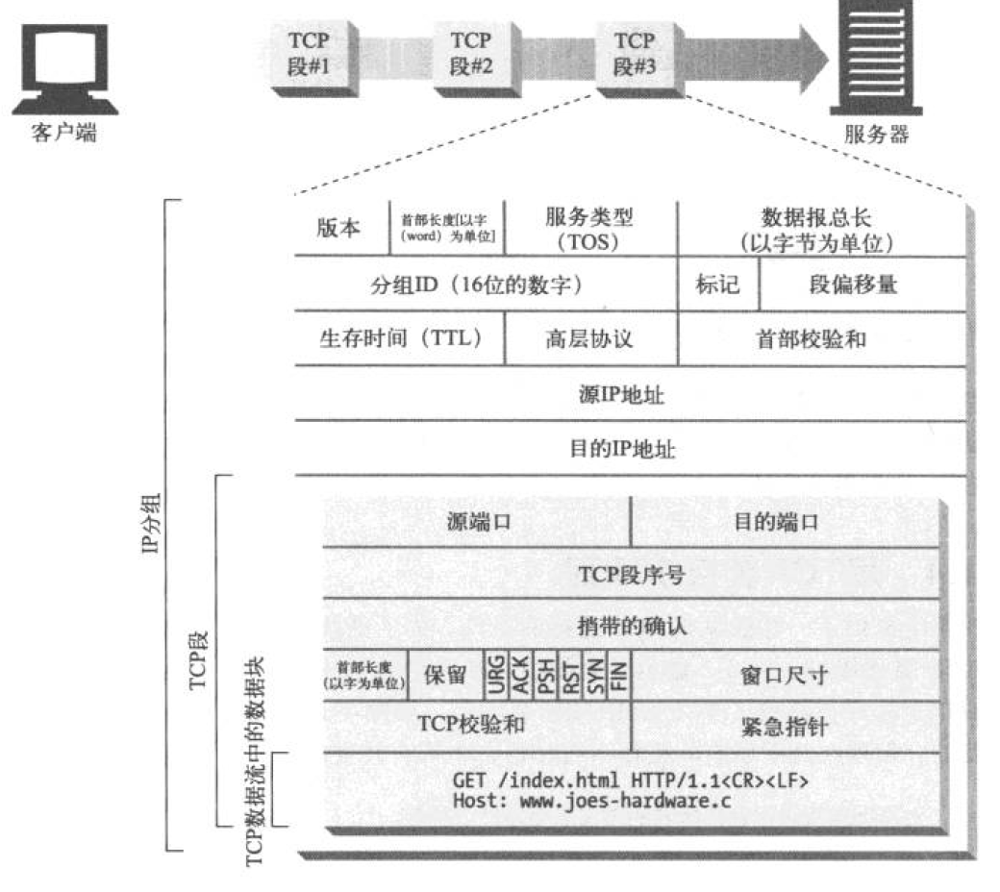
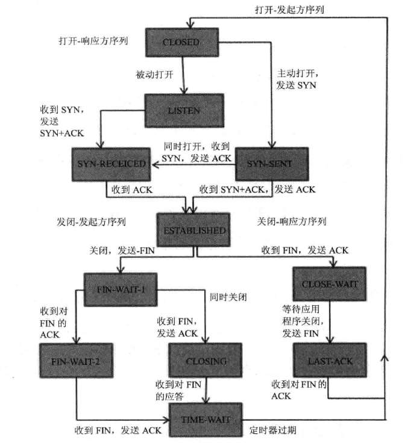

本文章纯手动，请转载注明：https://github.com/Zeb-D/my-review ，你的支持，就是我们的学习的动力！

 

说到HTTP一个系统性了解还是去年看了些《HTTP权威指南》，本篇文章主要是复习一下HTTP相关知识，也是回忆自己看这本书大部分的能记忆下来的，权当是笔记吧。当然也是某个笔试题的总结。

[TOC]

------

## HTTP概述

首先了解HTTP协议得先知道HTTP报文结构，其中包括请求报文、返回报文：

请求报文包含四部分：

- 请求行：包含请求方法、URI、HTTP版本信息
- 请求首部字段
- 请求内容实体
- 空行

响应报文包含四部分：

- 状态行：包含HTTP版本、状态码、状态码的原因短语
- 响应首部字段
- 响应内容实体
- 空行

常见的首部：

- **通用首部字段（请求报文与响应报文都会使用的首部字段）**
  - Date：创建报文时间
  - Connection：连接的管理
  - Cache-Control：缓存的控制
  - Transfer-Encoding：报文主体的传输编码方式
- **请求首部字段（请求报文会使用的首部字段）**
  - Host：请求资源所在服务器
  - Accept：可处理的媒体类型
  - Accept-Charset：可接收的字符集
  - Accept-Encoding：可接受的内容编码
  - Accept-Language：可接受的自然语言
- **响应首部字段（响应报文会使用的首部字段）**
  - Accept-Ranges：可接受的字节范围
  - Location：令客户端重新定向到的URI
  - Server：HTTP服务器的安装信息
- **实体首部字段（请求报文与响应报文的的实体部分使用的首部字段）**
  - Allow：资源可支持的HTTP方法
  - Content-Type：实体主类的类型
  - Content-Encoding：实体主体适用的编码方式
  - Content-Language：实体主体的自然语言
  - Content-Length：实体主体的的字节数
  - Content-Range：实体主体的位置范围，一般用于发出部分请求时使用

当然你也得区分URI 统一资源标识符（Uniform Resource Identifier）、URL 统一资源定位符、URN 统一资源名；

**URI，是uniform resource identifier，统一资源标识符，用来唯一的标识一个资源。**

- Web上可用的每种资源如HTML文档、图像、视频片段、程序等都是一个来URI来定位的
- URI一般由三部组成：
- ①访问资源的命名机制
- ②存放资源的主机名
- ③资源自身的名称，由路径表示，着重强调于资源。

**URL是uniform resource locator，统一资源定位器，它是一种具体的URI，即URL可以用来标识一个资源，而且还指明了如何locate这个资源。**

URL通用格式：

`<scheme>://<user>:<password>@<host>:<port>/<path>;<params>?<query>#<frag>`

- URL是Internet上用来描述信息资源的字符串，主要用在各种WWW客户程序和服务器程序上，特别是著名的Mosaic。
- 采用URL可以用一种统一的格式来描述各种信息资源，包括文件、服务器的地址和目录等。URL一般由三部组成：
- ①协议(或称为服务方式)
- ②存有该资源的主机IP地址(有时也包括端口号)
- ③主机资源的具体地址。如目录和文件名等

**URN，uniform resource name，统一资源命名，是通过名字来标识资源，比如mailto:java-net@java.sun.com。**

- URI是以一种抽象的，高层次概念定义统一资源标识，而URL和URN则是具体的资源标识的方式。URL和URN都是一种URI。笼统地说，每个 URL 都是 URI，但不一定每个 URI 都是 URL。这是因为 URI 还包括一个子类，即统一资源名称 (URN)，它命名资源但不指定如何定位资源。上面的 mailto、news 和 isbn URI 都是 URN 的示例。

HTTP 事物组成，包括 请求方法、返回状态码；你还得知道请求报文、返回报文 结构的相同性及不同性；

常见的HTTP状态码，状态码 分五种类型：信息性-1开头、成功-2开头、重定向-3开头、客户端错误-4开头、服务器错误-5开头。

- 200：请求被正常处理
- 204：请求被受理但没有资源可以返回
- 206：客户端只是请求资源的一部分，服务器只对请求的部分资源执行GET方法，相应报文中通过Content-Range指定范围的资源。
- 301：永久性重定向
- 302：临时重定向
- 303：与302状态码有相似功能，只是它希望客户端在请求一个URI的时候，能通过GET方法重定向到另一个URI上
- 304：发送附带条件的请求时，条件不满足时返回，与重定向无关
- 307：临时重定向，与302类似，只是强制要求使用POST方法
- 400：请求报文语法有误，服务器无法识别
- 401：请求需要认证
- 403：请求的对应资源禁止被访问
- 404：服务器无法找到对应资源
- 500：服务器内部错误
- 503：服务器正忙

接下来我们就可以看看HTTP是怎么连接的，这里就涉及到网络模型 各个层协议得作用，HTTP 协议处于应用层，使用传输层 TCP作为网络传输，大家有兴趣可以理解下[TCP与UDP](./TCP和UDP 总结.md)，TCP会调用网络层的IP 协议进行TCP数据分组传输，在此期间 TCP保证了稳定的数据传输、按序传输、分段数据流，你知道这些，你肯定会被问到  浏览器访问HTTP网站的整个流程；

 

##HTTP协议版本了解

接下来可能需要一些衍生了解HTTP协议版本，是如何从HTTP 0.9 升到 现在的HTTP 2.0，我们现在大多数使用的是HTTP 1.1。

HTTP 0.9 作为当初推出的第一个版本，当然也会存在非常多的Bug 缺陷，在这个版本只支持GET 请求，不支持多媒体内容MIME类型、各种HTTP首部、版本号，当时的目的 只是获取简单的HTML对象。

HTTP 1.0 在HTTP 0.9 基础上 加了HTTP 版本，各种HTTP 首部、一些额外的请求方法、多媒体类型支持。还有就是发送一次请求时，需要**等待服务端响应了**才可以继续发送请求。

HTTP 1.0+ 这是一种非正式的HTTP 1.0 扩展版，加入比较多的特性，如持久化链接、虚拟主机支持、代理。

HTTP 1.1 这个版本大家可能比较熟悉，就是我们平常在使用，这个版本重点是校正HTTP 设计中的结构性缺陷，明确语义，还有一部分性能优化措施 如默认开启持久化链接、Host 首部字段、Chunked transfer-coding 断点续传，也优化了不好用的特性。还有就是发送一次请求时，不需要等待服务端响应了就可以发送请求了，但是回送数据给客户端的时候，客户端还是需要按照**响应的顺序**来一一接收

- **持久连接**
- 请求管道化
- 增加缓存处理（新的字段如cache-control）
- 增加Host字段、支持断点传输等

HTTP 2.0 主要的是性能大幅度优化，更强大的服务逻辑远程执行框架。加入了管线化pipelining链接。

> HTTP Pipelining其实是把多个HTTP请求放到一个TCP连接中一一发送，而在发送过程中不需要等待服务器对前一个请求的响应；只不过，**客户端还是要按照发送请求的顺序来接收响应！**

管线化pipelining链接 理论主要是解决了线头阻塞的问题！其中最重要的改动是：多路复用 (Multiplexing)

线头阻塞 是因为返回结果 在前面HTTP协议中是按序接受的，多路复用意味着线头阻塞将不在是一个问题，允许同时通过单一的 HTTP/2 连接发起**多重的请求-响应消息**，合并多个请求为一个的优化将不再适用。

我在网上找了个图 可以直接说明 HTTP 2是如何进行性能优化的。

HTTP2所有性能增强的核心在于**新的二进制分帧层**(不再以文本格式来传输了)，它定义了如何封装http消息并在客户端与服务器之间传输。

看上去协议的格式和HTTP1.x完全不同了，**实际上HTTP2并没有改变HTTP1.x的语义**，只是把原来HTTP1.x的header和body部分用**frame重新封装了一层**而已

HTTP2连接上**传输的每个帧都关联到一个“流”**。流是一个独立的，双向的帧序列可以通过一个HTTP2的连接在服务端与客户端之间不断的交换数据。

HTTP2还有一些比较重要的改动：

- 使用HPACK对HTTP/2头部压缩
- 服务器推送
  - HTTP2推送资料
- 流量控制
  - 针对传输中的**流**进行控制(TCP默认的粒度是针对连接)
- 流优先级（Stream Priority）它被用来告诉**对端哪个流更重要**。
- 二进制分帧
- **多路复用**
- 头部压缩
- 服务器推送

非常详细请[HTTP2.0 阅读](https://juejin.im/post/5b88a4f56fb9a01a0b31a67e)

#### 回顾HTTP / 2

HTTP / 2协议规范（[RFC 7540](https://httpwg.org/specs/rfc7540.html)）于2015年5月发表，从那之后，它被广泛地在Internet和WWW上实现。

2018年初，前1000大网站中约40％实现了HTTP / 2协议，在火狐发出的HTTPS请求中，近70％的请求由HTTP / 2回复。主流的浏览器，服务器，代理均支持了HTTP / 2。

HTTP / 2的出现揭露了HTTP / 1中的很多问题，其中相当一部分对于开发者来说非常麻烦。在HTTP / 2之前开发者要用很多变通方法来解决，而HTTP / 2的出现解决了这些问题。

HTTP / 2的一个主要特性是复用（多路复用）通过复用，多个逻辑数据流可以共享一个TCP连接复用使得很多事情变得更好更快：。更好的拥塞控制，更好的带宽利用，更长的TCP连接----这些都使得相比以前，链路更容易实现全速的传输。另外，头部压缩技术减少了带宽的使用。

以前，每个*主机*和浏览器需要*六个*连接，通过HTTP / 2，我们只需要*一个* TCP连接。其实，HTTP / 2使用的连接聚合（连接合并）和“去分片”（desharding）技术还可以把连接数进一步缩小。

用了HTTP / 2之后，HTTP的队头拥塞（线头阻挡）问题好像被解决了。以前客户端发请求之前，必须等待前边的请求回复回来，那样的日子已经一去不复返了。

 

#### HTTP / 3

HTTP / 2标准RFC7540发布于2015年5月，只比**QUIC**首次进入IETF早一个月。

HTTP / 2的发布为HTTP进化提供了好的经验。这一经验让大家相信，迭代更新的HTTP版本会比从第一版到HTTP2（花了16年）快得多。

HTTP / 2的发布让用户和软件意识到，HTTP不是一个纯粹序列化的，基于文本的协议。

【HTTP的过QUIC于2018年11月更名为HTTP / 3】。

QUIC就是一个名字，而不是什么的缩略词。它的发音和英语单词快速一样。

QUIC是一种可靠又安全的新的传输层协议，它适合为类似HTTP的应用层协议提供服务。在通过TCP或TLS传输的HTTP / 2协议中遇到过很多问题，这些问题可以通过QUIC来解决.QUIC将会是下一代的网络传输层协议。

QUIC的用途不仅限于HTTP。我们希望将网络和数据更快地交付给终端用户，这是创造QUIC这一新的传输层协议的最大的源动力和原因。

 

HTTP / 2是HTTP流量通过网络传输的一种新方式，与之类似，HTTP / 3是另一种传输HTTP的方式。

HTTP的范式（范例）和概念没有改变.HTTP含有头部（头）和正文，请求报文和回复报文。还有动词（动词），饼干和缓存（高速缓存）.HTTP / 3主要改变的是这些报文比特传送到另一端的方式。

为了让HTTP可以通过QUIC传输，需要对协议进行修改这些修改的结果便是HTTP / 3这些修改是因为QUIC和TCP的性质不同导致的修改包括。：

- QUIC中，数据流由传输层负责，在HTTP / 2中由HTTP层负责。
- 由于数据流互相独立，如果头部压缩算法不做改动的话，会造成队头阻塞。
- QUIC流和HTTP / 2稍稍不同。在HTTP / 3中应对了这些不同。

如果想看 [HTTP 3.0 详细背景、进展、特点、工作原理、对比HTTP 2.0](https://github.com/bagder/http3-explained/blob/master/zh/SUMMARY.md)

 

在这里不讲[HTTPS协议](./HTTPS深入理解.md)

 

## HTTP连接管理

说到HTTP连接，实际上就是TCP连接和一些使用连接的规则。TCP在传输层上来说是个可靠连接协议。

首先TCP会为HTTP提供一条可靠的比特传输管道，从TCP连接一端填入的字节会从另外一端以原有的顺序、正确地传送出来；TCP的数据流会先进行分段，通过IP分组的小数据块发送的，每个TCP段都是由IP分组承载，从一个IP到地址发送到另外一个IP的。

那么每个IP分组都包括：

- IP分组首部——通常20字节，包含 源和目的IP地址、长度和一些标识、分组ID、
- TCP段首部——通常20字节，包含了TCP 源和目的 端口号、TCP控制标记，及用于数据排序和完整性检查的一些数字值、窗口尺寸、保留字、及部分控制标识（ACK、SYN、FIN、RST、URG、PSH）
- TCP数据块——0+个字节

在TCP段首部中 控制标识，那这些在TCP连接（三次握手、四次挥手 这些后面会说）起了非常重要的作用：

1. 紧急URG，当URG=1，表明紧急指针字段有效。告诉系统此报文段中有紧急数据；
2. 确认ACK，仅当ACK=1时，确认号（一般是小写 ack）字段才有效。TCP规定，在连接建立后所有报文的传输都必须把ACK置1；
3. 推送PSH，当两个应用进程进行交互式通信时，有时在一端的应用进程希望在键入一个命令后立即就能收到对方的响应，这时候就将PSH=1；
4. 复位RST，当RST=1，表明TCP连接中出现严重差错，必须释放连接，然后再重新建立连接；
5. 同步SYN，在连接建立时用来同步序号。当SYN=1，ACK=0，表明是连接请求报文，若同意连接，则响应报文中应该使SYN=1，ACK=1；
6. 终止FIN，用来释放连接。当FIN=1，表明此报文的发送方的数据已经发送完毕，并且要求释放；

那么浏览器从输入地址到返回结果，这里发生了什么事情呢？

1. 首先解析出主机名
2. 查询出主机名的相对应IP地址 （DNS）
3. 浏览器获得端口号
4. 浏览器发起到目的IP端口的TCP连接
5. 浏览器向服务器发送HTTP METHOD 报文
6. 浏览器从服务器读取返回的报文
7. 浏览器关闭连接

以上是HTTP请求简化 是因为这里没涉及到HTTP、TCP一些特性(如TCP管道持久化等)，HTTP连接主要依赖TCP连接。

那么TCP是如何进行双方的连接呢？其实TCP连接步骤 有点像socket 套接字编程步骤：

- 服务端 S1（服务端用S表示、客户端用C表示，数字表示相对应端的步骤序号）创建新的套接字 socket
- S2将socket绑定到端口上 bind
- S3允许socket进行连接 listen
- S4 等待连接 accept
- C1 获取本地客户端 IP地址和端口号
- C2创建新的套接字 socket
- C3 连接到服务器 IP 端口 connect 
- S5 通知应用程序有连接到来
- S6开始读取请求 read
- C4 连接成功
- C5 发送HTTP 请求 write
- C6 等待HTTP响应 read
- S7处理HTTP请求报文
- S8回送HTTP响应 write
- C7 读取及处理HTTP响应
- S9关闭连接 close
- C8 关闭连接 close

在这里TCP请求流量 没体现出 TCP三次握手四次挥手，这是建立连接、及关闭连接的时候发生的。

我们可以先看下TCP通信整个流程：

### TCP性能分析

虽然HTTP是建立在TCP上，TCP也有一些性能优化方式。HTTP事务的性能在很大程度上取决于底层TCP通道的性能。

只有先理解TCP某些特性后，才能更好的理解HTTP连接优化特性。

最常见、会对HTTP产生影响的TCP相关时延：

- 建立握手
- 慢启动拥塞控制
- 数据聚集的Nagle算法
- 用于捎带确认的TCP延迟确认算法
- TIME_WAIT时延和端口耗尽

我们来分别来解释为什么会有以上这些时延，怎么发生的。

1、TCP连接的握手时延

TCP连接**三次握手步骤**：在握手主要注意的是TCP段首部的那几个控制标识

**最开始的时候客户端和服务器都是处于CLOSED状态。主动打开连接的为客户端，被动打开连接的是服务器。**

- TCP服务器进程先创建传输控制块TCB，时刻准备接受客户进程的连接请求，此时服务器就进入了LISTEN（监听）状态；
- TCP客户进程也是先创建传输控制块TCB，然后向服务器发出连接请求报文，这是报文首部中的同部位SYN=1，同时选择一个初始序列号 seq=x ，此时，TCP客户端进程进入了 SYN-SENT（同步已发送状态）状态。TCP规定，SYN报文段（SYN=1的报文段）不能携带数据，但需要消耗掉一个序号。
- TCP服务器收到请求报文后，如果同意连接，则发出确认报文。确认报文中应该 ACK=1，SYN=1，确认号是ack=x+1，同时也要为自己初始化一个序列号 seq=y，此时，TCP服务器进程进入了SYN-RCVD（同步收到）状态。这个报文也不能携带数据，但是同样要消耗一个序号。
- TCP客户进程收到确认后，还要向服务器给出确认。确认报文的ACK=1，ack=y+1，自己的序列号seq=x+1，此时，TCP连接建立，客户端进入ESTABLISHED（已建立连接）状态。TCP规定，ACK报文段可以携带数据，但是如果不携带数据则不消耗序号。
- 当服务器收到客户端的确认后也进入ESTABLISHED状态，此后双方就可以开始通信了。 

**注：为什么TCP客户端还需要发送一次确认？**

> 如果使用的是两次握手建立连接，假设有这样一种场景，客户端发送了第一个请求连接并且没有丢失，只是因为在网络结点中滞留的时间太长了，由于TCP的客户端迟迟没有收到确认报文，以为服务器没有收到，此时重新向服务器发送这条报文，此后客户端和服务器经过两次握手完成连接，传输数据，然后关闭连接。此时此前滞留的那一次请求连接，网络通畅了到达了服务器，这个报文本该是失效的，但是，两次握手的机制将会让客户端和服务器再次建立连接，这将导致不必要的错误和资源的浪费。
>
> 如果采用的是三次握手，就算是那一次失效的报文传送过来了，服务端接受到了那条失效报文并且回复了确认报文，但是客户端不会再次发出确认。由于服务器收不到确认，就知道客户端并没有请求连接。

此时，SYN/SYN+ACK握手会产生一个可测量的时延。如果当前HTTP事物 需要的数据量较小的话，那么这TCP握手占用整个HTTP事务 比例多，那么现在HTTP如何通过重用现存的连接，来减少这种TCP建立时延。那就是HTTP持久化连接。

2、延时确认

因为因特网无法确保可靠的分组传输，所以TCP实现了自己的确认机制来确保数据的成功传输。

每个TCP段 的接受者 收到了完整的段时，都会向发送这回送小的确认分组，如果发送这没有在指定的窗口时间内收到确认信息，那发送者会认为该分组已被破坏损毁，及重新发送数据。

“延迟确认”算法会在一个特定的窗口时间（通常是100至200ms）内将输出确认存在在缓冲区中，以寻找能够捎带它输出的数据分组，如果那个时间段内没有输出数据分组，将单独的分组传送。

3、TCP慢启动

TCP数据传输的性能还取决于TCP连接的使用期。TCP连接会随着时间进行自我调谐，起初会限制连接的最大速度，如果数据成功传输，会随着时间的推移提高传输的速度。这种TCP慢启动，主要用于防止因特网的突然过载和拥塞。

TCP慢启动限制了一个TCP端点在任意时刻可以传输的分组数。简单来说，每成功接收一个分组，发送端就有了发送另外两个分组的权限。所以HTTP事务有大量数据、大量数组分组要发送，这是不可能一次将所有分组都发送出去的。这种方式称为“打开拥塞窗口”。

4、Nagle算法与TCP_NODELAY

TCP有一个数据流接口，应用程序可以通过它将任意尺寸的数据放入TCP栈中——即使一次只放一个字节。我们分析IP协议各个部分可以看出，每个TCP段都至少需要40+个字节的IP首部、TCP段首部，还有部分的内容（TCP数据块），如果数据块过少 就会导致网络性能严重下降。

Nagle算法就是试图在发送一个分组之前，将大量的TCP数据绑定在一起，以提供网络效率。该算法鼓励发送尺寸大约1500字节的段。只有当所有其他分组都被确认之后，Nagle算法 才会允许发送非全尺寸的分组。

这种算法会导致 小的HTTP报文无法填满一个分组，可能一直不会有其他额外数据产生时延；其次 该算法会与 延迟确认 之间存在交互问题，该算法会阻止数据的发送，直到有确认分组抵达为止，但确认分组自身会被延迟确认算法延迟。

5、TIME_WAIT累积与端口耗尽

TIME_WAIT 大家可能对这单词可能有点迷糊，这是socket连接不同时候的状态标识，这是在TCP四次挥手出现的一种状态，在Linux 中可以 nstat 查看网络连接状态。大家可以从网上找socket连接图，我当时是从 《深入分析JavaWeb技术内幕——许令波》看到的。

当某个TCp端点关闭TCP连接时，这类信息（关闭连接的IP地址和端口）只会在内存中生存一小段时间，通常是所估计得最大分段使用期的两倍2MSL(Maximum Segment Lifetime——最长报文段寿命)(约2分钟)左右，以确保在这段时间内不会创建相同地址和端口的新连接。是为了防止在两分钟内创建、关闭、并重新创建两个具有相同IP地址和端口号的连接。那为什么会有这种操作呢？这使得重复分组几乎不可能在连接关闭的几分钟之后，出现在服务器上，如果分组被复制，那这复制分组插入了具有相同连接值的新TCP流，会破坏TCP数据。

每个客户端每次连接到服务器时，都会获取一个新的窗口，以实现连接的唯一性（源和目的IP及端口），但是服务器的端口是有限的，而且在2MSL内无法重用，连接速率就会限制在60000/120=500次/秒。如果连接速率高于这个值，就会遇到TIME_WAIT端口耗尽问题，但修复这问题，可以增加集群机器数量，或者确保客户端和服务器在循环使用几个虚拟IP地址增加更多的理解组合。所以这TIME_WAIT 、控制块 大量连接处于这个状态，有些操作系统会受到严重的影响。

**我们可以看下TCP是如何进行四次挥手，及为什么要比三次握手多一次呢？**

数据传输完毕后，双方都可释放连接。最开始的时候，客户端和服务器都是处于ESTABLISHED状态，然后客户端主动关闭，服务器被动关闭。

1. 客户端进程发出连接释放报文，并且停止发送数据。释放数据报文首部，FIN=1，其序列号为seq=u（等于前面已经传送过来的数据的最后一个字节的序号加1），此时，客户端进入FIN-WAIT-1（终止等待1）状态。 TCP规定，FIN报文段即使不携带数据，也要消耗一个序号。
2. 服务器收到连接释放报文，发出确认报文，ACK=1，ack=u+1，并且带上自己的序列号seq=v，此时，服务端就进入了CLOSE-WAIT（关闭等待）状态。TCP服务器通知高层的应用进程，客户端向服务器的方向就释放了，这时候处于半关闭状态，即客户端已经没有数据要发送了，但是服务器若发送数据，客户端依然要接受。这个状态还要持续一段时间，也就是整个CLOSE-WAIT状态持续的时间。
3. 客户端收到服务器的确认请求后，此时，客户端就进入FIN-WAIT-2（终止等待2）状态，等待服务器发送连接释放报文（在这之前还需要接受服务器发送的最后的数据）。
4. 服务器将最后的数据发送完毕后，就向客户端发送连接释放报文，FIN=1，ack=u+1，由于在半关闭状态，服务器很可能又发送了一些数据，假定此时的序列号为seq=w，此时，服务器就进入了LAST-ACK（最后确认）状态，等待客户端的确认。
5. 客户端收到服务器的连接释放报文后，必须发出确认，ACK=1，ack=w+1，而自己的序列号是seq=u+1，此时，客户端就进入了TIME-WAIT（时间等待）状态。注意此时TCP连接还没有释放，必须经过2MSL时间后，当客户端撤销相应的TCB后，才进入CLOSED状态。
6. 服务器只要收到了客户端发出的确认，立即进入CLOSED状态。同样，撤销TCB后，就结束了这次的TCP连接。可以看到，服务器结束TCP连接的时间要比客户端早一些。

在第5个步骤时：客户端进行了第四次挥手操作，**那为什么还要等待2MSL**?

- 第一，保证客户端发送的最后一个ACK报文能够到达服务器，因为这个ACK报文可能丢失，站在服务器的角度看来，我已经发送了FIN+ACK报文请求断开了，客户端还没有给我回应，应该是我发送的请求断开报文它没有收到，于是服务器又会重新发送一次，而客户端就能在这个2MSL时间段内收到这个重传的报文，接着给出回应报文，并且会重启2MSL计时器。
- 第二，防止类似与“三次握手”中提到了的“已经失效的连接请求报文段”出现在本连接中。客户端发送完最后一个确认报文后，在这个2MSL时间中，就可以使本连接持续的时间内所产生的所有报文段都从网络中消失。这样新的连接中不会出现旧连接的请求报文。

**为什么建立连接是三次握手，关闭连接确是四次挥手呢？**

- 建立连接的时候， 服务器在LISTEN状态下，收到建立连接请求的SYN报文后，把ACK和SYN放在一个报文里发送给客户端。 
- 关闭连接时，服务器收到对方的FIN报文时，仅仅表示对方不再发送数据了但是还能接收数据，而自己也未必全部数据都发送给对方了，所以己方可以立即关闭，也可以发送一些数据给对方后，再发送FIN报文给对方来表示同意现在关闭连接，因此，己方ACK和FIN一般都会分开发送，从而导致多了一次。

 

## HTTP连接处理

以上我们刚刚探讨了TCP连接及性能分析，那这里就引入HTTP是如何连接及分析。

- 串行连接

  该连接只是对连接简单的管理，TCP的性能时延（如慢启动时延、连接时延）可能会叠加起来。如果网页需要进渲染，就可能需要等待所有的网页对象，在这之前，页面可能是空白的。

- 并行连接

  并行发送多个TCP连接，可能会受到网络带宽影响，每次连接对象会去抢带宽资源，达到带宽上限就会每个连接对象的带宽都会下降。而且多个连接对象会消耗很多内存资源，引发自身性能问题。

- 持久连接

  重用TCP连接，可以消除**连接及关闭时延**。在HTTP 1.1时，请求首部默认 保持持久化连接，重用对目标服务器打开的空闲持久连接，可以避开缓慢的建立阶段，也会避免慢启动的拥塞阶段。不过请求首部 Keep-Alive字段 需要注意使用代理从而出现哑代理。如果代理不进行首部 头部字段处理，那么会导致盲中继问题。这样会导致只能等待连接关闭。导致客户端再进行发起同一条请求（持久化连接可以理解为另外一条请求就是同一条请求），然而代理并不认为是同一条（比如不支持持久化连接），就会丢弃该连接。

  这种问题 可以使用首部 Proxy-Connection 字段。

- 管道化连接

  管道化在HTTP 1.1就提出并有一定的操作，但是在HTTP 2.0用的比较成熟。

  管道化连接 消除了**传输时延**。在进行多个事务时候，管道化连接以一种非阻塞方式（有点像双工通信方式） 并行发送请求（但不是打开多个连接，只有一个），可以说是一个连接获取到 并行连接的效果，但不存在 并行连接的缺点。

 

## web服务器会做什么

在这里讨论web服务器一般对整个HTTP请求到响应的整个过程的动作。

1. 建立连接

   客户端请求一系列到Web服务器的TCP连接时，服务器会建立连接，判断连接的另一端是哪个客户端，从TCP连接中将Ip地址解析出来。一旦新连接建立起来并被接受，服务器就会将新连接添加到现存Web服务器连接列表中，做好监视连接上数据传输的准备。服务器可以随意拒绝或立即关闭任意一条连接（客户端Ip、主机名未认证，恶意客户端等），Apache 有启用HostnameLookups 主机名扫描功能，不过会消耗资源。

2. 接受请求

   连接上有数据到达，web服务器将请求报文中的内容解析出来，一般将请求报文按照请求结构解析出服务器能够识别且支持的操作（可以理解为Java中的HttpServletRequest）。好的Web服务器能同时支持数千条连接。

   Web服务器也分多种类型（针对于接受请求）：单线程、多进程多线程、复用IO、复用多线程IO、

3. 处理请求

   根据方法、资源、首部、和可选主体 进行请求处理

4. 访问资源

   这里包括静态资源、动态内容资源的映射、访问控制

5. 构建响应

   响应主体、MIME类型、重定向

6. 发送响应

   ​

7. 记录事务处理过程

   一般在响应结束后，一般会在日志记录一些信息，比如Tomcat 有access_log。

 

我目前只看到这，后续会加入。

接下来的几章有代理、缓存、集成点（网关、隧道、中继）、web机器人、HTTP-NG；

客户端识别与cookie机制，这是重点，涉及到客户端cookie与服务端session机制；

还有一些针对于HTTP一些安全操作，如基本认证机制、摘要认证等，这里偏向于[HTTPS](./HTTPS深入理解.md);

 

本文章纯手动，请转载注明：https://github.com/Zeb-D/my-review

