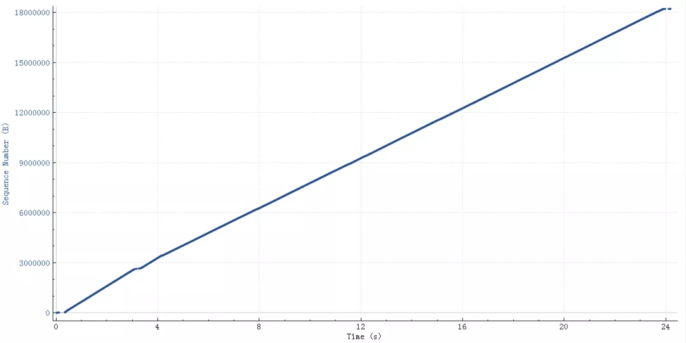
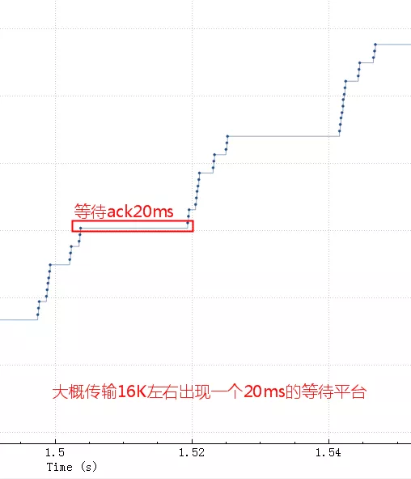
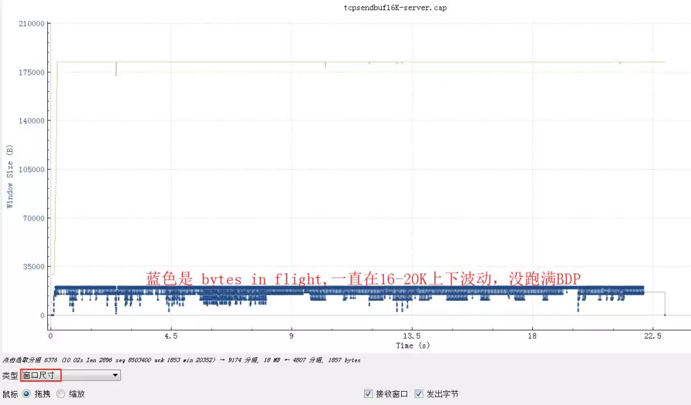
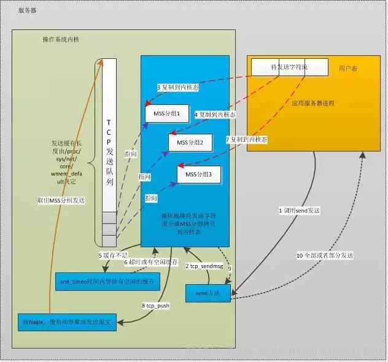
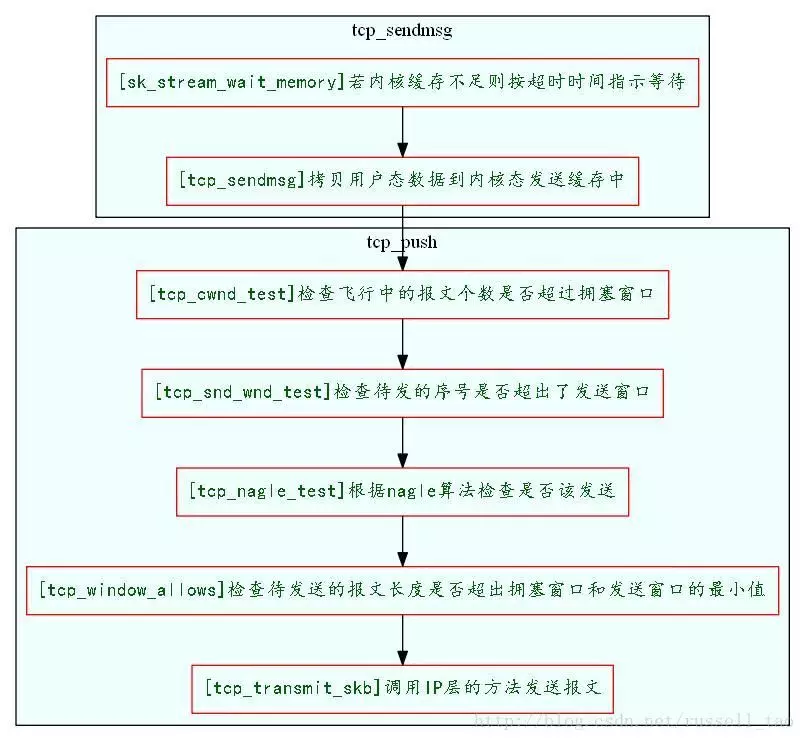
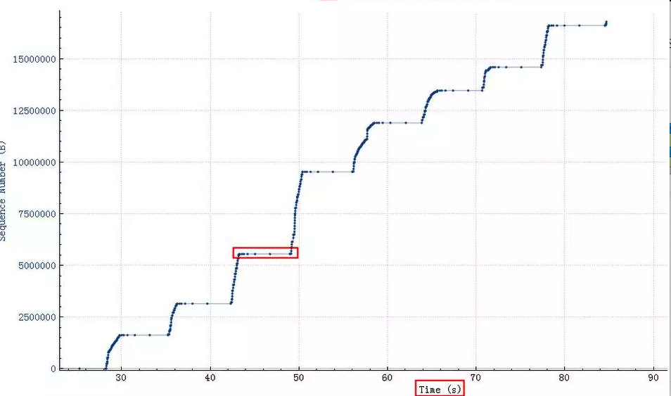
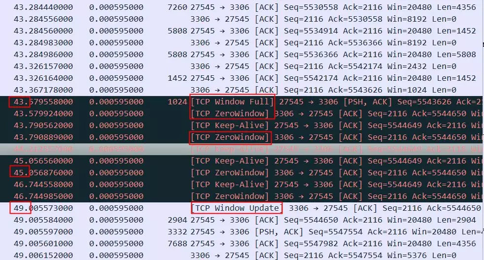
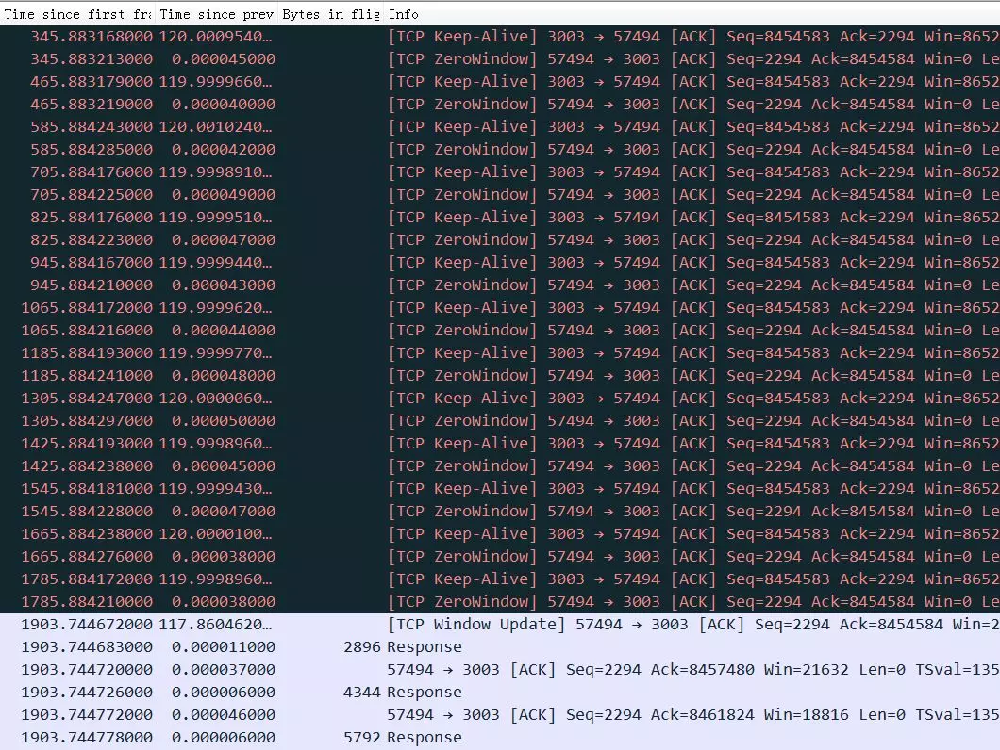

本文章来源于：<https://github.com/Zeb-D/my-review> ，请star 强力支持，你的支持，就是我的动力。

[TOC]


### 背景

在多个数据中心避免不了交互，如全量数据同步等类似涉及到网络传输的问题。简单点，各个服务端点进行不同大小数据包传输，按理说数据包大小与时间成线性相关(已排除业务层处理能力)；

### 前言

本文希望解析清楚，当我们在代码中写下 socket.setSendBufferSize 和 sysctl 看到的rmem/wmem系统参数以及最终我们在TCP常常谈到的接收发送窗口的关系，以及他们怎样影响TCP传输的性能。

先明确一下：文章标题中所说的Buffer指的是sysctl中的 rmem或者wmem，如果是代码中指定的话对应着SO_SNDBUF或者SO_RCVBUF，从TCP的概念来看对应着发送窗口或者接收窗口。


### TCP性能和发送接收Buffer的关系

相关参数：

```shell
$sudo sysctl -a | egrep "rmem|wmem|adv_win|moderate"
net.core.rmem_default = 212992
net.core.rmem_max = 212992
net.core.wmem_default = 212992
net.core.wmem_max = 212992
net.ipv4.tcp_adv_win_scale = 1
net.ipv4.tcp_moderate_rcvbuf = 1
net.ipv4.tcp_rmem = 4096    87380   6291456
net.ipv4.tcp_wmem = 4096    16384   4194304
net.ipv4.udp_rmem_min = 4096
net.ipv4.udp_wmem_min = 4096
vm.lowmem_reserve_ratio = 256   256 32
```

先从碰到的一个问题看起：

> 应用通过专线从公司访问阿里云上的服务，专线100M，时延20ms，一个SQL查询了22M数据，结果花了大概25秒，这太慢了，不正常。
>
> 如果通过云上client访问云上服务那么1-2秒就返回了（说明不跨网络服务是正常的）。
>
> 如果通过http或者scp从公司向云上传输这22M的数据大概两秒钟也传送完毕了（说明网络带宽不是瓶颈），所以这里问题的原因基本上是我们的服务在这种网络条件下有性能问题，需要找出为什么。


### 抓包 tcpdump+wireshark

这个查询结果22M的需要25秒，如下图（wireshark 时序图），横轴是时间，纵轴是sequence



粗一看没啥问题，因为时间太长掩盖了问题。把这个图形放大，就看中间50ms内的传输情况（横轴是时间，纵轴是sequence number，一个点代表一个包）。



换个角度，看看窗口尺寸图形：



从bytes in flight也大致能算出来总的传输时间 16K*1000/20=800Kb/秒

我们的应用会默认设置 socketSendBuffer 为16K：

>
> socket.setSendBufferSize(16*1024) //16K send buffer

来看一下tcp包发送流程：





如果sendbuffer不够就会卡在上图中的第一步 sk_stream_wait_memory，通过systemtap脚本可以验证：

```shell

#!/usr/bin/stap
# Simple probe to detect when a process is waiting for more socket send
# buffer memory. Usually means the process is doing writes larger than the
# socket send buffer size or there is a slow receiver at the other side.
# Increasing the socket's send buffer size might help decrease application
# latencies, but it might also make it worse, so buyer beware.

# Typical output: timestamp in microseconds: procname(pid) event
#
# 1218230114875167: python(17631) blocked on full send buffer
# 1218230114876196: python(17631) recovered from full send buffer
# 1218230114876271: python(17631) blocked on full send buffer
# 1218230114876479: python(17631) recovered from full send buffer
probe kernel.function("sk_stream_wait_memory")
{
    printf("%u: %s(%d) blocked on full send buffern",
        gettimeofday_us(), execname(), pid())
}

probe kernel.function("sk_stream_wait_memory").return
{
    printf("%u: %s(%d) recovered from full send buffern",
        gettimeofday_us(), execname(), pid())
}
```


### **原理解析**

如果tcp发送buffer也就是SO_SNDBUF只有16K的话，这些包很快都发出去了，但是这16K不能立即释放出来填新的内容进去，因为tcp要保证可靠，万一中间丢包了呢。只有等到这16K中的某些包ack了，才会填充一些新包进来然后继续发出去。由于这里rt基本是20ms，也就是16K发送完毕后，等了20ms才收到一些ack，这20ms应用、内核什么都不能做，所以就是如第二个图中的大概20ms的等待平台。

> sendbuffer相当于发送仓库的大小，仓库的货物都发走后，不能立即腾出来发新的货物，而是要等对方确认收到了(ack)才能腾出来发新的货物。
>
>  传输速度取决于发送仓库（sendbuffer）、接收仓库（recvbuffer）、路宽（带宽）的大小，
>
> 如果发送仓库（sendbuffer）足够大了之后接下来的瓶颈就是高速公路了（带宽、拥塞窗口）。

如果是UDP，就没有可靠的概念，有数据统统发出去，根本不关心对方是否收到，也就不需要ack和这个发送buffer了。

#### **几个发送buffer相关的内核参数**

```
vm.lowmem_reserve_ratio = 256   256     32
net.core.wmem_max = 1048576
net.core.wmem_default = 124928
net.ipv4.tcp_wmem = 4096        16384   4194304
net.ipv4.udp_wmem_min = 4096
```

net.ipv4.tcp_wmem 默认就是16K，而且是能够动态调整的，只不过我们代码中这块的参数是很多年前从Cobra中继承过来的，初始指定了sendbuffer的大小。代码中设置了这个参数后就关闭了内核的动态调整功能，但是能看到http或者scp都很快，因为他们的send buffer是动态调整的，所以很快。


接收buffer是有开关可以动态控制的，发送buffer没有开关默认就是开启，关闭只能在代码层面来控制：

> net.ipv4.tcp_moderate_rcvbuf


#### **优化**

调整 socketSendBuffer 到256K，查询时间从25秒下降到了4秒多，但是比理论带宽所需要的时间略高。

继续查看系统 net.core.wmem_max 参数默认最大是130K，所以即使我们代码中设置256K实际使用的也是130K，调大这个系统参数后整个网络传输时间大概2秒(跟100M带宽匹配了，scp传输22M数据也要2秒），整体查询时间2.8秒。测试用的mysql client短连接，如果代码中的是长连接的话会块300-400ms（消掉了慢启动阶段），这基本上是理论上最快速度了。

如果指定了tcp_wmem，则net.core.wmem_default被tcp_wmem的覆盖。send Buffer在tcp_wmem的最小值和最大值之间自动调整。如果调用setsockopt()设置了socket选项SO_SNDBUF，将关闭发送端缓冲的自动调节机制，tcp_wmem将被忽略，SO_SNDBUF的最大值由net.core.wmem_max限制。


#### **BDP 带宽时延积**

BDP=rtt*(带宽/8)

这个 buffer 调到1M测试没有帮助，从理论计算BDP（带宽时延积） 0.02秒*(100MB/8)=250Kb 所以SO_SNDBUF为256Kb的时候基本能跑满带宽了，再大实际意义也不大了。也就是前面所说的仓库足够后瓶颈在带宽上了。

因为BDP是250K，也就是拥塞窗口（带宽、接收窗口和rt决定的）即将成为新的瓶颈，所以调大buffer没意义了。


#### 用tc构造延时和带宽限制的模拟重现环境

```
sudo tc qdisc del dev eth0 root netem delay 20ms
sudo tc qdisc add dev eth0 root tbf rate 500kbit latency 50ms burst 15kb
```


**这个案例关于wmem的结论**

默认情况下Linux系统会自动调整这个buffer（net.ipv4.tcp_wmem）, 也就是不推荐程序中主动去设置SO_SNDBUF，除非明确知道设置的值是最优的。

从这里我们可以看到，有些理论知识点虽然我们知道，但是在实践中很难联系起来，也就是常说的无法学以致用，最开始看到抓包结果的时候比较怀疑发送、接收窗口之类的，没有直接想到send buffer上，理论跟实践的鸿沟。

**说完发送Buffer(wmem)接下来我们接着一看看接收buffer(rmem)和接收窗口的情况**

用这样一个案例下来验证接收窗口的作用：

> 有一个batch insert语句，整个一次要插入5532条记录，所有记录大小总共是376K。
>
> SO_RCVBUF很小的时候并且rtt很大对性能的影响

如果rtt是40ms，总共需要5-6秒钟：

基本可以看到server一旦空出来点窗口，client马上就发送数据，由于这点窗口太小，rtt是40ms，也就是一个rtt才能传3456字节的数据，整个带宽才80-90K，完全没跑满。

比较明显间隔 40ms 一个等待台阶，台阶之间两个包大概3K数据，wireshark斜线越陡表示速度越快

**对应的窗口尺寸**：

窗口由最开始28K(20个1448）很快降到了不到4K的样子，然后基本游走在即将满的边缘，虽然读取慢，幸好rtt也大，导致最终也没有满。（这个是3.1的Linux，应用SO_RCVBUF设置的是8K，用一半来做接收窗口）。


**SO_RCVBUF很小的时候并且rtt很小时对性能的影响**

如果同样的语句在 rtt 是0.1ms的话：

虽然明显看到接收窗口经常跑满，但是因为rtt很小，一旦窗口空出来很快就通知到对方了，所以整个过小的接收窗口也没怎么影响到整体性能。

接收窗口的大小对性能的影响，rtt越大影响越明显，当然这里还需要应用程序配合，如果应用程序一直不读走数据即使接收窗口再大也会堆满的。


#### **SO_RCVBUF和tcp window full的坏case**



上图中红色平台部分，停顿了大概6秒钟没有发任何有内容的数据包，这6秒钟具体在做什么如下图所示，可以看到这个时候接收方的TCP Window Full，同时也能看到接收方（3306端口）的TCP Window Size是8192（8K），发送方（27545端口）是20480。



这个状况跟前面描述的recv buffer太小不一样，8K是很小，但是因为rtt也很小，所以server总是能很快就ack收到了，接收窗口也一直不容易达到full状态，但是一旦接收窗口达到了full状态，居然需要惊人的6秒钟才能恢复，这等待的时间有点太长了。这里应该是应用读取数据太慢导致了耗时6秒才恢复，所以最终这个请求执行会非常非常慢（时间主要耗在了上传SQL而不是执行SQL）。


实际原因不知道，从读取TCP数据的逻辑来看这里没有明显的block，可能的原因：

- request的SQL太大，Server（3306端口上的服务）从TCP读取SQL需要放到一块分配好的内存，内存不够的时候需要扩容，扩容有可能触发fgc，从图形来看，第一次满就卡顿了，而且每次满都卡顿，不像是这个原因
- request请求一次发过来的是多个SQL，应用读取SQL后，将SQL分成多个，然后先执行第一个，第一个执行完后返回response，再读取第二个。图形中卡顿前没有response返回，所以也不是这个原因。
- ……其它未知原因


**接收方不读取数据导致的接收窗口满同时有丢包发生**


服务端返回数据到client端，TCP协议栈ack这些包，但是应用层没读走包，这个时候 SO_RCVBUF 堆积满，client的TCP协议栈发送 ZeroWindow 标志给服务端。也就是接收端的 buffer 堆满了（但是服务端这个时候看到的bytes in fly是0，因为都ack了），这时服务端不能继续发数据，要等 ZeroWindow 恢复。


那么接收端上层应用不读走包可能的原因：

- 应用代码卡顿、GC等等

应用代码逻辑上在做其它事情（比如Server将SQL分片到多个DB上，Server先读取第一个分片，如果第一个分片数据很大很大，处理也慢，那么第二个分片数据都返回到了TCP buffer，也没去读取其它分片的结果集，直到第一个分片读取完毕。如果SQL带排序，那么Server。


- 会轮询读取多个分片，造成这种卡顿的概率小了很多



上图这个流因为应用层不读取TCP数据，导致TCP接收Buffer满，进而接收窗口为0，server端不能再发送数据而卡住，但是ZeroWindow的探测包，client都有正常回复，所以1903秒之后接收方窗口不为0后（window update）传输恢复。


网络不通，重传超过一定的时间（tcp_retries2)然后断开这个连接是正常的，这里的问题是：

为什么这种场景下丢包了，而且是针对某个stream一直丢包？

可能是因为这种场景下触发了中间环节的流量管控，故意丢包了（比如proxy、slb、交换机都有可能做这种选择性的丢包）

这里server认为连接断开，没有发reset和fin,因为没必要，server认为网络连通性出了问题。client还不知道server上这个连接清理掉了，等client回复了一个window update，server早就认为这个连接早断了，突然收到一个update，莫名其妙，只能reset。


#### **接收窗口和SO_RCVBUF的关系**

初始接收窗口一般是 mss乘以初始cwnd（为了和慢启动逻辑兼容，不想一下子冲击到网络），如果没有设置SO_RCVBUF，那么会根据 net.ipv4.tcp_rmem 动态变化，如果设置了SO_RCVBUF，那么接收窗口要向下面描述的值靠拢。


初始cwnd可以大致通过查看到：

```shell
ss -itmpn dst "10.81.212.8"
State      Recv-Q Send-Q Local Address:Port  Peer Address:Port
ESTAB      0      0      10.xx.xx.xxx:22     10.yy.yy.yyy:12345  users:(("sshd",pid=1442,fd=3))
         skmem:(r0,rb369280,t0,tb87040,f4096,w0,o0,bl0,d92)

Here we can see this socket has Receive Buffer 369280 bytes, and Transmit Buffer 87040 bytes.
Keep in mind the kernel will double any socket buffer allocation for overhead.
So a process asks for 256 KiB buffer with setsockopt(SO_RCVBUF) then it will get 512 KiB buffer
space. This is described on man 7 tcp.
```

初始窗口计算的代码逻辑，重点在18行：

```shell

/* TCP initial congestion window as per rfc6928 */
#define TCP_INIT_CWND           10


/* 3. Try to fixup all. It is made immediately after connection enters
 *    established state.
 */
void tcp_init_buffer_space(struct sock *sk)
{
        int tcp_app_win = sock_net(sk)->ipv4.sysctl_tcp_app_win;
        struct tcp_sock *tp = tcp_sk(sk);
        int maxwin;

        if (!(sk->sk_userlocks & SOCK_SNDBUF_LOCK))
                tcp_sndbuf_expand(sk);

        //初始最大接收窗口计算过程
        tp->rcvq_space.space = min_t(u32, tp->rcv_wnd, TCP_INIT_CWND * tp->advmss);
        tcp_mstamp_refresh(tp);
        tp->rcvq_space.time = tp->tcp_mstamp;
        tp->rcvq_space.seq = tp->copied_seq;

        maxwin = tcp_full_space(sk);

        if (tp->window_clamp >= maxwin) {
                tp->window_clamp = maxwin;

                if (tcp_app_win && maxwin > 4 * tp->advmss)
                        tp->window_clamp = max(maxwin -
                                               (maxwin >> tcp_app_win),
                                               4 * tp->advmss);
        }

        /* Force reservation of one segment. */
        if (tcp_app_win &&
            tp->window_clamp > 2 * tp->advmss &&
            tp->window_clamp + tp->advmss > maxwin)
                tp->window_clamp = max(2 * tp->advmss, maxwin - tp->advmss);

        tp->rcv_ssthresh = min(tp->rcv_ssthresh, tp->window_clamp);
        tp->snd_cwnd_stamp = tcp_jiffies32;
}
```

传输过程中，最大接收窗口会动态调整，当指定了SO_RCVBUF后，实际buffer是两倍SO_RCVBUF，但是要分出一部分（2^net.ipv4.tcp_adv_win_scale)来作为乱序报文缓存。


> 1. net.ipv4.tcp_adv_win_scale = 2 //2.6内核，3.1中这个值默认是1。


如果SO_RCVBUF是8K，总共就是16K，然后分出2^2分之一，也就是4分之一，还剩12K当做接收窗口；如果设置的32K，那么接收窗口是48K。

```shell

static inline int tcp_win_from_space(const struct sock *sk, int space)
{//space 传入的时候就已经是 2*SO_RCVBUF了
        int tcp_adv_win_scale = sock_net(sk)->ipv4.sysctl_tcp_adv_win_scale;

        return tcp_adv_win_scale <= 0 ?
                (space>>(-tcp_adv_win_scale)) :
                space - (space>>tcp_adv_win_scale); //sysctl参数tcp_adv_win_scale
}
```

接收窗口有最大接收窗口和当前可用接收窗口。


一般来说一次中断基本都会将 buffer 中的包都取走。


### **总结**


- 一般来说绝对不要在程序中手工设置SO_SNDBUF和SO_RCVBUF，内核自动调整比你做的要好；
- SO_SNDBUF一般会比发送滑动窗口要大，因为发送出去并且ack了的才能从SO_SNDBUF中释放；
- TCP接收窗口跟SO_RCVBUF关系很复杂；
- SO_RCVBUF太小并且rtt很大的时候会严重影响性能；
- 接收窗口比发送窗口复杂多了；
- 发送窗口/SO_SNDBUF--发送仓库，带宽/拥塞窗口--马路通畅程度，接收窗口/SO_RCVBUF--接收仓库；
- 发送仓库、马路通畅程度、接收仓库一起决定了传输速度--类比一下快递过程。


总之记住一句话：不要设置socket的SO_SNDBUF和SO_RCVBUF。


相关和参考文章：

> 经典的 nagle 和 dalay ack对性能的影响 就是要你懂 TCP-- 最经典的TCP性能问题
>
> 关于TCP 半连接队列和全连接队列
>
> [MSS和MTU导致的悲剧](原理分析--TCP粘包与拆包.md)
>
> 双11通过网络优化提升10倍性能
>
> 就是要你懂TCP的握手和挥手
>
> 高性能网络编程7--tcp连接的内存使用